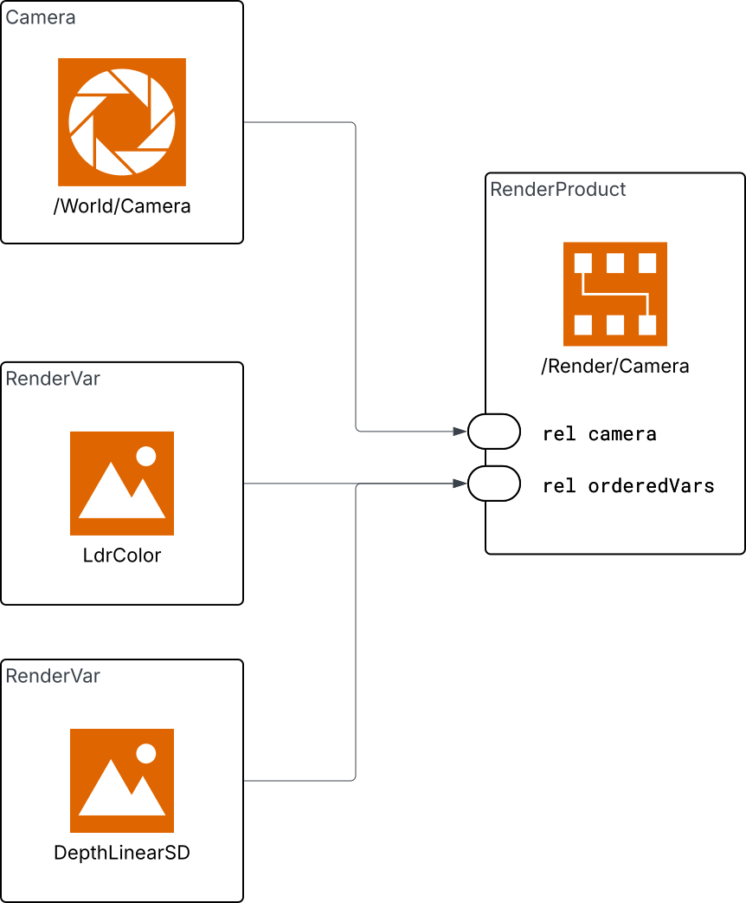
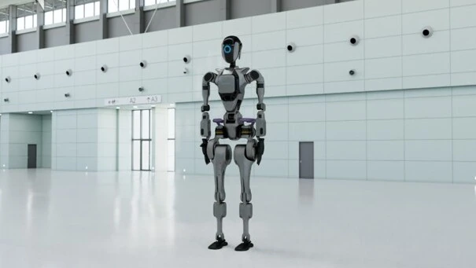

# NVIDIA ovrtx：把传感器渲染接成张量接口

ovrtx 是供外部应用调用 Omniverse RTX 的 C／Python SDK。应用提供 OpenUSD 场景与传感器配置，SDK 推进指定渲染产品，返回图像或点云等张量。它解决的是“场景如何进入渲染器、输出如何进入学习系统”的接口，不是完整机器人任务或物理控制框架。

本页固定于 `raw/ovrtx-source.tar.gz` 内提交 `29d11037fbcaed0f0f53e7f32d17bd0486fd453b`，2026-05-19、`0.3.0` 预发布版。本轮完整读相关文档与最小／激光雷达示例，并静态核查 Python 包装中的步进、映射、DLPack 同步和释放路径；未运行 GPU 示例、未审计二进制渲染器内部。[归档 README](https://github.com/NVIDIA-Omniverse/ovrtx/blob/29d11037fbcaed0f0f53e7f32d17bd0486fd453b/README.md)

## 一个请求包含三种对象

| 对象 | 输入职责 | 容易混淆的地方 |
| --- | --- | --- |
| 传感器图元 | 相机内参、激光雷达或雷达模型 | 它不是直接传给 `step` 的路径 |
| `RenderProduct` | 通过 `camera` 关系选传感器，以 `orderedVars` 选输出，还配置分辨率／模式等 | `camera` 关系也能指向雷达类传感器 |
| `RenderVar` | `sourceName` 标识输出语义；点云还列请求通道 | 图像是单张量，点云是多个具名张量与参数 |

官方文档：渲染结构。[查看原始来源](https://github.com/NVIDIA-Omniverse/ovrtx/tree/main)

例如激光雷达示例的 `/World/Render/Products/LidarProduct` 连接传感器和 `PointCloud` 输出，通道选择坐标、强度、计数和时间偏移。相同场景可以创建多个产品，以不同模式或分辨率读取。[application_flow.rst](https://github.com/NVIDIA-Omniverse/ovrtx/blob/29d11037fbcaed0f0f53e7f32d17bd0486fd453b/docs/core/application_flow.rst)、[lidar_example.usda L54–85](https://github.com/NVIDIA-Omniverse/ovrtx/blob/29d11037fbcaed0f0f53e7f32d17bd0486fd453b/examples/python/sensors/lidar/lidar_example.usda#L54-L85)

共享的 [[OpenUSDSceneComposition|场景组合]] 解释引用与子层；本页的具体输出机制集中于 [[RTXSensorSimulationPipeline|RTX 传感器流程]]。

## 从加载到一张图像

官方最小 Python 示例创建 `Renderer`，`open_usd` 加载场景，再对 `/Render/Camera` 调用 `step(delta_time=1/60)`。返回值按产品路径组织；每个产品包含帧，帧包含渲染变量。示例把 `LdrColor` 映射到 CPU，再由 `np.from_dlpack` 创建 NumPy 视图用于显示或保存。这里的1/60是渲染请求时间增量，不能从这个独立示例推断任何机器人的物理积分周期。[minimal/main.py L26–64](https://github.com/NVIDIA-Omniverse/ovrtx/blob/29d11037fbcaed0f0f53e7f32d17bd0486fd453b/examples/python/minimal/main.py#L26-L64)

官方示例：最小场景渲染。[查看原始来源](https://github.com/NVIDIA-Omniverse/ovrtx/tree/main)

静态代码把同步形式展开为：`step_async(...).wait().fetch()`。第一阶段将产品集合与时间增量传入 C 绑定，第二阶段等待操作，第三阶段取得输出句柄并构造 Python 产品／帧／变量对象。API 入队成功和输出可读取是不同状态；映射时还检查变量本身是否完成。[renderer.py L799–864](https://github.com/NVIDIA-Omniverse/ovrtx/blob/29d11037fbcaed0f0f53e7f32d17bd0486fd453b/python/ovrtx/_src/renderer.py#L799-L864)、[L1640–1720](https://github.com/NVIDIA-Omniverse/ovrtx/blob/29d11037fbcaed0f0f53e7f32d17bd0486fd453b/python/ovrtx/_src/renderer.py#L1640-L1720)

## 零拷贝之后，还有同步和所有权

DLPack 传递指针、形状、类型与设备，使消费库可建立共享视图。“零拷贝”限定于这一步；将 GPU 渲染结果映射到 CPU 仍涉及回读，SDK 内部渲染与线性内存转换也不由 DLPack 保证无复制。要保持 GPU 数据路径，应映射到 CUDA 并正确安排消费流。[sensor_outputs.rst](https://github.com/NVIDIA-Omniverse/ovrtx/blob/29d11037fbcaed0f0f53e7f32d17bd0486fd453b/docs/sensors/sensor_outputs.rst)

本版本 `MappedRenderVar.__dlpack__` 和具名张量的同名方法显式忽略消费者传入的 `stream`。因此只写“PyTorch 接收了 DLPack”不足以证明跨流读取安全。可选做法是映射时指定真实消费流 `sync_stream`，随后在同一流排入计算；或映射后 `wait_on(stream)`；或调用 `wait()` 在 CPU 侧等待完成。[types.py L324–347、L382–400](https://github.com/NVIDIA-Omniverse/ovrtx/blob/29d11037fbcaed0f0f53e7f32d17bd0486fd453b/python/ovrtx/_src/types.py#L324-L400)、[L541–567、L623–650](https://github.com/NVIDIA-Omniverse/ovrtx/blob/29d11037fbcaed0f0f53e7f32d17bd0486fd453b/python/ovrtx/_src/types.py#L623-L650)

**教学例子：** 渲染流 A 尚在写图像，学习流 B 已拿到其地址。地址正确不代表像素已经写完；必须先让 B 等待 A 的完成事件，再执行归一化与网络推理。消费完成后释放时也要传正确事件或流，避免底层缓冲被过早回收。

Python 和 C 的释放语义需要分开：C 取消映射后原始指针无效；Python 的 `unmap()` 先禁止创建新视图，已经生成的 DLPack 视图通过引用保活缓冲，最终释放延后至最后消费者消失。`with` 退出等价于不带同步参数的 `unmap()`，第一次调用记录的同步提示优先，之后调用不覆盖。因此需要 CUDA 释放同步时，应在退出前明确提交提示；渲染器销毁仍是更外层生命周期限制。[types.py L652–731](https://github.com/NVIDIA-Omniverse/ovrtx/blob/29d11037fbcaed0f0f53e7f32d17bd0486fd453b/python/ovrtx/_src/types.py#L652-L731)

## 点云为何不能照图像读取

点云 `Coordinates` 的非平铺布局为 $[3,N_{\max}]$，形状给出容量；`Counts` 提供本帧条目范围；每条记录还要以 `Flags & 0x40` 检查有效位。坐标编码和参考坐标系由 CPU 参数描述，不能仅看到三行数据就假定是世界系 XYZ。`Intensity` 是激光雷达强度，雷达可提供 `RCS` 与有符号径向速度，它们有不同含义。[pointclouds.rst](https://github.com/NVIDIA-Omniverse/ovrtx/blob/29d11037fbcaed0f0f53e7f32d17bd0486fd453b/docs/sensors/pointclouds.rst)、[lidar.rst L110–133](https://github.com/NVIDIA-Omniverse/ovrtx/blob/29d11037fbcaed0f0f53e7f32d17bd0486fd453b/docs/sensors/lidar.rst#L110-L133)

官方激光雷达示例启用运动 BVH、加载场景、预热3步，再读取一帧。其读取函数按 `Counts` 截取后复制 CPU 数组以便后续使用，但没有额外筛选 `Flags`；文档则明确说明启用 `includeInvalidPoints=true` 时，范围内仍可能有无效／未命中条目；该选项为 false 时，传感器先丢弃无效返回。因此要把“示例如何写”和“通用消费者应遵守的有效性约定”分别理解，不能把示例截断当作完整过滤器。3步是这个示例的设置，不是所有传感器的预热保证。[lidar/main.py L72–88、L124–154](https://github.com/NVIDIA-Omniverse/ovrtx/blob/29d11037fbcaed0f0f53e7f32d17bd0486fd453b/examples/python/sensors/lidar/main.py#L72-L88)

## 接入机器人系统时的分工

上层系统负责选择随机化分布、推进机器人动力学、把最新位姿同步到渲染场景，并决定何时取观测；ovrtx 负责其 SDK 内的场景、渲染产品与输出生命周期。它提供场景组合和属性接口，但本轮没有读到创建刚体／关节系统的同级高层任务框架；范围另见 [[ovrtx-api-boundary|API 边界]]。对机器人来说，最重要的是每个观测对应哪个物理时刻、哪个相机和哪个输出版本。

README 宣称物理准确传感器和高吞吐。本页检查的是公开接口、Python 包装和示例，未复核底层传感器模型、真实硬件标定或性能基准；不会把这些宣传表述转换为已经测量的误差上界。跨模块成本和时序见 [[RoboticsSimulationInfrastructure|仿真基础设施]]，现实分布验证见 [[SimulationRealityGap|现实差距]]。

## 研究归属

[[topics/assets-and-world-generation|3D 资产与场景]] · [[topics/asset-representation|3D 资产格式]]。
