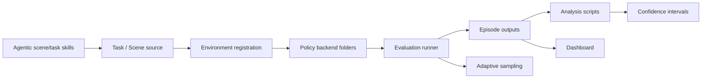

## 摘要

[[NVIDIA]] 的 `NVlabs/RoboLab` repository 是 [[RoboLab]] paper 的 official implementation artifact。本次 refresh 把 wiki 的 repo snapshot 从 2026-04-22 的 baseline commit `5d3ba41e551aced710b3d585b245a313a9a407ce` 更新到 2026-06-01 author date 的 `main` commit `7d45d74904eade3b578a8eb1f2f9f89bc3d40326`。GitHub compare 显示 current HEAD 相对 baseline ahead by 19 commits、behind by 0，涉及 README/docs、analysis、dashboard、policies、examples、assets、Docker、license 和 Claude Code skills 等设计面；详细 file inventory 见 `graph/extracts/robolab-20260612-7d45d749-repository-manifest.md`。

RoboLab 的核心仍是 robot- and policy-agnostic task-generalist evaluation substrate：task file 描述 scene、language instruction、termination/subtask predicates 和 contact objects；environment registration 再组合 robot articulation、actions、observations、cameras、lighting/background、simulation parameters；policy 通过 server-client inference 接入。新版 repo 把这个 substrate 向完整 benchmark platform 推进一步：新增 first-class dashboard、per-policy backend folders、adaptive sampling / confidence interval reporting、diagnostic pytest suite、VRAM sizing guide、known-issues page、Apache-2.0 licensing、以及 `/robolab-scenegen` / `/robolab-taskgen` agentic generation skills。

Source URL: https://github.com/NVlabs/RoboLab

## 核心主张

- README 仍定义 RoboLab 为 task-based evaluation benchmark，包含 100+ manipulation tasks、automated success detection、server-client policy architecture 和 multi-environment parallel evaluation；新增重点是“Results Dashboard with Episode Videos and Cross-Experiment Analysis”。
- 许可证与 packaging 发生实质变化：current README 将 framework 置于 Apache License 2.0，并新增 `THIRD_PARTY_NOTICES.md`；`pyproject.toml` 将 `robolab-dashboard` 暴露为 console script，默认 dependency set 包含 dashboard dependencies。
- 安装验证从旧的 `scripts/check_registered_envs.py` 风格转为 `uv run pytest tests/`，README 说明该 test suite 覆盖 IsaacLab import、task definition validity、env factory、single full episode，并在测试中自动接受 Omniverse EULA；常规入口仍需用户在首次运行时设置 `OMNI_KIT_ACCEPT_EULA=Y`。
- Policy integration 从单一 inference doc / examples path 重组为 `policies/<backend>/` folders。`policies/README.md` 明确每个 backend 含 `client.py`、`run.py`、`__init__.py` 和 backend README；concrete clients 继承 `robolab.eval.InferenceClient`，实现 `_extract_observation`、`_pack_request`、`_query_server`、`_unpack_response`，runner 构造 `make_client(args)` 并调用 `run_evaluation`。
- 新增 Cosmos 3 backend。`policies/cosmos3/README.md` 把 Cosmos3-Nano-Policy-DROID 描述为基于 Cosmos 3、post-training on DROID 的 World-Action Model（WAM），RoboLab client 通过 OpenPI WebSocket protocol 连接 server。
- Evaluation runner 新增 adaptive sampling surface：`--num-episodes-adaptive` 让 per-task loop 按 batch 运行，使用 95% Beta posterior credible interval width 与 `--ci-pp-width` 判断是否继续；这把 “跑多少 episodes” 从固定 `num_runs * num_envs` 扩展为 precision-targeted sampling。
- Analysis/reporting 现在显式显示 uncertainty：`analysis/read_results.py` 的 success-rate columns 带 95% Beta posterior credible interval；dashboard result cells 也显示 interval 和 half-width annotation；score 使用 Student-t interval。
- Dashboard 是新的一等 UX layer。`docs/dashboard.md` 与 `dashboard/app.py` 显示它是 FastAPI app，支持 persisted output sources、scene/task catalog browsing、episode video/thumb、event log、timeseries、overview/per-run summaries 和 LAN hosting；它读取 metadata JSON 与 output folders，不需要 import IsaacLab 才能浏览 catalog。
- Task/environment docs 更强调 external extensibility：`docs/environment_registration.md` 明确用户可以在自己的 repository 中注册 RoboLab tasks，无需修改 RoboLab；environment name 是 task + robot/config variant 的 composition，task name 可对应多个 environment variants。
- `docs/task_conditionals.md` 增加 mechanism explanation：containment 使用 centroid-in-convex-hull / open-top face logic；`object_on_top` 使用 contact force analysis 判断 stable support，这说明 success predicates 不只是 string-level semantics，而是 geometry + physics queries。
- Debug/ops surface 明显增强：`docs/debug.md` 定义 `VERBOSE`、`DEBUG`、`VISUALIZE`、WorldState inspection 和 diagnostic pytest scripts；`docs/known_issues.md` 记录 non-headless viewport VRAM leak 和 rendering artefacts；`docs/env_vram_size_guide.md` 给出 L40 48GB 上每个 task 的 `num_envs` upper bound。
- `/robolab-scenegen` Claude Code skill 把 natural language scene description 转成 USDA scene：读取 object catalog，生成 predicates JSON，使用 pure Python + numpy/scipy predicate solver 做 collision-free placement，再写 scene file。
- `/robolab-taskgen` Claude Code skill 把 natural language manipulation goal 转成 `Task` dataclass：选择 conditional function、写 instruction variants、termination、contact_object_list、episode_length 和 optional subtasks；这把 scene/task authoring 变成 [[AgenticSceneTaskGeneration|agentic scene/task generation]] workflow。
- Asset churn 主要是 `_wip` assets removal、scene metadata/images 更新和 utility script maintenance；除非具体 asset 影响 benchmark coverage，应作为 curation/governance evidence，而不是 concept-level 机制变化。

## 关键引文

- "Results Dashboard with Episode Videos and Cross-Experiment Analysis"
- "Apache License 2.0"
- "Adaptive sampling"
- "Every per-policy runner"
- "A self-contained web dashboard"

## 设计面分解

这次 repo refresh 的设计意义不是“RoboLab 多了一个 UI”，而是 evaluation contract 更完整：policy backend、runner、episode outputs、analysis scripts、dashboard、uncertainty reporting 和 adaptive sampling 现在构成 [[SimulationBenchmarkReportingPipeline|simulation benchmark reporting pipeline]]。同时，Claude Code skills 把 scene/task library 扩展流程写成 LLM-assisted authoring contract，但这仍应被看作 [[RoboticsSimulationInfrastructure|simulation infrastructure]] 的 authoring layer，而不是论文结论的一部分。

## 与旧 snapshot 的差异

- Baseline `5d3ba41e...` 的 wiki 重点是 task dataclass、conditionals/subtasks、WorldState、environment registration、policy clients、analysis tools 和 MNPE sensitivity script。
- Current `7d45d749...` 保留这些核心，但新增或强化了 dashboard、statistical significance/adaptive sampling、policy backend organization、Cosmos 3 client、pytest install verification、debug/known-issues/VRAM operational docs、Apache-2.0 licensing、third-party notices、agentic scene/task generation skills 和 asset curation。
- GitHub repo metadata 在本次抓取中显示 `pushed_at` 为 2026-06-01，`updated_at` 为 2026-06-12；star/fork 数是时间敏感 metadata，不作为长期知识结论。

## 关联

- [[robolab-a-high-fidelity-simulation-benchmark-for-analysis-of-task-generalist-policies]] - repo 对应的 arXiv paper source page；paper claims 与 repo 后续实现更新需要分开追溯。
- [[RoboLab]] - repo 实现的 benchmark/platform entity。
- [[TaskGeneralistPolicyEvaluation]] - task/subtask/predicate/evaluation APIs 与 adaptive sampling/reporting 的概念页。
- [[SimulationBenchmarkReportingPipeline]] - dashboard、analysis scripts、episode outputs 和 confidence intervals 的 generalized reporting pipeline。
- [[AgenticSceneTaskGeneration]] - `/robolab-scenegen` 和 `/robolab-taskgen` 暴露的 LLM-assisted scene/task authoring pattern。
- [[SimulationSensitivityAnalysis]] - repo 中 posterior inference 与 controlled perturbation workflow 对应的概念页。
- [[RoboticsSimulationInfrastructure]] - RoboLab 的 task API、policy adapters、dashboard、diagnostics、metadata 和 authoring workflow 属于 infrastructure case study。
- [[VisionLanguageActionModels]] - repo 内置 Pi0 family、GR00T、DreamZero、Cosmos 3 client examples，服务于 VLA / WAM-style policy evaluation。
- [[SimulationRealityGap]] - high-fidelity sim 与 controlled perturbations 是 diagnostic proxy，不等同于真实部署能力。

## 开放问题

- Dashboard 与 leaderboard 是否会形成 stable public submission workflow，还是主要作为 local experiment browser？
- Adaptive sampling 的 Beta interval stopping rule 是否会成为 RoboLab leaderboard 的 required protocol，还是只是 per-policy runner 的 optional compute-saving mode？
- Cosmos 3 / WAM-style policy backend 与 VLA backends 在 observation/action packing、latency、action chunking 上是否可公平比较？
- Agentic scene/task generation skills 的 solver/validation loop 能否稳定扩展 benchmark，同时避免 LLM-generated task bias？
- Apache-2.0 repo code license 与 assets / third-party materials 的具体 usage boundary 是否需要后续单独整理？
- Non-headless viewport VRAM leak 和 rendering artefacts 会不会影响 interactive debugging 的 reproducibility，尤其在 dashboard/video review 与 GUI eval 混用时？
