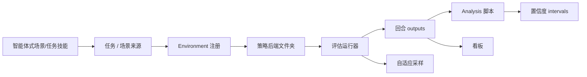

## 摘要

[[NVIDIA]] 的 `NVlabs/RoboLab` 代码仓库是 [[RoboLab]] 论文的官方实现产物。本次更新把知识库的代码仓库快照从 2026-04-22 的基线提交 `5d3ba41e551aced710b3d585b245a313a9a407ce` 更新到 2026-06-01 作者 date 的 `main` 提交 `7d45d74904eade3b578a8eb1f2f9f89bc3d40326`。GitHub 比较显示当前输出头相对基线 ahead 由 19 commits、隐藏在由 0，涉及 README/文档、分析、看板、策略、示例、资产、Docker、许可证和 Claude 代码技能等设计面；详细文件 inventory 见 `graph/extracts/robolab-20260612-7d45d749-repository-manifest.md`。

RoboLab 的核心仍是机器人- 与策略-agnostic 任务通用型评估基底：任务文件描述场景、语言指令、终止/子任务判定条件和接触物体；环境 registration 再组合机器人关节系统、动作、观测、相机、光照/背景、仿真参数；策略通过服务端客户端推理接入。新版代码仓库把这个基底向完整基准平台推进一步：新增一等的看板、per-策略后端文件夹、自适应采样 / 置信区间报告、诊断 pytest 套件、VRAM sizing 指南、已知问题页面、Apache-2.0 许可、以及 `/robolab-scenegen` / `/robolab-taskgen` 智能体式生成技能。

来源网址: https://github.com/NVlabs/RoboLab

## 核心主张

- README 仍定义 RoboLab 为任务基于评估基准，包含 100+ 操作任务、automated 成功检测、服务端客户端策略架构和多环境并行评估；新增重点是“结果看板带有回合视频与跨实验分析”。
- 许可证与 packaging 发生实质变化：当前 README 将框架置于 Apache 许可证 2.0，并新增 `THIRD_PARTY_NOTICES.md`；`pyproject.toml` 将 `robolab-dashboard` 暴露为 console 脚本，默认依赖集合包含看板依赖。
- 安装验证从旧的 `scripts/check_registered_envs.py` 风格转为 `uv run pytest tests/`，README 说明该测试套件覆盖 IsaacLab 导入、任务 definition 有效性、env factory、单一完整回合，并在测试中自动接受 Omniverse EULA；常规入口仍需用户在首次运行时设置 `OMNI_KIT_ACCEPT_EULA=Y`。
- 策略集成从单一推理文档 / 示例路径重组为 `policies/<backend>/` 文件夹。`policies/README.md` 明确每个后端含 `client.py`、`run.py`、`__init__.py` 和后端 README；具体的客户端继承 `robolab.eval.InferenceClient`，实现 `_extract_observation`、`_pack_request`、`_query_server`、`_unpack_response`，运行器构造 `make_client(args)` 并调用 `run_evaluation`。
- 新增 Cosmos 3 后端。`policies/cosmos3/README.md` 把 Cosmos3-Nano-策略-DROID 描述为基于 Cosmos 3、在 DROID 上继续训练的世界动作模型（WAM），RoboLab 客户端通过 OpenPI WebSocket 协议连接服务端。
- 评估运行器新增自适应采样表面：`--num-episodes-adaptive` 让 per-任务循环按批次运行，使用 95% Beta 后验可信区间 width 与 `--ci-pp-width` 判断是否继续；这把 “跑多少回合” 从固定 `num_runs * num_envs` 扩展为精度-targeted 采样。
- 分析/报告现在显式显示不确定性：`analysis/read_results.py` 的成功比率 columns 带 95% Beta 后验可信区间；看板结果 cells 也显示区间和 half-width 标注；得分使用学生 t 分布区间。
- 看板是新的一等用户体验层。`docs/dashboard.md` 与 `dashboard/app.py` 显示它是 FastAPI 应用，支持持久化输出来源、场景/任务目录浏览、回合视频与缩略图、事件日志、时间序列、总览与逐次运行摘要，以及局域网托管；它读取元数据 JSON 与输出文件夹，不需要导入 IsaacLab 就能浏览目录。
- 任务/环境文档更强调外部 extensibility：`docs/environment_registration.md` 明确用户可以在自己的代码仓库中注册 RoboLab 任务，无需修改 RoboLab；环境名称是任务 + 机器人/配置变体的组合，任务名称可对应多个环境变体。
- `docs/task_conditionals.md` 增加机制解释：包含使用 centroid-in-凸包 / 顶部开放的面 logic；`object_on_top` 使用接触力分析判断稳定的支撑，这说明成功判定条件不只是 string-层级语义，而是几何 + 物理查询。
- 调试/运维表面明显增强：`docs/debug.md` 定义 `VERBOSE`、`DEBUG`、`VISUALIZE`、WorldState 检查和诊断 pytest 脚本；`docs/known_issues.md` 记录非无头模式的视口 VRAM 泄漏和渲染伪影；`docs/env_vram_size_guide.md` 给出 L40 48GB 上每个任务的 `num_envs` 上限。
- `/robolab-scenegen` Claude 代码技能把自然语言场景描述转成 USDA 场景：读取物体目录，生成判定条件 JSON，使用 pure Python + numpy/scipy 判定条件求解器做无碰撞的放置，再写场景文件。
- `/robolab-taskgen` Claude 代码技能把自然语言操作目标转成 `Task` 数据类：选择条件函数、写指令变体、终止、contact_object_list、episode_length 和可选子任务；这把场景/任务制作变成 [[AgenticSceneTaskGeneration|智能体式场景/任务生成]] 流程。
- 资产 churn 主要是 `_wip` 资产 removal、场景元数据/图像更新和 utility 脚本维护；除非具体资产影响基准覆盖范围，应作为 curation/治理证据，而不是概念层级机制变化。

## 关键引文

- "Results Dashboard with Episode Videos and Cross-Experiment Analysis"
- "Apache License 2.0"
- "Adaptive sampling"
- "Every per-policy runner"
- "A self-contained web dashboard"

## 设计面分解

这次代码仓库更新的设计意义不是“RoboLab 多了一个 UI”，而是评估契约更完整：策略后端、运行器、回合输出、分析脚本、看板、不确定性报告和自适应采样现在构成 [[SimulationBenchmarkReportingPipeline|仿真基准报告流程]]。同时，Claude 代码技能把场景/任务库扩展流程写成 LLM 辅助的制作契约，但这仍应被看作 [[RoboticsSimulationInfrastructure|仿真基础设施]] 的制作层，而不是论文结论的一部分。

## 与旧快照的差异

- 基线 `5d3ba41e...` 的知识库重点是任务数据类、conditionals/子任务、WorldState、环境 registration、策略客户端、分析工具和 MNPE 敏感性脚本。
- 当前 `7d45d749...` 保留这些核心，但新增或强化了看板、statistical significance/自适应采样、策略后端组织、Cosmos 3 客户端、pytest 安装验证、调试/已知问题/VRAM operational 文档、Apache-2.0 许可、third-party notices、智能体式场景/任务生成技能和资产 curation。
- GitHub 代码仓库元数据在本次抓取中显示 `pushed_at` 为 2026-06-01，`updated_at` 为 2026-06-12；star/叉状数是时间敏感元数据，不作为长期知识结论。

## 关联

- [[robolab-a-high-fidelity-simulation-benchmark-for-analysis-of-task-generalist-policies]] - 代码仓库对应的 arXiv 论文来源页；论文主张与代码仓库后续实现更新需要分开追溯。
- [[RoboLab]] - 代码仓库实现的基准/平台实体。
- [[TaskGeneralistPolicyEvaluation]] - 任务/子任务/判定条件/评估 APIs 与自适应采样/报告的概念页。
- [[SimulationBenchmarkReportingPipeline]] - 看板、分析脚本、回合输出和置信区间的广义的报告流程。
- [[AgenticSceneTaskGeneration]] - `/robolab-scenegen` 和 `/robolab-taskgen` 暴露的 LLM 辅助的场景/任务制作模式。
- [[SimulationSensitivityAnalysis]] - 代码仓库中后验推理与受控的 perturbation 工作流对应的概念页。
- [[RoboticsSimulationInfrastructure]] - RoboLab 的任务 API、策略 adapters、看板、诊断信息、元数据和制作工作流属于基础设施情形研究。
- [[VisionLanguageActionModels]] - 代码仓库内置 Pi0 族、GR00T、DreamZero、Cosmos 3 客户端示例，服务于 VLA / WAM-风格策略评估。
- [[SimulationRealityGap]] - 高保真度 sim 与受控的 perturbations 是诊断代理，不等同于真实部署能力。

## 开放问题

- 看板与 leaderboard 是否会形成稳定的公开投稿工作流，还是主要作为局部实验 browser？
- 自适应采样的 Beta 区间 stopping rule 是否会成为 RoboLab leaderboard 的必需协议，还是只是 per-策略运行器的可选计算-saving 模式？
- Cosmos 3 / WAM-风格策略后端与 VLA 后端在观测/动作打包、延迟、动作 chunking 上是否可公平比较？
- 智能体式场景/任务生成技能的求解器/验证循环能否稳定扩展基准，同时避免 LLM 生成的任务偏差？
- Apache-2.0 代码仓库代码许可证与资产 / third-party 材质的具体用法边界是否需要后续单独整理？
- Non-headless 视口 VRAM 泄漏和渲染伪影会不会影响交互式调试的可复现性，尤其在看板/视频审查与 GUI eval 混用时？
