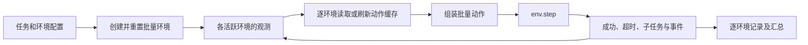

# RoboLab 实现：从任务定义到可追溯的评估记录

RoboLab 将任务语义、机器人与传感器配置、策略通信、回合执行和结果分析分开，使同一任务可以配上不同策略或扰动配置。本页固定于本地归档提交 `7d45d74904eade3b578a8eb1f2f9f89bc3d40326`（作者日期2026-06-01）；旧快照 `5d3ba41e…` 仍保留。[[robolab-a-high-fidelity-simulation-benchmark-for-analysis-of-task-generalist-policies|论文页]] 负责实验结论，本页解释这个较晚代码版本实际如何工作。

**阅读与验证范围。** 本轮静态追踪了任务、环境工厂、π0客户端、评估循环、结果持久化和自适应采样的关键路径；下面链接固定到归档提交的文件行号。没有安装或运行 Isaac Sim、策略服务或第三方测试，因此代码路径支持“如何实现”，不支持吞吐量、稳定性或论文成绩已复现。

## 一条具体任务怎样成为环境

以 `BananaInBowlTask` 为例，任务文件绑定 `banana_bowl.usda`、香蕉／碗／桌子的接触对象、三种指令详略版本、50秒时域及成功条件。成功要求香蕉满足容器几何判定、与碗接触且与夹爪分离；超时另作截断。子任务进度由 `pick_and_place` 组合。这里的任务是可执行的判定定义，不是只有一句自然语言。[任务文件 L15–45](https://github.com/NVlabs/RoboLab/blob/7d45d74904eade3b578a8eb1f2f9f89bc3d40326/robolab/tasks/benchmark/banana_in_bowl_task.py#L15-L45)

`EnvFactory.create_env_cfg` 解析任务文件，再将机器人、观测、动作、相机、光照、背景和仿真时序配置交给环境生成器；生成的配置类注册到 Gym，并进入任务／标签索引。`create_env` 按名字加载配置，选择指令变体、合并重置事件，创建环境，并将实际 `env_cfg` 写到输出目录。因此任务名标识语义，环境名还可以标识机器人或扰动变体。[factory.py L92–190](https://github.com/NVlabs/RoboLab/blob/7d45d74904eade3b578a8eb1f2f9f89bc3d40326/robolab/core/environments/factory.py#L92-L190)、[config.py L255–288](https://github.com/NVlabs/RoboLab/blob/7d45d74904eade3b578a8eb1f2f9f89bc3d40326/robolab/core/environments/config.py#L255-L288)、[runtime.py L108–203](https://github.com/NVlabs/RoboLab/blob/7d45d74904eade3b578a8eb1f2f9f89bc3d40326/robolab/core/environments/runtime.py#L108-L203)

### “香蕉在碗里”如何被计算

关键实现比函数注释更具体。`object_in_container` 的注释仍写局部 AABB，但实际调用 `in_opentop_container`，后者使用**对象凸包顶点的均值点**和**移除朝上面的容器凸包半空间**。均值点不是物体质量中心；旧 `tolerance` 参数在这个几何路径中不参与计算。[conditionals.py L189–231](https://github.com/NVlabs/RoboLab/blob/7d45d74904eade3b578a8eb1f2f9f89bc3d40326/robolab/core/task/conditionals.py#L189-L231)、[predicate_logic.py L330–403](https://github.com/NVlabs/RoboLab/blob/7d45d74904eade3b578a8eb1f2f9f89bc3d40326/robolab/core/task/predicate_logic.py#L330-L403)

下面是对该实现的数学转写。设对象局部均值点为 $c_o$，对象位姿为 $(R_o,t_o)$，容器位姿为 $(R_c,t_c)$，则容器局部点为：

$$
c_c=R_c^\top(R_oc_o+t_o-t_c),\qquad
\mathrm{inside}=\mathbf1[\max_j(n_j^\top c_c+d_j)\le0].
$$

$(n_j,d_j)$ 是保留的容器凸包平面；默认移除局部向上法向分量不小于0.7的面。这样物体位姿和容器位姿改变时，判定仍在容器坐标下进行。它是一种几何代理，不检查整个物体是否完全位于真实容器空腔；香蕉任务额外要求接触和松爪，收紧了仅靠均值点的条件。[hull_check.py L43–110](https://github.com/NVlabs/RoboLab/blob/7d45d74904eade3b578a8eb1f2f9f89bc3d40326/robolab/core/task/hull_check.py#L43-L110)

接触由 `WorldState.in_contact` 读取接触力矩阵，按默认0.1阈值检查任一分量是否超过阈值，并保留环境维度；不是从 RGB 图像判断接触。一般的坐标变换基础见 [[RobotCoordinateFrames|机器人坐标系]]，评估判定器与语义的关系见 [[TaskGeneralistPolicyEvaluation|策略评测]]。[world_state.py L551–573](https://github.com/NVlabs/RoboLab/blob/7d45d74904eade3b578a8eb1f2f9f89bc3d40326/robolab/core/world/world_state.py#L551-L573)

## 从观测到一次控制动作

`InferenceClient` 把策略适配拆成四步：抽取仿真观测、打包服务请求、发送请求、解包动作块。基类按 `env_id` 分开保存动作块与消费计数；缓存到达 `open_loop_horizon` 后才重新请求策略。子类可以更换通信协议和动作后处理，而评估主循环不必识别具体模型。[base_client.py L13–78、L131–141](https://github.com/NVlabs/RoboLab/blob/7d45d74904eade3b578a8eb1f2f9f89bc3d40326/robolab/eval/base_client.py#L13-L78)

π0系列客户端提供一个可检查的例子：从批量观测按环境索引取外置／腕部 RGB、7维关节位置与夹爪状态，复制到 CPU NumPy，图像补边缩放为224×224，再加指令发送到 OpenPI WebSocket 服务。返回 `actions` 后，最后一维以0.5为阈值二值化；默认开环长度 π0 为10、π0.5 为15。相机键名、通道和动作含义都属于策略的输入输出契约。[client.py L19–39、L80–119](https://github.com/NVlabs/RoboLab/blob/7d45d74904eade3b578a8eb1f2f9f89bc3d40326/policies/pi0_family/client.py#L80-L119)

**教学例子：** π0.5在第一个时刻返回一段动作，随后15次控制调用依次使用这段缓存，第16次才以新观测重新规划。这个间隔描述客户端闭环频率，并不意味着物理只积分15步，也不说明服务器输出长度恰好等于15。改变开环长度会同时改变反馈频率和请求成本，应随评测配置保存。接口语义见 [[PolicyDeploymentContract|策略部署契约]]。

## 并行环境中的执行和终止

```mermaid
flowchart LR
  T["任务和环境配置"] --> R["创建并重置批量环境"]
  R --> O["各活跃环境的观测"]
  O --> I["逐环境读取或刷新动作缓存"]
  I --> A["组装批量动作"]
  A --> S["env.step"]
  S --> G["成功、超时、子任务与事件"]
  G --> O
  G --> W["逐环境记录及汇总"]
```

图为对归档代码的教学重画。`run_episode` 共用一个客户端对象，在活跃环境上逐个调用 `infer`，再把动作堆成批量张量交给 `env.step`。**并行物理环境不等于批量策略推理**；此处客户端请求仍按循环顺序发生。结束时清空客户端缓存，避免下一批沿用旧动作。[episode.py L86–107、L138–158、L180–195](https://github.com/NVlabs/RoboLab/blob/7d45d74904eade3b578a8eb1f2f9f89bc3d40326/robolab/eval/episode.py#L138-L158)

`RobolabEnv` 截获自动重置：记录终止结果、导出该环境回合，然后把它标为“冻结”，后续不再请求策略并将其动作置零。底层仍调用父类的批量物理步，所以这里的冻结首先是评估控制与重置语义，不能仅凭名称断言物体状态绝对不再变化。代码还把前两步终止当作初始物理伪影重新重置。该细节会影响最早期终止的含义，应随版本理解。[env.py L65–120](https://github.com/NVlabs/RoboLab/blob/7d45d74904eade3b578a8eb1f2f9f89bc3d40326/robolab/core/environments/env.py#L65-L120)

## 结果如何成为报告

每个并行环境都有成功值、终止步、事件和轨迹。汇总阶段使用 `dt = sim.dt × decimation` 将控制步转换为时长；从 `run_N.hdf5` 读取轨迹和子任务最终分数，保存版本2事件日志，再把逐回合摘要追加到 `episode_results.jsonl`。回合编号按 `run_idx × num_envs + env_id` 生成，重启时可检查已完成编号。[summarize.py L145–198、L239–310](https://github.com/NVlabs/RoboLab/blob/7d45d74904eade3b578a8eb1f2f9f89bc3d40326/robolab/eval/summarize.py#L239-L310)、[results.py L604–638、L785–801](https://github.com/NVlabs/RoboLab/blob/7d45d74904eade3b578a8eb1f2f9f89bc3d40326/robolab/core/logging/results.py#L604-L638)

固定采样跑 `num_runs × num_envs` 个回合；自适应采样则每批之后根据当前成功数和总数，检查95% Beta 可信区间宽度，达到目标或上限后停止。该逻辑发生在下一批开始前，实际数量可能越过上限至批次边界。数学与“文档声称无偏但未证明”的限制集中见 [[SimulationBenchmarkReportingPipeline|报告流程]]，避免在本页重复推导。[runner.py L189–252](https://github.com/NVlabs/RoboLab/blob/7d45d74904eade3b578a8eb1f2f9f89bc3d40326/robolab/eval/runner.py#L189-L252)、[adaptive_sampling.py L20–40](https://github.com/NVlabs/RoboLab/blob/7d45d74904eade3b578a8eb1f2f9f89bc3d40326/robolab/core/utils/adaptive_sampling.py#L20-L40)

## 能力和证据边界

归档 README／文档另介绍结果看板、场景／任务制作技能、更多策略后端、调试和显存规划。它们是该版本的文档能力说明；本轮没有逐个执行，也没有将其回填为论文已经测量的效果。基准结果还取决于相机与动作适配、成功判定器、种子、时序、模型检查点和训练数据，单独固定仓库提交并不足以固定整个实验。

这条实现路径提供了一个具体判断：策略错误、接口错误和判定错误可能产生同样的低成功率，但应在不同层排查。[[SimulationSensitivityAnalysis|参数敏感性分析]] 研究环境变化，[[RoboticsSimulationInfrastructure|仿真基础设施]] 研究这些层之间的接口，[[RoboLab|项目入口]] 汇合论文与实现。

## 研究归属

[[topics/assets-and-world-generation|三维资产与场景生成]] · [[topics/evaluation-and-transfer|评测与现实迁移]] · [[topics/robot-policy-learning|机器人策略学习]] · [[topics/simulation-ready-worlds|生成世界何时成为可执行环境]] · [[topics/policy-evaluation|数据与评测怎样支撑泛化判断]]。
