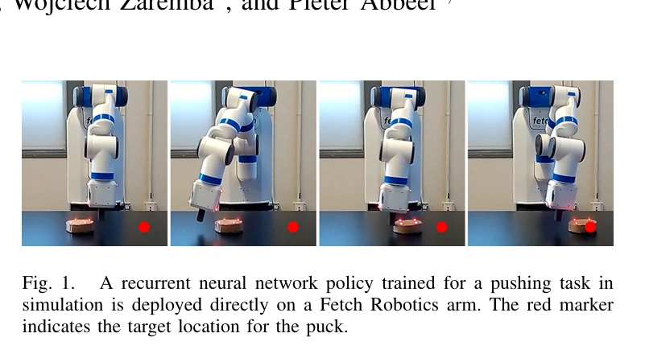
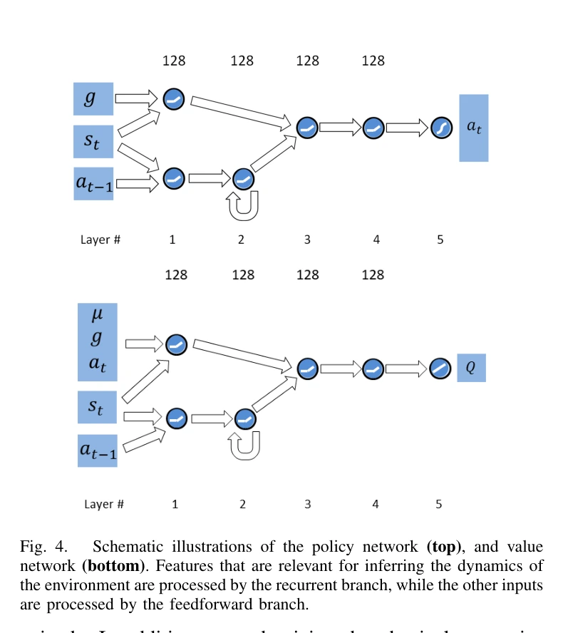

## 一屏概览

**研究问题：** 仿真中学会的推动策略，能否在质量、摩擦、执行时序和观测误差都不准确时直接控制真实机械臂？Peng 等让策略在随机动力学中训练，并用循环记忆根据交互历史调整动作。

原文图 1；PDF 第 1 页。[查看原始来源](https://arxiv.org/pdf/1710.06537v3#page=1)

**主要贡献：** 将动力学随机化、循环策略、训练时可读物理参数的价值网络，以及事后经验回放（HER）组合起来，用稀疏目标奖励训练 Fetch 推圆盘任务。

**结论范围：** 表 II 的循环策略真实成功率为 $0.89\pm0.06$，共 28 次试验；圆盘状态由动作捕捉取得，成功阈值为距目标 7 cm。这是状态输入的单任务动力学迁移证据，不是视觉端到端操作验证。依据为 [原论文](https://arxiv.org/abs/1710.06537v3) 第 IV–V 节、算法 1、表 I–III；本页以完整归档 v3 为准。

## 方法：在一族动力学里学习可适应策略

设 $\mu$ 为仿真动力学参数，$\rho_\mu$ 为其采样分布，$s_t,a_t$ 为状态和动作，$g$ 为本回合目标位置。原文第 IV 节把策略目标改成随机动力学下的平均回报：

$$
\max_\pi\;\mathbb E_{\mu\sim\rho_\mu}\mathbb E_{\tau\sim p(\tau\mid\pi,\mu)}\left[\sum_{t=0}^{T-1}r(s_t,a_t,g)\right].
$$

其中 $\tau$ 是长度为 $T$ 的交互轨迹。到达目标时奖励为 0，否则为 $-1$；HER 把过去轨迹实际达到的位置重标为目标，使失败轨迹也能提供到达目标的学习信号。策略用循环确定性策略梯度 RDPG 训练，以适配 HER 的离策略数据。（第 III-B、IV-E 节、算法 1）

### 随机化哪些量，何时变化

质量、阻尼等在每回合开始采样并保持固定；动作持续时间与观测噪声每一步重采样。共 95 个随机参数，不只是“随机摩擦”。（第 IV-C 节、表 I）

| 参数 | 范围或规则 |
|---|---|
| 机械臂连杆质量 | 默认值的 $0.25$–$4$ 倍 |
| 关节阻尼 | 默认值的 $0.2$–$20$ 倍 |
| 圆盘质量、摩擦 | $0.1$–$0.4$ kg；摩擦系数 $0.1$–$5$ |
| 桌面高度、控制增益 | $0.73$–$0.77$ m；增益为默认值的 $0.5$–$2$ 倍 |
| 动作持续时间 | $\Delta t=0.04\,\mathrm{s}+\mathrm{Exp}(\lambda)$，$\lambda\in[125,1000]\,\mathrm{s}^{-1}$，同回合内 $\lambda$ 固定 |
| 观测噪声 | 零均值高斯噪声，标准差为各状态特征运行标准差的 5% |

质量、阻尼、摩擦和增益在对数尺度采样，其他部分参数均匀采样。物理步长为 0.002 s，默认每 20 个物理步更新控制，但动作时长随机化后并非严格固定 25 Hz。（第 V 节）

### 为什么需要记忆与特权价值网络

策略接收 52 维状态，包括关节位置和速度、末端位置及圆盘位姿和速度；输出七个关节相对当前位置的目标角度增量。前馈分支直接读取当前状态和目标，LSTM 分支读取状态与上一步动作，维护对近期交互的摘要。可以写为 $a_t=\pi_\theta(s_t,z_t,g)$，其中 $z_t$ 是历史形成的隐藏状态。（第 IV-B、D、F 节、图 4）

原文图 4；PDF 第 6 页。[查看原始来源](https://arxiv.org/pdf/1710.06537v3#page=6)

训练中的价值网络 $Q_\phi(s_t,a_t,y_t,g,\mu)$ 额外读取真实仿真参数 $\mu$，$y_t$ 是其自身的循环状态；策略并不读取 $\mu$。这样可在训练时利用已知参数评价动作，而部署时只需可观测状态和历史。作者称之为隐式系统辨识；实验没有直接验证隐藏状态是否恢复了唯一的质量、摩擦等参数。

### 一次交互如何同时提供控制和适应信息

**教学例子：** 两张桌面上的圆盘在某一时刻位置、速度相同，接下来相同推力却可能因摩擦不同而产生不同位移。只看当前状态的策略无法区分这两种情况；历史中的“上次怎样推、随后移动多少”则提供响应信息。LSTM 不必输出一个摩擦系数，它只需形成能帮助选动作的隐藏状态。这里的物理参数在回合内固定，所以历史有预测价值；如果把摩擦每一步独立重抽，任务就变成另一种适应问题。（对第 IV-C–D 节的机制解释。）

训练流程为：每回合采样 $\mu$ 和目标 $g$ → 在该动力学下收集状态、动作与结果 → 连同参数和目标存入回放 → 对部分轨迹用实际到达位置重标目标并重算奖励 → 以循环价值网络评价动作、更新策略。HER 改的是目标和奖励，不会把失败动作改造成另一条物理轨迹；价值网络知道 $\mu$，可区分相同状态动作在不同物理条件下的后果。部署时去掉价值网络、回放和 HER，保留循环策略及其历史更新，物体状态仍由动作捕捉提供。（第 IV-E–F 节、算法 1；隐式适应与显式参数拟合见 [[SystemIdentificationForSimulation|系统辨识]]。）

## 实验与消融

仿真训练约用一亿样本，在 100 核集群上模拟约 8 小时。训练每回合 100 个控制步，真实评估则是 200 步；初始圆盘和目标位置在 $0.3\times0.3$ m 区域随机选择，真实圆盘约重 0.2 kg、半径 0.065 m。（第 V 节）

| 模型，表 II | 仿真成功率 | 真实成功率 | 真实次数 |
|---|---|---|---|
| LSTM＋随机化 | $0.91\pm0.03$ | $0.89\pm0.06$ | 28 |
| 前馈、无随机化 | $0.51\pm0.05$ | $0.00\pm0.00$ | 10 |
| 前馈＋随机化 | $0.83\pm0.04$ | $0.67\pm0.14$ | 12 |
| 前馈＋八步历史＋随机化 | $0.87\pm0.03$ | $0.70\pm0.10$ | 20 |

仿真评估各 100 次且带随机动力学。无随机化前馈策略与 LSTM 完整策略同时改变了模型和训练分布，不能把两者全部差异归因于记忆；随机化前馈与 LSTM 的对照才更接近记忆结构的比较。表中误差项按原文保留，不擅自改称置信区间。

| 固定或去掉的因素，表 III | 真实成功率 | 次数 |
|---|---|---|
| 完整设置 | $0.89\pm0.06$ | 28 |
| 固定动作持续时间 | $0.29\pm0.11$ | 17 |
| 不加观测噪声 | $0.25\pm0.12$ | 12 |
| 固定连杆质量 | $0.64\pm0.10$ | 22 |
| 固定圆盘摩擦 | $0.48\pm0.10$ | 27 |

这些消融支持控制延迟和传感噪声在本设置中尤其重要。第 V-C 节还在圆盘底部附加薯片袋改变接触，报告成功率 $0.91\pm0.04$；这是特定接触扰动测试，不能替代大规模未知物体评估。

## 局限与我们的解释

**作者证据的边界：** 真实验证只涉及一种推动任务，使用外部动作捕捉，视觉输入是结论中的后续方向。真实试验数量较小且各模型不同，没有覆盖任意精密接触或长时间操作。（第 V–VI 节）

**我们的解释：** 这里的鲁棒性有两个来源：训练分布迫使策略避免只在单一参数下有效的动作，交互历史则让它根据当前系统反应作调整。两者都依赖任务所需变化被训练覆盖；记忆提供适应机制，并不自动解决训练分布之外的任意动力学。少用真实训练数据，也不意味着总计算成本低。

## 关联与归档

[[DomainRandomization|域随机化]] 解释分布训练；[[SystemIdentificationForSimulation|系统辨识]] 区分显式参数估计与隐式适应；[[SimulationTimeStepping|仿真步长与控制频率]] 解释动作时序；[[SimulationRealityGap|现实差距]] 汇总未建模因素。与 [[tobin-domain-randomization|视觉随机化]]、[[simopt-adaptive-randomization|SimOpt 自适应随机化]] 对照，可分别研究“随机什么”和“如何调整随机化分布”。

原始证据、版本和获取日期见页首。归档 SHA-256 为 `a15cb24630a11218865027024ae2353f80f46d40371b42dccb2b24e9d00d62d8`，登记在 `graph/acquisitions.jsonl`；本次完整复核归档 PDF 的方法、实验与参考文献。

## 研究归属

[[topics/evaluation-and-transfer|评测与 Sim-to-Real]] · [[topics/simulation-transfer|Sim-to-Real]]。
