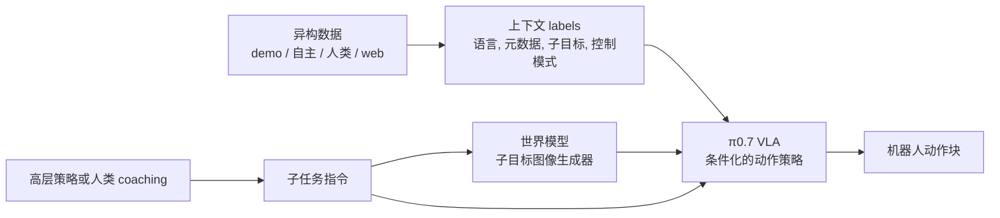

## 摘要

物理 Intelligence 的 π0.7 论文提出一个 [[pi07-steerable-generalist-robotic-foundation-model|π0.7]] 机器人基础模型：它不只把任务语言映射到动作，而是把任务指令、子任务指令、生成的子目标图像、回合元数据和控制模式都放进提示与上下文，让同一个 [[VisionLanguageActionModels|VLA（视觉—语言—动作模型）]] 可以利用示范数据、质量混合的自主数据、人类第一视角视频和网络多模态数据。

论文的核心判断是：大规模异质数据本身不够，机器人策略需要 [[RobotContextConditioning|上下文条件化]] 来区分回合的策略、质量、速度、错误与视觉 outcome。否则模型会在不同 strategy/模式之间平均，学到 suboptimal 行为。π0.7 用更丰富的上下文把“数据多样性”转成可 steer 的行为空间，并在实验中展示 out-的-the-盒体 dexterity、指令 following、跨机器人形态迁移和 [[CompositionalGeneralizationInRobotics|组合式泛化 in 机器人学]]。

来源网址: https://www.pi.website/download/pi07.pdf

相关的项目页面: https://www.pi.website/blog/pi07

## 核心主张

- π0.7 是一个约 5B-参数的 VLA：4B Gemma3 VLM 主干网络、MEM-风格视频历史编码器、860M-参数流程-匹配动作专家，并在上下文中加入语言命令、回合元数据、控制模式和子目标图像。
- 标准 VLA 目标是从观测历史 $o_{t-T:t}$ 与上下文 $C_t$ 预测未来动作 chunk $a_{t:t+H}$；π0.7 的主要变化不是全新主干网络，而是扩展 $C_t$，让训练示例携带“怎么做”和“做得多好”的信息。
- 提示/上下文被拆成任务指令 $\ell_t$、子任务指令 $\hat{\ell}_t$、多视角子目标图像 $g_t$、回合元数据 $m$ 与控制模式 $c$。训练时随机 dropout 提示组件，使模型在测试时可以使用任意子集。
- 子目标图像由轻量的世界模型生成；这个世界模型接收当前观测、子任务指令和元数据，输出 near-未来多视角图像。它把语言层级意图转成视觉目标，使低层 VLA 更容易做空间语义落地。
- 回合元数据包括总体速度、总体质量和错误标签。论文的关键 argument 是：元数据允许模型吸收失败、低质量示范数据与自主轨迹采样，同时在测试时被提示到快速/高质量/无错误模式。
- 运行时流程是 hierarchical 的：人类或学得的高层策略产生子任务指令，世界模型异步刷新子目标图像，π0.7 动作专家产生 50-步骤动作 chunks，并用实时动作 chunking 处理推理延迟。
- 实验声称 π0.7 在 laundry folding、espresso、盒体 building 等灵巧任务上能 out-的-the-盒体接近或超过任务特定的 RL/SFT specialists；消融显示去掉元数据或自主评估数据会显著降低表现，尤其是吞吐量。
- 指令-following 实验覆盖未见的 kitchens/bedrooms、复杂的 referential 指令和 deliberately 反向的数据集 biases；生成的子目标图像对一些 reverse-偏差任务是关键。
- 跨机器人形态迁移实验中，π0.7 把 folding 等灵巧技能转移到未收集该任务数据的 bimanual UR5e 系统；shirt folding 对比中，π0.7(GC) 达到 85.6% 任务进度 / 80% 成功，专家 teleoperators 为 90.9% / 80.6%。
- 组合式泛化主要表现为两类：short-时域未见的任务可直接提示；长时域未见的 appliance 任务需要步骤由-步骤语言 coaching，之后可以用 coaching traces 训练高层策略，让 π0.7 autonomously 生成子任务。
- 论文也明确承认零样本泛化仍低于分布内：见过的任务常超过 90% 成功，而未见的任务或未见的任务机器人 combinations 通常在 60-80% range。
- “Seen/unseen” 本身难以界定：由于 training data 很大且多样，某些看似 unseen 的行为可能是从相关 episodes、web-scale pretraining 或 incidental skills 中 remix 出来的。

## 关键引文

- "how to do it"
- "out of the box"
- "compositional generalization"

### PhysicalIntelligence

物理 Intelligence 是 [[pi07-steerable-generalist-robotic-foundation-model|π0.7 论文]] 的发布组织。当前知识库中它主要作为 [[pi07-steerable-generalist-robotic-foundation-model|π0.7]]、π0.6/MEM/RL-specialist 模型 line、机器人数据采集基础设施与机器人基础模型研究的实体出现。

在这个来源中，物理 Intelligence 的技术 thesis 是：机器人基础模型的泛化不只来自更多参数或更多示范，还来自能把异构数据标注为不同 strategy、质量、速度、错误和目标状态的 [[RobotContextConditioning|上下文条件化]]。这让一个通用型 VLA 在测试时被 steer 到特定行为模式，而不是平均掉数据集中互相冲突的轨迹。

本页只记录该来源对物理 Intelligence 的处理方式；关于公司状态、产品化部署或模型开放性，需要另行收录官方页面、模型 card 或独立 evaluations。

### Pi07

π0.7 是 [[pi07-steerable-generalist-robotic-foundation-model|Physical Intelligence]] 在 [[pi07-steerable-generalist-robotic-foundation-model|π0.7: a Steerable Generalist Robotic Foundation Model with Emergent Capabilities]] 中提出的 steerable 通用型机器人基础模型。它属于 [[VisionLanguageActionModels|VLA（视觉语言动作模型）]] 族：输入多视角观测、本体感知历史与提示/上下文，输出 continuous 机器人动作 chunks。

#### 模型结构

π0.7 约 5B 参数：一个 4B Gemma3 VLM 主干网络，一个 MEM-风格视频历史编码器，以及一个 860M-参数流程-匹配动作专家。观测 $o_t=[I_t^1,\dots,I_t^n,q_t]$ 由最多四个相机视图和机器人关节配置 $q_t$ 组成；动作专家预测 50-步骤动作 chunk $a_{t:t+H}$，运行时只执行其中 $H'$ 个步骤并持续异步刷新。

π0.7 的关键不是只换主干网络，而是扩展上下文 $C_t$：任务指令、子任务指令、生成的子目标图像、回合元数据与控制模式都可以进入提示。训练时随机 dropout 这些组件，因此测试时可以只给语言，也可以加元数据、视觉子目标或人类 coaching。

#### 机制角色

π0.7 把大规模混合机器人数据集的问题改写成条件建模问题。失败、低质量示范、RL-trained 策略轨迹采样、人类第一视角视频和 web 数据都可能有用，但前提是上下文让模型知道当前轨迹是快/慢、好/坏、有/无错误、关节/ee 控制，以及 near-未来视觉状态应该是什么。

#### 来源证据

论文报告 π0.7 在灵巧分布内任务上可以 out-的-the-盒体接近任务特定的 specialists；在未见的 kitchens/bedrooms 中提升指令 following；在 bimanual UR5e 上展示跨机器人形态 laundry folding；并能通过语言 coaching 学习未收集动作示范的 appliance 任务。

这些主张需要按来源特有的证据使用：论文的实验规模很大，但模型 weights、完整数据、独立 reproduction 和公开基准并未在本来源中提供。

## 关联

- [[pi07-steerable-generalist-robotic-foundation-model|Pi07]] - 本来源的核心模型/实体页面。
- [[pi07-steerable-generalist-robotic-foundation-model|PhysicalIntelligence]] - 发布 π0.7 论文与相关模型 line 的组织。
- [[VisionLanguageActionModels]] - π0.7 所在的动作预测模型族。
- [[RobotContextConditioning]] - 本文最重要的机制：用更丰富的上下文解开异构机器人数据的歧义。
- [[CompositionalGeneralizationInRobotics]] - 本文围绕未见的任务、语言 coaching 和跨机器人形态迁移展示的能力类型。
- [[WorldModelsForEmbodiedAI]] - π0.7 的子目标生成器是一个决策-耦合的世界模型 use 情形：世界模型不直接控制机器人，而是生成视觉目标来条件策略。

## 开放问题

- π0.7 的组合式泛化有多少来自机器人数据中的潜在重叠，有多少来自 web-规模 VLM/图像生成器预训练，还有多少来自提示/上下文设计？
- 子目标图像世界模型在失败 recovery 中如何表现？如果它生成看似合理但物理上 unreachable 的目标图像，VLA 会如何失败？
- 元数据 prompting 是否会在部署中产生 miscalibration：例如要求高速度/高质量/no 错误，但当前状态或机器人形态已经超出训练分布？
- “Coaching → high-level policy” 能否扩展到更长 horizon、更高 branching factor、需要 retry/repair 的 household tasks？
- 论文没有把模型 weights、训练数据或完整评估 protocols 变成可复现产物；这些主张目前主要是来源特有的证据，而不是独立基准 consensus。
