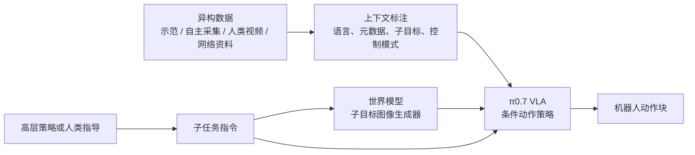

## 摘要

Physical Intelligence 的 π0.7 论文提出一个可通过提示引导行为的机器人基础模型。它把任务指令、子任务指令、生成的子目标图像、回合元数据和控制模式都纳入上下文，让同一个 [[VisionLanguageActionModels|视觉—语言—动作模型（VLA）]] 可以利用示范数据、质量混合的自主数据、人类第一视角视频和网络多模态数据。

论文的核心判断是：大规模异构数据还需要 [[RobotContextConditioning|上下文条件化]]，才能区分轨迹中的行为策略、质量、速度、错误与视觉结果，避免把互相冲突的行为平均成次优策略。实验围绕无需任务专门微调的灵巧操作、指令遵循、跨机器人形态迁移和 [[CompositionalGeneralizationInRobotics|机器人组合泛化]] 展开。

来源网址: https://www.pi.website/download/pi07.pdf

项目页面: https://www.pi.website/blog/pi07

## 核心主张

- π0.7 约有 5B 参数，包括 4B Gemma3 VLM 主干网络、MEM 风格的视频历史编码器和 860M 参数的流匹配动作专家。主要变化是扩展上下文，而不是重新设计整个 VLA 主干网络。
- 标准 VLA 从观测历史 $o_{t-T:t}$ 与上下文 $C_t$ 预测未来动作块 $a_{t:t+H}$。π0.7 将 $C_t$ 拆为任务指令 $\ell_t$、子任务指令 $\hat{\ell}_t$、多视角子目标图像 $g_t$、回合元数据 $m$ 与控制模式 $c$；训练时随机丢弃部分提示组件，让测试时可以使用任意子集。
- 子目标图像由轻量世界模型生成：输入当前观测、子任务指令和元数据，输出近期未来的多视角图像。这些视觉目标把高层语言意图落到具体空间状态，再交给低层 VLA 执行。
- 回合元数据包含总体速度、总体质量和错误标签。论文认为，这让失败、低质量示范和自主采样轨迹也能进入训练，同时允许测试时提示模型选择快速、高质量或无错误的行为模式。
- 运行时采用分层流程：人类或学得的高层策略产生子任务指令，世界模型异步刷新子目标图像，动作专家生成 50 步动作块，并通过实时动作分块执行处理推理延迟。
- 论文报告，通用 π0.7 在折叠衣物、制作浓缩咖啡和组装盒子等灵巧任务上，无需任务专门微调即可接近或超过任务专用的 RL/SFT 模型。去掉元数据或自主评估数据的消融会显著降低表现，尤其是吞吐量。
- 指令遵循实验覆盖未见过的厨房和卧室、复杂的指代指令，以及刻意违背训练数据偏好的任务。生成的子目标图像对部分要求反转数据偏好的任务尤为重要。
- 跨机器人形态迁移实验把折叠衣物等技能迁移到未采集该任务数据的双臂 UR5e。衬衫折叠实验中，π0.7(GC) 的任务进度为 85.6%、成功率为 80%；专家遥操作员分别为 90.9% 和 80.6%。
- 组合泛化有两种证据：未见过的短时域任务可以直接用提示完成；未见过的长时域家电任务需要逐步语言指导，再用这些指导记录训练高层策略，让 π0.7 自主产生子任务。
- 零样本泛化仍弱于分布内表现：见过的任务成功率常超过 90%，未见任务或未见的任务—机器人组合通常为 60%–80%。论文也承认，大规模训练数据使“见过/未见”的划分难以严格界定；部分新行为可能由相关轨迹、网络预训练或偶然学到的技能组合而来。

## 模型结构

观测 $o_t=[I_t^1,\dots,I_t^n,q_t]$ 包含最多四个相机视图和机器人关节配置 $q_t$。动作专家预测 50 步动作块 $a_{t:t+H}$，运行时只执行其中 $H'$ 步，并持续异步刷新后续预测。

上下文用于标明混合数据中“怎么做”和“做得如何”：同一任务可以包含快慢不同、质量不同、有无错误以及关节或末端执行器控制的轨迹。提示中的视觉子目标进一步给出接下来应达到的状态。

```mermaid
flowchart LR
  A["异构数据<br/>示范 / 自主采集 / 人类视频 / 网络资料"] --> B["上下文标注<br/>语言、元数据、子目标、控制模式"]
  B --> C["π0.7 VLA<br/>条件动作策略"]
  D["高层策略或人类指导"] --> E["子任务指令"]
  E --> F["世界模型<br/>子目标图像生成器"]
  F --> C
  E --> C
  C --> G["机器人动作块"]
```

## 关键引文

- "how to do it"
- "out of the box"
- "compositional generalization"

## 关联

- [[VisionLanguageActionModels|视觉—语言—动作模型]] - π0.7 所属的动作预测模型族。
- [[RobotContextConditioning|机器人上下文条件化]] - 本文的核心机制：用上下文区分异构机器人数据中的行为模式。
- [[CompositionalGeneralizationInRobotics|机器人组合泛化]] - 本文关于未见任务、语言指导和跨机器人形态迁移的证据。
- [[WorldModelsForEmbodiedAI|具身智能世界模型]] - π0.7 的世界模型生成视觉子目标，用这些目标引导动作策略。

## 开放问题

- 组合泛化分别有多少来自机器人训练数据中的潜在重叠、网络规模的 VLM/图像生成器预训练，以及提示与上下文设计？
- 子目标图像生成器如何支持失败恢复？如果它产生视觉上合理、物理上却无法达到的目标，VLA 会如何失败？
- 部署状态或机器人形态超出训练分布时，要求“高速度、高质量、无错误”的元数据提示是否仍能可靠地引导行为？
- 从语言指导记录训练高层策略的方法，能否扩展到时域更长、分支更多、需要重试和修复的家务任务？
- 本来源没有提供模型权重、完整训练数据或可独立复现的完整评估协议。上述结果应作为论文报告的证据使用；模型开放性、独立复现和实际部署情况仍需另行核验。
