# π0.7：用丰富上下文引导通用机器人策略

## 一屏概览

**研究问题。** 不同示范、失败回合和专用策略轨迹混在一起时，同一任务可能对应不同质量与执行方式。怎样让通用策略学习这些差异，并在执行时选择期望的行为？

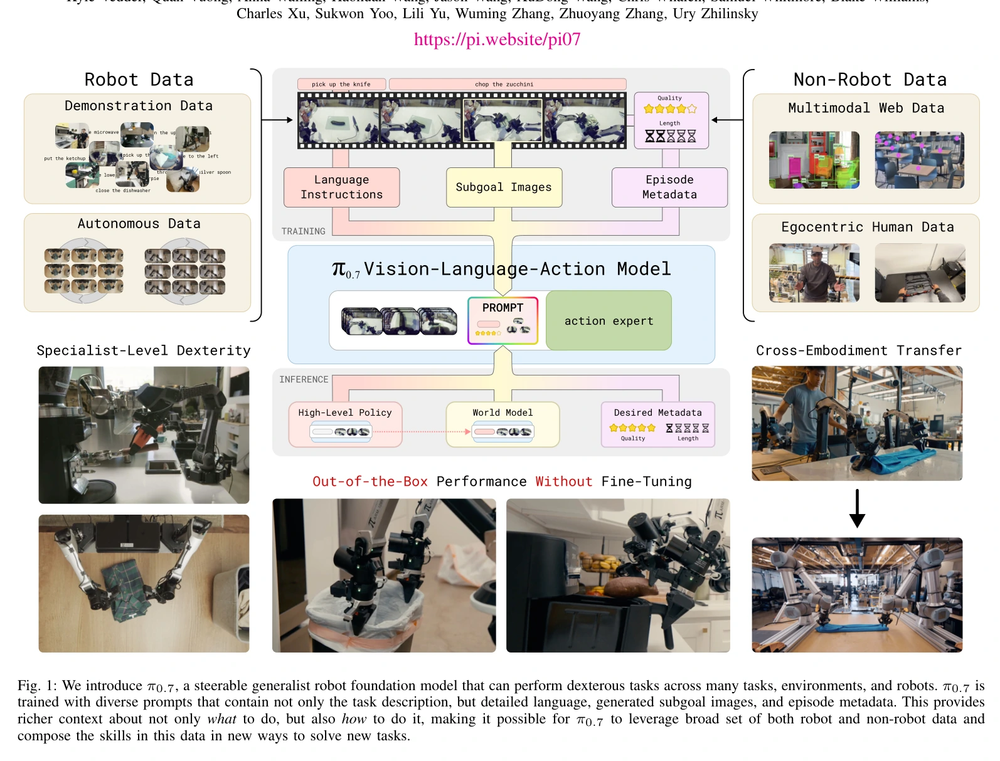

原文图 1；PDF 第 1 页。[查看原始来源](https://www.pi.website/download/pi07.pdf#page=1)

**方法贡献。** π0.7 把子任务语言、视觉子目标、速度／质量／错误元数据和控制模式加入条件输入，并在训练中随机丢弃部分条件。约 5B 参数的 VLA 执行动作；独立的 BAGEL 14B 模型按需生成子目标，高层策略或人类给出子任务。（§III–VII，图 2）

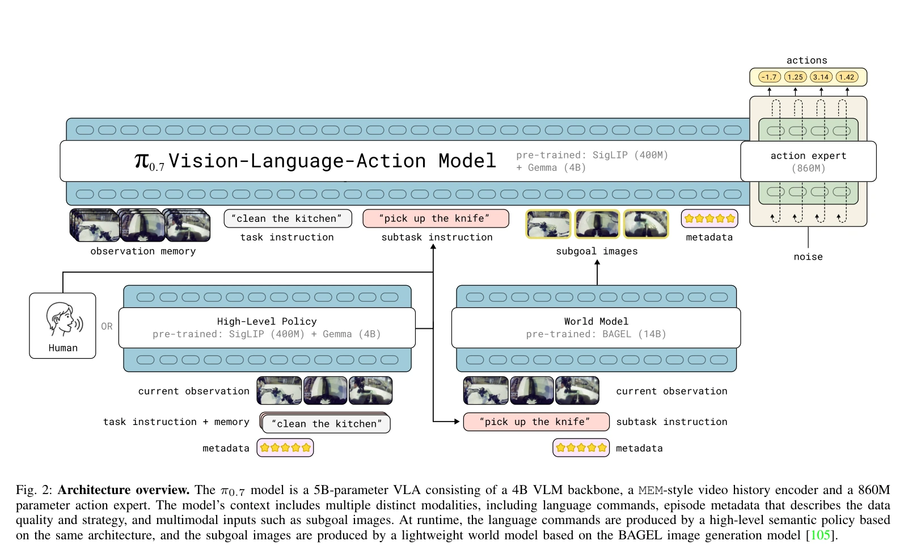

原文图 2；PDF 第 4 页。[查看原始来源](https://www.pi.website/download/pi07.pdf#page=4)

**证据结论。** 作者报告已见任务上的专用策略级表现、未见环境指令遵循和有限跨形态迁移。必须区分三种情形：训练已见任务但无需再微调；未见任务通过逐步语言指导完成；再用指导记录训练高层策略实现自主执行。后两者不是同一种“零样本自主完成”。（§IX-A–D）

原文：[论文 PDF](https://www.pi.website/download/pi07.pdf) · [项目页面](https://www.pi.website/blog/pi07)。本页完整复核本地归档技术报告（登记日期 2026-04-16）的正文与附录；未把图中缺少精确标签的柱高猜成数值。

## 条件化的机制

### 从一句任务到可区分的数据模式

令观测 $o_t=[I_t^1,\ldots,I_t^n,q_t]$ 包含相机图像与机器人状态，$o_{t-T:t}$ 为历史，$a_{t:t+H}$ 为动作块。上下文写为：

$$
C_t=(\ell_t,\hat\ell_t,g_t,m,c),\qquad
\max_\theta\ \mathbb E_{\mathcal D}\log\pi_\theta(a_{t:t+H}\mid o_{t-T:t},C_t).
$$

$\ell_t$ 是总任务、$\hat\ell_t$ 是当前子任务、$g_t$ 是多视角子目标，$m$ 是回合元数据，$c$ 是关节／末端控制模式。该目标沿用论文式 1 的概括；连续动作专家实际用流匹配近似训练，不是直接计算闭式动作对数似然。（§III、V）

元数据包括回合步数（按 500 步分箱）、1–5 的质量分数，以及当前片段是否出错。训练使用实际标签，执行时通常给最高质量、无错误，以及任务回合长度第 15 百分位对应的速度条件。这是期望行为提示，**不是检测到真实执行已无错误，也不是成功保证**。（§V-C、VII）

**我们的解释。** 如果低质量和高质量轨迹都只标“完成任务”，模型难区分它们为何不同；加入质量与策略条件，使两者可以对应不同条件分布。本文消融支持这一数据使用方式，却没有证明人工质量标签对所有机器人任务都足够或自动正确。

### 子目标图像承担什么责任

独立模型根据当前多视角图像、子任务指令和元数据生成目标图像。它由 BAGEL 初始化，在高质量分段标签对应的末帧目标、第一视角人类视频、图像编辑和视频数据上训练。当前图像经 ViT 与 VAE 两条路径编码；14B 模型含 7B 理解主干与 7B 生成主干。（§V-B、附录 C）

子目标给 VLA 具体的空间结果，使动作学习接近“从当前状态到目标状态的逆动力学”问题。该生成器输入没有待检验的动作序列，因此它主要作为视觉目标提供者；本文没有用它在线搜索多条候选动作的物理后果。

### 条件丢弃与训练／部署差异

只有 25% 的训练样本加入子目标；这些样本中再以 30% 概率去掉子任务语言。元数据整体以 15% 概率丢弃，各字段另有 5% 独立丢弃；控制模式始终保留。因此“任意子集”不能理解成控制模式也可任意遗漏。（§V-E）

训练目标图像既有真实未来帧，也有生成图像以降低两者差异；真实目标中 25% 取片段末帧，75% 从未来 0–4 秒抽样。这几个比例的分母不同，不能合并为一次总采样比例。（§VI-C）

## 模型与执行系统

VLA 以 Gemma3 4B 视觉语言主干、MEM 历史编码和 860M 流匹配动作专家组成。最多四相机，每路最多六帧历史，最多三个子目标视图；历史图像被压缩到固定数量标记。训练通过 FAST 离散动作标记监督视觉语言主干，连续动作专家的梯度不回传主干，即知识隔离训练。（§III、IV、VI-B）

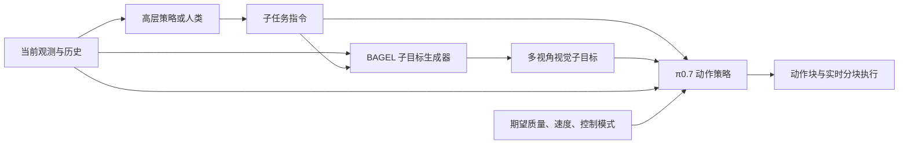
```mermaid
flowchart LR
  O["当前观测与历史"] --> H["高层策略或人类"]
  H --> L["子任务指令"]
  O --> W["BAGEL 子目标生成器"]
  L --> W
  W --> G["多视角视觉子目标"]
  L --> P["π0.7 动作策略"]
  G --> P
  O --> P
  M["期望质量、速度、控制模式"] --> P
  P --> A["动作块与实时分块执行"]
```

动作专家用五步去噪输出 50 步动作块，每次执行 15 或 25 步后更新。子目标在子任务改变或距上次生成四秒时异步刷新；动作策略使用最新可用目标继续执行。训练模拟 0–12 步推理延迟，配合实时动作分块。UR5e 以 20 Hz 执行，其余所列机器人为 50 Hz；这些控制频率不是整套生成系统的推理频率。（§VI-B、VII–VIII，算法 1）

**计算边界。** 附录 D 报告 VLA 与高层策略在单 H100 上运行，最小 VLA 配置约 38 ms，加入历史和子目标后最坏约 127 ms；14B 子目标生成器另用四张 H100，25 步去噪约 1.25 秒。因此“5B VLA”不包含完整可选子目标系统；原文的“轻量世界模型”称谓不能代替实际资源说明。

### 两种动作监督为何同时存在

FAST 把训练动作表示成离散标记，给视觉语言主干提供交叉熵监督；连续动作专家则生成机器人真正执行的动作块。设主干激活为 $h_\phi=H_\phi(O_t,C_t)$，离散动作标记序列为 $y$，动作专家参数为 $\eta$。依据 §III 的知识隔离设计，梯度关系可用以下教学表达说明：

$$
\mathcal L_{\rm token}=-\sum_j\log p_\phi(y_j\mid y_{<j},O_t,C_t),
\qquad
\mathcal L_{\rm action}=\mathcal L_{\rm FM}\bigl(v_\eta;\operatorname{sg}(h_\phi)\bigr),
\qquad
\nabla_\phi\mathcal L_{\rm action}=0.
$$

$\operatorname{sg}$ 表示停止梯度，$\mathcal L_{\rm FM}$ 为 [[FlowMatching|流匹配]] 动作损失；式子仅表达监督与梯度分工，不设定原文未给出的权重。动作专家仍能读取主干信息，但它的梯度不能改写主干，主干由离散交叉熵学习。执行时不必先自回归生成整串 FAST 动作标记再转成动作；附录注意力图将 FAST 标记注明为训练时使用。

### 一次有视觉子目标的执行

以下是按算法 1 重述的教学例子：总任务是“准备咖啡”，人或高层策略先给“把杯子放在出水口下”的子任务；图像模型用当前图像、子任务和质量等元数据生成期望杯子位置。VLA 读取近期图像／本体历史、语言和这张目标图，动作专家从噪声生成 50 步命令；控制器只先执行一部分，并基于新观测异步准备下一块。

若子任务变化或四秒计时器触发，另行启动新子目标生成，当前控制继续使用最近可用的目标，不要把 1.25 秒图像生成时间误写成每个控制步都停顿 1.25 秒。另一方面，异步运行也不消除陈旧目标的问题；实时分块处理的是动作推理延迟，不等价于证明每个生成目标都及时、可达。后两点是算法结构的解释。（§VII–VIII、算法 1）

## 实验与消融：分别证明到哪里

| 问题 | 论文报告 | 协议与边界 |
| --- | --- | --- |
| 通用策略能否接近专用策略 | 折衣、咖啡、搭盒子的成功率／吞吐量接近 RL 专用策略；其他操作与记忆任务接近监督微调专用策略 | §IX-A、图 6–8；任务在训练中见过，且包含过去策略自主轨迹，这是免任务专门后训练，不是未见任务测试 |
| 元数据和自主数据是否有用 | 去元数据或去自主评估轨迹后，四类灵巧任务表现下降，吞吐量差距尤其明显 | 图 7；支持整套训练设计，不能把蒸馏专用策略能力归因于纯语言提示 |
| 指令能否迁移到新环境 | 四个未见厨房、两个未见卧室，14 个场景，每项含 3–6 条指令；π0.7 优于 π0.5／π0.6 | §IX-B、图 9；指标是正确执行的指令占总指令比例，不是整个长任务的全成率 |
| 复杂指代与反训练偏好 | 复杂指代、垃圾／餐具反向归类等优于旧模型；逆向“微波炉→冰箱”特别依赖子目标图像 | 图 10–11；说明特定测试中条件利用改善，不证明完全消除数据偏好 |
| 跨形态折衣 | UR5e 衬衫折叠：π0.7(GC) 进度 85.6%、成功率 80%；人类对照报告 90.9%、80.6% | §IX-C、图 12、22、附录 F；目标机器人没有该折衣任务数据，但不表示整个目标机器人从未进入训练 |
| 未见任务的组合 | 若干短任务可直接执行；空气炸锅、烤贝果长任务需要逐步语言指导 | §IX-D、图 14–17；“指导时低层策略不更新”与“只给总任务即可自主完成”要分开 |
| 从指导变成自主执行 | 用五类任务的语言指导回合训练高层语言策略，自主版本接近指导版本 | 图 16；新增的是高层训练记录，不是完全无新数据学习 |
| 混合质量扩展 | 折衣示范按质量／速度取前 30%、50%、80%、100%，有／无元数据共训练八个模型；有元数据随规模增加改善，无元数据可退化 | §IX-E、图 18 左；覆盖特定折衣分布，没有推出通用最优标签方案 |
| 多样性作用 | 去掉最多样的 20% 数据，表现弱于去随机 20% 的等量对照 | 图 18 右；较接近多样性的受控比较，但作者承认大数据切片难以完全隔离因素 |

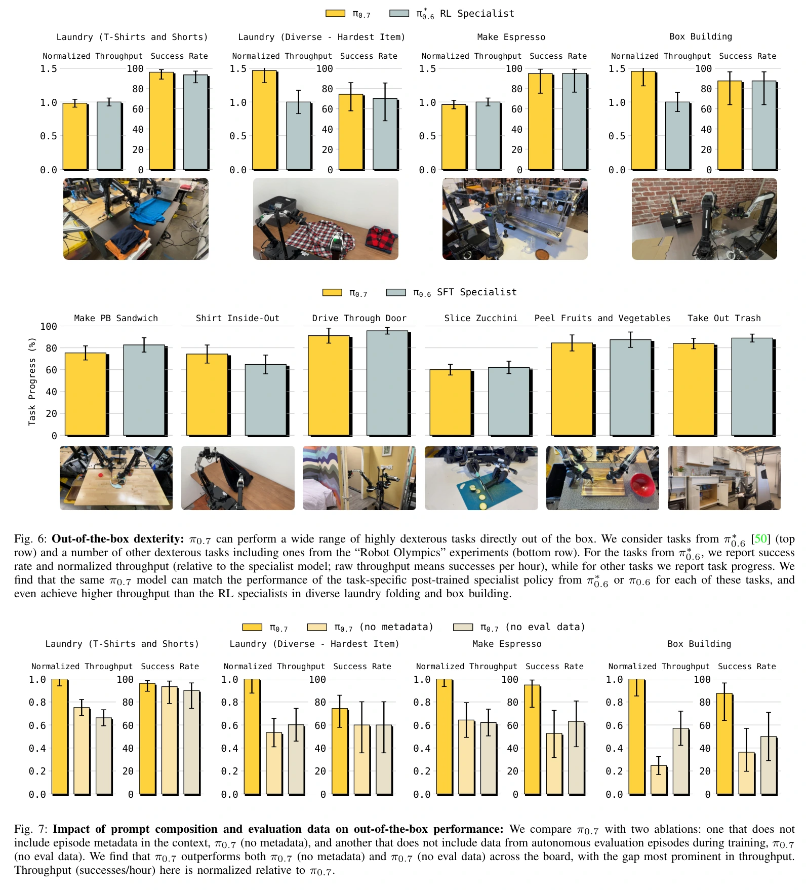

原文图 6、7；PDF 第 9 页。[查看原始来源](https://www.pi.website/download/pi07.pdf#page=9)

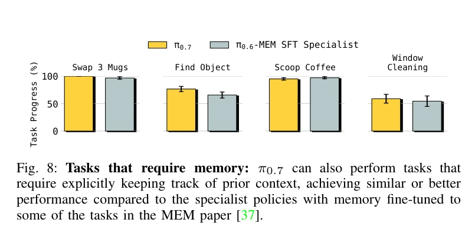

原文图 8；PDF 第 10 页。[查看原始来源](https://www.pi.website/download/pi07.pdf#page=10)

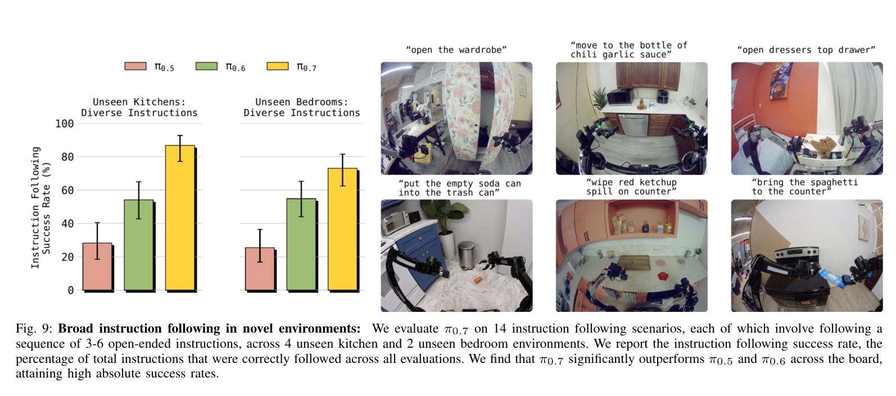

原文图 9；PDF 第 11 页。[查看原始来源](https://www.pi.website/download/pi07.pdf#page=11)

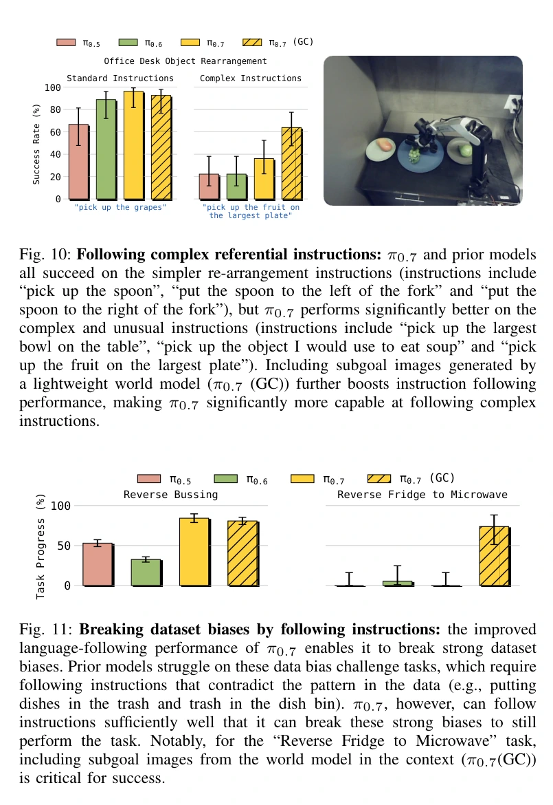

原文图 10、11；PDF 第 11 页。[查看原始来源](https://www.pi.website/download/pi07.pdf#page=11)

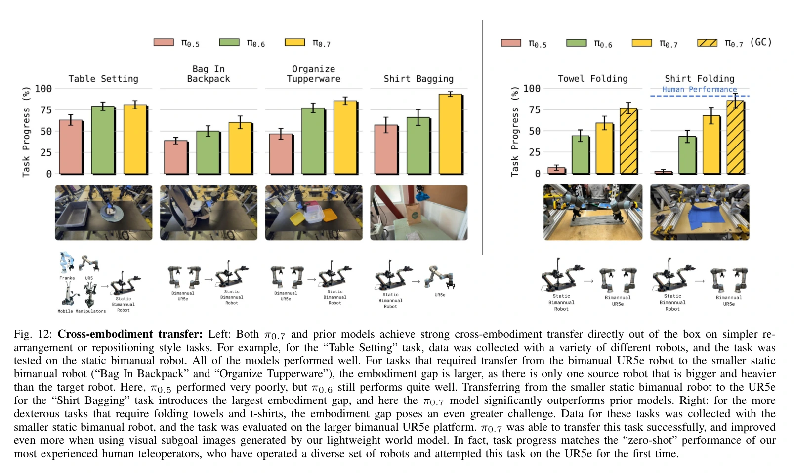

原文图 12；PDF 第 12 页。[查看原始来源](https://www.pi.website/download/pi07.pdf#page=12)

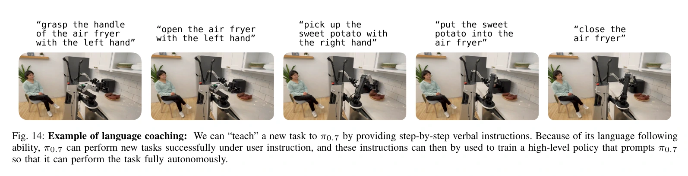

原文图 14；PDF 第 13 页。[查看原始来源](https://www.pi.website/download/pi07.pdf#page=13)

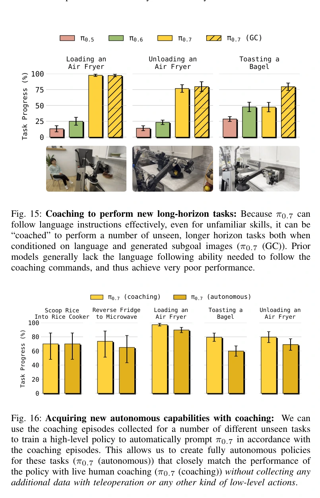

原文图 15、16；PDF 第 13 页。[查看原始来源](https://www.pi.website/download/pi07.pdf#page=13)

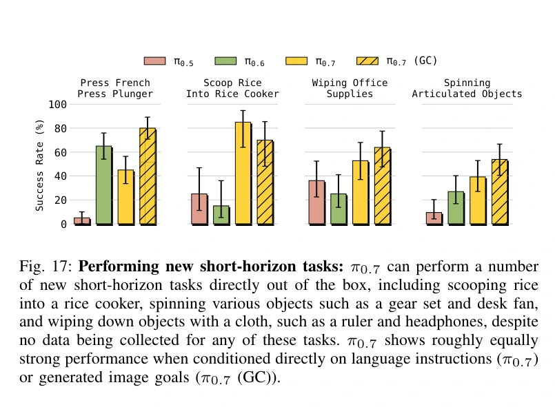

原文图 17；PDF 第 13 页。[查看原始来源](https://www.pi.website/download/pi07.pdf#page=13)

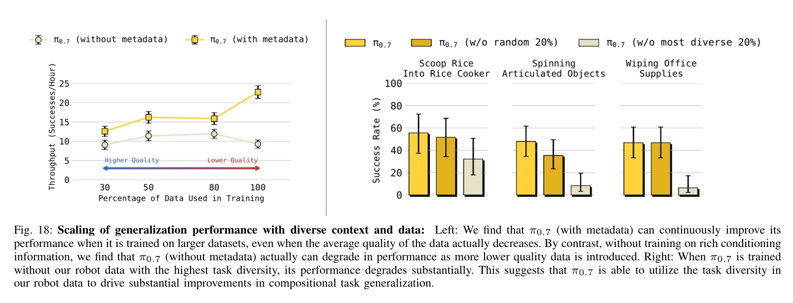

原文图 18；PDF 第 14 页。[查看原始来源](https://www.pi.website/download/pi07.pdf#page=14)

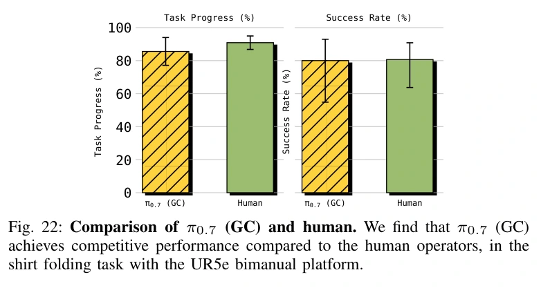

原文图 22；PDF 第 23 页。[查看原始来源](https://www.pi.website/download/pi07.pdf#page=23)

附录 G 逐项定义成功与进度：例如折衬衫满分 6 才成功，换垃圾袋则按 12 分子阶段计分。人类折衣研究招募十位熟练遥操作员，每人三次且无预热；原文报告的 80.6% 成功率并非 30 次二值试验可直接整除的比例，正文未给可重算明细，因此本页只保留“作者报告值”，不据此声称统计等效。

## 局限与判断归属

作者在 §X 明确：大规模数据很难保证一个任务完全未见过；没有刻意采集该任务，也可能包含相近技能、人类视频或其他标签下的相关行为。论文概括已见任务常超过 90%，未见任务／任务—机器人组合常在 60%–80%，这是讨论性总结，不是统一基准汇总。

当前证据来自发布团队，报告没有给出足以重建全部结果的完整数据规模、数据配比、所有任务重复次数与完整训练材料。无权重下载信息的技术报告也不能单独证明模型目前开放或关闭。新环境成功率、提示可控性与强接触可靠性仍应分别验证。

**我们的解释。** 这篇论文说明上下文可以帮助保留混合数据并选择执行方式；世界模型在这里是可选的视觉提示接口。与动力学规划或纯无动作视频预训练比较时，先检查目标生成器、低层策略和高层语言策略分别学了什么、用了哪些新数据，以及延迟由哪一层承担。

关联：[[RobotContextConditioning|机器人上下文条件化]]、[[CompositionalGeneralizationInRobotics|机器人组合泛化]]、[[VisionLanguageActionModels|视觉—语言—动作模型]]、[[WorldModelsForEmbodiedAI|具身世界模型]]。

## 研究归属

[[topics/robot-policy-learning|机器人策略学习]] · [[topics/world-models-and-representations|世界模型与表征]] · [[topics/evaluation-and-transfer|评测与现实迁移]] · [[topics/future-conditioned-action|未来预测怎样帮助动作学习]] · [[topics/policy-evaluation|数据与评测怎样支撑泛化判断]]。
