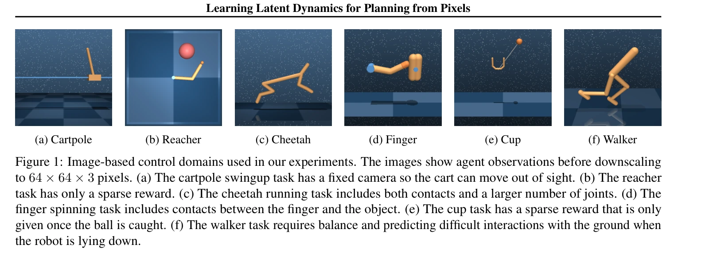
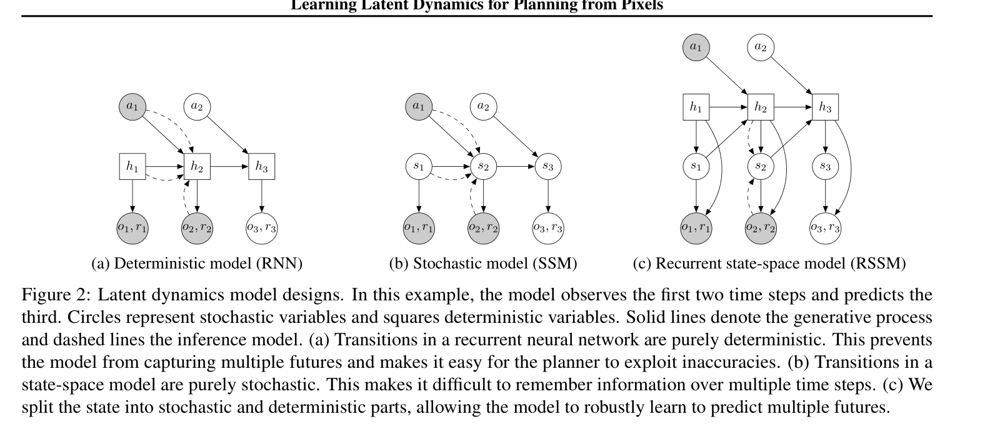
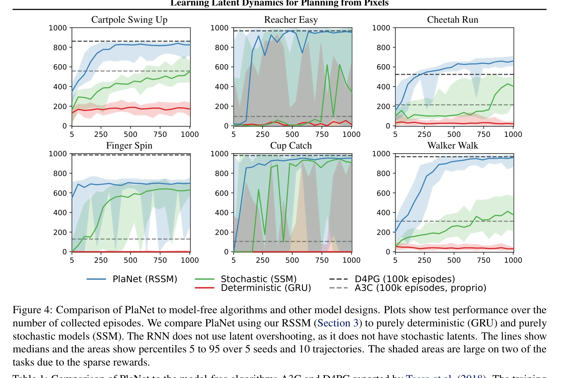
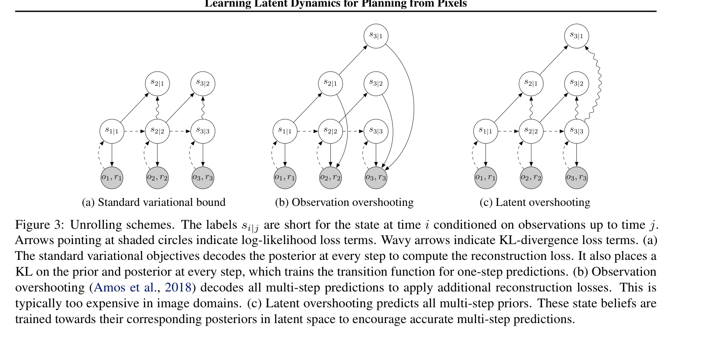
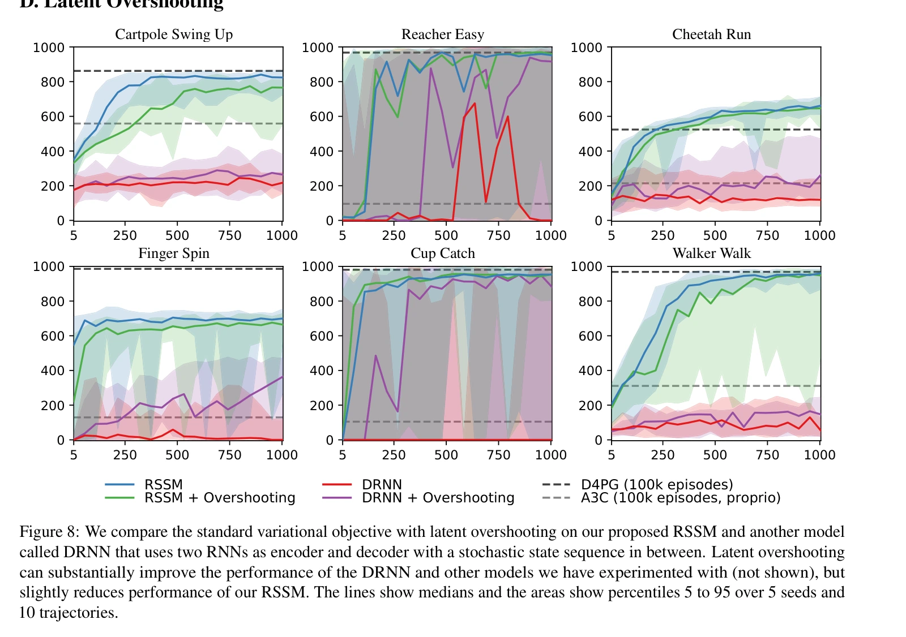
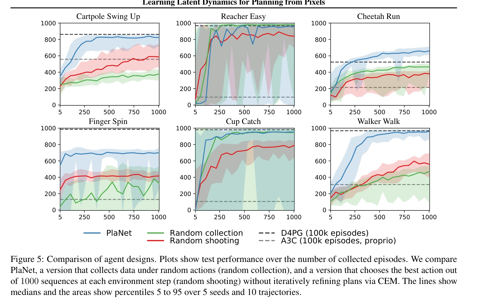
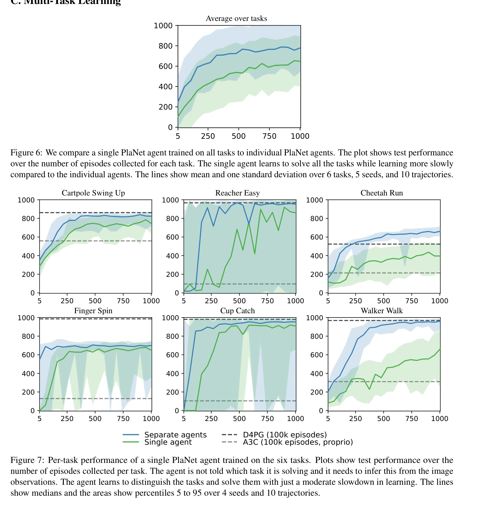
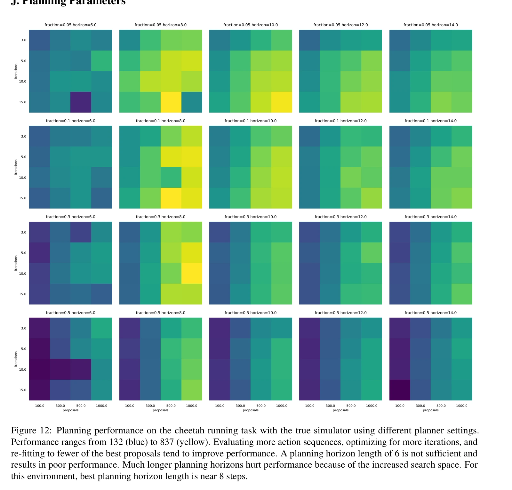

# PlaNet：从像素学习潜在动力学并规划

## 一屏概览

**研究问题。** 只有图像、动作与奖励时，怎样学出足以支持在线规划的状态和动力学？单张图像不含完整速度与遮挡信息，直接预测整段像素又使大量候选动作的评估过于昂贵。

原文图 1；PDF 第 2 页。[查看原始来源](https://arxiv.org/pdf/1811.04551v5#page=2)

**方法贡献。** Danijar Hafner 等提出 PlaNet：用兼有确定性记忆与随机状态的循环状态空间模型（RSSM）学习环境，在潜在空间用交叉熵方法（CEM）搜索动作，执行首个动作后重新观测、规划。它不训练演员或价值网络。论文同时提出潜在多步预测正则（latent overshooting），但最终 RSSM 并不依赖这一正则。

**证据范围。** ICML 2019 论文在六个 DeepMind Control Suite 图像控制任务中展示较高数据效率；没有真机验证。其贡献是打通「图像状态估计 → 潜在预测 → 动作搜索 → 新观测修正」，不是证明像素预测能自动获得通用物理模型。以下定位均指[归档版本论文](https://arxiv.org/abs/1811.04551v5)的章节、表和附录。

## 方法：为什么要同时保留记忆与随机状态

令 $o_t$ 为第 $t$ 步图像，$a_t$ 为动作，$r_t$ 为奖励。为与知识库记号一致，下面把原文随机状态 $s_t$ 改记为 $z_t$，确定性循环记忆仍为 $h_t$。RSSM 的生成与推断结构为（§3，式 4、图 2）：

原文图 2；PDF 第 4 页。[查看原始来源](https://arxiv.org/pdf/1811.04551v5#page=4)

$$
h_t=f_\theta(h_{t-1},z_{t-1},a_{t-1}),\qquad
z_t\sim p_\theta(z_t\mid h_t),\qquad
q_\theta(z_t\mid h_t,o_t).
$$

这里 $p_\theta$ 是不看当前图像的预测先验，$q_\theta$ 是看到当前图像后的后验。训练与真实交互时用后验更新信念；规划时没有未来图像，只能沿先验推进。观测解码器 $p_\theta(o_t\mid h_t,z_t)$ 和奖励模型 $p_\theta(r_t\mid h_t,z_t)$ 共用潜在状态。

确定性记忆为长时间保留信息提供路径，例如小车暂时离开画面时仍保留运动历史；随机状态为部分可观测条件下的多个可能状态提供表达空间。图 4 的纯 GRU、纯随机状态空间模型与 RSSM 对照支持组合结构在所测任务中更有效。**作者解释**是随机性也可能使规划更稳健；实验没有单独证明这就是性能提升的唯一原因。

原文图 4；PDF 第 7 页。[查看原始来源](https://arxiv.org/pdf/1811.04551v5#page=7)

### 一次决策里哪些量真实、哪些量预测

| 阶段 | 输入与操作 | 输出与用途 |
| --- | --- | --- |
| 当前时刻纠正 | 上一状态与已执行动作更新 $h_t$，当前图像进入 $q_\theta$ | 当前后验状态；它是所有候选计划的共同起点 |
| 候选内部展开 | 给定某条候选动作，更新 $h$ 并从先验采样 $z$ | 未来潜在状态和奖励均为预测，不读取未来真图像 |
| 实际执行 | CEM 输出首动作，环境返回新图像与奖励 | 用真图像再次纠正，旧计划的剩余部分不是事实 |
| 重放学习 | 缓存真实轨迹，训练观测、奖励与动力学模块 | 更新模型参数，影响之后的搜索评分 |

这是对算法1–2和图2的教学拆解。**沿候选展开时，图像解码器可以不运行；训练时仍需要它迫使状态保留观测信息。**“潜在规划”节省的是大量候选评估中的像素生成成本，不等于从训练里删掉图像监督。CEM 的共享推导见 [[CrossEntropyMethod|交叉熵方法]]。

### 学习目标：重建约束表示，先验追随后验

用 $q_t=q_\theta(z_t\mid h_t,o_t)$、$p_t=p_\theta(z_t\mid h_t)$ 简写，省略外层对采样轨迹的期望，模型最大化的目标可整理为（§3，式 3；奖励项按原文说明类推加入）：

$$
\mathcal J=\sum_t\mathbb E_q\!\left[\log p_\theta(o_t\mid h_t,z_t)+\log p_\theta(r_t\mid h_t,z_t)\right]
-\sum_t\mathbb E_q\!\left[D_{\mathrm{KL}}(q_t\Vert p_t)\right].
$$

重建要求状态保留观测信息，奖励项要求其保留控制相关信息，KL 项则把利用图像推断的后验与无图像预测的先验拉近。附录 A 的实现使用 200 维 GRU 记忆、30 维对角高斯随机状态，并将 KL 损失从下方截到 3 nat：低于阈值时不给进一步压缩压力。所有当前图像信息须经过随机采样路径，避免解码器绕过潜在变量。基础推导见 [[LatentStateSpaceModels|潜在状态空间模型]]。

**这条随机路径怎样训练？**对角高斯后验可以写成 $z_t=\mu_t+\sigma_t\odot\epsilon_t$，其中 $\epsilon_t\sim\mathcal N(0,I)$，$\odot$ 为逐元素乘法。随机性放到与网络参数无关的 $\epsilon_t$ 中，重建与奖励梯度便能经 $z_t$ 回到 $\mu_t,\sigma_t$；这是§3所用重参数化采样的教学展开。若图像能绕过这一步直接进入解码器，模型可能靠旁路重建，而不学好之后必须独立运行的潜在预测路径。

对于单位协方差高斯观测模型，$-\log p(o_t\mid h_t,z_t)=\tfrac12\|o_t-\hat o_t\|_2^2+\text{常数}$，因此论文的似然目标落到实现时成为平方误差。这个等价依赖给定的方差假设；不能由“重建损失”一词就断言所有世界模型都在优化相同概率模型（§3）。

### 动作搜索：训练有解码器，规划不生成图像

以下用 $H$ 个未来动作统一时域下标。对候选动作序列 $a_{t:t+H-1}$，从当前后验采样状态，沿模型预测奖励，优化

$$
a^*_{t:t+H-1}\approx\arg\max_{a_{t:t+H-1}}\mathbb E\!\left[\sum_{k=1}^{H}\hat r_{t+k}\right].
$$

[[CrossEntropyMethod|CEM]] 从逐时刻的对角高斯动作分布采样，选出累计预测奖励最高的一批序列，按这些精英重新拟合均值与离散程度，重复搜索，最后执行首动作均值。默认 $H=12$、10 轮、每轮 1,000 个候选、100 个精英。每个候选只采样一条潜在轨迹，把预算更多用于动作覆盖，并没有充分边缘化所有预测不确定性（§2、附录 A–B）。这是 [[ModelPredictiveControl|模型预测控制]]：重规划提供反馈，但不能消除模型偏差。

模型最初使用 5 个随机回合训练，之后每 100 次模型更新收集一个新回合，动作加入标准差 0.3 的高斯探索噪声。规划与数据收集相互影响，不能把这套在线学习结果当作任意固定离线数据集上的表现。动作重复次数随任务为 2、4 或 8，因此模型步数与物理仿真步数也不能直接混同（算法 1、附录 A）。

### 多步正则：论文贡献不等于最终算法必需项

标准目标直接约束一步先验；长时间无观测滚动会进入训练时较少覆盖的状态。潜在多步预测正则从较早的后验出发，连续推进若干步，让得到的预测分布接近目标时刻的后验；超过一步时停止目标后验的梯度。这样避免为每种预测距离重新解码图像（§4、图 3、式 7）。

原文图 3；PDF 第 5 页。[查看原始来源](https://arxiv.org/pdf/1811.04551v5#page=5)

**两步例子（教学重构）。**通常训练会先用真实 $o_{t+1}$ 形成后验，再预测 $t+2$；两步正则则从 $t$ 的状态出发，不看 $o_{t+1}$，连续预测到 $t+2$，再与利用真实数据形成的 $t+2$ 后验比较。额外监督落在潜在分布上，因此不用为每个起点和距离再生成一幅图像；它针对的是“模型连续吃自己的预测”这条路径。

但附录 D、图 8 显示：该正则显著改善 DRNN，对最终 RSSM 反而略有损害。原文关于多步界同时约束原一步分布的表述包含猜想，不能把该理论关系扩写成已经充分证明的一般定理。

原文图 8；PDF 第 14 页。[查看原始来源](https://arxiv.org/pdf/1811.04551v5#page=14)

## 实验与消融：什么被支持

表 1 的最终平均回报如下；PlaNet 使用 1,000 回合，两个无模型基线使用 100,000 回合。作者按 5 个随机种子、10 条测试轨迹统计。A3C 输入本体状态，D4PG 与 PlaNet 输入 $64\times64$ 图像，输入条件不同。

| 方法 | Cartpole | Reacher | Cheetah | Finger | Cup | Walker |
|---|---:|---:|---:|---:|---:|---:|
| A3C | 558 | 285 | 214 | 129 | 105 | 311 |
| D4PG | 862 | 967 | 524 | 985 | 980 | 968 |
| PlaNet | 821 | 832 | 662 | 700 | 930 | 951 |

「平均约 200 倍数据效率」来自作者依据基线学习曲线估计达到 PlaNet 最终表现所需回合数，不是把 100,000 除以 1,000，也不意味着所有任务都有相同倍数。Cheetah 的最终分数超过 D4PG，Finger 则明显低于 D4PG；须同时保留这两个事实。

| 要检验的设计 | 原文定位 | 观察与含义 |
|---|---|---|
| 随机状态与确定性记忆是否必要 | 图 4 | RSSM 优于纯确定性或纯随机模型；支持这一组合在六任务中的价值 |
| 在线收集与迭代搜索 | 图 5 | 随机收集数据弱于基于当前模型收集；单轮随机搜索弱于 CEM |
| 一个模型能否覆盖多个任务 | 附录 C、图 6–7 | 不输入任务身份，动作补齐后可联合学习六任务，但学习较慢；不是广泛跨域通用性验证 |
| 多步预测正则 | 附录 D、图 8 | 对 DRNN 有益，对 RSSM 略有损害 |
| 规划时域与搜索预算 | 附录 J、图 12 | 在真实 Cheetah 仿真器上，过短时域不足，过长时域因搜索维度增大而变差；不只涉及学到的模型误差 |

原文图 5；PDF 第 8 页。[查看原始来源](https://arxiv.org/pdf/1811.04551v5#page=8)

原文图 6、7；PDF 第 13 页。[查看原始来源](https://arxiv.org/pdf/1811.04551v5#page=13)

原文图 12；PDF 第 20 页。[查看原始来源](https://arxiv.org/pdf/1811.04551v5#page=20)

## 局限与我们的解释

**来源支持的边界。** 部分可观测、接触和稀疏奖励在六个仿真任务中得到覆盖，但观测较简单、动作维度有限，探索仍依赖自身收集。原文讨论中把终端价值、时间抽象与更丰富视觉条件列为后续方向（§7）；本文没有终端价值函数。

**我们的解释。** PlaNet 最可复用的思路是把「从观测纠正状态」和「在无观测条件下预测后果」放进同一状态空间。其成功不能仅由生成视频是否逼真判断，也不能把随机潜在变量当作已校准的不确定性证书。与 [[dreamerv3-mastering-diverse-control|DreamerV3]] 对照，后者把大量行为优化放到训练阶段；PlaNet 把搜索保留在每次决策时。它们是 [[WorldModelsForEmbodiedAI|具身世界模型]] 的两种使用方式。

资料版本与归档

完整阅读 arXiv v5（2019-06-04）；首次提交为 2018-11-12。原始 PDF 下载地址：<https://arxiv.org/pdf/1811.04551v5>。获取日期：2026-10-02；SHA-256：`abac727526e6a45669d3ab9957126587e22aacf4dc9bcd60ffe5c853108e5bcc`。MarkItDown 缓存的双栏与公式另用原 PDF 文本布局核对。

## 研究归属

[[topics/world-models-and-representations|世界模型与表征]] · [[topics/planning-and-control|规划与控制]] · [[topics/world-model-decision|世界模型如何用于决策]]。
