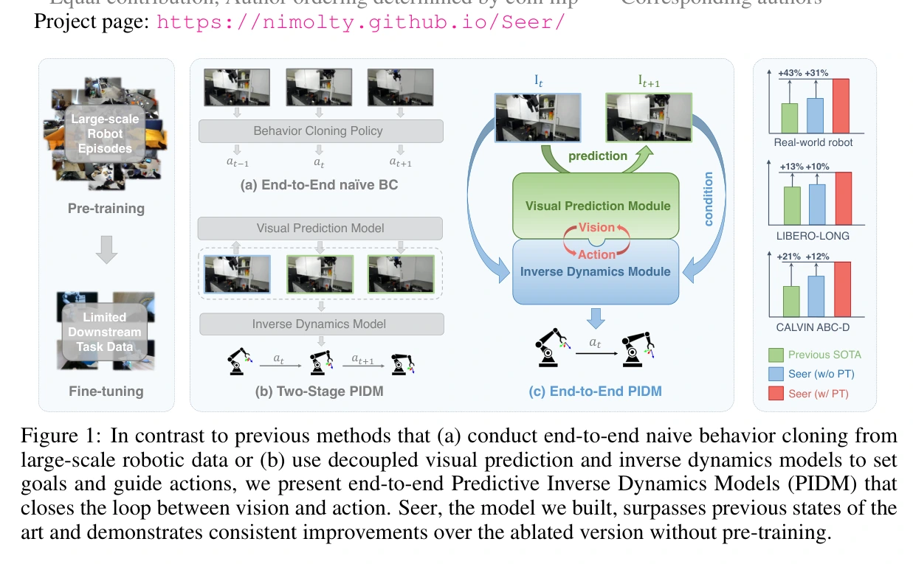
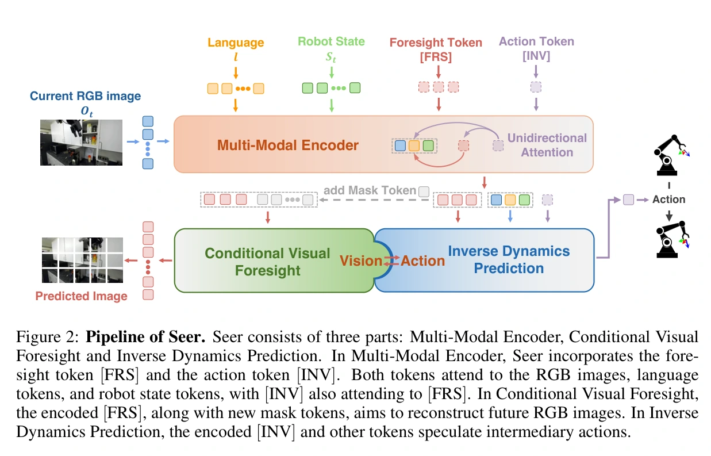
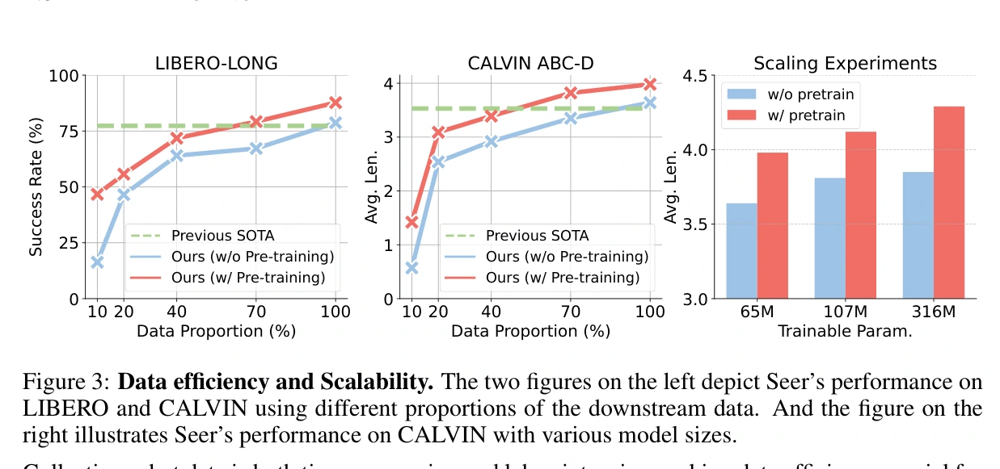
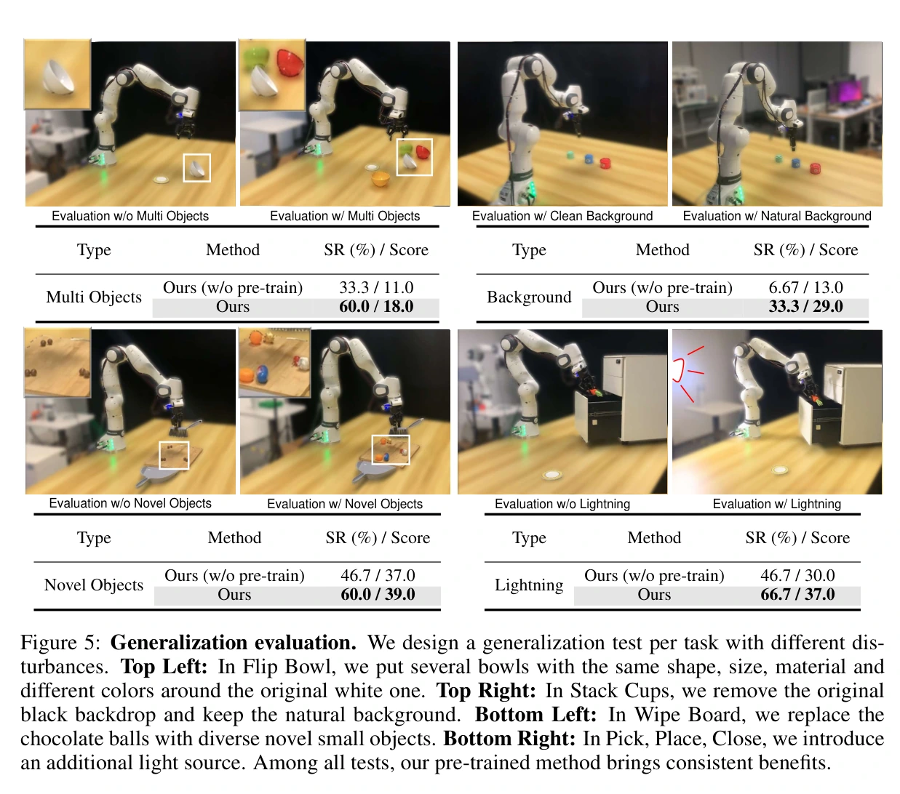

# Seer：用预测未来的表示指导逆动力学

## 一屏概览

**研究问题。** 在机器人示范中，只学动作会忽略视觉变化；只学未来图像又不能保证控制有效。能否让未来预测直接参与动作计算，并在同一网络内接受动作监督？

原文图 1；PDF 第 1 页。[查看原始来源](https://proceedings.iclr.cc/paper_files/paper/2025/hash/e5b5c402bb7bd5e60bede6961d6fe39e-Abstract-Conference.html#page=1)

**方法贡献。** 预测逆动力学模型（PIDM）的具体实现 Seer，用 `[FRS]` 标记承载未来视觉预测，用 `[INV]` 标记读取当前历史和预测未来表示并输出动作块。单向注意力连接这两类标记；执行时无需先生成完整未来图像再交给另一个模型。（§3，图 2）

**证据结论。** 联合训练和机器人数据预训练均改善本文实验。CALVIN 的 4.28 属于 **Seer-Large**，标准 Seer 是 3.98；真机四项主要任务均值为 78.4%，六任务均值为 71.1%。这些数字不能混为同一模型、同一任务集合的得分。（表 2、4、A-IV）

原文：[ICLR 2025 论文页](https://proceedings.iclr.cc/paper_files/paper/2025/hash/e5b5c402bb7bd5e60bede6961d6fe39e-Abstract-Conference.html) · [PDF](https://proceedings.iclr.cc/paper_files/paper/2025/file/e5b5c402bb7bd5e60bede6961d6fe39e-Paper-Conference.pdf) · [项目页](https://nimolty.github.io/Seer/) · [代码](https://github.com/OpenRobotLab/Seer/)。本页依据归档会议论文正文与附录，不把项目演示或代码可用视为独立复现。

## 方法机制

### 从目标与历史预测未来，再推断动作

令 $o_t$ 是双相机 RGB，$s_t$ 是机器人本体状态，$h_t=(o_{t-m+1:t},s_{t-m+1:t})$ 是长度 $m$ 的历史，$g$ 是语言或机器人状态目标，$n$ 是预测间隔。论文式 1–5 的关系为：

$$
\hat o_{t+n}=f_{\rm fore}(g,h_t),\qquad
\hat a_{t:t+n-1}=f_{\rm inv}(g,h_t,\hat o^l_{t+n}).
$$

$\hat o^l_{t+n}$ 是生成未来图像之前的潜在表示。策略使用它而非未来真实图像；因此部署不要求观测未来。图像像素均方误差训练预测分支，机械臂动作使用 Smooth-L1，二值夹爪使用交叉熵：

$$
\mathcal L=0.5\|\hat o_{t+n}-o_{t+n}\|_2^2
+\mathcal L_{\rm arm}+0.01\mathcal L_{\rm gripper}.
$$

这些是本文权重，不是普遍最优配比。动作监督可以沿 `[INV]` 对 `[FRS]` 的依赖更新预测表示，因此未来分支不只是一个旁路辅助损失。（§3.2–3.3）

### 注意力结构怎样接通视觉与动作

MAE 预训练 ViT 编码图像，Perceiver Resampler 压缩图像标记；CLIP 编码语言，MLP 编码机器人状态。GPT-2 风格主干在各时刻加入两种读出标记：`[FRS]` 读取目标、观测和状态，`[INV]` 还可以读取 `[FRS]`，反向读取被屏蔽。ViT 解码器重建未来图像，MLP 动作头输出末端六维动作与夹爪命令。（图 2、附录 A.1–A.2）

原文图 2；PDF 第 4 页。[查看原始来源](https://proceedings.iclr.cc/paper_files/paper/2025/hash/e5b5c402bb7bd5e60bede6961d6fe39e-Abstract-Conference.html#page=4)

这种“闭环”首先指预测表示与动作学习的耦合；执行时仍通过新观测不断调用策略。它不包含对候选动作的在线模型预测控制搜索。

### 为什么不是“预测图像＋旁路行为克隆”

令 $r_F$、$r_I$ 分别是 `[FRS]` 和 `[INV]` 的读出表示，$D$ 为图像解码器，$A$ 为动作头。计算关系可以简写为 $r_I=I(h_t,g,r_F)$、$\hat o=D(r_F)$、$\hat a=A(r_I)$。于是预测表示接收两条学习信号：

$$
\frac{\partial\mathcal L}{\partial r_F}
=0.5\frac{\partial\mathcal L_{\rm fore}}{\partial r_F}
+\frac{\partial\mathcal L_{\rm inv}}{\partial r_I}
 \frac{\partial r_I}{\partial r_F}.
$$

这是对图 2 依赖关系的链式法则解释，不是论文新增损失。第二项正是动作目标塑造未来表示的路径；如果只在同一网络旁边加一个独立图像预测头，却让动作头完全不读其特征，就没有这条直接耦合路径。表 3a 的对照把这一设计问题与普通行为克隆、辅助图像预测区分开。

**一次推理的具体过程。** 以“把杯子放到指定位置”为教学例子：双相机图像先经 ViT 和压缩模块变成较少的视觉标记；语言与本体状态提供目标、姿态信息；`[FRS]` 形成杯子将到达何处的预测特征，`[INV]` 同时读取历史与该特征，动作头给出短动作块。图像解码器的像素输出用于监督／查看预测，动作不必等待一次“生成 RGB→重新编码 RGB”的循环。取新观测后重新执行这条计算链，才构成机器人闭环。例子是结构说明，不声称对应表中某条评测轨迹。

### 预训练与微调不是完全相同的条件

无语言的预训练样本用未来 $t+n+1$ 的机器人状态作为目标。为避免过拟合随机探索行为，预训练时 `[FRS]` 和 `[INV]` 不读取先前图像与状态标记；微调／部署恢复历史与语言条件。动作标签始终参与 PIDM 的动作学习，因此这篇论文不证明仅靠无动作标签视频可获得可执行策略。（§3.4）

冻结视觉和语言编码器共 251M 参数；标准 Seer 可训练部分为 65M，总计约 316M；§3.4 的 Seer-Large 可训练参数为 315M。附录采用三步动作块，真机历史长度为七步；动作块可仅执行首步或做时间集成。（§3.2、3.4、附录表 A-I）

## 实验：数据来源、结果与消融

三种实验用了不同预训练集：LIBERO 使用 LIBERO-90；CALVIN 使用 ABC 环境无语言机器人交互，再在有语言数据微调、D 环境测试；主要真机实验使用 DROID，再用每任务 100 条示范微调。不能把仿真结果全部归功于 DROID。（§4.1、5.1、附录 A.4–A.6）

| 问题 | 结果 | 位置、协议与解释边界 |
| --- | --- | --- |
| 长任务迁移 | LIBERO-LONG：标准 Seer 87.7%，从头训练 78.7%，MPI 77.3% | 表 1；十任务，每任务 20 次，报告最佳三个检查点平均；相对 MPI 的 13% 是相对增幅，绝对差为 10.4 个百分点 |
| 未见环境 | CALVIN ABC-D：标准 Seer 3.98、从头 3.64；Large 4.28、从头 3.83；CLOVER 3.53 | 表 2；1,000 条五任务序列，最佳三个检查点平均；4.28 与 3.53 的差为 0.75 个任务 |
| 未来是否应参与动作推断 | 从头训练：普通行为克隆 3.31；另加图像预测 3.41；完整 PIDM 3.64 | 表 3a；表中“不用逆动力学目标”仍有行为克隆动作学习，不是完全没有动作损失 |
| 是否应预训练整个策略 | 不预训练 3.64；只预训练未来预测 3.73；视觉与逆动力学共同预训练 3.98 | 表 3b；支持该网络内的联合预训练收益 |
| 主要真机任务 | 四任务均值 78.4%，从头版本 60.0%，MVP 55.0%；每任务 15 种初态×3 次重复 | §5.1–5.2、表 4；摘要的 43% 是相对 55.0%的增幅，不是增加 43 个百分点 |
| 接触与精度 | 按按钮、插入均为 60%；从头均为 40% | 表 A-III；两项指定任务，不能外推成通用高精度接触能力 |
| 跨机器人预训练 | 去除 Franka 的 OXE 子集预训练：六任务均值 56.7%；从头 53.3%；DROID 71.1% | 表 A-IV；OXE 的堆杯、按按钮反而下降，跨形态收益明显弱于同形态数据 |

图 3 还显示较少下游数据时的预训练收益和测试范围内的模型规模收益，但没有给出跨模型家族、跨数据分布的统一尺度律。图 5 的干扰测试覆盖相同形状不同颜色物体、自然背景、新物体与附加光源；其中自然背景堆杯虽从 6.67% 提高到 33.3%，仍体现明显失效空间。

原文图 3；PDF 第 7 页。[查看原始来源](https://proceedings.iclr.cc/paper_files/paper/2025/hash/e5b5c402bb7bd5e60bede6961d6fe39e-Abstract-Conference.html#page=7)

原文图 5；PDF 第 10 页。[查看原始来源](https://proceedings.iclr.cc/paper_files/paper/2025/hash/e5b5c402bb7bd5e60bede6961d6fe39e-Abstract-Conference.html#page=10)

## 局限与证据质量

作者在 §6 将任务范围和跨形态验证列为局限；附录 A.6.4 已补充 OXE 跨形态实验，不能再写成“完全没有跨形态测试”。结果是有限而偏弱的迁移证据，并非已解决跨形态问题。

基线条件也需保留：真机 OpenVLA 只用第三人称相机，Seer 用双相机；附录 A.3 说明仿真部分基线直接取原论文成绩，MVP／MPI 则替换 Seer 的视觉编码器后训练。因此模型排行榜不能单独识别 PIDM 的净因果收益，内部表 3 消融更接近这个问题。

原文也存在实现描述口径差异：§5.2 将 OpenVLA 全微调可调规模写为 3B，附录 A.6.3 写公开 7B 模型；附录的 400 条真机微调示范与四个主要任务一致，另外两任务的数据应按“每任务 100 条”单独理解。本页不据此推导精确的统一训练成本排名。

## 我们的解释与关联

**我们的解释。** Seer 的关键是让动作模块消费受未来图像监督的表示，使动作误差也能塑造这份表示。它不保证预测图像满足物理规律，也不保证把同一视觉变化迁移到另一控制器仍得到正确动作。附录 OXE 实验正说明“数据更杂更多”与“动作先验更适配”不是同一件事。

机制见 [[InverseDynamicsModels|逆动力学模型]] 和 [[VisionLanguageActionModels|视觉—语言—动作模型]]。与 [[disentangled-robot-learning-via-separate-forward-and-inverse-dynamics-pretraining|DeFI]] 比较时，应分别检查训练阶段、动作标签、相机、预训练规模与冻结策略；两篇各自的成功不能直接判定“联合”或“解耦”普遍更优。

## 研究归属

[[topics/robot-policy-learning|机器人策略学习]] · [[topics/world-models-and-representations|世界模型与表征]] · [[topics/future-conditioned-action|未来预测怎样帮助动作学习]]。
