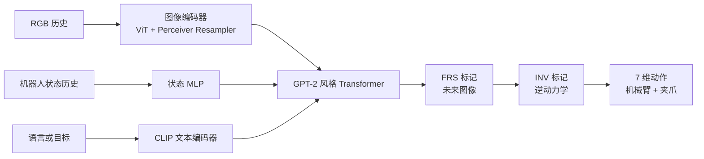

## 摘要

这篇 ICLR 2025 论文提出预测式逆动力学模型（PIDM），并实现为 Seer。它将未来视觉预测与 [[InverseDynamicsModels|逆动力学预测]] 放在同一策略中训练：先预测未来视觉状态，再以这一预测指导到达该状态所需的动作序列。

Seer 同时处理语言、RGB 观测和机器人状态，用 `[FRS]` 读出标记预测未来图像，用 `[INV]` 标记预测中间动作。单向注意力让动作标记可以关注未来预测标记，从而将视觉与动作学习连接起来。预训练和微调都使用同一组视觉预测与动作预测目标。

与 [[disentangled-robot-learning-via-separate-forward-and-inverse-dynamics-pretraining|DeFI]] 对照时，Seer 代表端到端联合优化的路线；DeFI 则认为视觉与动作目标的耦合可能造成不匹配，因此先分别预训练正向与逆动力学，再在下游任务上耦合。

来源网址: https://proceedings.iclr.cc/paper_files/paper/2025/hash/e5b5c402bb7bd5e60bede6961d6fe39e-Abstract-Conference.html

PDF 网址: https://proceedings.iclr.cc/paper_files/paper/2025/file/e5b5c402bb7bd5e60bede6961d6fe39e-Paper-Conference.pdf

项目主页: https://nimolty.github.io/Seer/

代码: https://github.com/OpenRobotLab/Seer/

## 核心主张

- PIDM 以预测的视觉状态为条件推断动作，而不是只依据当前观测做行为克隆。论文认为，这比朴素行为克隆或“视觉目标预测器＋底层逆动力学模型”的两阶段策略更利于规模扩展。
- 历史 $h_t$ 包含过去 $m$ 步 RGB 图像与机器人状态；目标 $g$ 可以是语言指令或机器人状态。未来视觉预测为 $\hat{o}_{t+n}=f_{\mathrm{fore}}(g,h_t)$，对应像素均方误差损失。
- 逆动力学使用目标、历史和预测的未来视觉潜在表征 $\hat{o}^{l}_{t+n}$：$\hat{a}_{t:t+n-1}=f_{\mathrm{inv}}(g,h_t,\hat{o}^{l}_{t+n})$。动作损失包含 6 维机械臂动作的平滑 L1 损失和夹爪二元交叉熵，夹爪损失权重 $\lambda=0.01$。
- 总目标为 $\mathcal{L}=\alpha\mathcal{L}_{\mathrm{fore}}+\mathcal{L}_{\mathrm{inv}}$，其中视觉预测权重 $\alpha=0.5$。预训练与微调均结合视觉预测和逆动力学预测。
- 标准 Seer 共 316M 参数，其中 65M 可训练；Seer-Large 有 315M 可训练参数。规模比较应区分总参数与可训练参数。
- 预训练数据随评估基准而变化：LIBERO 使用 LIBERO-90；CALVIN 使用无语言标注、包含随机探索的官方机器人自由交互数据；现实世界验证使用 DROID。语言标注缺失时，预训练可以用未来机器人状态标记作为目标。
- LIBERO-LONG 中，Seer 平均成功率为 87.7%，对照为从头训练的 Seer 78.7%、OpenVLA 54.0% 和 MPI 77.3%。CALVIN ABC-D 中，Seer-Large 的平均连续任务长度为 4.28，对照为 CLOVER 3.53、GR-1 3.06 和 Susie 2.69；标准 Seer 为 3.98。
- 仅使用 10% 下游数据时，预训练 Seer 相比从头训练，在 LIBERO-LONG 成功率上相对提升 187%，在 CALVIN 平均任务长度上相对提升 150%。论文报告，约 70% 下游数据即可超过此前最佳基线；这些相对提升不能理解为百分点。
- 消融支持视觉与动作的协同训练：微调时只加入 $L_{\mathrm{fore}}$，平均任务长度从 3.31 到 3.41；同时加入 $L_{\mathrm{fore}}+L_{\mathrm{inv}}$ 则到 3.64。预训练时只加入 $L_{\mathrm{fore}}$，从 3.64 到 3.73；同时加入两者则到 3.98。
- Franka Research 3 与 Robotiq-2f-85 夹爪的现实世界实验中，4 项以泛化为重点的任务平均成功率/得分为 78.4% / 39.5，对照为从头训练的 Seer 60.0% / 32.8、MVP 55.0% / 29.8、MPI 48.4% / 29.3 和 OpenVLA 16.7% / 11.0。附录中的 Press Button 和插入等高精度、接触丰富任务也显示了预训练收益。

## 模型结构

图像由经过 MAE 预训练的 ViT 编码，再由 Perceiver Resampler 压缩；语言使用 CLIP ViT-B/32 文本编码器；机器人状态使用 MLP。24 层 GPT-2 风格的 Transformer 将这些输入与读出标记结合，再分别由 ViT 图像解码器和 MLP 动作解码器输出未来图像与动作。

图中的未来预测进入动作推断分支，是 Seer 把视觉与行动连接起来的关键；视觉目标与动作目标在训练中共同优化。

## 关键引文

- "closing the loop between vision and action"

## 关联

- [[InverseDynamicsModels|逆动力学模型]] - Seer 使用有动作标注的端到端训练，DeFI/GIDM 则从无标签视频转移中预训练潜在动作。
- [[VisionLanguageActionModels|视觉—语言—动作模型]] - 使用 `[FRS]`/`[INV]` 读出标记，将视觉预测接入动作策略。
- [[LatentDynamicsActionModels|潜在动力学动作模型]] - Seer 直接监督动作序列；LDA-1B 和 DeFI 更侧重潜在动力学或潜在动作的预训练扩展。
- [[WorldModelsForEmbodiedAI|具身智能世界模型]] - 未来图像预测服务于动作决策，而非单独优化视频保真度。
- [[SimulationRealityGap|仿真—现实差距]] - DROID 预训练在物体、背景和光照扰动下的收益，以及跨机器人形态和复杂接触的评估边界。

## 开放问题

- 用户提供的 `asproceedings.iclr.cc` 网址只返回空占位文本，本页使用同一路径下的规范 `proceedings.iclr.cc` 页面和官方 PDF。
- Seer 依赖有动作标注的机器人预训练数据。它支持的是机器人数据上的视觉—动作联合预训练，尚不能据此推断无动作标注的人类视频也能直接用于逆动力学预训练。
- 未来目标仍是 RGB 像素重建，外观保真度与任务相关状态可能纠缠在一起；这是 DeFI/LDA 等潜在表示路线试图改进的问题。
- 论文的现实世界评估仅含 6 个任务，高精度与接触丰富任务覆盖仍有限，跨机器人形态也需要更多测试。附录中，移除 Franka 子集后的 OXE 预训练只带来小幅改善，部分高精度任务表现还会下降。
