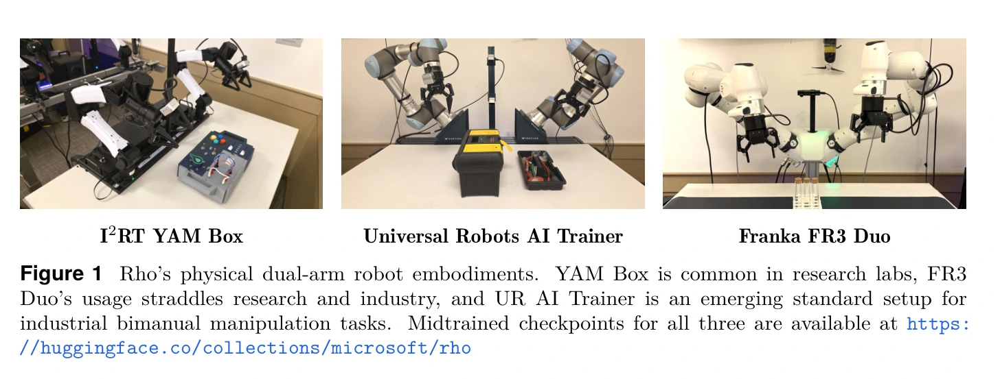
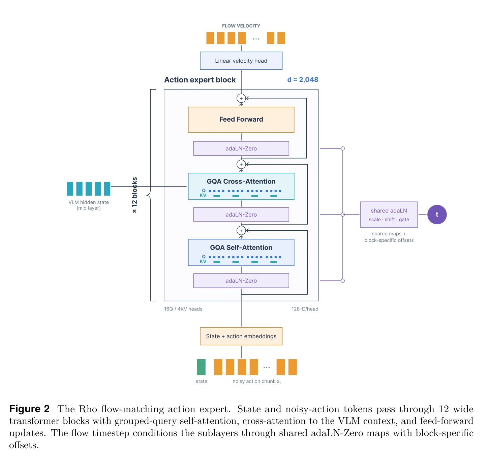
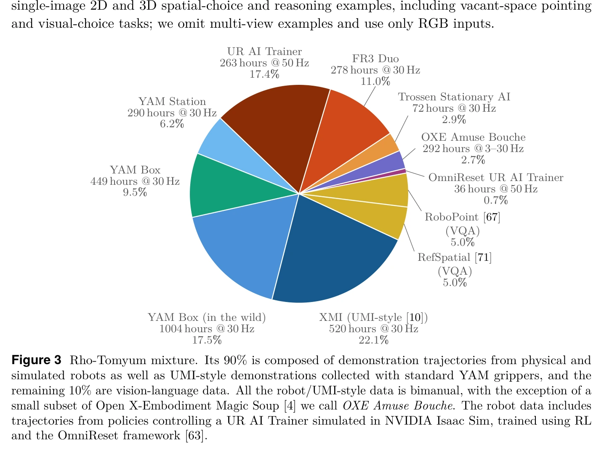
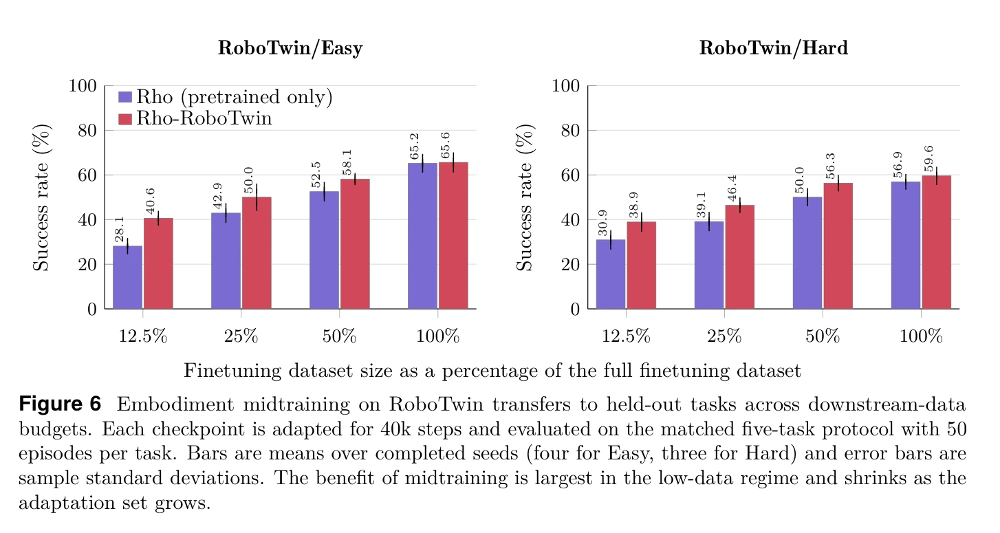
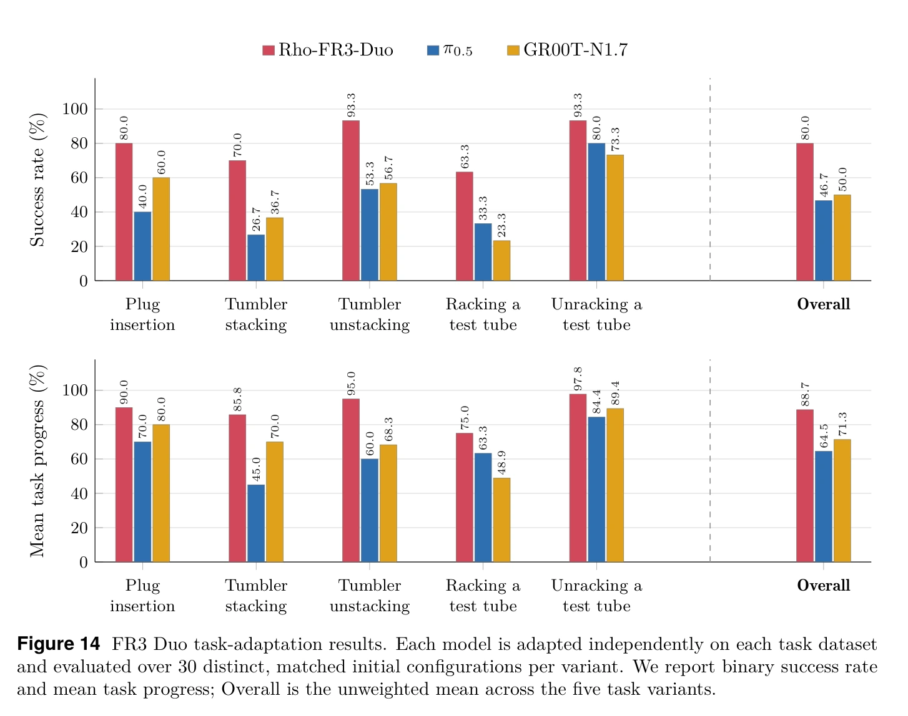
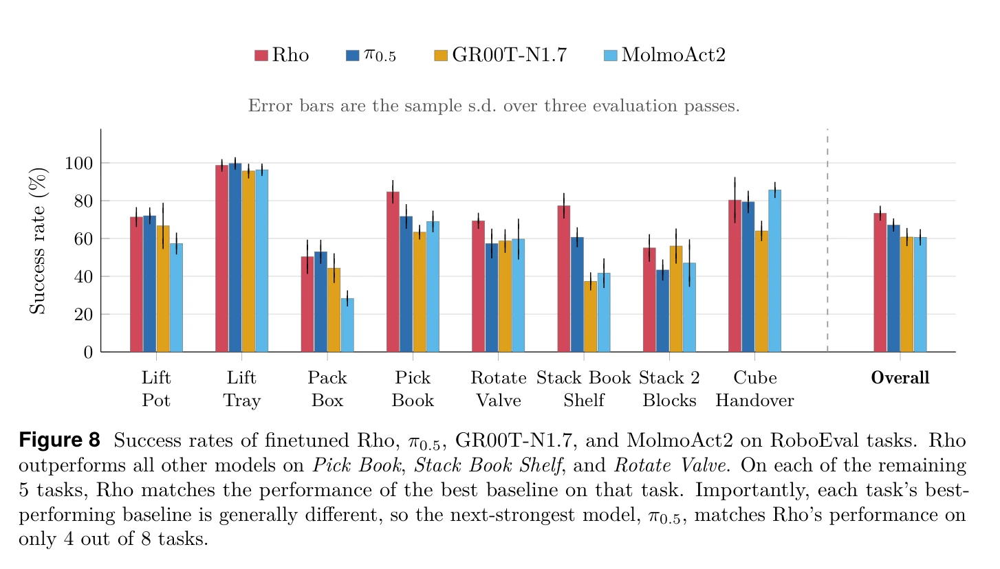

## 一屏概览

**问题：** 一个多机器人预训练模型，怎样较低成本地适配某种机器人、某个任务，以及部署时暴露的具体错误？Rho 将三种适配分开，而不是把所有变化都归为一次端到端微调。（§1–2）

原文图 1；PDF 第 2 页。[查看原始来源](https://arxiv.org/pdf/2609.38164v1#page=2)

原文图 2；PDF 第 6 页。[查看原始来源](https://arxiv.org/pdf/2609.38164v1#page=6)

原文图 3；PDF 第 8 页。[查看原始来源](https://arxiv.org/pdf/2609.38164v1#page=8)

**方法：** 约5.22B 参数的视觉—语言—动作模型，以物理理解增强的视觉语言骨干为条件，用流匹配生成动作块；先多机器人预训练，再做机器人专属中间训练与任务微调。在线阶段采用既有 FlowDAgger 思路，冻结动作生成器，通过少量纠正轨迹训练一个选择初始潜变量的小策略。（§2–3、附录 F）

**结果与边界：** 作者报告 RoboEval 73.4%、LIBERO 97.9%，但后者包含在线专家纠正，不能当成单纯离线微调成绩。FR3 的两项在线适配各用15条纠正轨迹，测试的是指定困难配置，不足以证明广泛的新任务泛化。（表8–10、附录 F、I）

**阅读建议：试。** 已有固定版本的发布文档可支撑40回合 LIBERO 冒烟评测计划，见 [[rho-release-documentation|发布文档与验证步骤]]。本页完整阅读 [v1 论文及附录](https://arxiv.org/pdf/2609.38164v1) 共52页，视觉核对在线适配与逐任务结果；未运行模型、训练或硬件实验。所有成绩为作者报告。

## 架构与实际动作接口

模型由4.68B 参数的 Phi-Phy 视觉语言模型和542M 参数动作专家组成。前者包含428M 参数的 SigLIP2 NaFlex 视觉编码器及32层、宽3072的语言骨干；后者为12层、宽2048的生成网络，16个查询头、4个键值头，每头128维。动作专家交叉注意力复用骨干第14个块的特征，经投影后缓存，减少生成多步动作时重复计算视觉语言条件的代价。（§2.1、附录 A）

输入包含至多三路256×256图像和语言；本体状态单独投影为动作专家的状态令牌。状态与动作补齐到32维，并用掩码排除无效维度。这样的接口统一不意味着不同机器人控制器自动可互换，坐标、归一化和执行频率仍需逐项对齐。（§2.1、附录 A、I；基础见 [[VisionLanguageActionModels|Vision-Language-Action (VLA)]]）

预训练的末端动作相对**当前动作块起点**表达，而不是每一步相对前一步：每只手臂包含3维位置、6维旋转表示和1维绝对夹爪量，双臂共20维，再补齐到32维。一个动作块覆盖约一秒原生频率数据，最多50步。按数据源、动作维度与块内位置的1%／99%分位数映射到 $[-1,1]$，并裁剪到 $\pm1.5$；后续任务配置可能采用均值／标准差归一化，不能把预训练规则无条件套到所有检查点。（附录 A、D、I）

流匹配以真实动作块 $a$ 和同维高斯噪声 $\epsilon$ 构造：

$$
x_t=(1-t)a+t\epsilon,\qquad
\mathcal L=\mathbb E\|v_\theta(x_t,t,o)-(\epsilon-a)\|^2.
$$

$o$ 表示观测和任务条件，生成时间 $t$ 与机器人控制时间不同。推理从 $t=1$ 向0执行10步显式欧拉积分得到动作块；不是让机器人只运动10个时刻。通用原理见 [[FlowMatching|流匹配]]，这里的特有设计在于条件缓存、动作参数化及后续潜在策略。（§2、附录 A）

## 三层适配分别改什么

| 阶段 | 数据与更新对象 | 作用与适用边界 |
| --- | --- | --- |
| 多机器人预训练 | 机器人动作与视觉语言任务混合，更新骨干和动作专家，词嵌入冻结 | 学到跨数据源的基础动作能力；数据并非全部公开 |
| 机器人专属中间训练 | 同一种平台的多任务数据，两轮训练，保留视觉语言混合 | 提供可重复使用的平台起点，不是直接获得每个下游任务能力 |
| 任务微调 | 目标任务示范，更新可训练的主模型参数，不再混合视觉语言任务 | 学习具体任务，需要任务数据和对应动作归一化 |
| 在线纠正 | 冻结主模型，只学习小型潜在策略 | 在现有生成器内选择更合适的动作，依赖纠正数据和可逆近似 |

多机器人预训练中90%的更新为机器人任务、10%为视觉语言任务，后者损失系数0.02。骨干与动作专家学习率分别为 $10^{-6}$ 和 $10^{-4}$；论文列出48张 B200 的预训练配置。不能把发布仓库的“四张 H100”任务训练说明解读成完整基础模型的训练成本。（§2、附录 A；发布说明见 [[rho-release-documentation]]）

中间训练平台数据包括 FR3 的3278小时／19类任务、UR 的299小时（263小时真实、36小时仿真），以及 YAM 的289小时／65个任务家族。这里的“减少下游示范”以前置的大量平台经验为条件，而非从总数据预算里免费节省。（§3.1、附录 D）

## 在线纠正为何能只训练小网络

令冻结的条件生成器为 $G_\theta(o,z)$，普通流匹配从高斯初值 $z$ 生成动作。在线适配改为：

$$
a=G_\theta(o,\pi_\phi(o)),
$$

其中 $\pi_\phi$ 是新训练的小策略。它接收池化后的视觉语言前缀特征与本体状态，使用三层1024宽 MLP、层归一化与末端双曲正切，输出 $16\times32$ 的潜变量并限制在 $[-3,3]$。这改变的是生成的起点，不是只微调最后一个动作头。（§3.2、附录 F）

人类或脚本专家介入后，收集实际执行的动作块 $a^*$，其中可以混合自主动作和纠正动作。通过近似逆变换得到 $z^*\approx G_\theta^{-1}(o,a^*)$，再最小化：

$$
\mathcal L_{\mathrm{latent}}(\phi)=\mathbb E\|\pi_\phi(o)-z^*\|^2.
$$

这是纠正轨迹上的监督学习，不是用在线奖励做强化学习；FlowDAgger 是论文采用的既有方法，不能当作 Rho 首次提出的算法。（§3.2、附录 F）

### 为什么“反向积分”还要迭代

一次正向生成的离散欧拉步为 $x_{j-1}=x_j-\Delta v_\theta(x_j,t_j,o)$。已知数据侧的 $x_{j-1}$，求噪声侧的 $x_j$ 要解隐式关系：

$$
x_j=x_{j-1}+\Delta v_\theta(x_j,t_j,o).
$$

右侧也依赖未知 $x_j$，所以作者采用不动点迭代，而不是简单对同一个速度取反。Meta-World 使用每步5次迭代，FR3 使用3次；再正向生成检查往返误差，均方误差超过 $10^{-3}$ 的样本丢弃。（附录 F）

连续流的可逆直觉不能保证有限步离散映射总能稳定求逆。上述筛选是在控制近似误差，不证明任意纠正动作都可表示。冻结主模型也不自动保证策略行为保持不变或安全：初始潜变量变化仍可能明显改变动作。这是由方法结构得到的解释，论文没有提供通用安全定理。

## 架构和中间训练证据怎样读

**动作专家缩小的局部证据。** 在部分预训练数据和固定 RoboEval 适配协议中，动作专家从1.649B 减至542M，得分从0.673变为0.671（后者报告误差量0.008），表明该配置下大幅缩小并未明显损失成绩。这组架构实验不是最终73.4%的完整训练结果，也不能推出任意任务上参数越少越好。（§2.2、附录 B）

**混合视觉语言训练。** 对应消融中，机器人＋视觉语言预训练的 LIBERO 得分为0.963，机器人预训练为0.943，无预训练为0.924；RoboEval 相应为0.673、0.652、0.610。这支持当前数据与训练设置下的混合收益，未直接建立语言指令鲁棒性或组合泛化能力。（§2.2、附录 B）

**中间训练的数据效率。** RoboTwin 先用45个任务、约23000条示范做中间训练，再在五个留出任务上用12.5%、25%、50%、100%的嵌套示范子集，以相同40000步微调预算比较。部分曲线约用一半下游数据达到相近成绩，但效果随任务与饱和程度变化；各子集的归一化统计取自完整下游数据集，因此小数据条件并非连统计信息都只见过那个子集。（§3.1、附录 D）

统计口径也应保留原文差异：附录部分叙述泛称三个种子，而图6／表19及具体设置列出 Easy 四个种子、Hard 三个有效种子。本页按明确列出的设置理解，不将其统一改写为所有实验均三种子。FR3 插接中间训练0／1／2轮的独立比较为18／30、23／30、26／30，不应与主结果图14的插接80%混为同一试验。（附录 D）

原文图 6；PDF 第 16 页。[查看原始来源](https://arxiv.org/pdf/2609.38164v1#page=16)

## 主实验：数字后面的协议

| 评测与定位 | 作者结果 | 必须一起保留的条件 |
| --- | --- | --- |
| RoboEval，§4.1、附录 I、表22 | Rho 73.4%，次高 π0.5 为67.1% | 八个任务，每任务100回合、三轮；所有模型40000步、批量128，但 Rho／Molmo 每样本8次流匹配训练采样，π／GR00T 为1次，计算预算并不完全相同 |
| LIBERO，表8、附录 F、I | 总体97.9%；空间98.3%、物体99.6%、目标97.6%、长任务95.9% | 包含离线微调和有特权脚本专家的在线纠正；40任务×50回合×3种子，共6000回合，比较表还引入不同协议的既有文献结果 |
| YAM BusyBox，§4.2 | 六项任务共60次，Rho 90%，与 π0.5 持平 | 2000条示范、50000步任务训练；不是所有平台上都独占第一 |
| UR，§4.2 | 工具箱46.7%、小电子件60% | 各30次评测，分别150／160条示范；18 Hz 执行，任务时限60／90秒 |
| FR3，图14、附录 I | 三类任务五种操作，150次平均80% | 每变体30次，30秒／30 Hz；任务专属微调50000步，示范量因任务而异 |

原文图 14；PDF 第 25 页。[查看原始来源](https://arxiv.org/pdf/2609.38164v1#page=25)

RoboEval 用32步动作块、每次执行16步，最长250步。除总成功率，还评估行为指标；Rho 在九项中五项最好，不等于所有碰撞与动作质量指标都最佳。（§4.1、附录 I）

**原文内部的措辞边界。** 图8图注称其余任务“匹配最佳”，但表22点估计中，Cube Handover 为0.80 vs Molmo 0.86、Lift Pot 为0.71 vs π0.5 0.72。没有进一步统计检验时，应报告表内数值和总体优势，不能把图注强化成逐任务都持平或领先。（图8、表22）

原文图 8；PDF 第 18 页。[查看原始来源](https://arxiv.org/pdf/2609.38164v1#page=18)

LIBERO 97.9%与架构章节出现的98.3%属于不同实验，不能挑较高数字作为统一总成绩。论文表15给出 LIBERO 预测16步、执行8步，固定版本发布文档则写预测16步、执行16步；本次只核查了文档，未追踪代码默认值，复现前必须对照实际配置。（附录 I、[[rho-release-documentation|发布文档]]）

## “15条纠正轨迹”具体证明了什么

Meta-World 在六个任务各采集50条纠正轨迹，再每任务100回合评测，平均57.5%提升到73.3%。纠正者为具有特权状态的脚本专家，随机选择接管点并持续至结束；这不是等量人工纠正成本的测量。（附录 F、表9）

FR3 两任务分别已有150条离线示范，再各用15条在线纠正轨迹。评测覆盖十个指定困难配置、每个重复三次：试管任务9／30提升到21／30，插接20／30提升到28／30。纠正与评测使用这些困难配置，结论是对已针对性收集反馈的问题有适配收益，不是未见布局的普遍泛化。（附录 F、表10）

在线机制也存在表示限制：若冻结生成器无法由可用潜变量产生所需动作，只学习潜在策略可能不足。论文没有系统给出这种支持范围的判别方法；这是一个适合进一步研究的边界，而非已测得的失败率。

## 我们的解释与复现优先级

最有价值的分解是把“平台经验”“任务经验”“现场纠错”当作不同层次。与 [[simex-simulation-integrated-robotics-autoresearch|SimEX]] 相比，Rho 在线修复的是潜变量选择器，SimEX 修复的是工具代码与仿真假设；因此两者的反馈条数、计算预算和可复用产物都不能直接横向排名。

优先执行 [[rho-release-documentation|40回合冒烟评测]]，确认检查点、归一化、执行块长和结果文件一致，再谈训练。冒烟运行只检验环境和推理链路；40回合不够复现6000回合及在线纠正后的97.9%。语言稳健性、跨平台泛化范围和未见配置下在线适配仍需补证，不能用“基础模型”名称代替实验。（§5）
