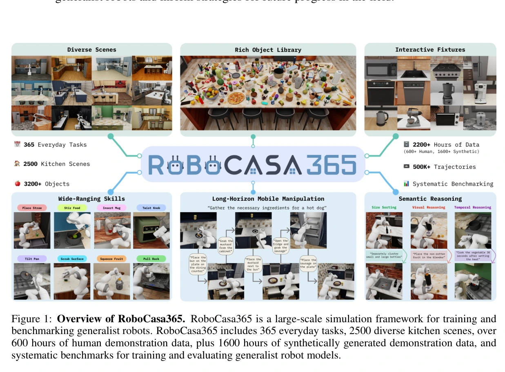
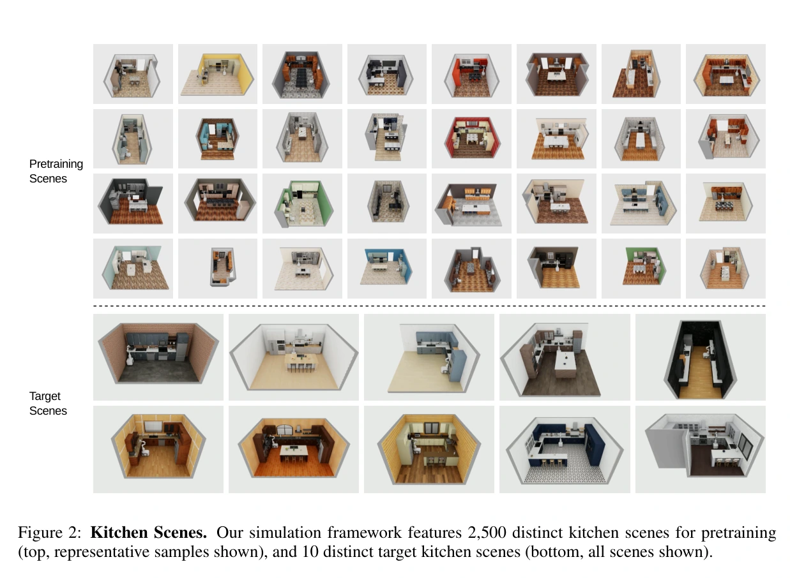
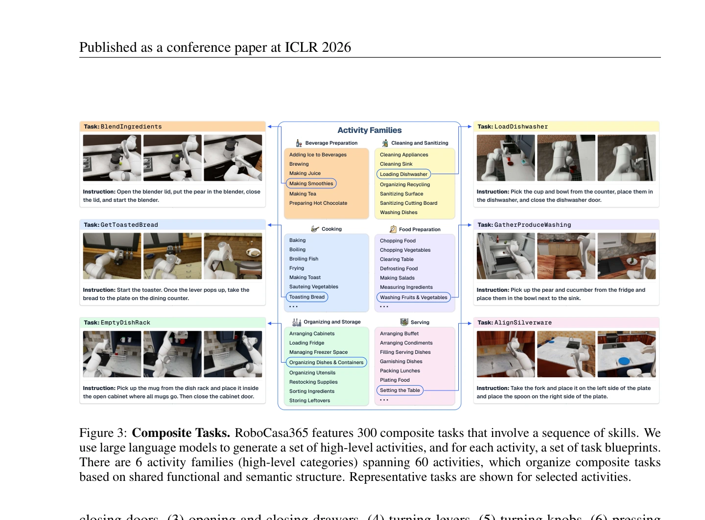
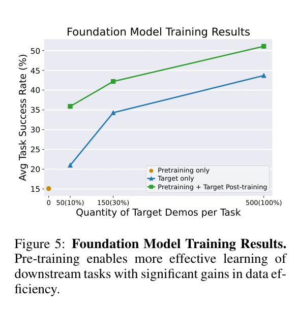

# RoboCasa365：用厨房任务研究数据构成与通用策略学习

## 一屏概览

**研究问题。** 怎样在可重复环境中分开研究任务多样性、场景多样性、数据质量、目标域适应和持续学习？RoboCasa365同时提供任务、环境、示范和训练协议，适合研究“训练数据如何影响能力”。

原文图 1；PDF 第 1 页。[查看原始来源](https://robocasa.ai/assets/robocasa365_iclr26.pdf#page=1)

**核心贡献。** 365个任务由65个原子任务与300个复合任务组成；2500个预训练厨房来自50布局×50风格，另有10个固定目标厨房；人类与 MimicGen 示范支持多任务训练、预训练后适应、持续学习及数据构成消融。[论文 §3](https://robocasa.ai/assets/robocasa365_iclr26.pdf#page=3)

**主要结论。** 本文 GR00T N1.5协议中，预训练提高目标任务的数据效率，但把全部合成示范加进去不一定更好；多任务直接训练的未见复合任务成功率仍低，顺序学习出现明显遗忘。结果不能推出通用最优数据配比，也不能把目标数据微调后的成功当作零样本组合泛化。

本页复核 `raw/robocasa365.pdf`，PDF 标明 ICLR 2026会议论文，完整阅读25页含附录，并核看真机结果表5。论文源日期保留原登记2026-03-04；未在原文另找到具体发布日期。

## 数据与任务：先分清三个划分

### 场景划分

厨房场景由布局和风格组成：布局决定平面结构，风格决定家具、电器及纹理实例。50个预训练布局参照美国50处真实住宅制作数字近似场景，与50种风格组合成2500场景。10个目标厨房来自原 RoboCasa 布局与风格的一一配对；预训练与目标风格在电器、家具和环境纹理选择上不重叠。**2500不是目标测试场景数，也不是2500个独立实测真实厨房。**[§3.2、图2](https://robocasa.ai/assets/robocasa365_iclr26.pdf#page=4)

原文图 2；PDF 第 4 页。[查看原始来源](https://robocasa.ai/assets/robocasa365_iclr26.pdf#page=4)

### 任务划分

65个原子任务基于抓放、开关门、抽屉、杠杆、旋钮、按钮、插入、导航等技能；300个复合任务覆盖60类活动，由语言模型提出蓝图后编写任务代码。365任务中220个需要移动操作，145个不需要。[§3.3、图3、附录 E](https://robocasa.ai/assets/robocasa365_iclr26.pdf#page=5)

原文图 3；PDF 第 5 页。[查看原始来源](https://robocasa.ai/assets/robocasa365_iclr26.pdf#page=5)

预训练人类示范覆盖全部65原子任务及235复合任务，共300任务。目标集选50任务：18原子、16预训练已见复合、16预训练未见复合。**“未见”是相对于预训练集：进入目标微调阶段后，这16任务也有目标示范。** 只有§4.1直接评估它们时，才是在该训练划分中的零样本新任务评估。

### 示范划分

| 数据 | 覆盖任务 | 场景池 | 每任务示范 | 规模与来源 |
| --- | --- | --- | --- | --- |
| 人类预训练 | 300 | 2500预训练厨房 | 100 | 3万条、404小时；§3.4、附录 F 表7 |
| MimicGen 预训练 | 60原子任务 | 2500预训练厨房 | 10000 | 60万条、1615小时；由每任务100条人类种子扩展 |
| 人类目标数据 | 50 | 10目标厨房 | 500 | 2.5万条、208小时 |

“场景池”不表示每个任务在每个厨房都有示范。人类数据总计5.5万条、612小时。§4.2曾把人类预训练时长写为411小时，与§3.4.3和附录 F 的404小时不一致；本表采用数据统计表口径并保留差异。

## 训练与评估机制

底层由 robosuite 与 [[sources/mujoco-overview|MuJoCo]] 支持。控制接口以20Hz 运行，机械臂动作为三维平移、三维旋转和夹爪，再加底盘、躯干及动作模式共5维，总计12维。这里的20Hz 是文中控制/交互频率，不能据此推断 MuJoCo 内部积分步长。观测包含腕部与两个第三视角的256×256图像、本体状态和语言指令。[附录 B、F–G](https://robocasa.ai/assets/robocasa365_iclr26.pdf#page=16)

以下记号是**我们的协议概括**：$D_p$ 为预训练示范，$D_t$ 为目标示范，$\theta$ 为策略参数。两阶段训练为：

$$
\theta_p=\operatorname{Train}(\theta_0,D_p),\qquad
\theta_t=\operatorname{FineTune}(\theta_p,D_t).
$$

与直接在 $D_p\cup D_t$ 上联合训练相比，两阶段方式把后续优化集中在目标分布。论文比较的是完整训练方案，不是严格控制所有样本曝光量与计算量后的唯一变量实验。[§4.2、附录 G、H.3](https://robocasa.ai/assets/robocasa365_iclr26.pdf#page=8)

仿真评估每任务30次，任务在规定时域内满足二值成功条件算成功，报告跨任务平均值。多任务实验在预训练厨房评估；目标适应实验在目标厨房评估。π0/π0.5使用全量微调、批量64、7.5万步；GR00T N1.5冻结视觉与语言编码器，批量128、多任务12万步；扩散策略批量192、25万步。因此表1不能作为计算预算完全一致的模型能力排名。[附录 G](https://robocasa.ai/assets/robocasa365_iclr26.pdf#page=21)

### 用一个复合任务串起制作、训练和测试

图3的 `BlendIngredients` 要求开搅拌机盖、放入梨、合盖并启动。高层任务蓝图列出物体、器具和技能顺序，之后由作者编写任务代码；模型提出蓝图并不意味着直接生成可靠控制策略。一次示范则把这些步骤展开为相机、本体观测、指令和机器人动作随时间变化的序列。[§3.3、图3](https://robocasa.ai/assets/robocasa365_iclr26.pdf#page=5)

预训练学习器从多任务示范中学习观测与指令到动作的关系；目标适配继续使用目标厨房和目标任务示范更新策略。评估时关闭训练更新，在指定厨房重置机器人，反复“读观测→预测动作→执行→读新观测”，以任务成功条件计分。它不会在每次评估时再调用生成蓝图的语言模型。基础的示范拟合目标见 [[RobotLearningObjectives|机器人学习目标]]，数据如何进入各阶段见 [[RobotLearningDataComposition|数据构成]]。

**教学解释。** 假设某个开盖—放物—启动组合没有进入预训练，但其目标示范进入微调，评估测到的是“借助预训练再学这个组合的效率”。只有完全没有用该组合示范更新的测试，才回答相应的零样本组合泛化问题。原子动作会做，也不自动保证长序列完成：开盖后的状态必须让放物可行，放物后的状态又必须允许合盖。论文的任务划分和逐类结果正是在区分这些条件。

四类实验因此有不同训练流向：多任务测试用预训练场景训练后测试；目标适配在这之后接目标数据；持续学习按阶段只加入新阶段任务；真机实验则再加入真实示范共同微调。不能把它们统一称为同一套“仿真预训练成绩”。各分支的冻结层、训练步数和数据量仍按下面表格及附录 G 核对。

## 主要实验与消融

| 问题 | 结果 | 原文位置及限制 |
| --- | --- | --- |
| 大规模多任务训练能否组合泛化 | GR00T N1.5原子43.0%、已见复合9.6%、未见复合4.4%，总体20.0%；π0.5总体16.9% | §4.1表1；3万人类示范，未见任务零样本；不同模型训练配置不完全一致 |
| 预训练是否节省目标示范 | 目标数据10%/30%/100%时，直接目标训练21.0/34.3/43.7%，两阶段35.9/42.2/51.1% | §4.2表2、图5；每任务50/150/500示范；作者概括约3倍数据效率，限此离散比较 |
| 任务多样性与合成数据 | 低目标数据下 Human50为34.7%、Human300为40.0%、Human300+MG60为35.9%；全目标数据时50.0/52.5/51.1% | §4.4表4；扩任务也扩数据量，不是纯粹固定样本数的多样性消融 |
| 场景多样性 | 5/25/2500场景预训练后零样本29.6/39.6/44.7%，目标10%微调后53.3/56.7/62.4% | 附录 H.1表8；使用17个原子任务的 MimicGen 示范，不能替换为全365任务结论 |
| 顺序学习是否遗忘 | 原子任务从第一阶段41.5%降至第四阶段10.6%；最终2–3阶段任务1.7%、4–5阶段2.7%、6+阶段4.3% | §4.3表3；后续阶段只用新阶段数据，未与回放或专门抗遗忘方法竞争 |
| 两阶段与一次联合训练 | 全数据联合训练22.5%，两阶段51.1% | 附录 H.3对表2；联合12万步，对照预训练8万+微调6万步，不能把全部差距只归因于顺序 |
| 输入扰动 | 已见/未见复合基准40.6/42.1%；新语言38.3/39.2%；相机扰动28.8/31.5% | 附录 H.2表9；关节与底盘初态扰动也降分，说明视觉与初态泛化未解决 |
| LoRA 适配 | 表10中 LoRA 总体1.2%，对照20.0% | 附录 H.4；特定配置结果，不证明所有低秩微调都失败；所谓“full”也须结合编码器冻结设置理解 |

原文图 5；PDF 第 8 页。[查看原始来源](https://robocasa.ai/assets/robocasa365_iclr26.pdf#page=8)

### 真机结果与需要保留的统计疑点

§4.5比较四个真实厨房任务、140条真实示范。对照只用真实数据训练；另一路先用仿真中表现最好的150任务中间训练，再用对应仿真与真实示范共同微调，并重渲染对齐相机。表5报告总体61.8%→79.8%，支持该组合方案对这四任务有帮助，不能推成无需真实示范的零样本迁移。[§4.5、表5](https://robocasa.ai/assets/robocasa365_iclr26.pdf#page=10)

本地 PDF 核查确认：正文称每任务20次试验，但柜子任务列52%与84%，并非20次二值试验能直接产生的比例；表注称提升18.1%，显示的总体值相减为18.0个百分点。原文未解释额外汇总或分母，本页保留原报告数，不据此反推成功次数、置信区间或更精确提升。

## 局限与我们的解释

**作者说明。** 任务集中在厨房，尚未覆盖现实感知与物理的全部复杂性。附录 I 的失败不只来自时域：包括微波炉边缘放置、灶台目标选错、抓取不稳、导航失败、紧空间容器放置，以及不同于常见抓放的翻锅倾倒。

**我们的解释。** 这篇论文对 [[RobotLearningDataComposition|训练数据构成]] 的支持比“数据越多越好”更具体：质量、任务范围、场景覆盖、采样权重和训练阶段共同决定收益。Human300优于加入 MG60，显示当前混合方案有问题；作者将其部分归因为合成轨迹质量不齐，但没有独立隔离质量、权重和任务不平衡的因果贡献。[[CompositionalGeneralizationInRobotics|组合泛化]] 也应与目标适应分开报告。

与 [[sources/nvlabs-robolab|RoboLab]] 的区别是评估目的：本篇主动研究仿真训练与后训练，RoboLab 论文主要把真实数据训练策略放进留出仿真域。两者解决不同问题，不能用一个总成功率排序。相关页：[[TaskGeneralistPolicyEvaluation|通用任务策略评估]]、[[RoboticsSimulationInfrastructure|仿真基础设施]]、[[SimulationRealityGap|Sim-to-Real Gap]]、[[VisionLanguageActionModels|Vision-Language-Action (VLA)]]。

## 研究归属

[[topics/evaluation-and-transfer|评测与 Sim-to-Real]] · [[topics/robot-policy-learning|机器人策略学习]] · [[topics/policy-evaluation|策略评测]]。
