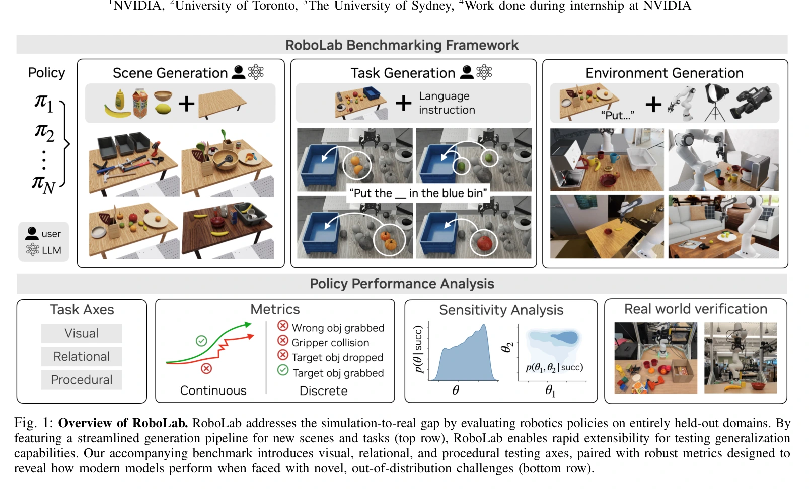
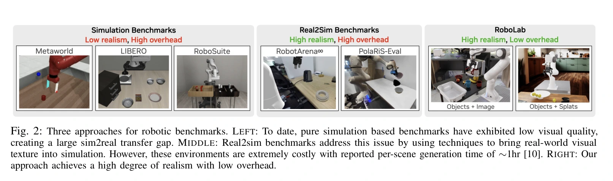
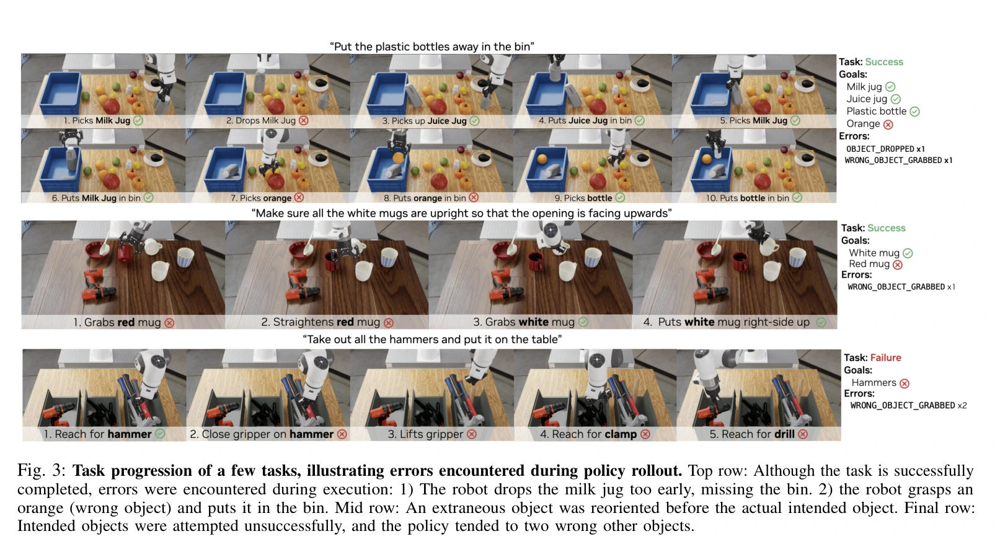

# RoboLab：在留出仿真环境中诊断通用机器人策略

## 一屏概览

**研究问题。** 用目标仿真基准的数据训练后再测同类场景，可能掩盖策略对未见环境的脆弱性。RoboLab 用在真实 DROID 数据上微调的现成策略，进入高保真、可控扰动的仿真环境，考察视觉、操作程序与关系理解。

原文图 1；PDF 第 1 页。[查看原始来源](https://arxiv.org/pdf/2604.09860#page=1)

原文图 2；PDF 第 2 页。[查看原始来源](https://arxiv.org/pdf/2604.09860#page=2)

**核心贡献。** RoboLab-120 提供分能力轴的任务、过程错误和轨迹指标；场景与任务生成工具支持扩展；混合神经后验估计用于描述哪些环境参数与成功相关。[论文 §III](https://arxiv.org/pdf/2604.09860v2#page=3)

**结论范围。** 表 I 报告五种策略的总体成功率都较低，π0.5 为23.3%；六个简单任务上的真机对照因策略而异，π0尤其明显失配。原文内部存在任务数、成功率和分组统计不一致，本页明确保留这些差异，不把论文改写成无歧义排行榜。

本页依据 `raw/robolab.pdf`，arXiv:2604.09860v2，2026-04-14，完整阅读26页含附录，并核看 PDF 表 I 及其同页正文。本页只分析论文；项目实现与后续能力见 [[nvlabs-robolab|NVlabs/RoboLab 仓库来源页]]，共同项目入口为 [[sources/nvlabs-robolab|RoboLab]]。项目主页或较晚仓库功能不作为本篇实验依据。

## 方法：任务、指标与扰动如何连起来

### 把任务从机器人与场景变化中分开

论文定义场景 $S=\{(b_i,p_i,q_i)\}_{i=1}^{N}$，其中 $b_i$ 是资产实例，$p_i$ 是位置，$q_i$ 是旋转；任务 $T=(S,l)$ 加入语言指令 $l$。环境进一步指定机器人 $R$、观测 $O$、动作 $A$ 和扰动参数 $\xi$。同一任务可改变相机、光照、背景或物体位姿，而不重写成功条件。[§III-D](https://arxiv.org/pdf/2604.09860v2#page=5)

三条能力轴允许重叠：视觉轴考察颜色、语义类别、大小；程序轴考察可供性、重定向、堆叠；关系轴考察逻辑连接、计数、空间关系。难度考虑指令直接程度和推理/操作步骤。能力轴不是互斥类别，不能将三个轴的数量相加当作总任务数。

### 场景生成与任务生成分别验证

场景生成先让语言模型选择目录内资产并输出包含、支撑、聚集等谓词；几何求解器按依赖次序放置物体，使用包围盒分离检查，再在 Isaac Sim 中受重力运行300步。最大位移超过阈值（通常2厘米）则形成文本反馈，要求修正场景。[§III-D、附录 C、算法1–2](https://arxiv.org/pdf/2604.09860v2#page=5)

任务生成接收场景目录、成功谓词库、能力模板和物理约束，输出 Python 任务代码；语法、资产引用和容器尺寸检查失败时重试。**这些检查能过滤一部分无效任务，但不能证明策略确实存在可行执行路径。** 812个自动生成任务用于另一个扩展性评估，不等同于 RoboLab-120；论文对120任务又有“自动生成后人工验证”与“人工生成”的不同描述，见下文。

### 成功率之外还记录什么

任务分数是子任务分数的归一化平均，例如“抓柠檬并抓青柠”可以分别计抓取、放置进度。额外记录抓错物体、提前掉落、夹爪碰撞。最终成功仍可能经历错误，图3正是在说明这个差别。[§III-B、图3](https://arxiv.org/pdf/2604.09860v2#page=3)

原文图 3；PDF 第 3 页。[查看原始来源](https://arxiv.org/pdf/2604.09860#page=3)

轨迹质量包括速度、路径长度及频谱弧长 SPARC。路径长度 $L=\sum_{k=0}^{N-1}\|p_{k+1}-p_k\|_2$ 使用末端位置序列；SPARC 对归一化速度频谱曲线取负弧长，越接近零通常越平滑。原文式(1)采用不超过10Hz 的自适应截止频率，频谱阈值为0.05。**我们的解释：** 不动作也可能路径短，动作平滑也可能抓错对象，所以这些指标必须与任务结果和错误事件并读，不能独立当“智能程度”。[§III-B、式(1)](https://arxiv.org/pdf/2604.09860v2#page=4)

### 敏感性后验测的是关联

设 $\theta$ 为相机位姿差、物体位置等环境参数，$x\in\{0,1\}$ 为成功结果。采样试验得到 $D=\{(\theta_i,x_i)\}_{i=1}^{N}$，训练条件密度 $q_\phi(\theta\mid x)$ 近似：

$$
p(\theta\mid x)\propto p(x\mid\theta)p(\theta),\qquad
\mathcal L(\phi)=-\frac1N\sum_i\log q_\phi(\theta_i\mid x_i).
$$

混合神经后验估计将离散参数分布与条件连续流模型组合；相机实验本身全部为连续参数。附录 B 使用均匀先验、50轮训练，并从后验采5000样本；非均匀采样时以估计提议分布作重要性修正。[§III-C、附录 B 式(4)–(9)](https://arxiv.org/pdf/2604.09860v2#page=13)

成功条件下腕部相机偏移集中在零附近，表示在所采分布中成功依赖接近标称相机配置。**我们的解释：** 这是成功条件分布，不是独立的因果效应估计；先验、扰动覆盖、成功数量和密度估计误差都会影响曲线。原文将位移米数与旋转弧度以权重1相加作为位姿距离，该尺度选择也影响横轴解释。

### MNPE 为什么能从成功结果反查敏感参数

训练数据中的每行是“本次用了哪些参数 $\theta_i$、最后是否成功 $x_i$”。最小化条件负对数似然，让 $q_\phi(\theta\mid x=1)$ 拟合成功回合的参数分布，$q_\phi(\theta\mid x=0)$ 拟合失败分布。网络在评估后用于诊断，不参与策略控制，也不通过这个损失微调被测 VLA。[附录 B、式(4)–(9)](https://arxiv.org/pdf/2604.09860v2#page=13)

原文将混合参数拆为：

$$
q_\phi(\theta\mid x)=q_\phi(\theta_{\mathrm{cont}}\mid\theta_{\mathrm{disc}},x)\,
q_\phi(\theta_{\mathrm{disc}}\mid x).
$$

离散部分用分类概率，连续部分用条件归一化流。分解把“哪种背景”与“在这个背景下哪些位姿更常成功”串起来；相机位姿实验本身只有连续参数，所以不要误读为每张相机敏感性图都用了离散分支。

实际采样若来自 $\widetilde p(\theta)$ 而目标解释希望使用均匀先验 $p(\theta)$，学出的条件密度首先近似的是 $p(x\mid\theta)\widetilde p(\theta)$ 归一化后的结果。于是乘以 $p(\theta)/\widetilde p(\theta)$，再归一化，才恢复目标先验下的后验：

$$
p(\theta\mid x)\propto \frac{p(\theta)}{\widetilde p(\theta)}q_\phi(\theta\mid x).
$$

这是对附录 B 重要性修正的推导说明；论文用训练参数上的高斯核密度估计提议分布。稀少区域会出现大权重，故作者还以归一化权重 $\bar w_i$ 计算 $\mathrm{ESS}=1/\sum_i\bar w_i^2$，判断有效样本量。增加后验抽样到5,000次只能使密度的数值汇总更稳定，不能创造原始执行数据没覆盖的证据。

直觉上，若腕相机偏移很小时成功、较大时失败，成功后验会靠近零；具体数字例子以及为什么“后验宽”不等于“成功率高”见 [[SimulationSensitivityAnalysis|敏感性分析]]。实现层的相机、观测和动作适配另见 [[nvlabs-robolab|固定版本代码路径]]，不把较晚实现当成本文实验已经采用的协议。

## 实验与消融

主评估采用 DROID 构型：7自由度 Franka Panda、Robotiq 夹爪、外置和腕部相机；动作是7维关节位置与1维二值夹爪。五种公开策略检查点经过 DROID 微调，本文未用 RoboLab 示范做目标域后训练。每任务重复10次，§IV-A 写明固定种子；不应把它描述成多独立训练种子的统计。[§IV-A](https://arxiv.org/pdf/2604.09860v2#page=6)

| 比较 | 原文位置 | 结果与适用范围 |
| --- | --- | --- |
| RoboLab-120总体 | 表 I、VI | π0.5 23.3%，π0-FAST 15.7%，π0 5.2%，GR00T N1.6 2.0%，PaliGemma 1.5%；仅限本文检查点与仿真适配 |
| 指令明确程度 | 表 IV | π0.5：含糊16.8%、默认23.3%、具体25.8%；π0-FAST：9.7%、15.7%、15.2%，更具体并非所有模型都提高 |
| 目标数量增加 | 表 II-b、VII-b | π0.5在“装罐装食品”中从1个目标70%降至3个20%；不能推广为所有任务同幅下降 |
| 环境扰动 | 表 III | 仅 BananaInBowl、BananaAndCubeInBowl 两个简单任务；π0.5腕相机扰动60%、外相机85%；π0的光照结果很不稳定 |
| 真机与仿真 | 表 V、VIII | π0.5：79.5%/74.0%；π0-FAST：34.1%/42.0%；π0：63.2%/18.0%；PaliGemma：0%/4.0%（真机/仿真） |
| 扩展场景生成 | 附录 C、表 XIV | 100个场景，VQA 为0.554对0.398，GPT 偏好82%对18%；属于模型裁判的视觉/语义评估 |
| 自动任务质量 | 附录 D、表 XVII | 59场景、812任务；模型裁判给平均对齐0.91、完全对齐76%、物体覆盖88%、谓词覆盖29%；不是812次机器人任务成功率 |

## 原文不一致：引用数字时必须带位置

| 项目 | 原文中的差异 | 本页处理 |
| --- | --- | --- |
| π0.5总体成功率 | §IV-B 写31.9%，表 I、VI、IX 写23.3%，引言写约30% | 主表列23.3%并保留冲突；本地 PDF 同页视觉核查确认，非提取错误 |
| 能力轴数量 | 引言、§IV-A 为关系44/视觉91/程序36；表 VI 为42/83/34 | 不静默选一个版本，不据此算跨轴加权平均 |
| 难度数量 | 65简单+38中等+18复杂=121，总数反复写120 | 原文未解释，保留为未解决的统计口径问题 |
| 120任务如何生成 | 引言称自动生成后人工验证，附录 A 称人工生成 | 与812自动生成任务区分，不能认定120任务全部来自同一自动流程 |
| 真机对照覆盖 | 正文写六个简单任务；表 VIII 的 FoodPacking2Cans 仿真项全缺失 | 表 V 整体结果按原文记录，不称六任务均有完整一一配对 |
| 光照鲁棒性 | §IV-D 概括 VLA 有90–100%成功；表 III 该概括更接近π0.5，π0多项为0% | 只对相应策略和扰动描述，不泛化到全部 VLA |

## 局限与我们的解释

**作者明确的限制。** 系统主要覆盖刚体桌面操作，布料、电缆、袋子、精细力控、顺应和复杂摩擦行为不足；视觉分布差异仍然存在。真机验证规模小，π0反例说明仿真排名与现实可靠性之间不能直接划等号。[§V、§IV-E](https://arxiv.org/pdf/2604.09860v2#page=8)

**我们的解释。** 本文最值得复用的是诊断协议：隔离语言、场景和外参变化，同时检查任务成功、错误与轨迹。由于内部表文不一致、固定种子小样本以及真机匹配不完整，其数字更适合作为发现问题的线索，而非高精度预测现实成功率。没有对照训练数据内容的实验，“颜色或几何先验覆盖指令”等归因应保留为作者解释，不当作已经证明的训练机制。

相关机制见 [[TaskGeneralistPolicyEvaluation|通用任务策略评估]]、[[SimulationSensitivityAnalysis|仿真敏感性分析]]、[[SimulationRealityGap|Sim-to-Real Gap]]、[[VisionLanguageActionModels|Vision-Language-Action (VLA)]]。后续模型讨论可参考 [[pi07-steerable-generalist-robotic-foundation-model|π0.7]]，但其成绩不能与本页协议直接混排。

## 研究归属

[[topics/evaluation-and-transfer|评测与 Sim-to-Real]] · [[topics/robot-policy-learning|机器人策略学习]] · [[topics/policy-evaluation|策略评测]]。
