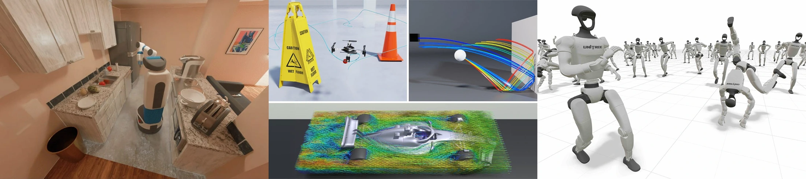
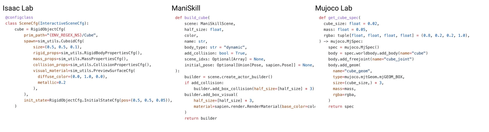
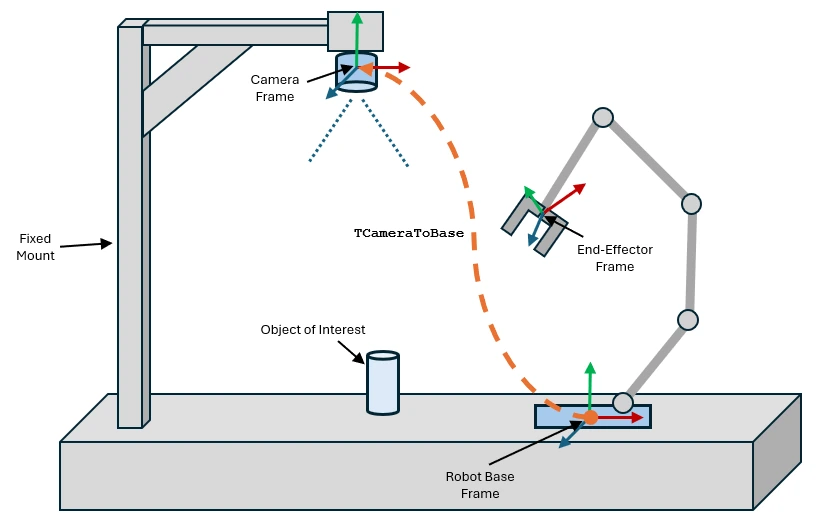

# Stone Tao：机器人仿真基础设施中的接口设计

Stone Tao 在2026-05-13的文章中，把仿真基础设施解释为将物理、渲染、资产、任务和学习系统接成可用研究环境的工程层。作者是 ManiSkill 参与者，文章提供设计经验与代码片段，不是固定版本、统一硬件下的框架性能评测。本轮完整重读已归档正文和片段；没有据本文运行或重新审计其引用的框架实现。[原文](https://stoneztao.substack.com/p/robotics-simulation-infrastructure)

不同仿真系统的场景示例。[查看原始来源](https://substackcdn.com/image/fetch/$s_!-oph!,w_5760,c_limit,f_auto,q_auto:good,fl_progressive:steep/https%3A%2F%2Fsubstack-post-media.s3.amazonaws.com%2Fpublic%2Fimages%2F7d551cc1-64e9-4051-b1cb-32d4e73d4f0f_2880x640.png)

三种框架创建长方体的接口对比。[查看原始来源](https://substackcdn.com/image/fetch/$s_!gyVU!,w_2400,c_limit,f_auto,q_auto:good,fl_progressive:steep/https%3A%2F%2Fsubstack-post-media.s3.amazonaws.com%2Fpublic%2Fimages%2Fda59da25-a5c6-48ef-816a-6e4aad1c83c4_2278x616.png)

## 为什么物理引擎之外还需要一层系统

文章列出六类组件：任务与环境 API、资产管理、物理、渲染、可视化、机器学习。以一次视觉策略训练为例，场景先构建资产，物理步产生新状态，渲染把状态变成观测，策略产生动作，任务判定和记录又决定训练／评估怎样解释这条轨迹。上述链路是我们对文章六组件观点的教学串联；作者没有给出所有框架共享的正式执行顺序。

作者用创建立方体说明接口取舍：配置驱动方式便于统一结构和序列化，直接 Python 构造便于动态修改；他将 Isaac Lab 与 ManiSkill／MuJoCo Lab 分别作为相应例子。这里的优劣针对开发方式，不是碰撞精度或策略成功率排名。[“Decisions and Trade-offs”节](https://stoneztao.substack.com/p/robotics-simulation-infrastructure)

## 位姿对象为什么能减少接口负担

文章最具体的案例是位姿：一个位置向量和一个四元数可分别传递，也可封装为带 `.p`、`.q`、求逆和组合操作的 `Pose` 对象。两种表达都能做相同数学运算；区别在于调用方需要携带多少成对变量，以及单位、批量形状和输入转换放在哪一层维护。作者举出 NumPy、张量和 SAPIEN 位姿统一进入 `Pose.create` 的用法，同时承认 Python 间接访问有开销。[“Poses”节](https://stoneztao.substack.com/p/robotics-simulation-infrastructure)

机器人系统中的坐标系变换（原文注明来自 MathWorks）。[查看原始来源](https://substackcdn.com/image/fetch/$s_!P0r5!,w_1456,c_limit,f_auto,q_auto:good,fl_progressive:steep/https%3A%2F%2Fsubstack-post-media.s3.amazonaws.com%2Fpublic%2Fimages%2F02cbd68f-9e11-4e48-b4bf-a8f76581b756_826x519.png)

**教学转写。** 设两个位姿在同一参考系下为 $T_1=(R_1,p_1)$、$T_2=(R_2,p_2)$。原文片段分别返回位置差和旋转差：

$$
e_p=p_2-p_1,\qquad R_e=R_2R_1^\top.
$$

对象写法通过 `(pose_02 * pose_01.inv()).q` 得到旋转部分，再单独计算 `.p` 之差。它没有把完整乘积的平移部分当作位置差，因为 $T_2T_1^{-1}$ 的平移其实是 $p_2-R_2R_1^\top p_1$。这正说明好接口能减少参数，却仍需明确“误差用哪个参考系、要哪种平移含义”。完整变换基础见 [[RobotCoordinateFrames|机器人坐标系]]，不在项目观点页重复展开。

例如两点位置相同但朝向不同，$e_p=0$；完整变换乘积的平移却未必为零。此例由知识库构造，用来解释原文为什么取乘积的 `.q`、却另外相减 `.p`，不是作者新增实验。

## 渲染选择怎样影响训练资源

作者回顾 ManiSkill／SAPIEN 批量渲染优先性能和显存占用的设计，让更多显存留给批量、经验回放与网络，并把它与更重视视觉保真的路线比较。他还赞赏 MuJoCo Lab 把奖励曲线、暂停和历史状态检查放进可视化工具。这些是作者经验判断；文章没有给出等任务、等画质、等硬件的显存／吞吐消融，也没有量化 API 设计减少多少错误。[原文相关段落](https://stoneztao.substack.com/p/robotics-simulation-infrastructure)

**我们的解释：** 显存预算可按 $M_{\mathrm{total}}=M_{\mathrm{scene}}+M_{\mathrm{render}}+M_{\mathrm{policy}}+M_{\mathrm{training}}+M_{\mathrm{other}}$ 盘点。这只是资源账本；减少渲染占用提供了扩大学习资源的空间，是否提高样本效率还取决于算法、任务和训练配置。显示更多诊断信息同样只有在对应正确时序、奖励和状态时才帮助排错。

## 与本地其他来源的关系

本文适合先建立“接口决定可用性”的视角，再看具体现实：[[nvlabs-robolab|RoboLab 实现]] 展示任务、策略客户端与回合记录怎样串起来；[[nvidia-ovrtx|ovrtx]] 展示渲染输出的同步与所有权；[[RoboticsSimulationInfrastructure|基础设施概念]] 汇总这些接口。

仓库已另收录 [[maniskill-repository|ManiSkill]]、[[isaac-lab-repository|Isaac Lab]] 和 [[mjlab-repository|mjlab]]，所以不再沿用旧页“尚无官方来源”的描述。那些页面负责各自固定版本的实现；本文不把博客中的片段自动当作它们当前 API 或性能的证据。作者关于接口更易理解、显存换训练资源的观点，仍应与可测量的工程结果区分。

## 研究归属

[[topics/assets-and-world-generation|3D 资产与场景]] · [[topics/simulation-ready-worlds|Simulation-ready Worlds]]。
