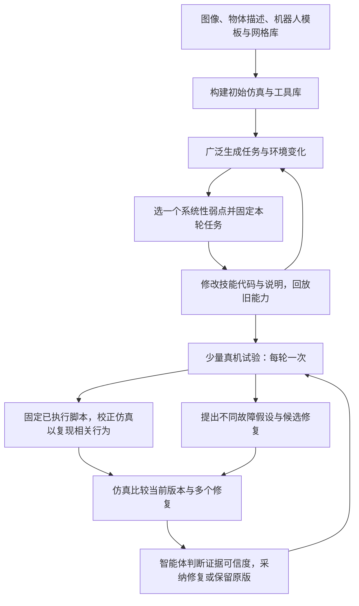

## 一屏概览

**研究问题：** 编程智能体会写机器人程序，却未必知道可达抓取、接触和标定误差；直接让机器人试错又昂贵。SimEX 把仿真用作技能开发与故障诊断的实验室：先开放式探索、积累可复用的感知与控制代码，再把每次真实试验转化为多次仿真修复实验。（§1–2、图1–2）

**主要贡献：** 持久产物是一对文件：`toolbox.py` 保存技能实现，`skill.md` 保存用法、测得的限制和已知失败情形。任务脚本由模型按需生成；改进发生在工具库和仿真环境中，论文没有以更新模型权重作为学习机制。阶段一兼顾新能力与旧任务回放，阶段二先复现真实行为，再以多种假设筛选代码修复。（§2.1–2.4）

**关键证据：** 同一双臂 YAM 平台的三个代表任务上，经过每任务五次适应试验，最终评估共成功26/30，最强外部基线为3/30。“约10分钟”仅指每任务五次真机交互；另有仿真开发、模型推理、人工重置和最终评估成本。主要受控比较则是跨仿真器的21个任务，不能与三项硬件结果混为一组。（§3、表1、表3–4）

本页完整阅读 [v1 原论文及附录](https://arxiv.org/pdf/2609.38982v1)，共21页；对表1–9及预算表所在页面作视觉核对。没有核查项目代码或运行复现实验。文中定位均指此版本。

## 问题与设计动机

直接生成代码的困难是缺少环境特有知识：相机标定偏差、夹爪能否伸入、盘子能从哪一侧夹住，不能仅靠语言描述可靠猜出。只在一个重建场景上优化，又可能利用仿真的偶然几何和动力学；完全依赖真实反馈，则每个错误猜测都消耗一次机器人实验。（§1、§2.3）

SimEX 的设计是先扩充能力覆盖，再集中处理现实差距。第一阶段让智能体自行提出任务、环境变化和成功判据，主动暴露工具库弱点；第二阶段围绕真实失败改仿真、改工具库。迁移的内容包含可执行过程及其使用知识，但这仍然构成控制策略，不能把作者“迁移知识与过程”的表述理解为不存在策略迁移。（§2；最后一句为本页解释）

## 系统接口与一次任务执行

| 层次 | 输入、输出和可编辑内容 | 关键约束 |
| --- | --- | --- |
| 初始仿真 | 工作区图像、物体文字描述、空 YAM 场景模板、预置网格库 → 场景与初始工具库 | 有资产和机器人模板，不是从单图恢复任意世界的完整物理真值 |
| 底层机器人接口 | RGB-D、关节和末端状态、逆运动学与可达性查询；接受末端或绝对关节位置目标、夹爪命令 | 各方法共用，优化过程不改此接口；不提供现成任务级操作技能 |
| 持久工具库 | `toolbox.py` 的感知和控制函数；`skill.md` 的用法及限制 | 成对改进，作为跨迭代能力载体 |
| 任务脚本生成 | 工具库源码、技能说明、任务名称与描述 → 一次文本生成的 Python 程序 | 生成时不能调用工具或多轮交互；执行时不得读写特权物体状态 |
| 执行与反馈 | 程序读取观测并控制机器人；执行系统记录视频、读到的图像和程序输出 | 优化阶段脚本执行后丢弃，长期改进写回工具库 |

以上接口来自§2.1–2.2与附录 A.2。附录提示词允许脚本调用工具库，也允许自行写代码绕过它；因此“每个动作必经已有技能函数”并非硬约束。真正共同的限制是底层接口与禁止作弊。仿真中生成成功判据可以读取仿真状态，与机器人执行程序不能读取特权状态是两种权限。

例如扫码任务先由模型生成程序，程序在执行时识别物体、选择可行抓取、露出标签并对准扫描器，然后收纳物体。这里的感知反馈发生在程序内；大模型不必在每次动作前重新推理。工具库优化完成后的单次程序生成约30秒，执行过程没有模型调用，不应把“一次生成程序”误称为必然开环控制。（§3.4、附录 B.3、D.4）

## 方法机制

图按§2与图2重画。阶段一结束后才进入集中真机适应；阶段二允许仿真对齐与故障假设分析并行，图中两条分支在筛选时汇合。

### 阶段一：探索、聚焦、优化

智能体先改变任务目标、物体类别、质量与摩擦、物体位置和机器人初态，为每个配置写可执行成功判据。接着选出一个系统性弱点，例如某类瓶子的抓取，固定一组围绕该弱点的任务，再通过代码与说明的修改、仿真实验和择优保留逐步改进。**没有预设全局任务分布，不等于没有评价函数**：每个任务有判据，而且单轮优化任务固定，才可比较修改前后。（§2.3）

两项机制抑制能力收窄。能力库保存此前已解任务，每次修改抽取旧任务做回归检查；种群包含四条独立优化路径，各自有工作目录、工具库、任务集与能力库。成员可在探测阶段边界阅读别人的简短实验描述、重新实现思路，但不能复制实现。每个成员有20次优化迭代预算；表2另列每轮24–32个广泛探测配置、每子目标约10个聚焦配置、每候选4–6个旧能力回放配置。（§2.3、表2）

为理解保留规则，可把工具库写成 $T=(C,K)$，其中 $C$ 为代码，$K$ 为使用知识；令 $G(T,q)$ 为模型针对任务 $q$ 生成的程序，$E$ 为仿真环境，$R_q$ 为任务成功判据，则

$$
S(T;Q,E)=\frac{1}{|Q|}\sum_{q\in Q}R_q\bigl(\operatorname{Rollout}(E,G(T,q),T)\bigr).
$$

$Q$ 表示本轮聚焦任务与旧能力回放的集合。这个式子是本页说明“工具库修改通过程序执行接受评价”的教学抽象，**不是论文给出的固定损失或接受阈值**；原文把优化决策交给智能体，未给出上述等权打分公式作为实现。模型生成也有随机性，所以一次提升不自动代表能力稳定提升。

### 阶段二：先让失败可复现，再筛选修复

每轮先执行一次真机程序，保存视频、程序读过的帧和完整输出。随后在相同任务配置中运行那份已执行脚本，智能体定性比较仿真与真实轨迹；必要时持续修改仿真，直到复现与结果相关的行为。修改后的环境保留到后续候选筛选。（§2.4，第1–2步）

这里固定的是**程序**，不是逐时刻动作序列。由于程序可以读取当前观测，同一程序在两个环境里仍可能采取不同动作。固定程序有助于把观察差异归因于环境，但不能证明参数唯一正确；相关基础见 [[SystemIdentificationForSimulation|系统辨识与闭环分布校准]]。

智能体再提出可检验的不同解释，并为每种解释单独修改一份工具库。例如图2列出“标签朝向不对”与“手指挡住标签”，相应修复应对朝向或遮挡产生不同可观察效果。筛选时既在重建的试验初态上运行固定脚本，也在少量新仿真任务上比较当前版本与候选。默认每轮四个修复、五个测试场景，整个适应过程五次真机试验。（§2.4、图2、表2）

**选择者仍是智能体。** 执行系统返回视频、轨迹与分数，不自动排序或按最高仿真分数更新；智能体根据剩余现实差距判断哪些测试可信，选择修复或保留旧版本。这给粗略仿真留出余地，也使评价可信度依赖智能体判断。论文没有定义统一轨迹损失、校准终止阈值或自动选择保证。（§2.4）

### 与 SimOpt 的关系

[[simopt-adaptive-randomization|SimOpt]] 也是固定当前策略、比较真实与仿真观测，再交替更新仿真与策略；但它用显式轨迹距离和受 KL 约束的随机化分布更新，再训练神经策略。SimEX 由编程智能体定性修改仿真，并将其用于代码候选的诊断和筛选。这是两篇已收录来源的机制比较，不是同预算实验结论，也不能把 SimOpt 的数学优化程序套作 SimEX 的实现。（SimEX §2.4、附录 E；SimOpt §III）

## 实验：把适应、评估与成本分开

### 跨仿真器的受控比较

盘子收纳与扫码从 MuJoCo 开发环境迁移到 Isaac Sim；毛巾从 FLASH 迁移到 MJWarp Flex。智能体不能读取评估仿真器内部状态或源码。三类任务各七项，每个“方法—任务”做五次独立运行，每次允许五次部署适应，然后冻结工具库、另做五次评估，因此每格25次、每类175次。每个评估回合重新生成脚本；论文的95%自助法置信区间在各任务内重采样运行。（§3.1–3.2、附录 B–D）

| 方法 | 盘子收纳 | 毛巾操作 | 扫码后收纳 |
| --- | ---: | ---: | ---: |
| Direct CaP | 25% | 17% | 1% |
| ENPIRE* | 35% | 34% | 0% |
| Zero-Shot Sim2Real | 27% | 36% | 1% |
| ASPIRE* | 30% | 38% | 18% |
| SimEX：固定目标，去掉开放探索 | 60% | 47% | 24% |
| SimEX：真机后直接修复 | 79% | 39% | 58% |
| 完整 SimEX | **94%** | **67%** | **85%** |

表为图3的整数百分比，与表4计数核对；完整方法分别165/175、118/175、149/175。每类结果是七任务等权平均，并非硬件成功率。完整方法在全部21项任务上不低于外部基线，但并非每项都胜过自身消融：隐藏条码方块是24/25，直接修复为25/25；双瓶是19/25，直接修复为20/25。（表4）

毛巾任务也不是七项全都要求标准折叠：包含平移、缩小覆盖面积、半折和双折。旋转半折的判据同时检查面积、两轴尺寸及平整程度，堆成一团不算成功；完整方法在该项仅8/25。扫码要求先读到条码再收纳，盘子要求先抬高至少5厘米再送入箱中。因此平均分不能替代具体技能判据。（附录 B、表4）

ENPIRE* 与 ASPIRE* 是作者在统一接口下重实现的方法；零样本基线沿用 DrEureka 的仿真单向迁移原则，以本文代码策略接口实现，不能视为原算法原样复现。各含仿真预开发的方法匹配四成员、每成员20次迭代，各适应方法匹配五次部署试验；这些条件没有证明所有方法总 token、仿真执行数和耗时完全一致。（附录 C；最后一句为本页对预算匹配范围的解释）

### 真实机器人

| 方法 | 四个盘子入箱 | 毛巾对折 | 两物体扫码与收纳 | 合计 |
| --- | ---: | ---: | ---: | ---: |
| Direct CaP | 0/10 | 0/10 | 0/10 | 0/30 |
| ENPIRE* | 2/10 | 1/10 | 0/10 | 3/30 |
| Zero-Shot Sim2Real | 0/10 | 2/10 | 0/10 | 2/30 |
| ASPIRE* | 2/10 | 0/10 | 0/10 | 2/30 |
| SimEX | **10/10** | **8/10** | **8/10** | **26/30** |

此表来自§3.3表1；每类选一个代表任务，适应方法先做五次试验，再各评估十次。所有任务共用双臂 YAM、一个顶置相机和两个腕部相机；真机试验之间由人重置。论文展示了不同任务中的有效策略，包括根据盘子与箱子的距离改变抓取侧、折后铺平毛巾、用单臂完成扫码收纳；本次没有独立核查视频。（§3.1、§3.3）

### 消融与跨模型检查

条码七任务上，完整方法85%，去掉种群为66%，去掉旧能力库为69%，只留一个修复候选为78%，不显式生成假设为72%。这些是跨仿真器结果。去种群从四个优化过程变为一个，原文没有报告将单过程预算增至四倍，因此降幅同时涉及探索多样性与总计算量；去多候选也减少了候选搜索，不能直接解释为纯粹的选择规则贡献。（图5、表5、附录 D.2；后两句为本页分析）

同一条码协议中，同时更换优化智能体和程序生成模型，SimEX 的七任务均值依次为 Fable 5.1：85%，Opus 5：77%，GPT-5.5：67%，GPT-6 Astra：82%。这支持方法在四种配置中都有收益，但没有分离优化能力与程序生成能力，也不是四模型各自的完整真机评测。（§3.4、图6、表6–9）

### “10分钟”与实际资源

附录 A.3表3给出条码任务的平均编排成本，输出 token 包含推理 token，后者不是需要再相加的额外数值：

| 统计项 | 阶段一：每个种群成员 | 阶段二：每次适应运行 |
| --- | ---: | ---: |
| 编排模型调用 | 840 | 124 |
| 累计模型思考时间 | 5.4小时 | 31分钟 |
| 输出 token（其中推理） | 198万（116万） | 16.1万（6.4万） |
| 缓存读取输入 token | 1.55亿 | 1950万 |

这里统计的是编排调用的累计响应等待时间，不是包含仿真执行、所有任务程序生成和人工操作的完整墙钟时间。四成员并行也不能把“每成员5.4小时”直接说成总墙钟21.6小时。每任务约10分钟则是五次真机适应交互，另有十次最终硬件评估。（§3.3、附录 A.3）

在线控制对照中，三个条码任务各五个初始化，在线智能体每回合约30次模型调用、累计等待约40分钟，15次均未在预算内完成；SimEX 是约30秒的一次程序生成，三个程序各自的验证回合均完成。样本数与执行预算不同，这项实验主要支持本设置下串行模型延迟是瓶颈，不能概括成所有在线智能体都不适合机器人。（附录 D.4）

## 局限与我们的解释

**作者明确指出：** 只使用一种机器人平台；真实场景仍需人工重置，尚未实现完全自主的物理实验循环。（§5）

**本页对证据范围的判断：** 三个硬件任务和每任务十次最终评估支持可行性及该协议下的优势，不能证明跨机器人、跨工作区或长期连续运行的可靠性。没有演示数据，也仍有预训练大模型、机器人接口、标定、模板、网格库和初始感知模块作为先验条件。（§2、§3、附录 C）

**仿真质量仍是未量化变量。** 论文展示粗略仿真结合适应能够工作，但未给出“粗略到什么程度仍够用”的受控曲线，也未独立消融固定脚本对齐步骤。智能体自行生成任务和判据还可能漏掉弱点、设置过宽判据；独立留出评测能检验部分后果，不能保证开放探索覆盖所有重要失败。这些是由方法结构引出的限制，不是论文已测出的失败概率。（§2.3–2.4、§3.4）

**对本库最有价值的启发：** 仿真除了产生训练轨迹、部署前打分，还可以在真实失败之后比较修复假设。我们应检验它是否帮助选对下一次修改，而不能只看画面、轨迹拟合或单个仿真成功率。一个待验证实验是固定总计算预算，比较“不对齐、定性对齐、量化对齐”对候选修复真实排序的影响；论文尚未完成此检验。

## 关联与复习

- [[SystemIdentificationForSimulation|系统辨识]]：固定程序有助于比较环境，但行为吻合不证明物理参数唯一正确。
- [[DomainRandomization|域随机化]]：SimEX 的环境变化服务于能力探测，不能将其直接等同于固定参数分布上的神经策略训练。
- [[PolicyDeploymentContract|策略部署契约]]：可复用技能仍依赖观测、坐标和控制接口一致。
- [[topics/simulation-transfer|仿真迁移专题]] 与 [[topics/robot-policy-learning|机器人策略学习]]：分别比较仿真的作用和被改进的策略表示。

复习时可问：持久化的是哪两个文件？成功判据与策略分别能看到什么？为何对齐时固定脚本，而修复时更换工具库？为什么仿真最高分不自动决定下一次真机版本？26/30与每任务五次适应、约10分钟之间是什么关系？
