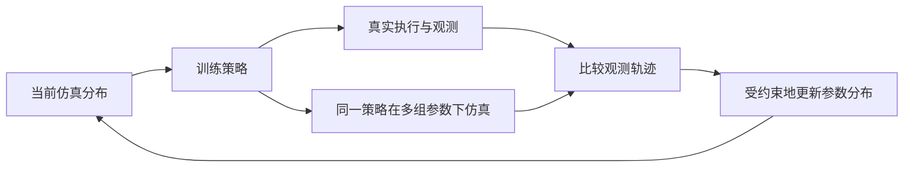

## 一屏概览

**研究问题：** 域随机化的范围依赖手调，过宽会让策略保守甚至让任务无解；能否用少量真实交互自动调整训练用的仿真分布？Chebotar 等提出 SimOpt，交替训练策略、执行真实策略、匹配闭环观测轨迹并更新参数分布。

**主要贡献：** 用任务相关的观测一致性校正一族仿真环境，既不要求真实环境的完整状态，也不要求在真实环境中计算训练奖励。当前实现使用高斯参数分布、PPO 和无梯度采样优化。

**结论范围：** 摇摆插销任务在两轮更新后达到 18/20，抽屉任务在一轮更新后达到 20/20；每轮采三条真实轨迹，但仿真使用 64 块 GPU。依据为 [原论文](https://arxiv.org/abs/1810.05687v4) 第 III–IV 节与附录 A–C；本页完整复核 v4，旧 v2 仍保留为独立原始快照。

## 方法：交替改策略与训练分布

设 $\xi$ 为仿真参数，例如机器人柔顺性、阻尼、绳索性质与物体尺寸；$p_\phi(\xi)$ 为参数分布，本文采用 $\phi=(\mu,\Sigma)$ 参数化的高斯分布，其中 $\mu$ 是均值，$\Sigma$ 是完整协方差矩阵。每轮先在当前分布中训练策略 $\pi_i$，再在真实系统执行该策略，取得观测轨迹 $\tau_{\mathrm{real}}^{\mathrm{ob}}$。（第 III 节、图 3、算法 1）

保持策略 $\pi_i$ 固定，采样不同仿真参数并执行同一闭环策略，求解

$$
\min_{\phi_{i+1}}\;\mathbb E_{\xi\sim p_{\phi_{i+1}},\,\tau_\xi\sim\pi_i}\left[D\left(\tau_\xi^{\mathrm{ob}},\tau_{\mathrm{real}}^{\mathrm{ob}}\right)\right],\qquad
D_{\mathrm{KL}}\left(p_{\phi_{i+1}}\Vert p_{\phi_i}\right)\le\varepsilon.
$$

$D$ 衡量观测轨迹差异，$\varepsilon$ 限制新旧分布的 KL 散度。这个信赖域约束避免一次把环境分布推到当前策略不再适用的区域。随后在更新后的分布中重新训练或继续训练策略，再采集新的真实轨迹，而不是为每个候选参数分布都从头训练并做真实评估。（第 III-B 节、式 2–3）

### 匹配什么，为什么保留闭环

对真实与仿真的观测 $o_t^{\mathrm{real}},o_t^\xi$，原文式 4 使用

$$
D=w_1\sum_t\left\|W(o_t^\xi-o_t^{\mathrm{real}})\right\|_1+w_2\sum_t\left\|W(o_t^\xi-o_t^{\mathrm{real}})\right\|_2^2,
$$

其中 $W$ 为观测各维的重要性权重，$w_1,w_2$ 平衡绝对误差与平方误差；还对距离计算应用高斯平滑以缓解时间错位。辨识用观测不必与策略输入完全相同，不能观测完整绳索形变也不妨碍用关节和插销位置构造差异。（第 III-B–C 节）

本文每个候选环境都重新运行闭环策略，动作会根据该环境中的当前观测变化。附录 A 讨论了直接重放真实动作的替代方案：若无法逐步恢复全部真实状态，开环重放可能偏离到不可比的轨迹；闭环机器人反应还能间接携带未观测环境变量的信息。这是本文实验和机制解释，不是闭环总优于开环辨识的定理。

### 参数分布如何更新

实现用 NVIDIA Flex 仿真器，PPO 负责策略训练，基于相对熵策略搜索（REPS）的采样优化负责更新分布。优化器只需候选参数及其轨迹差异，把仿真器当黑箱，不求物理梯度。可微仿真器、判别式轨迹差异和多峰参数分布只是文中提出的可替换方向。（第 III-C 节）

完整协方差允许参数一起变化：图 9 显示关节柔顺性与阻尼之间出现相关性。作者解释为参数作用可相互补偿；因此能复现任务行为的参数分布不必对应唯一真实物理参数。

### 从轨迹代价到分布更新：一个简化推导

为解释 REPS 的方向，暂时不限制新分布一定是高斯。令旧密度为 $p(\xi)$，新密度为 $q(\xi)$，固定策略下候选参数的轨迹代价为 $c(\xi)$。最小化 $\mathbb E_q[c]$ 并限制 $D_{KL}(q\Vert p)$，对约束引入正乘子 $\eta$，再加入 $\int q=1$ 的归一化约束。对 $q$ 求驻点得

$$
c(\xi)+\eta\left(\log\frac{q(\xi)}{p(\xi)}+1\right)+\lambda=0
\quad\Longrightarrow\quad
q(\xi)=\frac{p(\xi)\exp[-c(\xi)/\eta]}{Z}.
$$

$\lambda$ 是归一化约束的乘子，$Z$ 为归一化常数。低代价样本得到更大权重，但仍受到旧分布与更新尺度 $\eta$ 的约束。实际论文采用高斯参数化和基于 REPS 的采样优化；上式是说明这一原则的教学推导，不是对其未核查代码中每个拟合步骤的断言。（对应第 III-B–C 节。）

流程上的关键是 **比较时固定策略，更新完分布后再训练策略**。例如仿真里的抽屉更难拉开时，同一闭环策略可能持续施力更久，真实系统则已经进入下一阶段；比较的对象正是这两条闭环观测轨迹。若同时改变策略，就难以判断差异来自参数还是新行为；若把真实动作固定重放，又失去策略根据当前状态修正动作的反馈。这是 SimOpt 本身的设计选择，辨识的共通限制见 [[SystemIdentificationForSimulation|系统辨识]]。

## 实验与消融

| 实验与定位 | 设置与结果 | 证据范围 |
|---|---|---|
| 过宽随机化，第 IV-C 节、图 4–5 | 摇摆插销可能遇到孔太小、绳太短的无解配置；抽屉位置方差扩大后，策略常只接近把手而不开抽屉 | 证明这些任务和训练预算下存在随机化过宽的问题，不是一般不可能性定理 |
| 仿真间位置迁移，第 IV-C 节、图 6–7 | 抽屉侧向偏移 15 cm 和 22 cm，分别需要约 3 和 5 轮更新 | 从较窄可学习分布逐渐移到目标分布，有别于一开始覆盖整个范围 |
| 真实摇摆插销，第 IV-D.1 节、图 8 | ABB Yumi；两轮更新后成功 18/20；每轮 3 条真实轨迹、3 次分布更新，每次 9,600 个仿真样本 | 支持软绳与刚体混合任务中的迁移 |
| 真实抽屉，第 IV-D.2 节、图 8 | Franka Panda；一轮更新后成功 20/20；每轮 3 条真实轨迹、20 次分布更新，每次 9,600 个仿真样本 | 更新后夹爪更能保持与把手正交，避免手指受力张开 |

真实观测由关节读数与 DART 深度跟踪得到；DART 需要对象的三维关节模型。策略输出七维关节速度，抽屉任务另加夹爪命令。摇摆插销的仿真奖励还使用孔位、角度对齐和是否完全插入，证明“不用真实奖励”依赖仿真奖励可计算。（第 IV-A、D 节）

资源也应与成功率一起读：使用 64 块 GPU，每块并行 150 个仿真实例；每轮摇摆插销策略训练约 7 分钟，抽屉约 22 分钟。每轮三条真实轨迹是校正所需数据，不是包含最终 20 次评估的全部硬件交互预算。超参数和初末参数均值见附录 B–C。

## 局限与我们的解释

**作者明确的边界：** 只验证两类真实任务；实现使用单峰高斯分布，高维视觉、触觉与多峰分布留作后续工作。若物理模型族缺少必要机制，改变参数不等于能表达任意真实行为。（第 V 节；最后一句为本页对模型族限制的解释）

**我们的解释：** SimOpt 的目标是使当前策略的任务相关行为可迁移，不是恢复整台机器人和环境的完整真值。观测权重、初始分布、策略访问到的状态都会影响被校正的差距。因此“轨迹匹配变好”与“新任务同样准确”需要分开验证；参数之间可补偿也意味着不应把最终均值直接当作测量值。

## 关联与归档

[[DomainRandomization|域随机化]] 提供分布训练，[[SystemIdentificationForSimulation|系统辨识]] 提供利用真实轨迹校正模型的视角，[[SimulationRealityGap|现实差距]] 说明覆盖范围。与 [[DifferentiablePhysics|可微物理]] 的区别在于本文不穿过仿真求导；与 [[peng-dynamics-randomization|动力学随机化]] 的区别在于真实反馈会更新训练分布。

原始证据、版本和获取日期见页首。v4 的 SHA-256 为 `5dde7ad391342c29cdcb80c3728389a59712e6798a21fc5a8f4b5d82e4baf245`，登记在 `graph/acquisitions.jsonl`；`raw/simopt-adapting-simulation-randomization-v2.pdf` 仍保持原样，不作为本页 v4 数字的依据。

## 研究归属

[[topics/evaluation-and-transfer|评测与现实迁移]] · [[topics/simulation-transfer|仿真策略怎样可靠迁移到现实]]。
