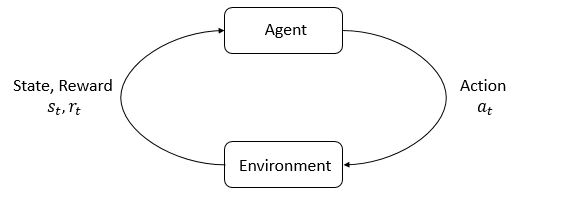

## 摘要

OpenAI 的基础教程定义状态、观测、动作、策略、轨迹、回报、价值函数和 MDP，并连接交互循环与期望回报优化。页面标有 2018 年版权和修订号 `038665d6`，此处记录 2026-09-30 获取的快照，不将其视为最新算法综述。

智能体与环境的交互循环。[查看原始来源](https://spinningup.openai.com/en/latest/_images/rl_diagram_transparent_bg.png)

## 核心主张

- 状态是完整描述，观测可以只包含部分信息；策略在实际系统中可能只能读取观测。
- 策略可以是确定性的或随机的，离散与连续动作空间对应不同的参数化方式。
- RL 优化策略产生的轨迹分布上的期望回报。单步奖励、整段回报和状态价值是不同对象。
- Bellman 方程将价值拆成当前奖励与折扣后的后续价值；优势函数表示某动作相对策略平均行为的收益。
- 马尔可夫性质要求在给定当前状态与动作后，下一状态的分布不依赖更早历史。有限时域价值需要明确剩余时间。

## 关键引文

> “maximize expected return”

目标是期望回报最大化，不能直接与机器人终态成功率等同。

## 关联

变量、方程与抓取例子见 [[MarkovDecisionProcesses|Markov Decision Process (MDP)]]；与示范学习的比较见 [[RobotLearningObjectives|机器人学习目标]]；算法用途分类见 [[spinning-up-rl-algorithm-taxonomy|Spinning Up 第二部分]]。

## 开放问题

该页不覆盖部分可观测控制的完整推导、约束 RL 或奖励设计理论；这些主题需要单独收录。

## 研究归属

[[topics/world-models-and-representations|World Models]] · [[topics/planning-and-control|规划与控制]] · [[topics/evaluation-and-transfer|评测与 Sim-to-Real]] · [[topics/robot-policy-learning|机器人策略学习]] · [[topics/world-model-decision|World Models 与决策]] · [[topics/policy-evaluation|策略评测]]。
