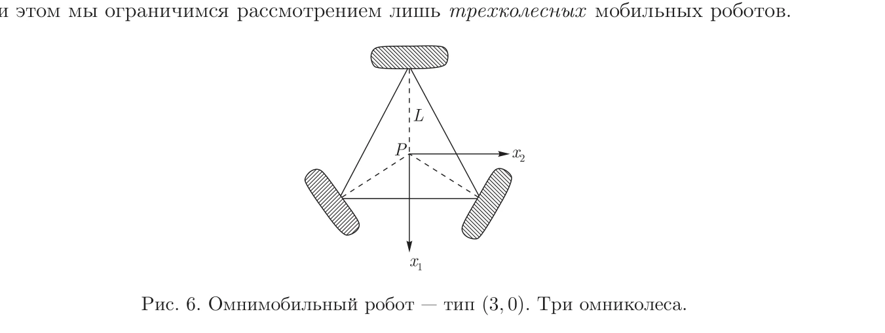
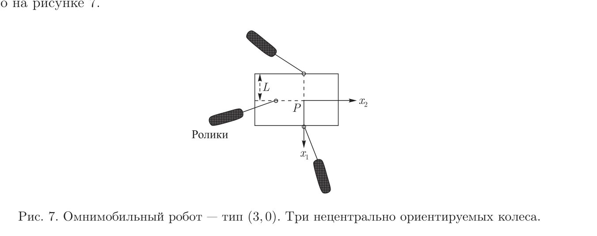
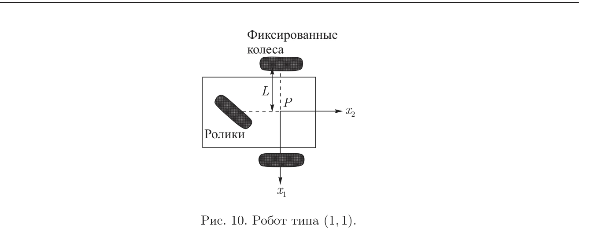
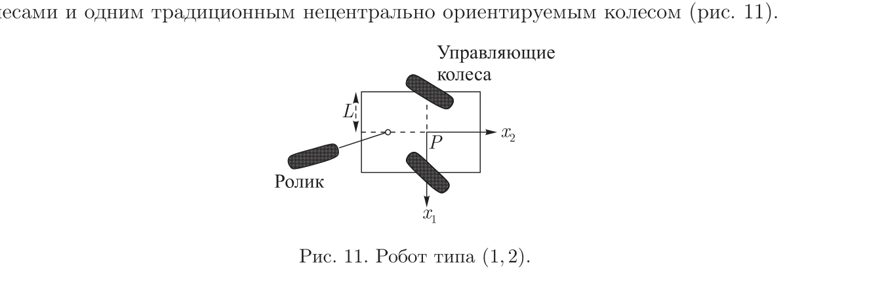

## 一屏概览

**问题。** 差速、汽车式和全向底盘的外观不同，但真正决定可运动方向、转向能力和控制模型的是车轮施加的速度约束。如何从任意车轮组合得到统一的分类与模型？

**贡献。** Guy Campion、Georges Bastin、Brigitte D’Andrea-Novel 用机动度 $\delta_m$ 和可转向度 $\delta_s$ 将满足非退化条件的轮式移动机器人分成五类；进一步区分底盘位姿与完整配置、运动学与动力学，分析可控性、稳定化和电机配置。

**版本与结论范围。** 原论文发表于 **1996 年** *IEEE Transactions on Robotics and Automation* 12(1):47–62。本库完整阅读的是 [2011 年俄文译本](https://nd.ics.org.ru/nd1104002/)，*Нелинейная динамика* 7(4):733–769；原始出版信息由译本首页与末页明确给出。本文是约束与控制理论分析，**没有机器人性能基准或实验消融**。下文页码和式号均指 2011 译本，不冒充已核读 1996 英文原版。

## 假设与车轮约束

论文假定刚性底盘、不可变形车轮、固定水平地面、垂直车轮平面和单点接触；传统轮纯滚动且无侧滑。记底盘位姿 $\xi=(x,y,\theta)^\top$，其中 $x,y$ 是选定底盘点的世界坐标，$\theta$ 是朝向。矩阵 $R(\theta)$ 把世界位姿速度转到底盘坐标，因此 $v_b=R(\theta)\dot\xi$ 是底盘局部速度。（§II.A–B，页 734–737，式 1–9）

| 车轮 | 约束的关键区别 | 对底盘瞬时自由度的影响 |
| --- | --- | --- |
| 固定传统轮 | 轮平面固定，禁止横向滑动 | 提供只含底盘速度的约束 |
| 中心式可转向传统轮 | 转向轴经过轮心，轮平面可变 | 当前角度仍约束底盘速度，转向改变允许运动方向 |
| 偏置脚轮 | 转向轴与轮心有非零偏置 $d$ | 横向约束还含 $d\dot\beta$，可通过脚轮转动满足 |
| 全向轮 | 只限制一个固定方向的接触速度 | 在论文非退化滚子角假设下，滚动变量可适应底盘运动 |

例如传统固定轮的侧向约束是

$$
[\cos(\alpha+\beta),\ \sin(\alpha+\beta),\ l\sin\beta]v_b=0.
$$

$l,\alpha$ 描述轮心相对底盘参考点的极坐标，$\beta$ 描述轮平面的方向。中心式转向轮使用同一个式子，但 $\beta$ 随时间变化；偏置脚轮的第三项变成 $d+l\sin\beta$，并加上 $d\dot\beta$。**会转向的脚轮与中心式可转向轮不能只因名字相近就计入同一类。**（式 4、6、8）

## 从矩阵秩得到五类底盘

把固定轮与中心式转向轮的侧向约束叠起来：

$$
C_1^*(\beta_c)v_b=0,\qquad
C_1^*(\beta_c)=\begin{bmatrix}C_{1f}\\C_{1c}(\beta_c)\end{bmatrix}.
$$

$\beta_c$ 为中心式转向轮角度，$C_{1f}$ 为固定轮约束，$C_{1c}$ 为转向轮约束。允许底盘速度位于这个矩阵的零空间，于是

$$
\delta_m=3-\operatorname{rank}C_1^*(\beta_c),\qquad
\delta_s=\operatorname{rank}C_{1c}(\beta_c),\qquad
\delta_M=\delta_m+\delta_s.
$$

$\delta_m$ 表示固定当前转向角时能立即采用的独立速度方向；$\delta_s$ 表示保持轮系兼容时可独立调节的中心转向角数；$\delta_M$ 是操纵度。$\delta_s$ 不是所有转向电机的数量：多余轮子的角度必须协调，才能维持共同的瞬时转动中心。（§II.C，页 739–742；§IV.B，页 750–751）

五类结论依赖假设 2：$\operatorname{rank}C_{1f}\le1$，且固定轮与中心转向轮的约束秩可加，总秩不超过 2。多个固定轮必须共轴；总秩为 3 的锁死配置，以及只绕固定中心转圈的退化设计不在五类中。

| $(\delta_m,\delta_s)$ | 典型结构与含义 | 译本示例 |
| --- | --- | --- |
| $(3,0)$ | 三方向速度即时可选；由全向轮或适当驱动的偏置脚轮组成 | 图 6–7 |
| $(2,0)$ | 固定轮共轴，无独立中心转向；可控制纵向运动与转动 | 两固定轮加脚轮，图 8 |
| $(2,1)$ | 无固定轮，一个独立中心转向方向；当前仍有两个速度自由度 | 一中心转向轮加两脚轮，图 9 |
| $(1,1)$ | 固定轮轴加中心转向轮；当前沿一维速度方向运动 | 三轮车／汽车式，图 10 |
| $(1,2)$ | 两个独立中心转向角决定当前一维运动方向 | 两中心转向轮加脚轮，图 11 |

原文图 6；PDF 第 11 页。[查看原始来源](https://nd.ics.org.ru/nd1104002/#page=11)

原文图 7；PDF 第 12 页。[查看原始来源](https://nd.ics.org.ru/nd1104002/#page=12)

原文图 8；PDF 第 13 页。[查看原始来源](https://nd.ics.org.ru/nd1104002/#page=13)

原文图 9；PDF 第 14 页。[查看原始来源](https://nd.ics.org.ru/nd1104002/#page=14)

原文图 10；PDF 第 15 页。[查看原始来源](https://nd.ics.org.ru/nd1104002/#page=15)

原文图 11；PDF 第 15 页。[查看原始来源](https://nd.ics.org.ru/nd1104002/#page=15)

这不是全世界所有轮式机构的穷尽分类，而是上述理想接触与非退化假设下的结构分类。$\delta_M=3$ 的 $(1,2)$ 也不能瞬间实现任意底盘速度：先调整轮角需要时间。（§II.C–IV.B）

## 四种模型回答四类问题

### 位姿运动学：哪些路径能走到

令 $\Sigma(\beta_c)$ 的列构成 $C_1^*$ 零空间基，$\eta\in\mathbb R^{\delta_m}$ 为允许速度的系数，$\zeta\in\mathbb R^{\delta_s}$ 为独立转向角速度，则

$$
\dot\xi=R(\theta)^\top\Sigma(\beta_c)\eta,\qquad
\dot\beta_c=\zeta.
$$

将独立状态写成 $z=(\xi,\beta_c)$、速度输入写成 $u=(\eta,\zeta)$，可简写为 $\dot z=B(z)u$。五类机器人通过选择底盘坐标系可以得到统一结构，状态维数为 $3+\delta_s$，即时输入维数为 $\delta_m+\delta_s$。（§IV.A，式 23–27，表 1）

对有限机动性底盘，输入方向少于状态维数，但依次执行不同运动产生的 Lie 括号方向可补齐可达方向。论文由此证明理想位姿模型可控、不可进一步约简；这并不意味着平衡点线性化可控。静止点线性化的可控秩只有 $\delta_m+\delta_s$。（§IV.C–D，性质 1–3）

**控制上的后果。** $(3,0)$ 可以用常规平滑静态反馈线性化；其余四类不能靠连续、静态、时不变状态反馈渐近稳定到一个孤立静止位姿。论文讨论时变反馈，以及非零速度条件下的动态反馈线性化。这里的“不可能”针对特定反馈类别，不是说非完整机器人不能停车或规划。（性质 4–5，页 754–755）

### 配置运动学：车轮内部怎样一起运动

完整配置 $q=(\xi,\beta_c,\beta_{oc},\varphi)$ 还包含脚轮转向角 $\beta_{oc}$ 和各轮自转角 $\varphi$。滚动与脚轮约束给出

$$
\dot\beta_{oc}=D(\beta_{oc})\Sigma(\beta_c)\eta,\qquad
\dot\varphi=E(\beta_c,\beta_{oc})\Sigma(\beta_c)\eta,
$$

其中 $D=-C_{2oc}^{-1}C_{1oc}$、$E=-J_2^{-1}J_1$ 来自侧向与滚动约束矩阵。合并得到 $\dot q=S(q)u$。它依赖具体车轮几何，并可能存在含轮角的守恒关系，使完整配置不是任意可达。**底盘位姿可控不等于轮子每个累计转角可独立指定。**（§V，式 29–38，页 755–758）

三全向轮实例的底盘有三个即时自由度，但包含轮子自转后的完整配置仍有非完整约束。因此“全向”与“完整配置完全没有非完整性”也不能等同。（§V，性质 6 与示例 1）

### 动力学：电机是否真能提供这些速度

论文从受约束的拉格朗日方程投影掉约束力，得到

$$
\dot q=S(q)u,\qquad H(\beta)\dot u+f(\beta,u)=F(\beta)\tau_0.
$$

$\beta$ 汇集转向角，$H$ 是约化惯性矩阵，$f$ 是速度相关项，$F$ 是电机力矩映射，$\tau_0$ 是实际安装电机的力矩。运动学中自由指定 $u$ 的前提，是电机配置在考虑的配置域内让 $F$ 保持满行秩。（§VI，式 39–53，假设 3）

**我们的代数整理。** 若 $F F^\dagger=I$，令 $\tau_0=F^\dagger(Hv+f)$，可得到 $\dot u=v$；$v$ 为期望广义加速度。再保留位姿状态得到 $\dot z=B(z)u,\ \dot u=v$。这是从式 53 推导的写法：译本第 766 页式 56 实际印为 $F^\dagger(Hu-f)$，并称其为左逆，与前后方程及维数不一致，**不应原样抄入控制实现**。本次已查看原 PDF 页面，但尚未对照 1996 原版确定错误来源。

该反馈仍需要完整配置参与力矩计算，忽略轮角只是在约化后的位姿方程层面成立，不代表真实控制器不再需要它们。（页 765–767，性质 7–8）

### 约束力为什么能从约化动力学中消失

**对 §VI.A 式 39–50 的统一记号重构。** 设完整配置的速度约束为 $A(q)\dot q=0$，$S(q)$ 的列张成允许速度空间，因此 $A S=0$。把受约束动力学写成

$$
M(q)\ddot q+c(q,\dot q)=B_\tau(q)\tau_0+A(q)^\top\lambda,
$$

其中 $M$ 是质量矩阵，$c$ 汇集速度相关项，$B_\tau$ 把已安装电机的力矩映射到配置坐标，$\lambda$ 是理想接触约束反力。由 $\dot q=S u$ 得 $\ddot q=S\dot u+\dot S u$。左乘 $S^\top$ 后，$S^\top A^\top=(AS)^\top=0$，于是

$$
\underbrace{S^\top M S}_{H}\dot u+
\underbrace{S^\top(M\dot S u+c)}_{f}
=\underbrace{S^\top B_\tau}_{F}\tau_0.
$$

这说明原文投影消元为何成立：理想约束反力在允许运动方向上不做功。轮子的惯量并没有被“忽略”，而是通过 $S^\top M S$ 进入约化惯性。推导仍以理想接触为前提；消掉乘子不等于已经检查真实摩擦锥能提供所需反力。

**由此得到的电机检查。** $F$ 的列表示各电机能够产生的约化广义力方向。电机数量充足但列相关时，仍不能独立实现每个加速度输入；不同轮角还可能改变这个秩。论文的电机配置实例因而检查整个考虑配置域，而非只在一个直行姿态数电机。共享几何例子放在 [[WheeledMobileRobotClassification#为什么数轮子不如算独立约束|约束秩计算]]，这里保留论文新增的动力学条件。

## 论证依据与边界

| 主张 | 依据 | 不能扩展成什么 |
| --- | --- | --- |
| 五类非退化底盘 | §II 的秩条件、§III 六个构型实例 | 允许滑移、轮胎变形、履带或任意奇异轮角时仍只有五类 |
| 位姿可控、静态稳定化受限 | §IV 的分布秩与性质 1–5 | 有障碍、单向驱动、转向限位或有限力矩下任意位姿都能到达 |
| 位姿全向仍可有配置非完整性 | §V 的完整配置分析 | 仅用底盘自由度判断每个轮角的可达性 |
| 电机数与安装位置重要 | §VI 的满秩准则和实例 | 最少电机数总等于 $\delta_M$ |

例如三个偏置脚轮组成的 $(3,0)$ 实例，为在全部考虑轮角下保持驱动映射满秩需要至少四台电机，而三全向轮实例为三台；$(1,2)$ 示例需要四台。它们是所分析几何与全配置满秩要求下的结果，不是只由类别标签决定的普遍硬件采购表。（§VI.B，页 761–765）

## 我们的评价与关联

这篇论文适合用作“从车轮接触假设到控制能力”的数学骨架。用于现代底盘时，应先写出实际接触约束、检验秩与驱动映射，再命名类别；滑移转向和履带不能只按外形硬套。奇异配置、饱和、接触力和摩擦是否允许所需运动，需要额外模型与验证。

共享机制见 [[WheeledMobileRobotClassification|轮式移动机器人分类]]、[[WheeledRobotKinematics|轮式机器人运动学]]、[[SteerableWheels|可转向轮]]、[[OmnidirectionalWheels|全向轮]] 与 [[NonholonomicMobileRobots|非完整约束移动机器人]]。这些页应保留跨构型机制，不重复本论文整套示例。

## 研究归属

[[topics/planning-and-control|规划与控制]] · [[topics/wheeled-robot-modeling|轮式机器人如何建模与分类]]。
