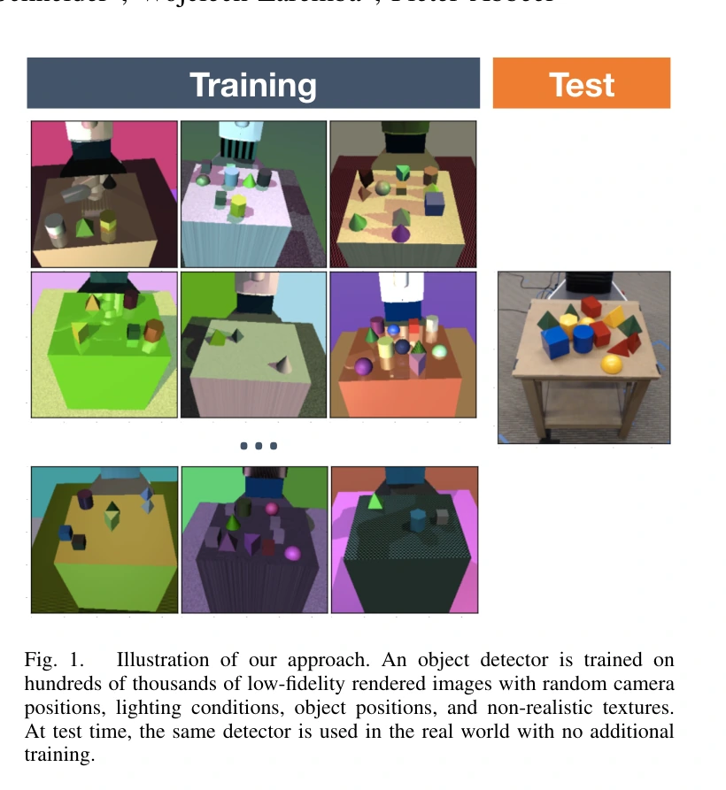
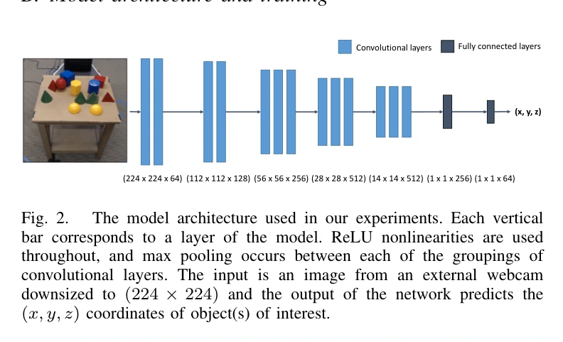
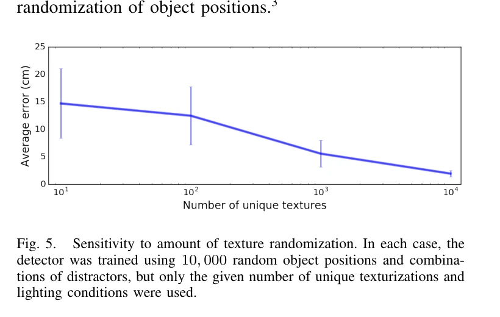
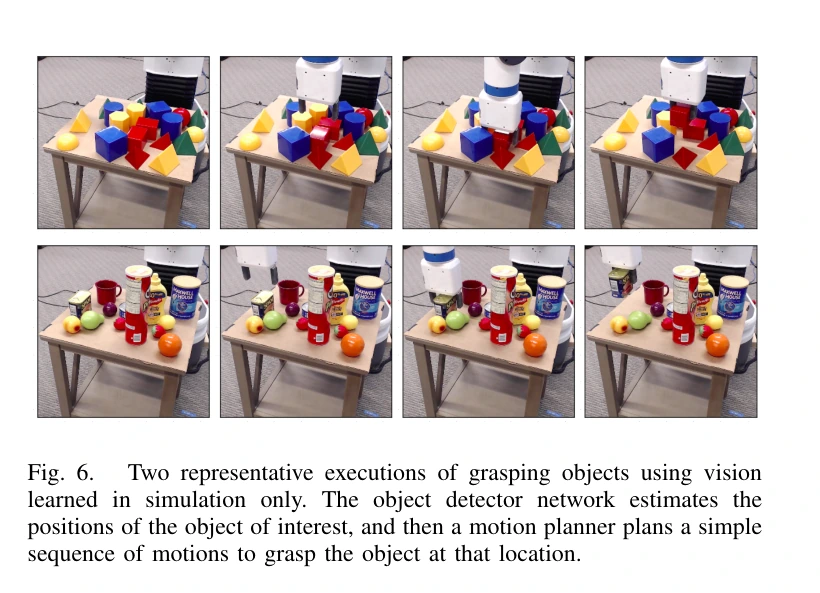
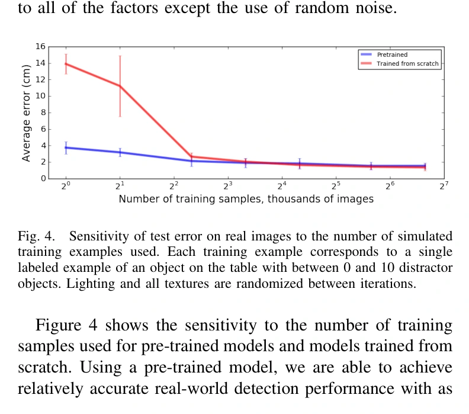

## 一屏概览

**研究问题：** 不追求照片级渲染，能否只用仿真标注训练物体定位网络，再让真实机器人据此抓取？Tobin 等把纹理、光照、相机和干扰物作为训练时的变化因素，检验真实图像能否落入网络已经学会处理的变化范围。

原文图 1；PDF 第 1 页。[查看原始来源](https://arxiv.org/pdf/1703.06907v1#page=1)

**主要贡献：** 将视觉域随机化用于需要厘米级定位的桌面抓取，并分别消融训练样本、纹理数量、干扰物、相机、噪声和预训练。网络预测位置，现成运动规划器执行抓取，论文没有训练端到端操作策略。

**结论范围：** 八种已知几何对象、480 张真实测试图像上，作者报告平均定位误差约 1.5 cm；从定位最稳定的两个对象中进行抓取，成功 38/40。多数实验使用 ImageNet 初始化，也有从头训练成功的结果，不能把所有实验概括为“完全没用真实图像预训练”。依据为 [原论文](https://arxiv.org/abs/1703.06907v1) 第 III–IV 节、表 I–II 与图 4–6；本页复核完整归档 v1。

## 方法：把外观变化与位置标签分开

训练输入是 $224\times224$ 单目 RGB 图像，标签是目标物体在世界坐标系中的位置 $(x,y,z)$。渲染时目标与干扰物的位置、纹理、光照和相机一起变化，位置标签由仿真直接取得。网络沿用 VGG-16 卷积层，把全连接层缩为 256 和 64 个单元，最后回归位置，使用位置误差的 $L_2$ 损失与 Adam 训练。这里的“检测”是已知目标的坐标回归，不是开放类别检测或完整六维位姿估计。（第 III 节、图 2）

原文图 2；PDF 第 4 页。[查看原始来源](https://arxiv.org/pdf/1703.06907v1#page=4)

用本页的统一记号重述其监督学习目标：设 $q$ 是物体和场景配置，$\xi$ 是随机渲染参数，$\mathcal R(q,\xi)$ 是渲染图像，$y(q)$ 是真实位置，$d_\theta$ 是定位网络，则

$$
\min_\theta\;\mathbb E_{q,\xi}\left[\left\|d_\theta\bigl(\mathcal R(q,\xi)\bigr)-y(q)\right\|_2^2\right].
$$

这只是第 III 节训练过程的数学重述。直觉是让颜色、纹理等线索与位置标签不再稳定绑定，使网络更多利用对象形状及空间布局；作者提出“足够变化可支持真实迁移”的假设，没有给出任意目标分布下的泛化保证。

| 随机化因素 | 原文设置与作用 |
|---|---|
| 外观 | 对象、桌面、地面、背景和机器人随机使用纯色、双色渐变或棋盘纹理；目标颜色并不固定 |
| 干扰物 | 每场景放入 0–10 个干扰物，让定位器学习忽略非目标对象 |
| 相机 | 围绕粗略匹配真实视角的初始位置，在 $10\times5\times10$ cm 范围采样；方向扰动不超过 0.1 rad，视场缩放不超过 5% |
| 光照与噪声 | 改变光源数量、位置、方向及镜面反射属性，并向图像加入随机噪声 |

相机没有精确标定，并不意味着没有几何先验：初始视角仍手工近似匹配真实相机，桌面高度固定，目标形状和尺寸已知。作者明确说固定桌面高度使问题实质上接近二维位置估计。（第 III-A 节）

### 训练时改变图像，部署时只做定位

可以把一个训练样本拆成“先决定桌面上的几何布局，再抽取外观与相机，再渲染并读取坐标标签”。仅改变纹理或灯光时，目标位置标签不变；改变目标位置时，标签也必须随之更新。下面的例子是教学构造：同一个物体位置分别渲染成红色、棋盘和渐变表面，网络若只用“红色区域中心”定位，就无法同时降低三张图的误差；学习目标迫使它利用在这些变化下仍有用的形状和布局线索。

真实执行阶段不再随机渲染或搜索一个匹配场景：真实图像经过定位网络产生世界坐标，规划器用已知对象信息执行抓取。能够从单目图像输出世界位置，依赖这里的固定桌高、已知形状尺寸及近似相机视角；不是一般单目图像凭空恢复绝对尺度。（流程依据第 III 节与 IV-D 节；随机化的一般目标见 [[DomainRandomization|域随机化]]。）

## 实验与消融：哪些变化真正起作用

真实测试集包含八种几何对象，每种 60 张图像，分别是单独放置、有干扰物、被部分遮挡，各 20 张。相机在测试集内位置固定，距离物体约 70–105 cm，真实标签用桌面网格测量。（第 IV-A–B 节）

| 证据 | 结果 | 能支持的判断 |
|---|---|---|
| 定位测试，表 I | 总体约 1.5 cm；仿真误差约 0.3–0.5 cm | 支持该对象集合的真实定位，仿真和真实误差仍有明显差距 |
| 完整方法，表 II | 单独／干扰／遮挡误差为 $1.3\pm0.6$／$1.8\pm1.7$／$2.4\pm3.0$ cm | 三类测试难度不同，不宜只保留一个平均数 |
| 去掉训练干扰物，表 II | 对应误差 $1.5\pm0.6$／$7.2\pm4.5$／$7.4\pm5.3$ cm | 干扰物变化对杂乱和遮挡条件尤其重要 |
| 去掉相机随机化，表 II | $2.0\pm2.1$／$2.4\pm2.3$／$2.9\pm3.5$ cm | 相机变化有帮助，但该设置下仍能得到可用定位 |
| 去掉图像噪声，表 II | $1.4\pm0.7$／$1.9\pm2.0$／$2.4\pm2.8$ cm | 最终精度影响很小；作者观察到噪声可改善训练收敛 |
| 样本量与初始化，图 4 | 预训练在小数据量时更有利；数据充足时从头训练接近预训练 | “不必预训练”成立于部分充分训练的实验，不代表预训练毫无作用 |
| 纹理数量，图 5 | 固定 10,000 个训练样本时，少于 1,000 种纹理明显退化 | 场景位置变化不能替代足够的外观变化 |
| Fetch 抓取，第 IV-D 节、图 6 | 两个定位最稳定对象共 38/40；Spam 罐配未见食品干扰物 9/10 | 支持定位加预设抓取规划的可行性；未见的是干扰物，不是任意目标类别 |

原文图 5；PDF 第 5 页。[查看原始来源](https://arxiv.org/pdf/1703.06907v1#page=5)

原文图 6；PDF 第 6 页。[查看原始来源](https://arxiv.org/pdf/1703.06907v1#page=6)

表 II 的各模型使用 20,000 个训练样本；不能把它与表 I 各对象的最佳模型或图 4 的样本量曲线当作同一实验条件。

原文图 4；PDF 第 5 页。[查看原始来源](https://arxiv.org/pdf/1703.06907v1#page=5)

## 局限与我们的解释

**作者明确的边界：** 更高精度、复杂接触操作、多视角和深度输入仍是后续方向。实验需要对象的几何模型，没有验证未知形状目标，也没有解决动力学误差。（第 II-A、V 节）

**我们的解释：** 本文说明应按任务所需的不变性选择随机化因素。去掉干扰物的消融远比去掉像素噪声更差，因而“随机得更多”不等于“随机得更有效”。这个解释只针对本文的定位任务；不能据此推断接触丰富的控制任务也应采用相同优先级。

## 关联与归档

机制见 [[DomainRandomization|域随机化]]、[[VisualSimToReal|视觉仿真到现实迁移]]；与 [[peng-dynamics-randomization|动力学随机化]] 对照，可区分图像变化和状态转移变化。两者都只覆盖 [[SimulationRealityGap|仿真—现实差距]] 的一部分。

原始证据、版本和获取日期见页首。归档 SHA-256 为 `3fc98c5f4cea050686d45858e647e1b704492121fdae80f8fcd5d560c107f11f`，登记在 `graph/acquisitions.jsonl`。本次用原 PDF 的布局保留提取全文复核，避免旧缓存的双栏错序；未把其他版本或项目网页内容并入本页。

## 研究归属

[[topics/evaluation-and-transfer|评测与现实迁移]] · [[topics/simulation-transfer|仿真策略怎样可靠迁移到现实]]。
