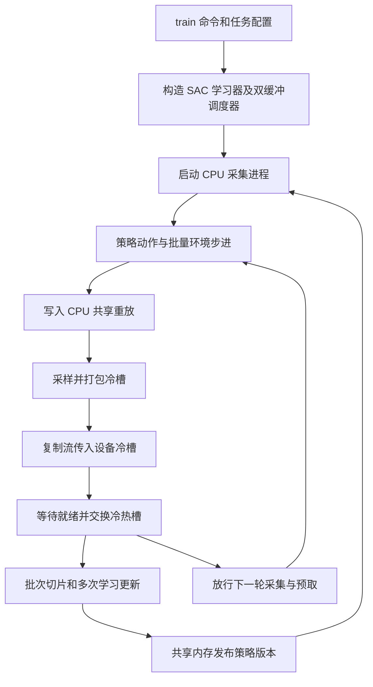

## 用途与本次核查范围

UniLab 把机器人任务、CPU 物理后端和强化学习调度组合起来。本页沿一条 **SAC 离策略训练**路径解释从命令到环境转移、重放采样和参数回传的全过程。依据既有 README 与固定提交 `2a9e8ae635811a7385bb8ac111acb25f8c819a6c` 的官方源码；不是当前主分支的无版本说明，也不是已经复现实验。

[[unilab-a-heterogeneous-architecture-for-robot-rl-beyond-gpu-dominant-paradigms|UniLab 论文]]提供性能与跨后端实验，本页验证代码如何实现其中一条数据路径。PPO、APPO、MLX PPO、TD3、FlashSAC 的入口可从 CLI 看到，但本次没有逐一审计它们的学习器。

## 从训练命令到一次更新

以下是依据源码重绘的教学流程；“下一轮采集”可以与“本轮更新”重叠，并非任意时刻完全无同步。

### 1. 配置先确定实际执行路径

`cli.py:build_route` 将 `train --algo sac --task g1_walk_flat --sim mujoco` 映射到 `scripts/train_offpolicy.py`，生成 `algo=sac` 与 `task=sac/g1_walk_flat/mujoco`。CLI 检查对应配置文件存在，再启动脚本；因此支持列表中的算法和后端不能任意交叉组合，最终还要有该任务的配置。`main` 读取 Hydra 配置、设置种子与记录器，调用 `build_runner` 和 `runner.learn`，并在 `finally` 中关闭调度器。

`build_runner` 的这条路径显式要求 `replay_prefetch_mode=one_tick`、单个学习 GPU 和同步分块采集。后者约束采集器每块产生多少环境步，并不排除数据预取和学习计算重叠。构造时用一个临时环境读取观测、评论器输入和动作维数；若启用对称增强，还检查任务提供的增强器及批量大小整除关系。（`train_offpolicy.py:124–261、603–667`）

### 2. 一次动作怎样成为可靠的转移

采集器建立 CPU 策略副本，先读取共享权重；每轮检查版本号，更新后再用观测推理。`NpEnv.step` 依次执行任务的 `apply_action`、后端的若干物理子步、任务的 `update_state`，然后计算时间截断并只重置结束的环境。任务子类负责动作解释、奖励和观测；这部分不属于物理后端的统一求解器。

**自动重置时有两种“下一观测”。** 返回给策略的是新回合初始观测；用于存储上一回合末次转移的，应是重置前保存的 `final_observation`。采集器将终止掩码和末次观测传给 `ReplayBuffer.add`，后者覆盖相应行的下一观测。缓冲同时保存 `done = terminated | truncated` 与 `truncated`；不能在下游将超时与真正终止不加区别地用于自举。这里确认了数据保存契约，未逐算法核对所有损失中的掩码计算。（`np_env.py:step/_reset_done_envs`；`worker.py:450–529`；`replay_buffer.py:add`）

### 3. 重放容量与传输批次分开

`ReplayBuffer` 将一条转移打包为一行共享 CPU 张量。观测宽度为 $d_o$、动作宽度为 $d_a$、可选评论器额外观测宽度为 $d_c$ 时，行宽为

$$
d=2d_o+d_a+3+2d_c.
$$

额外三个数是奖励、结束标志和截断标志。容量 $C=\texttt{replay\_buffer\_n}\times N$，$N$ 为环境数；写指针单调累加，存储位置按容量取余。每轮采样量则是 $B=\texttt{batch\_size}\times\texttt{updates\_per\_step}$，在设备端切成若干学习批次。**从实现推得的存储量：** 单精度主重放约占 $4Cd$ 字节，两份主机传输槽和两份设备槽各约占 $8Bd$ 字节，不含网络、优化器和其他状态。因此减少设备重放常驻容量不等于让 CPU 内存成本消失。（`replay_buffer.py:43–67`；`double_buffer_runner.py:96–136、451–494`）

### 4. 双缓冲靠就绪事件和采集水位维持次序

学习器先取本轮热槽，再请求下一轮冷槽；请求包含轮次、采样种子和最低写入指针。采集器只有在指针达到水位后才处理请求，在实际服务时记录缓冲大小与指针、均匀抽取索引，用 `index_select` 直接打包到共享槽。因而请求携带的早期指针不是把整个缓冲永久冻结的快照；返回元数据记录实际采样时点。（`worker.py:114–199`；`double_buffer_runner.py:410–429`）

CUDA 路径把这两个共享槽注册为锁页内存，在独立复制流发起传输，再记录各槽的就绪事件。学习计算流等待对应事件后才能交换并使用冷槽。代码有不覆盖当前热槽、轮次一致、批量尺寸一致等检查；`after_tick` 表示本轮逻辑消费结束。`SharedWeightSync` 再把策略参数复制到带锁的共享 CPU 数组并递增版本，采集器按版本取回。（`cpu_pinned_double_buffer.py`；`transfer/cuda_like.py`；`weight_sync.py`）

CUDA、ROCm、XPU、MPS／CPU 由不同传输实现分派。已读 CUDA 类同时识别 ROCm，且原生传输扩展不可用时退回 PyTorch 复制流；本次未深入 XPU 和 MPS 的传输实现，不能把 CUDA 的锁页与事件细节外推到全部设备。

## 这次核查支持什么

代码确认了 CPU 主重放、两个批次槽、提前一轮预取、CPU 策略副本以及分块同步的具体实现。它也显示“异步”需要明确粒度：采集进程独立运行，但数据水位、采集令牌和就绪事件仍建立依赖。共享机制见 [[HeterogeneousRobotRLTraining|异构机器人强化学习训练]]。

未安装或运行第三方项目，未实测吞吐、验证 GPU 调度或复现论文回报；SAC 损失、全部任务配置、原生物理后端及硬件分支不属于本轮审计范围。MuJoCoUni 接口与实验见 [[mujocouni-persistent-batched-runtime-primitives-for-mujoco|论文页]]；Motrix 的文档可见范围见 [[motrixsim-documentation|官方文档解析]]。

## 固定版本证据

下表列出新增归档与实际阅读范围；较大文件只将标明的实现段落用于本页判断。原 README、提交元数据和提取缓存继续保留。

| 固定提交中的文件 | 本轮静态阅读范围 | 本地不可变快照 |
| --- | --- | --- |
| [`src/unilab/cli.py`](https://github.com/unilabsim/UniLab/blob/2a9e8ae635811a7385bb8ac111acb25f8c819a6c/src/unilab/cli.py) | 全文 1–313 | `raw/uni-src-unilab-cli-2026-10-04-4ecb9bbab99e.py` |
| [`src/unilab/training/run.py`](https://github.com/unilabsim/UniLab/blob/2a9e8ae635811a7385bb8ac111acb25f8c819a6c/src/unilab/training/run.py) | 全文 1–210 | `raw/uni-src-unilab-training-run-2026-10-04-e8b1a37b2001.py` |
| [`src/unilab/algos/torch/offpolicy/runtime.py`](https://github.com/unilabsim/UniLab/blob/2a9e8ae635811a7385bb8ac111acb25f8c819a6c/src/unilab/algos/torch/offpolicy/runtime.py) | 全文 1–69 | `raw/uni-src-unilab-algos-torch-offpolicy-runtime-2026-10-04-8b2465361922.py` |
| [`src/unilab/ipc/replay_pipelines/base.py`](https://github.com/unilabsim/UniLab/blob/2a9e8ae635811a7385bb8ac111acb25f8c819a6c/src/unilab/ipc/replay_pipelines/base.py) | 全文 1–35 | `raw/uni-src-unilab-ipc-replay-pipelines-base-2026-10-04-c29a1a0abab9.py` |
| [`src/unilab/ipc/replay_pipelines/cpu_pinned_double_buffer.py`](https://github.com/unilabsim/UniLab/blob/2a9e8ae635811a7385bb8ac111acb25f8c819a6c/src/unilab/ipc/replay_pipelines/cpu_pinned_double_buffer.py) | 全文 1–506 | `raw/uni-src-unilab-ipc-replay-pipelines-cpu-pinned-double-buffer-2026-10-04-fa25d7fa0db0.py` |
| [`src/unilab/ipc/weight_sync.py`](https://github.com/unilabsim/UniLab/blob/2a9e8ae635811a7385bb8ac111acb25f8c819a6c/src/unilab/ipc/weight_sync.py) | 全文 1–154 | `raw/uni-src-unilab-ipc-weight-sync-2026-10-04-c30e0e96acd3.py` |
| [`src/unilab/base/np_env.py`](https://github.com/unilabsim/UniLab/blob/2a9e8ae635811a7385bb8ac111acb25f8c819a6c/src/unilab/base/np_env.py) | 全文 1–460 | `raw/uni-src-unilab-base-np-env-2026-10-04-6e050aae710d.py` |
| [`scripts/train_offpolicy.py`](https://github.com/unilabsim/UniLab/blob/2a9e8ae635811a7385bb8ac111acb25f8c819a6c/scripts/train_offpolicy.py) | 124–261、603–667 | `raw/uni-scripts-train-offpolicy-2026-10-04-a2df9720cffc.py` |
| [`src/unilab/ipc/async_runner.py`](https://github.com/unilabsim/UniLab/blob/2a9e8ae635811a7385bb8ac111acb25f8c819a6c/src/unilab/ipc/async_runner.py) | 全文 1–171 | `raw/uni-src-unilab-ipc-async-runner-2026-10-04-d89176296af5.py` |
| [`src/unilab/ipc/replay_pipelines/transfer/cuda_like.py`](https://github.com/unilabsim/UniLab/blob/2a9e8ae635811a7385bb8ac111acb25f8c819a6c/src/unilab/ipc/replay_pipelines/transfer/cuda_like.py) | 全文 1–171 | `raw/uni-src-unilab-ipc-replay-pipelines-transfer-cuda-like-2026-10-04-5ee97f7b221c.py` |
| [`src/unilab/ipc/replay_pipelines/transfer/factory.py`](https://github.com/unilabsim/UniLab/blob/2a9e8ae635811a7385bb8ac111acb25f8c819a6c/src/unilab/ipc/replay_pipelines/transfer/factory.py) | 全文 1–23 | `raw/uni-src-unilab-ipc-replay-pipelines-transfer-factory-2026-10-04-091cbc85bfae.py` |
| [`src/unilab/algos/torch/offpolicy/double_buffer_runner.py`](https://github.com/unilabsim/UniLab/blob/2a9e8ae635811a7385bb8ac111acb25f8c819a6c/src/unilab/algos/torch/offpolicy/double_buffer_runner.py) | 1–216、253–548 | `raw/uni-src-unilab-algos-torch-offpolicy-double-buffer-runner-2026-10-04-8698233babf0.py` |
| [`src/unilab/algos/torch/offpolicy/worker.py`](https://github.com/unilabsim/UniLab/blob/2a9e8ae635811a7385bb8ac111acb25f8c819a6c/src/unilab/algos/torch/offpolicy/worker.py) | 114–199、302–406、450–611 | `raw/uni-src-unilab-algos-torch-offpolicy-worker-2026-10-04-166ecf2408aa.py` |
| [`src/unilab/ipc/replay_buffer.py`](https://github.com/unilabsim/UniLab/blob/2a9e8ae635811a7385bb8ac111acb25f8c819a6c/src/unilab/ipc/replay_buffer.py) | 全文 1–215 | `raw/uni-src-unilab-ipc-replay-buffer-2026-10-04-d370c5270b47.py` |

## 研究归属

[[topics/robot-policy-learning|机器人策略学习]] · [[topics/physics-simulation|物理仿真]] · [[topics/robot-learning-systems|训练系统怎样提高有效学习效率]]。
