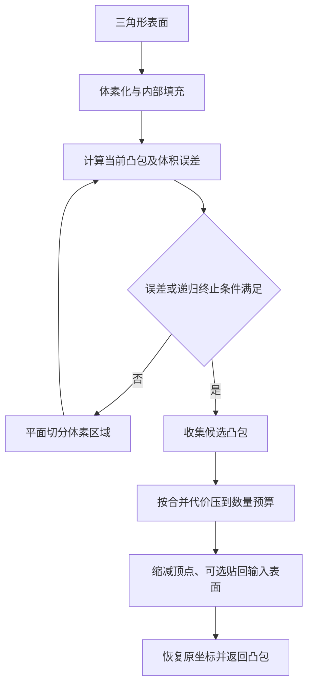

# V-HACD：体素分解与数量预算的实现

## 一屏概览

V-HACD 将输入三角网格体素化，递归切分体素区域，再将得到的凸包合并到用户指定的数量预算，并进行可选贴面与顶点缩减。它提供的是离线碰撞体生成能力，不能把分解时间称为仿真器的每步运行时间。

本页静态复核官方提交 `f900e42361491f525262d4825e758845e4969897`（2025-09-18），读取 4.x README、公开接口和关键实现路径。README 标明项目已弃用、归档并推荐 CoACD；这项维护建议不是各类网格上 CoACD 都优于 V-HACD 的基准结论。未构建、执行或复现性能。[固定版本 README](https://github.com/kmammou/v-hacd/blob/f900e42361491f525262d4825e758845e4969897/README.md)

## 从表面到凸包：体素为什么重要

下图按上述机制重画，用于说明信息流：

在一个体素区域内，代码将占据体素数乘单体素体积得到 $V_{\mathrm{vox}}$，再计算其凸包体积 $V_{\mathrm{hull}}$，定义局部误差：

$$
e=100\frac{|V_{\mathrm{hull}}-V_{\mathrm{vox}}|}{V_{\mathrm{vox}}}.
$$

这是相对体积百分比，分母对应离散体素区域，**不是原始三角网格的 Hausdorff 距离**。误差低于 `m_minimumVolumePercentErrorAllowed`、递归深度超出上限，或三个方向都小于最小体素边长时，该区域可停止细分。因此终止既可能来自满足误差，也可能来自计算预算。[凸包体积与终止，第 6148–6212 行](https://github.com/kmammou/v-hacd/blob/f900e42361491f525262d4825e758845e4969897/include/VHACD.h#L6148)

`FLOOD_FILL`、`SURFACE_ONLY`、`RAYCAST_FILL` 分别对应洪泛内部填充、只保留表层、基于射线的内部判断。默认洪泛方式依赖封闭性：孔洞可能让本应为内部的区域与外部连通。**我们的几何解释：** 体素化改变了算法实际看见的形状；如果薄壁、狭槽在这一步消失，增加后续凸包数量不能从已经离散化的输入中恢复它们。[填充模式说明，第 280–311 行](https://github.com/kmammou/v-hacd/blob/f900e42361491f525262d4825e758845e4969897/include/VHACD.h#L280)

递归分解结束后，若凸包过多，程序计算两两合并代价并放入优先队列，每次合并后更新涉及新凸包的代价，直到满足数量预算。最后才执行顶点缩减与 `shrinkWrap`。因此数量上限可能使几何误差重新增加，递归时的局部误差阈值不能当成最终输出的全局保证。[递归，第 7333 行起](https://github.com/kmammou/v-hacd/blob/f900e42361491f525262d4825e758845e4969897/include/VHACD.h#L7333)、[合并与后处理，第 7460–7720 行](https://github.com/kmammou/v-hacd/blob/f900e42361491f525262d4825e758845e4969897/include/VHACD.h#L7460)

## C++ 调用与同步语义

公开接口 `Compute(points, countPoints, triangles, countTriangles, params)` 接收紧密排列的三维坐标与三角形索引。顶点可用 `float` 或 `double`，索引为无符号整数；输出通过 `GetNConvexHulls()` 和 `GetConvexHull(i, hull)` 取得。一个结果包含顶点、三角形、体积、中心和包围盒等信息。[接口，第 340–485 行](https://github.com/kmammou/v-hacd/blob/f900e42361491f525262d4825e758845e4969897/include/VHACD.h#L340)

`CreateVHACD()` 创建同步接口；`CreateVHACD_ASYNC()` 创建异步包装，`Compute` 启动后台任务后即可返回，需等 `IsReady()` 再使用最终结果。`IsReady()` 也负责转发排队的进度与日志；完成回调则可能由后台线程触发，调用方应遵守自己的线程约束。参数 `m_asyncACD` 还控制同步实现内部是否启用线程池，不能仅凭这个布尔字段判断整个 API 调用是否阻塞。[同步入口，第 7112 行起](https://github.com/kmammou/v-hacd/blob/f900e42361491f525262d4825e758845e4969897/include/VHACD.h#L7112)、[异步实现，第 8199–8310 行](https://github.com/kmammou/v-hacd/blob/f900e42361491f525262d4825e758845e4969897/include/VHACD.h#L8199)

官方 `TestVHACD.cpp` 展示了创建接口、调用、等待、读取各凸包和释放接口的完整使用顺序。`Clean()` 清除内部结果，`Release()` 释放接口实例；它们不是同一个生命周期操作。[调用与等待，第 380–410 行](https://github.com/kmammou/v-hacd/blob/f900e42361491f525262d4825e758845e4969897/app/TestVHACD.cpp#L380)、[结果读取，第 455 行起](https://github.com/kmammou/v-hacd/blob/f900e42361491f525262d4825e758845e4969897/app/TestVHACD.cpp#L455)

## 固定版本参数与文档差异

| 参数 | 代码默认值 | 含义 |
| --- | --- | --- |
| `m_maxConvexHulls` | `64` | 最终凸包数量预算；README 正文仍写 `32`，本页以所读接口为准 |
| `m_resolution` | `400000` | 体素化预算，不能解读为单轴 400000 个体素 |
| `m_minimumVolumePercentErrorAllowed` | `1` | 上式体积误差百分比阈值，不是距离阈值 |
| `m_maxRecursionDepth` | `10` | 递归细分预算 |
| `m_maxNumVerticesPerCH` | `64` | 输出凸包顶点预算 |
| `m_shrinkWrap` | `true` | 后处理尝试使凸包贴近输入表面 |
| `m_fillMode` | `FLOOD_FILL` | 体素内部填充方式 |
| `m_minEdgeLength` / `m_findBestPlane` | `2` / `false` | 体素尺度停止条件／实验性切面选项 |

默认值直接来自 [Parameters，第 380–398 行](https://github.com/kmammou/v-hacd/blob/f900e42361491f525262d4825e758845e4969897/include/VHACD.h#L380)。README 的高精度命令示例重复使用 `-r`；`TestVHACD.cpp` 实际以 `-r` 设置体素分辨率，以 `-h` 设置凸包数量，所以不能原样把第二个 `-r 128` 解释为 128 个凸包。[参数解析，第 198–227 行](https://github.com/kmammou/v-hacd/blob/f900e42361491f525262d4825e758845e4969897/app/TestVHACD.cpp#L198)

## 怎样与论文结果对照

**我们的阅读建议。** 比较实验至少记录版本、填充模式、体素预算、误差、递归与最终数量／顶点预算。先细分再合并的结构说明：只对齐最终凸包数，仍可能产生不同的孔槽、顶点数和预处理误差。共同概念见 [[ApproximateConvexDecomposition|Approximate Convex Decomposition]]；任务证据与具体基线设置分别见 [[coacd-approximate-convex-decomposition|CoACD]]、[[convex-primitive-decomposition-for-collision-detection|凸基元分解]]、[[visacd-visibility-based-gpu-accelerated-approximate-convex-decomposition|VisACD]]。

本页没有核查各仿真器打包的是 V-HACD 哪一版，也没有将 4.x 接口参数回填到旧论文基线。旧版 `m_concavity` 与本页百分比阈值的迁移，不能理解成名字替换就保持完全相同的算法和数值。

## 固定版本证据

完整阅读 README；头文件按公开接口、体积误差、分解与合并、同步和异步实现阅读；示例程序核查参数解析与调用生命周期。未声称全文审计长头文件中的所有几何子程序。原始文件与校验记录已归档。

| 官方固定提交文件 | 新归档原始证据 |
| --- | --- |
| [README.md](https://github.com/kmammou/v-hacd/blob/f900e42361491f525262d4825e758845e4969897/README.md) | `raw/vhacd-readme-md-2026-10-04-ee8953b3533b.md` |
| [include/VHACD.h](https://github.com/kmammou/v-hacd/blob/f900e42361491f525262d4825e758845e4969897/include/VHACD.h) | `raw/vhacd-include-vhacd-h-2026-10-04-c2b750a41bc6.h` |
| [app/TestVHACD.cpp](https://github.com/kmammou/v-hacd/blob/f900e42361491f525262d4825e758845e4969897/app/TestVHACD.cpp) | `raw/vhacd-app-testvhacd-cpp-2026-10-04-9deb35a89ece.cpp` |

## 研究归属

[[topics/physics-simulation|物理仿真]] · [[topics/collision-geometry|Collision Geometry]]。
