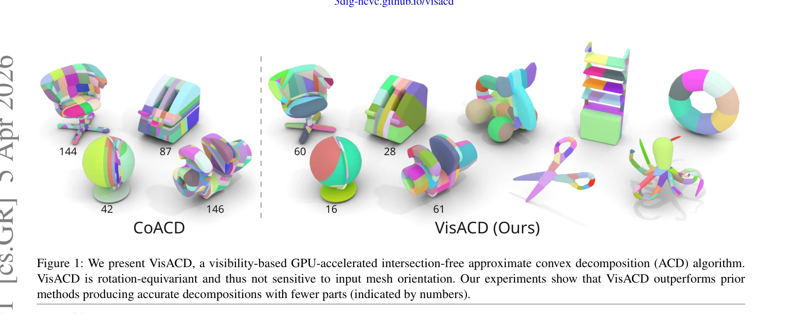
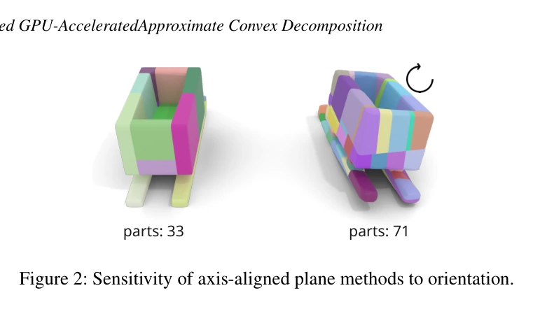
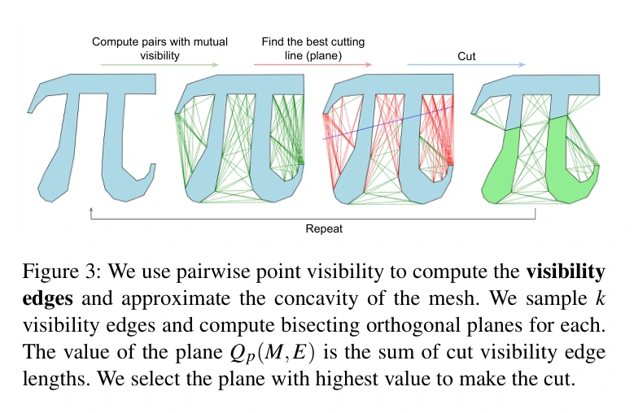

# VisACD：用可见性快速评价凸分解切面

## 一屏概览

**研究问题。** 近似凸分解每试一个平面都实际切网格、重新计算凹度很贵；只试少量轴对齐切面又容易受输入姿态影响。能否不实际切割就比较大量候选？

原文图 1；PDF 第 1 页。[查看原始来源](https://arxiv.org/pdf/2604.04244#page=1)

原文图 2；PDF 第 2 页。[查看原始来源](https://arxiv.org/pdf/2604.04244#page=2)

**核心贡献。** 用跨越外部凹陷的可见性线段衡量凹度，以被切面截断的线段总长度作为切割收益。在 GPU 上并行计算可见性与候选分数，从几何关系生成非轴对齐切面，再贪心切割。[原文第 3 节](https://arxiv.org/abs/2604.04244)

**证据范围。** 表 1 在三个数据集报告凹度／部件数，PartNet-Mobility 中平均耗时 16.97 秒，对比 CoACD 36.31 秒。对比关闭了 CoACD 合并，且论文未给出完整硬件与重复运行统计；不能推成任意配置、硬件下的加速比。没有机器人任务成功率或在线仿真吞吐量实验。

**版本与纠错。** 完整复核 4 页归档 PDF：arXiv:2604.04244v1，2026-04-05，Eurographics 2026 Short Paper。原来源链接误写为 `https://arxiv.org/abs/2604.04788`，按 PDF 首页更正。

## 方法：用线段代理切割后的变化

### 可见性凹度与评价凹度不是同一个量

对网格 $M$，连接两个顶点且位于物体外、不中途穿过网格的线段称为可见性边 $e_i$。凸物体没有这样的外部凹陷连线。算法用：

$$
C^\star(M)=\sum_i\|e_i\|_2,
\qquad C^\star(D)=\sum_{M\in D}C^\star(M),
$$

其中 $D$ 为部件集合，$\|e_i\|_2$ 是线段长度，**不是长度平方**。较长线段被视为较显著凹陷的廉价代理。它依赖顶点密度和网格拓扑，因此不能拿不同网格的 $C^\star$ 直接比较质量。正式实验改用 CoACD 的碰撞感知凹度 $C$。[第 3.1 节](https://arxiv.org/abs/2604.04244)

实现先在表面外偏移 $\varepsilon=0.03$ 构造包络网格 $M_c$。只有线段不穿原网格、同时与包络相交时才保留，借此滤掉太贴近表面的线段；相交测试使用 NVIDIA OptiX 的射线—网格查询。这个阈值是来源设置，正文没有充分交代所有输入尺度归一化细节，不应直接当成 3 厘米。[第 3.2 节]

### 切面价值为什么不需要先切网格

平面 $p$ 把 $M$ 分成 $M_1,M_2$，令 $I_p(e_i)$ 表示它是否切断可见性边。切后凹度可以写成原有边总长，减去被截断边总长，再加上新生可见性边的长度。论文认为顶点足够密时新增项较小，忽略它得到：

$$
C^\star(\{M_1,M_2\})\approx C^\star(M)-\sum_i I_p(e_i)\|e_i\|_2.
$$

于是只需最大化：

$$
Q_p(M,E)=\sum_i I_p(e_i)\|e_i\|_2.
$$

$E$ 是可见性边集合。关键收益是候选评价仅需线段—平面关系；不必为每个候选切割、封口和重建凸包。它是近似评分，而不是切割后凹度的精确恒等式。[第 3.3 节，式（1）–（3）、图 3](https://arxiv.org/abs/2604.04244)

原文图 3；PDF 第 3 页。[查看原始来源](https://arxiv.org/pdf/2604.04244#page=3)

### 评分与真实切割之间隔着哪一步

**教学例。** 假设已有可见性边长为 $2,3,5$（采用统一但任意的长度单位），切面 A 截断前两条，切面 B 截断第三条，两者评分都为 5。算法因此把它们视作相同的直接收益；但真正切开网格后，两边产生的新顶点与可见性边可能不同，后续分解也可能不同。这恰好说明被省略的“新增边项”与多步前瞻为何会影响结果，不能从相同 $Q_p$ 推出相同最终质量。[第 3.3、3.5 节]

下图按上述机制重画，用于说明信息流：

旋转等变也可直接理解：一条边端点为 $a,b$，候选平面过中点 $(a+b)/2$、法向沿 $b-a$。对整体施加同一旋转和平移，中点和法向随形状一起变换，因此候选方向不是被世界坐标轴固定。这个构造直觉支持作者第 3.4 节的设计主张；有限采样、并列候选与数值实现仍应与严格逐位相同的输出区别开来。

### 候选切面与终止

随机抽取可见性边，以各边的垂直平分面作为候选，再加入大平面表面的候选并将其权重加倍。这些候选由形状自身决定，作者据此主张旋转等变；不再只沿世界坐标轴搜索。每轮可评价 1,000 个以上候选，论文以 CoACD 每轮 60 个作参照。[第 3.4 节]

每轮选凹度最高的部件，挑 $Q_p$ 最大的切面，实际切割；若产生更多断连区域，再按三角形连通性分开。达到目标凹度、目标部件数或没有可见性边时停止。实验偏好用碰撞感知凹度 $C$ 决定优先切哪个部件，$C^\star$ 用于快速评价切面。方法仍为贪心，不做多步前瞻。[第 3.5 节]

## 结果与比较条件

| 数据集，表 1 | VisACD：凹度／部件数 | CoACD：凹度／部件数 | 来源支持的观察 |
| --- | --- | --- | --- |
| V-HACD 模型集 | 0.043／28.4 | 0.048／31.6 | 平均凹度与部件数同时降低 |
| PartNet-Mobility | 0.046／35.1 | 0.046／35.6 | 数量差异很小，不能称为全面大幅改进 |
| Objaverse，随机 1,000 个网格 | 0.047／45.4 | 0.047／58.3 | 相同报告精度下，平均部件更少 |

第 4 节说明所有输入先经 SDF 重网格化，使其水密、限制顶点数并均匀顶点密度。作者排除产生相交凸包的算法；在自己的设置中发现 CoACD 合并在 35% 情况产生相交，于是关闭 CoACD 合并，VisACD 也不合并。该 35% 是这次对比条件下的观察，不是 CoACD 任意输入或当前实现的固定错误率。

Thul 等方法的结果沿用 CoACD 论文，并非本次同机重跑。作者将 PartNet-Mobility 上较小差距解释为桌椅等规则轴对齐对象较多；Objaverse 姿态与形状更不规则，候选方向多样性更有用。论文没有单独量化旋转等变误差、候选数量、偏移阈值与 GPU 部分的消融，故“每一改动贡献多少”仍不可拆分。

## 局限与审阅说明

**原文明确局限。** 贪心选择可能次优；指标对拓扑敏感，好的性能依赖重网格化；作者提出未来可结合 MCTS。旋转等变是几何构造主张，不意味着离散重网格化、随机采样与数值实现逐比特不变。

**原文中需要保留的疑点。** 第 3.1 节将 CoACD 的评价指标描述为 Hausdorff 与缩放体积差的“最小值”，但 [[coacd-approximate-convex-decomposition|CoACD 原文]] 式（6）是最大值。VisACD 表 1 的 V-HACD 基线数值 0.118／57.6 也与 CoACD 表 1 中 HACD 的对应数值一致。本页如实列 VisACD／CoACD 两行，不据这两处文字／表格疑点自行修订实验数据；精确复现需进一步核查实现与实验配置。

**我们的解释。** 这项工作说明“便宜的候选评分”可能比单纯提高搜索复杂度更关键。它改变的是离线碰撞体制作成本与分解形状，尚未证明实际机器人接触或训练质量优于其他分解方式。

相关基础：[[ApproximateConvexDecomposition|Approximate Convex Decomposition]]、[[CollisionGeometryForRobotSimulation|机器人仿真的碰撞几何]]；对照 [[sources/coacd-repository|CoACD]] 与 [[sources/v-hacd-repository|V-HACD]]。作者项目入口为 [VisACD 项目页](https://3dlg-hcvc.github.io/visacd)，本轮结论仅以归档论文为依据。

## 研究归属

[[topics/physics-simulation|物理仿真]] · [[topics/collision-geometry|Collision Geometry]]。
