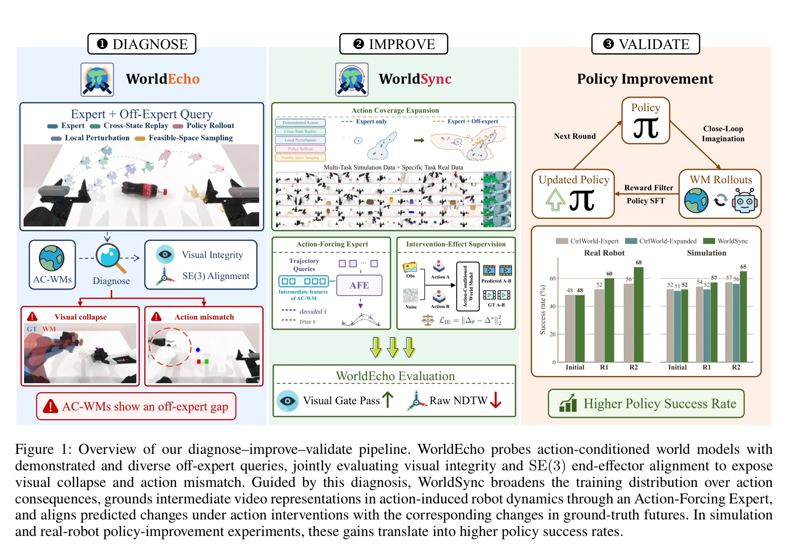
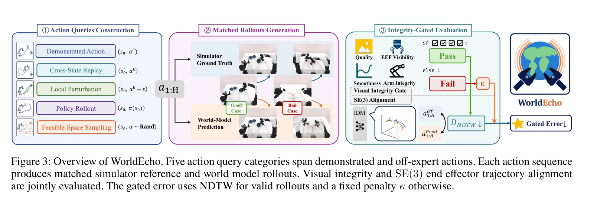
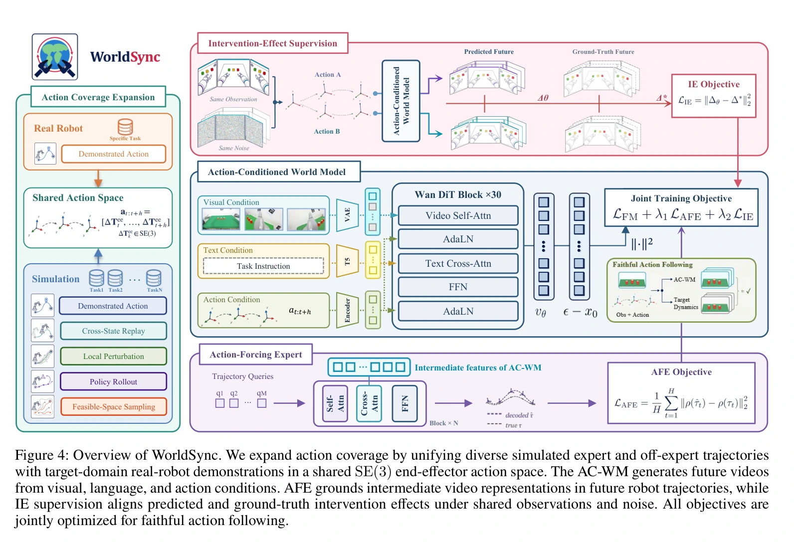
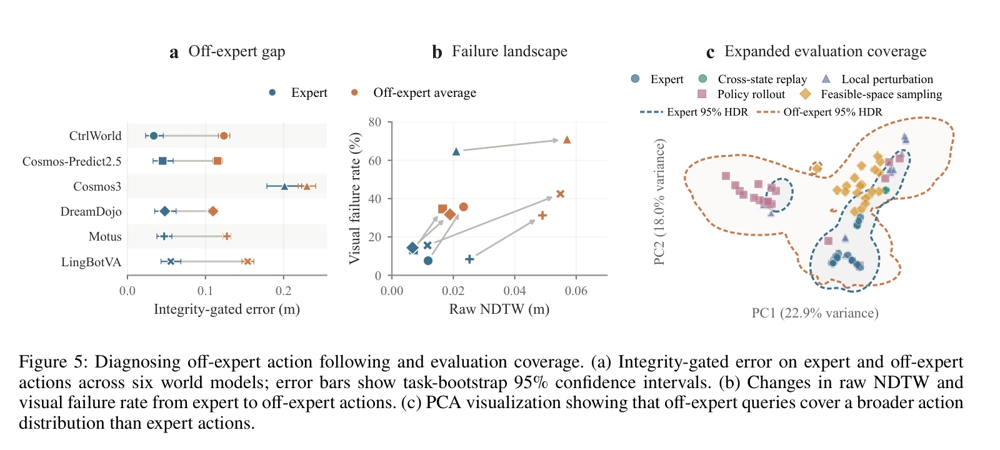
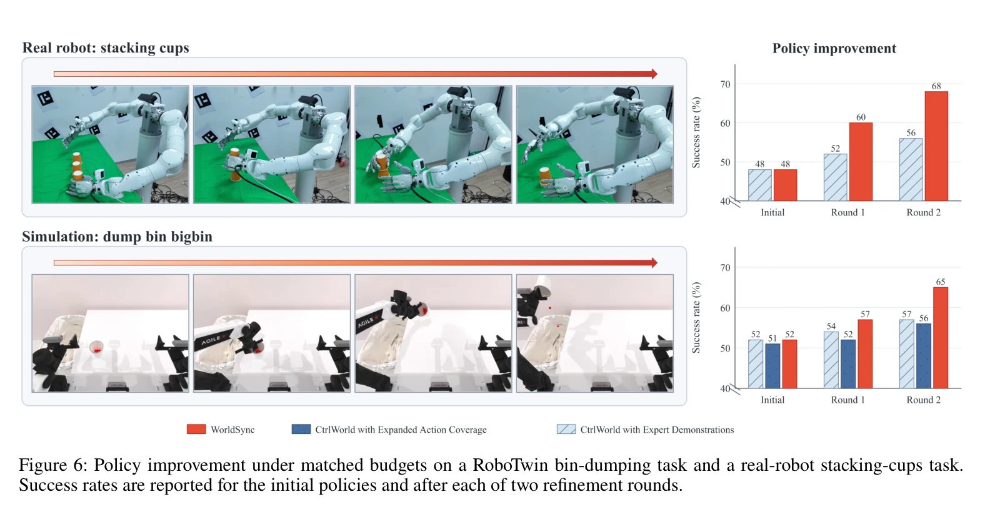

## 一屏概览

**问题。** 动作条件视频看起来合理，是否真的表现了输入动作的后果？只在专家动作上评估，可能掩盖策略探索时“视频崩坏”或“无视错误动作仍生成成功”的问题。

原文图 1；PDF 第 2 页。[查看原始来源](https://arxiv.org/pdf/2608.24885v1#page=2)

**贡献。** Sixiang Chen 等提出 WorldEcho，用五类动作查询、视觉完整性和末端位姿轨迹共同测量动作遵循；再提出 WorldSync，通过扩展动作覆盖、动作强制专家和干预效应监督改善生成。

**结论范围。** [arXiv 2608.24885v1](https://arxiv.org/abs/2608.24885v1)，2026-08-25，12 页，无额外方法附录。作者报告 50 个 RoboTwin 任务的动作评估，以及两个任务上的策略改进。WorldSync 的组合指标最好，但主表训练次数不匹配，且它不是所有分项指标最优。下面是归档论文的报告与明确标出的分析，未经本库独立复现。

## WorldEcho：怎样检验动作是否被执行

### 固定初态，为每条动作获取对应真值

模型从当前多视角观测 $o_0$、语言指令 $c$ 和长度为 $H$ 的动作序列 $a_{1:H}$ 生成未来视频：

$$
\hat I_{1:H}\sim p_\theta(I_{1:H}\mid o_0,c,a_{1:H}).
$$

$\theta$ 是模型参数。基准从同一环境初态执行同一动作，获取仿真真值视频 $I^{\mathrm{GT}}$，再用同一轨迹提取器 $\Phi$ 分别估计生成与真值的末端运动。这里比较的是该动作实际导致的结果，不是语言描述中的理想成功画面。（§3.1，式 1–2）

| 查询类别 | 构造 | 诊断意图 |
| --- | --- | --- |
| 当前专家动作 | 当前状态对应的示范序列 | 分布内基准 |
| 跨状态重放 | 把另一状态的专家动作放到当前状态 | 分开检验“动作像专家”与“动作适合当前状态” |
| 局部扰动 | 对示范动作加有界变化 | 检验局部动作敏感性 |
| 策略生成动作 | 当前学习策略产生的动作 | 覆盖实际策略改进时的偏离 |
| 可行空间采样 | 更广泛地采样机器人有效动作 | 减少对专家行为先验的依赖 |

后四类先做可执行性过滤，再配对重放。论文没有声称这些类别已穷尽所有异常动作或所有长时交互。（§3.3，图 3）

原文图 3；PDF 第 5 页。[查看原始来源](https://arxiv.org/pdf/2608.24885v1#page=5)

### 视觉门与位姿误差共同报告

视觉门 $G_{\mathrm{vis}}$ 要求图像质量、运动平滑度、末端持续可见和机械臂完整性全部通过。图像质量使用 MUSIQ，平滑度采用帧插值一致性；末端可见性和机械臂完整性分别依赖追踪器与视觉语言评价器。阈值在所有被评模型间固定。（§3.3，式 3–4）

对末端 $e$，生成帧 $i$ 与真值帧 $j$ 的局部误差为

$$
d_e(i,j)=\sqrt{w_p^2\|\hat p_i^e-p_j^{e,\mathrm{GT}}\|_2^2+w_R^2d_{SO(3)}(\hat R_i^e,R_j^{e,\mathrm{GT}})^2}.
$$

$p\in\mathbb R^3$ 为位置，$R\in SO(3)$ 为旋转；$w_p,w_R$ 是平移与旋转权重。旋转距离为相对旋转的角度。对各末端求最优动态时间规整路径 $\pi_e$，再按路径长度与有效末端数量平均：

$$
D^{\mathrm{NDTW}}=\frac1{|\mathcal A|}\sum_{e\in\mathcal A}\frac1{|\pi_e|}\sum_{(i,j)\in\pi_e}d_e(i,j).
$$

$\mathcal A$ 是有效末端集合。这里**只按时间对齐路径长度归一化，不按参考轨迹空间尺度归一化**，避免短运动把位姿估计噪声放大。（式 5–7）

组合误差在视频通过视觉门时取 $D^{\mathrm{NDTW}}$，否则给固定惩罚 $\kappa$；先在任务内平均，再对任务宏平均。同时保留视觉通过率与所有样本的未门控 NDTW，而不是只挑好看的视频算轨迹误差。（式 8，算法 1）

## WorldSync：三项训练改动各约束什么

**扩展覆盖。** 用示范和四种非专家轨迹增加仿真状态—动作覆盖，再混入少量目标任务真机示范。仿真与真机动作都表示为机器人基座坐标中的末端相对笛卡尔位姿变化，以共享动作接口。（§3.4，图 4）

原文图 4；PDF 第 6 页。[查看原始来源](https://arxiv.org/pdf/2608.24885v1#page=6)

**动作强制专家 AFE。** 一组轨迹查询逐层交叉注意视频模型的中间特征，预测未来末端轨迹。它不直接读取动作，也不把结果写回视频流；轨迹监督通过视频特征反向更新生成骨干，推理时删去此模块。其损失为

$$
\mathcal L_{\mathrm{AFE}}=\frac1H\sum_{t=1}^H\|\rho(\hat\tau_t)-\rho(\tau_t)\|_2^2,
$$

$\tau_t$ 是末端位姿，$\rho$ 是数值位姿表示。监督意图是让视频特征包含动作引起的机器人运动，而不只是外观。（式 10）

**干预效应 IE。** 同一观测与指令下配对两种动作 $A,B$，在流匹配噪声端点使用相同噪声，要求模型预测之间的变化符合真值未来之间的变化。设干净视频潜变量为 $x_0$、高斯噪声为 $\epsilon$，流匹配路径为 $x_t=(1-t)x_0+t\epsilon$，速度目标是 $\epsilon-x_0$。因此

$$
\Delta_\theta=v_\theta^A-v_\theta^B,\qquad
\Delta^*=x_0^B-x_0^A,\qquad
\mathcal L_{\mathrm{IE}}=\|\Delta_\theta-\Delta^*\|_2^2.
$$

**我们的代数解释。** 真值差分是 $B-A$，因为共同噪声相减后，$(\epsilon-x_0^A)-(\epsilon-x_0^B)=x_0^B-x_0^A$。脱离这个速度约定直接翻转符号，会改变训练目标。（式 9、11–12）

总目标为 $\mathcal L=\mathcal L_{\mathrm{FM}}+\lambda_{\mathrm{AFE}}\mathcal L_{\mathrm{AFE}}+\lambda_{\mathrm{IE}}\mathcal L_{\mathrm{IE}}$；$\lambda$ 控制辅助项权重。AFE 需要未来轨迹标签，IE 需要同条件不同动作的成对真值。这些额外数据条件也是方法成本的一部分。（式 13）

### 为什么“从视频特征读轨迹”和“比较两种动作”互补

AFE 问的是“单条生成过程的中间表示能否读出正确运动”；IE 问的是“只换动作后，预测变化是否也正确”。AFE 不直接读动作，使它不能仅靠动作输入绕过视频特征来完成轨迹预测；但这只是信息通路上的设计理由，是否带来最终收益仍要由消融验证。辅助头在训练时向骨干提供梯度，推理时移除，生成接口仍是观测、指令和动作到未来视频。（§3.4，图 4）

**用一个潜变量坐标解释 IE 的教学例子。** 设两种动作的真实未来值为 $x_0^A=2$、$x_0^B=-1$，共同噪声端点为 $\epsilon=0.3$。两条速度目标分别为 $-1.7$ 和 $1.3$，其差为 $-3$。完全忽略动作的模型在相同噪声端点给出相同预测速度，差为零，于是该坐标的 IE 平方误差为 9。只有让动作改变预测，才有可能消除这项误差。

这里使用**共同噪声端点**很关键：对一般中间时刻，$x_t^A=(1-t)x_0^A+t\epsilon$ 与 $x_t^B$ 本身也不同；不能把任意两个带噪输入的差都宣称为纯动作干预。这个标量例子只解释论文式 11–12，既不是物理位移单位，也没有证明视频每一像素或接触力正确。

## 实验与消融

### 动作评估：更广的查询改变结论

主评估覆盖 50 个 RoboTwin 任务和六个基线骨干。图 5 中，所有专家训练模型在非专家查询上的组合误差增加 0.029–0.099；未门控 NDTW 增加 0.010–0.043，视觉失败率增加 6.3–28.1 个百分点。图 5a 给任务自助采样的 95% 置信区间。这支持“专家评估低估此协议中的非专家误差”，不支持对未评模型的全称结论。（§4.1–4.2）

原文图 5；PDF 第 8 页。[查看原始来源](https://arxiv.org/pdf/2608.24885v1#page=8)

| 主表配置 | 更新次数 | 组合误差↓ | 未门控 NDTW↓ | 视觉通过率↑ |
| --- | --- | --- | --- | --- |
| CtrlWorld，专家数据 | 20k | 0.0716 | 0.0266 | 83.89% |
| CtrlWorld，扩展覆盖 | 40k | 0.0670 | 0.0210 | 83.71% |
| Cosmos-Predict2.5，扩展覆盖 | 40k | 0.0842 | **0.0127** | 75.03% |
| Motus，扩展覆盖 | 40k | 0.0731 | 0.0292 | 84.34% |
| WorldSync | 60k | **0.0661** | 0.0223 | **84.51%** |

这是表 1 的代表行，粗体表示原完整主表相应列最优。**训练次数不匹配**，扩展数据也伴随更多更新，不能仅用主表隔离覆盖扩大或辅助损失的作用。0.0661 与 0.0670 接近；表 1 未给这些点估计差异的显著性检验。WorldSync 的未门控轨迹误差也不是最优。（§4.3，表 1）

### 四任务消融：AFE 并非独立增益保证

表 2 对四个任务、八个共同检查点求平均，范围小于主表。

| 变体 | 组合误差↓ | 未门控 NDTW↓ | 视觉通过率↑ |
| --- | --- | --- | --- |
| 专家数据基线 | 0.0781 | 0.0306 | 82.41% |
| 扩展数据基线 | 0.0738 | 0.0258 | 82.68% |
| 扩展数据 + IE | 0.0700 | **0.0170** | 81.25% |
| 扩展数据 + AFE | 0.0753 | 0.0284 | **83.04%** |
| 完整方法 | **0.0695** | 0.0189 | 81.96% |

IE 是这组消融中轨迹改善的主要来源。单独加入 AFE 相比扩展基线，两个动作误差反而变大；与 IE 结合时，AFE 部分恢复视觉通过率并略降组合误差。因此“中间表示监督保证更忠实动作”超出了这组证据。（§4.5）

### 下游：两个任务的策略改进

作者适配 VLAW，做两轮策略改进，并称每个领域内初始策略、交互、模型生成和策略训练预算保持一致。仿真倒料任务中，WorldSync 从约 52% 到 65%，两种 CtrlWorld 配置终点为 56%／57%；真机叠杯中，WorldSync 从 48% 到 68%，专家 CtrlWorld 从 48% 到 56%。（§4.4，图 6）

原文图 6；PDF 第 9 页。[查看原始来源](https://arxiv.org/pdf/2608.24885v1#page=9)

**50 个任务的动作评估不等于 50 个任务的策略改进。** v1 未披露下游具体预算数值与试验样本量，不能由这些百分数自行计算可信区间或证明统计显著性。

## 局限与我们的评价

**作者明确的边界。** 长时交互、更多机器人形态和开放环境仍待扩展。（§5）

**复现材料不足。** v1 没有充分给出视觉门阈值、位姿权重、失败惩罚、各查询类别样本量、轨迹提取误差校准和下游预算。这些值影响组合误差与排名，不能用默认猜测补成已验证实现。

**我们的解释。** 末端 SE(3) 跟随不能直接证明接触力、摩擦或所有物体运动正确；时间规整允许一定速度伸缩，实时延迟应另测。本文更强的研究价值是把“动作干预是否造成正确变化”从画质中分离出来，而不是提供一个覆盖全部物理真实性的单一分数。

## 关联与归档

[[WorldModelEvaluation|世界模型评估]] 保留跨论文通用指标与比较边界；[[ModelPredictiveControl|模型预测控制]] 解释为何规划会查询非专家动作；[[SimulationRealityGap|仿真—现实差距]] 区分视觉与动力学匹配。[[v-jepa-2-understanding-prediction-planning|V-JEPA 2-AC]] 做潜在空间目标规划，与本文视频仿真及策略后训练的作用不同，成功率不能直接排序。

[归档 PDF 对应版本](https://arxiv.org/pdf/2608.24885v1)获取于 2026-10-02，SHA-256 为 `58e93b783ffe8d135f37fba7a72002d7a2ea7a18c9aef44bd1a50524a498ab21`。2026-10-04 重新完整阅读 PDF 布局提取文本；原 MarkItDown 缓存有双栏交错，数值以原 PDF 表 1–2 为准。本次没有核实后来正式发表状态，也没有独立复现。

## 研究归属

[[topics/world-models-and-representations|世界模型与表征]] · [[topics/evaluation-and-transfer|评测与现实迁移]] · [[topics/world-model-evaluation|如何验证世界模型的动作后果]]。
