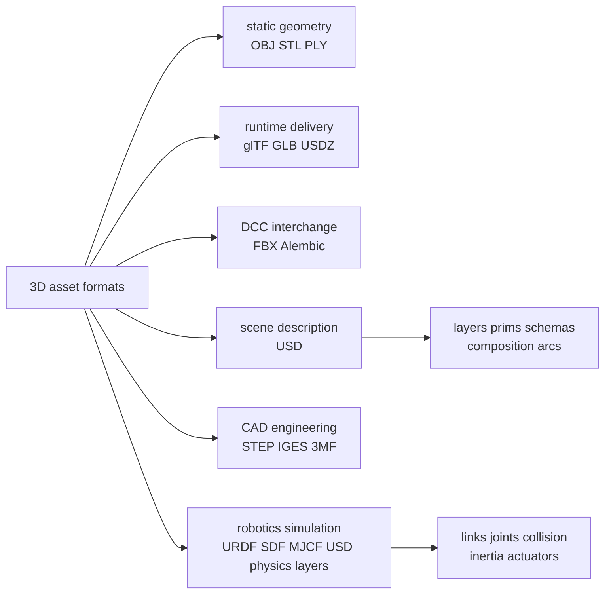
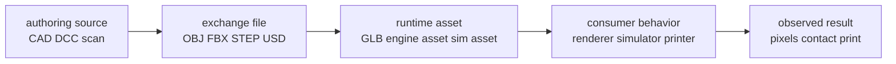

# 3D Model Formats Learning Map

本页是 `learn` workflow 生成的学习脚手架，用来建立 OBJ、STL、PLY、glTF/GLB、FBX、USD、STEP、URDF/SDF/MJCF 等 3D asset formats 的 mental map。当前 wiki 已有 source-backed coverage 主要集中在 [[OpenUSD]]、[[OpenUSDSceneComposition]] 和 [[IsaacSimAssetStructure]]；其他格式的说明先标注为 `unsourced learning note`，不能当作已 ingest source 的结论。

## Topic Boundary

这里的 “3D 模型格式” 实际包含几类不同对象：polygon mesh exchange（交换离散网格）、runtime asset delivery（面向实时渲染分发）、DCC / production interchange（建模动画软件之间交换）、scene description（可组合场景描述）、CAD / engineering geometry（精确工程几何）和 robotics / simulation description（机器人结构与物理语义）。

本页关注“格式保存了什么语义、适合什么 pipeline、容易丢什么信息”。它不展开具体 parser API、软件导入按钮、压缩算法细节或每个格式的完整规范。

## Evidence Boundaries

| Insight | Evidence Level | Wiki Target |
| --- | --- | --- |
| USD 不应只当作文件后缀理解，而应理解为 scene description + composition system。 | source-backed | [[OpenUSDSceneComposition]], [[openusd-introduction]] |
| Isaac Sim robot asset 可以拆成 geometry、material、physics、runtime tuning 和 feature layers。 | source-backed | [[IsaacSimAssetStructure]], [[isaac-sim-asset-structure]] |
| OBJ/STL/PLY/glTF/GLB/FBX/STEP/URDF 等格式的用途对比。 | unsourced learning note | 本页；后续应 source / ingest official specs 或 authoritative docs |
| “visual mesh 不等于 collision mesh”、“load 成功不等于 semantics preserved” 这些工程判断。 | conversation-derived learning heuristic | 本页；后续可用 simulation / asset pipeline docs 验证 |

## Prerequisite Map

- Geometry basics：vertex、edge、face、triangle、normal、UV、topology、coordinate frame、scale / unit。
- Material basics：base color、metallic / roughness、normal map、texture coordinates、shader model、PBR material。
- Scene graph basics：node、transform、parent-child hierarchy、instancing、camera、light、animation channel。
- Asset pipeline basics：authoring format、interchange format、runtime format、canonical source、exported derivative。
- Simulation basics：visual mesh、collision mesh、mass / inertia、joint、actuator、physics material、contact solver。

## Format Taxonomy

这张图的核心是：不同后缀不是同一层级的替代品。`STL` 和 `OBJ` 更像 geometry carrier；`GLB` 更像 runtime-delivery container；`USD` 更像 composed scene-description system；`URDF` / `SDF` / `MJCF` 更像 robot / simulation semantics container。

## Core Concepts

### Mesh vs Scene

`mesh` 是局部形状：vertices、faces、normals、UVs 和 material assignments。`scene` 是 mesh 之外的组织结构：transform hierarchy、instances、cameras、lights、animation、references、variants、metadata 和 downstream tool semantics。

`unsourced learning note`：很多格式争论本质上是 mesh format 和 scene format 混在一起讨论。`OBJ` 可以保存一个或一组 mesh，但不等于完整 production scene。`USD` 可以保存 mesh，但它的核心价值在于 composition、schemas 和 Stage-level scene description，这一点当前 wiki 已由 [[OpenUSDSceneComposition]] 支持。

### Authoring vs Interchange vs Runtime

Authoring format 是编辑源，例如 Blender `.blend`、Maya scene 或 CAD native files。Interchange format 用于在工具之间交换，例如 OBJ、FBX、STEP、USD。Runtime format 用于快速加载和分发，例如 GLB 或平台化 asset bundle。

`unsourced learning note`：不要把 exported runtime artifact 当作唯一 source-of-truth。GLB 很适合分发给 web viewer，但如果团队还要改 rig、材质图层、CAD 参数或 simulation semantics，通常需要保留更上游的 canonical source。

### Visual Mesh vs Collision Mesh

Visual mesh 负责渲染外观，collision mesh 负责 contact detection / physics approximation。两者可以不同：visual mesh 可以高面数、带纹理；collision mesh 往往需要低面数、凸分解或 primitive approximation。

`conversation-derived learning heuristic`：在 robotics / simulation 中，把 visual mesh 直接拿去做 collision 往往会让 contact 更慢、更不稳定或语义更难审计。[[IsaacSimAssetStructure]] 对 geometry、instance/collider、physics 和 runtime tuning 的分层可以作为更严谨的 asset authoring mental model。

## 主流格式对比

| Format | 保存重点 | 适合 | 主要限制 | Evidence Level |
| --- | --- | --- | --- | --- |
| `OBJ` | polygon mesh、UV、normal；材质常通过 `.mtl` sidecar | 简单静态模型交换、geometry debugging、很多工具的 common denominator | 不擅长复杂 scene、animation、rigging、PBR material；单位和坐标约定容易在工具间丢失 | unsourced learning note |
| `STL` | triangle surface geometry | 3D printing、快速制造、simple collision / preview mesh | 几乎不表达材质、UV、scene hierarchy、animation；不是 CAD exact solid | unsourced learning note |
| `PLY` | mesh 或 point cloud，常带 vertex attributes | 3D scanning、point cloud、research datasets、geometry processing | production pipeline 兼容性通常不如 OBJ/glTF；复杂材质和动画不是重点 | unsourced learning note |
| `glTF` | mesh、PBR material、textures、nodes、animation、skin 等 runtime-friendly asset | Web、viewer、game engine、AR/VR、轻量分发 | 不适合表达复杂 authoring history、layer overrides 或大型 production composition | unsourced learning note |
| `GLB` | glTF 的 binary package，把 JSON、buffers、textures 打成单文件 | 模型分发、网页加载、asset preview、移动端交付 | 不适合人工 diff；编辑通常回到 DCC 或 glTF source pipeline | unsourced learning note |
| `FBX` | mesh、skeleton、animation、camera、scene hierarchy 等 DCC interchange data | Maya / Blender / Unity / Unreal 之间交换动画资产 | 工具实现差异可能导致导入结果不一致；规范历史包袱重 | unsourced learning note |
| `USD` / `USDA` / `USDC` | `Stage`、`Layer`、`Prim`、schemas、composition arcs、metadata、scene graph | large scene pipeline、film / VFX、Isaac Sim robot assets、非破坏式 override | 学习成本高；只当成 monolithic mesh file 会误用；精确 value resolution 还需后续 glossary / API source | source-backed for current wiki scope |
| `USDZ` | packaged USD asset bundle | AR preview、移动端 asset package、分发 | 更偏 packaging / delivery，不等于完整 USD authoring pipeline | unsourced learning note |
| `STEP` / `IGES` | CAD / B-rep-style engineering geometry | 机械零件、制造、CAD interchange | 渲染或仿真前常要 tessellation；材质、animation、runtime scene graph 不是重点 | unsourced learning note |
| `3MF` | additive manufacturing package with richer printing metadata than STL | 3D printing production workflow | 不是通用 game / VFX scene format | unsourced learning note |
| `URDF` | robot links、joints、visual / collision / inertial references | ROS robot description、basic robot simulation entry | 不是通用 3D asset format；复杂 scene composition、material 和 runtime tuning 能力有限 | unsourced learning note |
| `SDF` | robot / world / sensor / physics description for simulation | Gazebo-style simulation worlds、multi-entity scenes | 不是 DCC authoring format；visual quality 和 CAD fidelity 依赖 referenced meshes | unsourced learning note |
| `MJCF` | MuJoCo XML model，表达 bodies、joints、geoms、actuators 和 simulation parameters | MuJoCo simulation、control / RL experiments | 与 MuJoCo runtime semantics 绑定；跨 engine interchange 需要转换和验证 | unsourced learning note |

## Mechanism-Level Explanation

一个 3D asset 在 pipeline 里通常经过四次语义变化：

第一步是 authoring source：设计者在 CAD、Blender、Maya、scanner 或 simulation editor 里创建高语义对象。第二步是 exchange：为了跨工具传输，信息会被映射到某种文件格式。第三步是 runtime preparation：engine、viewer、printer 或 simulator 会做优化、压缩、tessellation、collider generation、material conversion 或 physics binding。第四步才是 consumer behavior：renderer 看到的是 shader / texture / lighting，simulator 看到的是 collider / mass / joint / solver settings，printer 看到的是 surface / manifold / slicing constraints。

因此，“格式支持某信息”不等于“你的 pipeline 保留了某信息”。比如一个文件可以包含 material，但 exporter、importer 或 target renderer 对 shader model 的解释不同，最终外观仍会变。一个 mesh 可以包含 scale，但 downstream tool 可能默认 meter、centimeter 或 unitless。一个 robot visual mesh 可以正确显示，但 collision、inertia 或 joint axis 仍可能错误。

USD 的机制在这条 pipeline 中比较特殊：它不是只把一个 asset freeze 成最终结果，而是允许多个 layers author opinions，再通过 composition engine 形成 Stage。[[OpenUSDSceneComposition]] 把它抽象成 `Resolve(L, C, Σ)`：$L$ 是 layers，$C$ 是 composition arcs / strength ordering，$\Sigma$ 是 schema vocabulary，输出是 composed scene description。[[IsaacSimAssetStructure]] 进一步把 robotics asset 拆成 geometry、material、physics、runtime tuning 和 feature payloads，这让 asset assumptions 更容易定位。

## Misconception Map

| 误解 | 更好的理解 |
| --- | --- |
| STL 是 3D 模型的通用格式。 | STL 更接近 triangle surface dump，适合打印和简单几何交换，不适合完整 scene semantics。 |
| OBJ 简单所以最可靠。 | 简单降低 parser 难度，但也意味着 animation、PBR、rigging、units、scene semantics 很容易不在格式内表达。 |
| GLB 是所有场景的最终答案。 | GLB 很适合 runtime delivery，但不是大型 authoring / override / simulation semantics 的完整替代。 |
| FBX 能导出就说明动画资产没问题。 | DCC interchange 的难点常在 scale、axis、bone orientation、animation curves 和 importer interpretation。 |
| USD 只是另一种 mesh 文件。 | USD 的核心是 scene description、schemas 和 composition；只保存 mesh 会浪费它最重要的能力 [[OpenUSDSceneComposition]]。 |
| Visual mesh 可以直接当 collision mesh。 | Simulation 通常需要单独设计 collider representation；外观看起来正确不代表 contact behavior 正确。 |
| 文件能打开就说明语义保留。 | Parser success 只证明数据可读；单位、坐标、材质、层级、physics、joint semantics 仍需验证。 |

## Practice Hooks

- 如果目标是 web / product viewer：优先理解 `glTF` / `GLB` 的 runtime-delivery 思路，再补 texture compression、LOD 和 asset validation。
- 如果目标是 3D printing：优先理解 `STL`、`3MF`、manifold surface、wall thickness、scale 和 slicing。
- 如果目标是 DCC / game animation：优先理解 `FBX`、skeleton、skin weights、animation curves、axis conversion 和 engine importer behavior。
- 如果目标是 robotics simulation：优先理解 visual mesh、collision mesh、inertia、joint axis、actuator、physics material，再把 [[IsaacSimAssetStructure]] 作为 USD-based asset organization reference。
- 如果目标是 CAD-to-sim：先保留 `STEP` / CAD source，再明确 tessellation、simplified collision、mass properties 和 coordinate-frame conversion，不要只保留 STL/OBJ derivative。

## Source Acquisition Plan

后续如果要把本页升级成 source-backed knowledge，优先 `source` / `ingest` 这些材料类型：

- `glTF` / `GLB`：Khronos glTF 2.0 specification、Khronos sample models、official validator docs。
- `USD`：OpenUSD glossary、Terms and Concepts、composition tutorials、USD file format / schema docs；当前 wiki 只有 introduction-level source [[openusd-introduction]]。
- `OBJ` / `STL` / `PLY`：Library of Congress format descriptions、Stanford PLY notes、3D printing / mesh processing authoritative docs。
- `FBX`：Autodesk FBX SDK documentation、major engine import documentation for Unity / Unreal / Blender。
- `STEP` / CAD：ISO 10303 overview、Open Cascade documentation、CAD-to-mesh tessellation references。
- `3MF`：3MF Consortium specification and implementation guides。
- `URDF` / `SDF` / `MJCF`：ROS URDF docs、SDFormat spec、MuJoCo XML reference。
- Robotics asset pipeline：Isaac Sim robot import / asset validation docs、OpenUSD physics schemas、MuJoCo / PhysX asset conversion notes。

## Follow-up Questions

- 本 wiki 是否需要单独建一个 `Simulation Asset Formats` concept，把 `URDF`、`SDF`、`MJCF`、USD physics layers 和 Isaac Sim asset structure 放在同一个 robotics-oriented map 里？
- 是否需要建立 CAD-to-simulation ingest path，专门记录 `STEP -> mesh -> collider -> inertia -> USD/MJCF/URDF` 的可审计 pipeline？
- 是否需要为每种格式建 source page，还是先保留一个 high-level source plan，等真实项目中遇到某个格式再 ingest？

相关页面：[[OpenUSDSceneComposition]]、[[OpenUSD]]、[[IsaacSimAssetStructure]]、[[IsaacSim]]、[[MuJoCo]]、[[SimulationRealityGap]]。
