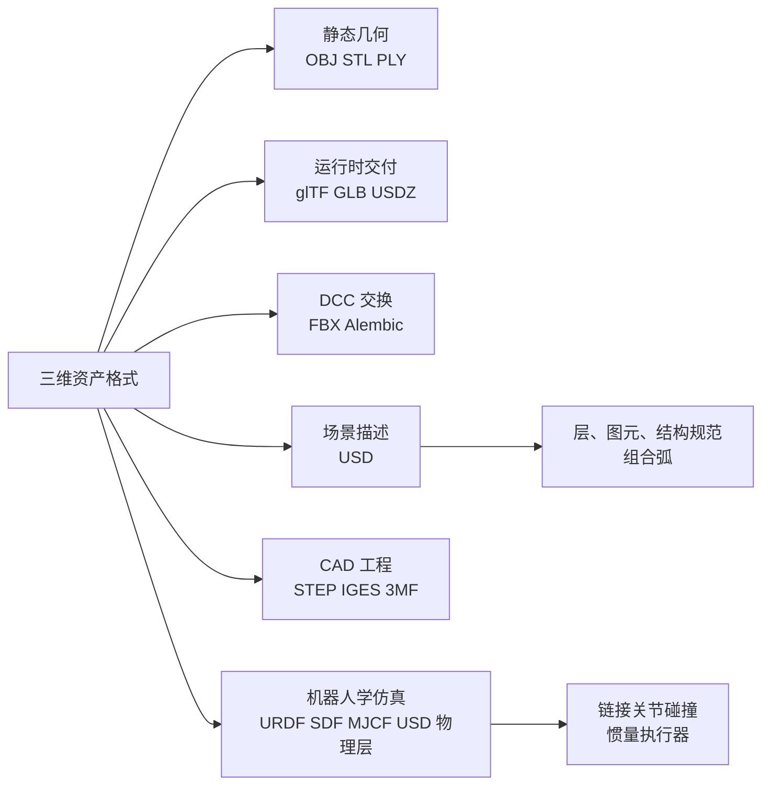

# 三维模型格式学习地图

本页是 `learn` 工作流生成的学习脚手架，用来建立 OBJ、STL、PLY、glTF/GLB、FBX、USD、步骤、URDF/SDF/MJCF 等三维资产格式的心智图谱。当前知识库中已有来源支持的内容主要集中在 [[OpenUSD]]、[[OpenUSDSceneComposition]] 和 [[IsaacSimAssetStructure]]；其他格式的说明先标注为“无来源学习笔记”，不能当作已收录来源的结论。

## 主题边界

这里的“三维模型格式”实际包含几类不同对象：多边形网格交换、运行时资产分发、DCC 与生产交换、场景描述、CAD 工程几何，以及机器人学与仿真描述。

本页关注“格式保存了什么语义、适合什么流程、容易丢什么信息”。它不展开具体解析器 API、软件导入按钮、压缩算法细节或每个格式的完整规范。

## 证据边界

| 洞见 | 证据层级 | 知识库位置 |
| --- | --- | --- |
| USD 不应只当作文件后缀理解，而应理解为场景描述 + 组合系统。 | 有来源支持的 | [[OpenUSDSceneComposition]], [[openusd-introduction]] |
| Isaac Sim 机器人资产可以拆成几何、材质、物理、运行时调优和特征层。 | 有来源支持的 | [[IsaacSimAssetStructure]], [[isaac-sim-asset-structure]] |
| OBJ/STL/PLY/glTF/GLB/FBX/步骤/URDF 等格式的用途对比。 | 无来源学习笔记 | 本页；后续应查找并收录官方规范或权威文档 |
| “视觉网格不等于碰撞网格”、“加载成功不等于语义得到保留”等工程判断。 | 源自讨论的学习启发式规则 | 本页；后续可用仿真与资产流程文档验证 |

## 前置知识图

- Geometry 基础：顶点、边、面、三角形、法向、UV、拓扑、坐标帧、规模 / 单位。
- 材质基础：基座颜色、金属度 / 粗糙度、法向映射图、纹理坐标、着色器模型、PBR 材质。
- Scene 图结构基础：节点、变换、父子层级、实例化、相机、灯光、动画通道。
- 资产流程基础：制作格式、交换格式、运行时格式、规范的来源、导出的派生产物。
- 仿真基础：视觉网格、碰撞网格、质量 / 惯量、关节、执行器、物理材质、接触求解器。

## 格式分类

```mermaid
flowchart LR
  F["三维资产格式"] --> M["静态几何<br/>OBJ STL PLY"]
  F --> R["运行时交付<br/>glTF GLB USDZ"]
  F --> D["DCC 交换<br/>FBX Alembic"]
  F --> S["场景描述<br/>USD"]
  F --> C["CAD 工程<br/>STEP IGES 3MF"]
  F --> B["机器人学仿真<br/>URDF SDF MJCF USD 物理层"]
  S --> U["层、图元、结构规范<br/>组合弧"]
  B --> P["链接关节碰撞<br/>惯量执行器"]
```

这张图的核心是：不同后缀不是同一层级的替代品。`STL` 和 `OBJ` 更像几何载体；`GLB` 更像运行时交付容器；`USD` 更像组合的场景描述系统；`URDF` / `SDF` / `MJCF` 更像机器人 / 仿真语义容器。

## 核心概念

### 网格与场景

`mesh` 是局部形状：顶点、面、法向量、UVs 和材质归类。`scene` 是网格之外的组织结构：变换层级、instances、相机、灯光、动画、参考资料、变体、元数据和下游工具语义。

无来源学习笔记：很多格式争论本质上是把网格格式和场景格式混在一起讨论。`OBJ` 可以保存一个或一组网格，但不等于完整生产场景。`USD` 可以保存网格，但它的核心价值在于组合、结构规范和阶段层级场景描述，这一点当前知识库已由 [[OpenUSDSceneComposition]] 支持。

### 创作、交换与运行时

制作格式是编辑源，例如 Blender `.blend`、Maya 场景或 CAD 原生文件。交换格式用于在工具之间交换，例如 OBJ、FBX、步骤、USD。运行时格式用于快速加载和分发，例如 GLB 或平台化资产包。

无来源学习笔记：不要把导出的运行时产物当作单一事实来源。GLB 很适合分发给网页查看器，但如果团队还要修改骨骼绑定、材质图层、CAD 参数或仿真语义，通常需要保留更上游的规范源。

### 视觉网格与碰撞网格

视觉网格负责渲染外观，碰撞网格负责接触检测 / 物理近似。两者可以不同：视觉网格可以高面数、带纹理；碰撞网格往往需要低面数、凸分解或基元近似。

来自讨论的学习启发：在机器人学与仿真中，把视觉网格直接用于碰撞往往会让接触更慢、更不稳定，或让语义更难审计。[[IsaacSimAssetStructure]] 对几何、实例/碰撞体、物理和运行时调优的分层，可以作为更严谨的资产制作心智模型。

## 主流格式对比

| 格式 | 保存重点 | 适合 | 主要限制 | 证据层级 |
| --- | --- | --- | --- | --- |
| `OBJ` | 多边形网格、UV、法向；材质常通过 `.mtl` sidecar | 简单静态模型交换、几何调试、很多工具的常见兼容格式 | 不擅长复杂场景、动画、骨骼绑定、PBR 材质；单位和坐标约定容易在工具间丢失 | 无来源学习笔记 |
| `STL` | 三角形表面几何 | 三维打印、快速制造、简单碰撞 / 预览网格 | 几乎不表达材质、UV、场景层级、动画；不是 CAD 精确实体几何 | 无来源学习笔记 |
| `PLY` | 网格或点点云，常带顶点属性 | 3D scanning、点点云、研究数据集、几何处理 | 生产流程兼容性通常不如 OBJ/glTF；复杂材质和动画不是重点 | 无来源学习笔记 |
| `glTF` | 网格、PBR 材质、纹理、节点、动画、skin 等运行时友好的资产 | Web、查看器、game 引擎、AR/VR、轻量分发 | 不适合表达复杂制作历史、层覆写或大型生产组合 | 无来源学习笔记 |
| `GLB` | glTF 的二进制软件包，把 JSON、缓冲区、纹理打成单文件 | 模型分发、网页加载、资产预览、移动端交付 | 不适合人工 diff；编辑通常回到 DCC 或 glTF 来源流程 | 无来源学习笔记 |
| `FBX` | 网格、skeleton、动画、相机、场景层级等 DCC 交换数据 | Maya / Blender / Unity / Unreal 之间交换动画资产 | 工具实现差异可能导致导入结果不一致；规范历史包袱重 | 无来源学习笔记 |
| `USD` / `USDA` / `USDC` | `Stage`、`Layer`、`Prim`、结构规范、组合弧、元数据、场景图结构 | 大规模场景流程、film / VFX、Isaac Sim 机器人资产、非破坏式覆写 | 学习成本高；只当成单体式的网格文件会误用；精确价值分辨率还需后续 glossary / API 来源 | 有来源支持的用于当前知识库范围 |
| `USDZ` | packaged USD 资产 bundle | AR 预览、移动端资产软件包、分发 | 更偏 packaging / 交付，不等于完整 USD 制作流程 | 无来源学习笔记 |
| `STEP` / `IGES` | CAD / B-rep 风格的工程几何 | 机械零件、制造、CAD 交换 | 渲染或仿真前常要进行网格离散化；材质、动画、运行时场景图结构不是重点 | 无来源学习笔记 |
| `3MF` | additive manufacturing 软件包带有更丰富的打印元数据 than STL | 三维打印生产工作流 | 不是通用 game / VFX 场景格式 | 无来源学习笔记 |
| `URDF` | 机器人链接、关节、视觉、碰撞和惯性引用 | ROS 机器人描述、基础机器人仿真入口 | 不是通用三维资产格式；复杂场景组合、材质和运行时调优能力有限 | 无来源学习笔记 |
| `SDF` | 机器人 / 世界 / 传感器 / 物理描述用于仿真 | Gazebo-风格仿真 worlds、多实体场景 | 不是 DCC 制作格式；视觉质量和 CAD 保真度依赖引用的网格 | 无来源学习笔记 |
| `MJCF` | MuJoCo XML 模型，表达 bodies、关节、geoms、执行器和仿真参数 | MuJoCo 仿真、控制 / RL 实验 | 与 MuJoCo 运行时语义绑定；跨引擎交换需要转换和验证 | 无来源学习笔记 |

## 机制层解释

一个 3D 资产在流程里通常经过四次语义变化：

```mermaid
flowchart LR
  A["制作来源<br/>CAD DCC 扫描"] --> B["交换文件<br/>OBJ FBX STEP USD"]
  B --> C["运行时资产<br/>GLB 引擎资产仿真资产"]
  C --> D["使用方行为<br/>渲染器仿真器打印机"]
  D --> E["观测结果<br/>像素接触打印"]
```

第一步是制作来源：设计者在 CAD、Blender、Maya、扫描仪或仿真编辑器里创建高语义对象。第二步是交换：为了跨工具传输，信息会被映射到某种文件格式。第三步是运行时准备：引擎、查看器、打印机或仿真器会做优化、压缩、网格离散化、碰撞体生成、材质转换或物理绑定。第四步才是使用方行为：渲染器看到的是着色器、纹理和光照，仿真器看到的是碰撞体、质量、关节和求解器场景，打印机看到的是表面、流形和切片约束。

因此，“格式支持某信息”不等于“你的流程保留了某信息”。比如一个文件可以包含材质，但导出器、导入器或目标渲染器对着色器模型的解释不同，最终外观仍会变。一个网格可以包含规模化，但下游工具可能默认米、厘米或无单位。一个机器人视觉网格可以正确显示，但碰撞、惯量或关节轴仍可能错误。

USD 的机制在这条流程中比较特殊：它不是只把一个资产冻结成最终结果，而是允许多个层作者意见，再通过组合引擎形成阶段。[[OpenUSDSceneComposition]] 把它抽象成 `Resolve(L, C, Σ)`：$L$ 是层，$C$ 是组合弧 / 强度顺序，$\Sigma$ 是结构规范 vocabulary，输出是组合的场景描述。[[IsaacSimAssetStructure]] 进一步把机器人学资产拆成几何、材质、物理、运行时调优和特征载荷，这让资产假设更容易定位。

## 误解图谱

| 误解 | 更好的理解 |
| --- | --- |
| STL 是 3D 模型的通用格式。 | STL 更接近三角形表面 dump，适合打印和简单几何交换，不适合完整场景语义。 |
| OBJ 简单所以最可靠。 | 简单降低 parser 难度，但也意味着动画、PBR、骨骼绑定、单位、场景语义很容易不在格式内表达。 |
| GLB 是所有场景的最终答案。 | GLB 很适合运行时交付，但不是大型制作 / 覆写 / 仿真语义的完整替代。 |
| FBX 能导出就说明动画资产没问题。 | DCC 交换的难点常在规模化、轴、bone 姿态、动画曲线和导入器解释。 |
| USD 只是另一种网格文件。 | USD 的核心是场景描述、结构规范和组合；只保存网格会浪费它最重要的能力 [[OpenUSDSceneComposition]]。 |
| 视觉网格可以直接当碰撞网格。 | 仿真通常需要单独设计碰撞体表示；外观看起来正确不代表接触行为正确。 |
| 文件能打开就说明语义保留。 | Parser 成功只证明数据可读；单位、坐标、材质、层级、物理、关节语义仍需验证。 |

## 实践连接

- 如果目标是 web / 产品查看器：优先理解 `glTF` / `GLB` 的运行时交付思路，再补纹理 compression、LOD 和资产验证。
- 如果目标是三维打印：优先理解 `STL`、`3MF`、流形表面、wall thickness、规模化和 slicing。
- 如果目标是 DCC / game 动画：优先理解 `FBX`、skeleton、skin weights、动画曲线、轴转换和引擎导入器行为。
- 如果目标是机器人学仿真：优先理解视觉网格、碰撞网格、惯量、关节轴、执行器、物理材质，再把 [[IsaacSimAssetStructure]] 作为 USD-基于资产组织参考。
- 如果目标是从 CAD 进入仿真：先保留 `STEP` / CAD 来源，再明确网格离散化、简化碰撞体、质量属性和坐标帧转换，不要只保留 STL/OBJ 派生产物。

## 来源获取计划

后续如果要把本页升级成有来源支持的知识，优先 `source` / `ingest` 这些材料类型：

- `glTF` / `GLB`：Khronos glTF 2.0 specification、Khronos 样本模型、官方 validator 文档。
- `USD`：OpenUSD glossary、条款与概念、组合 tutorials、USD 文件格式 / 结构规范文档；当前知识库只有介绍层级来源 [[openusd-introduction]]。
- `OBJ` / `STL` / `PLY`：美国国会图书馆格式说明、Stanford PLY 笔记、三维打印 / 网格处理权威的文档。
- `FBX`：Autodesk FBX SDK 文档，以及 Unity、Unreal、Blender 等主要引擎和工具的导入文档。
- `STEP` / CAD：ISO 10303 总览、Open Cascade 文档、CAD 到网格的离散化参考资料。
- `3MF`：3MF Consortium specification 与实现 guides。
- `URDF` / `SDF` / `MJCF`：ROS URDF 文档、SDFormat spec、MuJoCo XML 参考。
- 机器人学资产流程：Isaac Sim 机器人导入 / 资产验证文档、OpenUSD 物理结构规范、MuJoCo / PhysX 资产转换笔记。

## 后续问题

- 本知识库是否需要单独建一个 `Simulation Asset Formats` 概念页，把 `URDF`、`SDF`、`MJCF`、USD 物理层和 Isaac Sim 资产结构放在同一个机器人学定向的图谱里？
- 是否需要建立 CAD-到仿真收录路径，专门记录 `STEP -> mesh -> collider -> inertia -> USD/MJCF/URDF` 的可审计流程？
- 是否需要为每种格式建来源页，还是先保留一个高层来源 plan，等真实项目中遇到某个格式再收录？

相关页面：[[OpenUSDSceneComposition]]、[[OpenUSD]]、[[IsaacSimAssetStructure]]、[[IsaacSim]]、[[MuJoCo]]、[[SimulationRealityGap]]。
