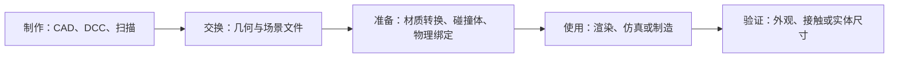

# 三维模型格式学习地图

先判断下游需要什么语义，再选择文件格式。网格、可渲染场景、可编辑资产和可仿真机器人不是同一对象。本页提供学习脚手架，官方来源支持的部分与待验证解释分开列出。

## 证据边界

| 内容 | 当前支持 |
| --- | --- |
| OpenUSD 场景、层、图元与组合 | [[openusd-introduction|OpenUSD 官方介绍]]、[[openusd-glossary|OpenUSD 术语与概念]]、[[learn-openusd-prim-composition|OpenUSD 图元组合教程]] |
| USDA 文本语法、Stage 与格式选择 | [[USDAFileSyntax|USDA 文件语法]]、[[learn-openusd-stage|OpenUSD 场景教程]]、[[learn-openusd-file-formats|OpenUSD 文件格式教程]] |
| glTF 场景、节点、网格与缓冲区结构 | [[gltf-basic-structure|Khronos glTF 结构教程]]、[[GLTFSceneStructure|glTF 场景与数据结构]]；不是完整 GLB／材质／动画规范 |
| Isaac Sim 资产的几何、物理与运行时分层 | [[isaac-sim-asset-structure|Isaac Sim 资产结构文档]]、[[IsaacSimAssetStructure|Isaac Sim 资产结构 3.0]] |
| MJCF 与 MuJoCo 的模型对象、执行器与状态 | [[mujoco-overview|MuJoCo 总览]]、[[RoboticsSimulationLoop|机器人仿真循环]]；完整 XML 语法另需参考 |
| OBJ、STL、PLY、FBX、STEP、IGES、3MF、URDF、SDF 的比较 | 无来源学习笔记，尚未逐项收录规范 |

## 前置知识

先理解顶点、三角形、法向、UV、变换与单位；再区分材质、场景层级、动画、骨骼绑定与物理参数。机器人资产还要理解碰撞体、质量／惯量、关节轴和执行器。这个顺序是教学安排，具体文件能力应回到官方规范核对。

## 格式怎样分层

```mermaid
flowchart LR
  A[制作：CAD、DCC、扫描] --> B[交换：几何与场景文件]
  B --> C[准备：材质转换、碰撞体、物理绑定]
  C --> D[使用：渲染、仿真或制造]
  D --> E[验证：外观、接触或实体尺寸]
```

图是流程学习模型，不是每种格式都必须经历的固定步骤。文件能解析，只证明数据可读；导出器、导入器和运行时对数据的解释还需要验证。来源支持的实例包括 [[OpenUSDSceneComposition|USD 组合]] 与 [[IsaacSimAssetStructure|仿真资产分层]]。

## 格式比较

下表未标明来源的行均为**无来源学习笔记**，用于形成问题，不替代规范。

| 格式 | 应重点核对的语义 | 典型学习用途 |
| --- | --- | --- |
| OBJ、STL、PLY | 网格、法向、顶点属性、材质引用、单位约定 | 几何交换、扫描与制造 |
| glTF | 场景节点、网格、访问器、缓冲区；见 [[GLTFSceneStructure|glTF 场景与数据结构]] | 渲染与运行时资产结构 |
| GLB | glTF 二进制容器、外部资源与打包规则，待规范验证 | 单文件交付 |
| FBX | 骨骼、蒙皮、动画曲线、坐标轴与导入器差异 | 动画资产交换 |
| USD、USDA、USDC | 层、组合、结构规范与属性求值；见 [[OpenUSDSceneComposition|OpenUSD 场景组合]] | 场景协作与非破坏式覆写 |
| USDZ | USD 打包约束与资源路径，见 [[learn-openusd-file-formats|OpenUSD 文件格式教程]] | 资产分发与预览 |
| STEP、IGES | 工程几何、边界表示与网格离散化 | CAD 到渲染／仿真 |
| 3MF | 制造元数据与打包规则 | 三维打印交付 |
| URDF、SDF | 连杆、关节、碰撞、惯量、世界与传感器语义 | 机器人／世界描述 |
| MJCF | MuJoCo 模型对象、执行器与编译语义；见 [[mujoco-overview|MuJoCo 总览]] | MuJoCo 控制与学习实验 |

### 网格与场景

网格描述局部形状；场景描述对象的组织与变换。glTF 的节点树和网格引用给出一个具体例子；USD 进一步提供层组合与覆写机制。两者的组织目标不同，不能仅比较“是否保存了顶点”。[[GLTFSceneStructure|glTF 场景与数据结构]]、[[OpenUSDSceneComposition|OpenUSD 场景组合]]

### 视觉与碰撞

视觉网格决定外观，碰撞体决定接触输入。高面数外观不保证正确碰撞；把手凹度是否保留可能改变可抓取性。更完整的来源和失效分析见 [[CollisionGeometryForRobotSimulation|机器人仿真的碰撞几何]]、[[ApproximateConvexDecomposition|近似凸分解]]。

## 练习：追踪一个资产

教学练习：选一个抽屉或机械臂，记录制作文件、导出文件、视觉网格、碰撞体、单位、关节轴、惯量与驱动参数；分别验证“能显示”“能接触”“能按指令运动”。若资产只在第一项通过，继续定位缺失语义，而不是只换文件后缀。

## 下一步资料

优先补 Khronos glTF 2.0 规范与验证器，核对 GLB、材质和动画；再补 MuJoCo XML、OpenUSD Physics、PhysX 驱动参考。OBJ／STL／PLY 可找原始格式说明，FBX 找 Autodesk SDK 文档，CAD 找 Open Cascade 和工程标准，URDF／SDF 找各自官方文档。以上是候选资料类型，尚未收录的内容不能据此升级为来源结论。

完整资产学习顺序见 [[simulation-and-assets-learning-path|仿真与资产：从模型到可信观测]]；跨引擎语义与后续补证见 [[asset-representation#未解问题与优先补证|资产表示专题]]。

## 研究归属

[[topics/assets-and-world-generation|三维资产与场景生成]] · [[topics/asset-representation|资产格式怎样保留仿真语义]]。
