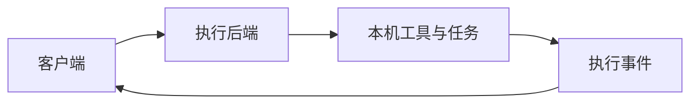

# 智能体工具：运行、会话与自托管

这个主题独立于机器人学主线，方便按需求查阅。当前有来源支持的内容主要是 AgentsDock 与 AgentsServer；DeepSeek Harness 的资料计划仍需收录后才能作为正式技术证据。

## 学习顺序

| 步骤 | 问题 | 阅读入口 |
| --- | --- | --- |
| 1 · 客户端 | 从哪里连接与查看任务？ | [[AgentsDock|AgentsDock]]、[[agentsdock-releases|发布资料]] |
| 2 · 执行后端 | 谁运行本机任务、记录事件并管理服务？ | [[AgentsServer|AgentsServer]]、[[agentsserver|后端官方说明]] |
| 3 · 运行机制 | 插件、会话、事件日志和能力接口如何组织？ | [[dsh-learning-map|DeepSeek Harness 资料计划]]，尚未完成来源收录 |

图是对已有 AgentsDock／AgentsServer 资料的教学抽象，不是对所有智能体系统的统一架构描述。阅读时分别确认客户端职责、执行权限、运行位置、日志与恢复行为，避免将界面能力等同于后端能力。

## 覆盖与缺口

当前资料提供产品与运行结构说明，缺少系统化的权限模型、故障恢复实验、可复现的并行任务评测和不同运行时的比较。先依据自己的使用场景选择资料，后续收录与验证问题见 [[agent-execution#未解问题与优先补证|会话与工具执行专题]]。

## 研究归属

[[topics/agent-execution|智能体会话与工具执行怎样分工]]。
