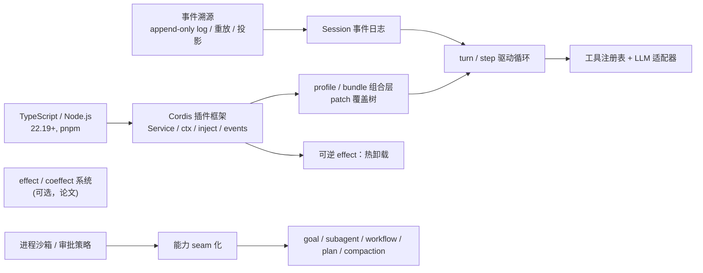

# DeepSeek Harness 学习地图

这个页面是 DeepSeek Harness（`dsh`）的学习脚手架。当前知识库还没有 ingest 任何 DSH 相关 canonical source，本页内容基于对本机安装包源码（`@deepseek-ai/dsh` 0.1.0-rc.7）和官方 GitHub 仓库文档的一手调研，属于 `conversation-derived` / `unsourced learning scaffold`：机制描述可靠，但尚未升级为 source-backed claim。来源获取计划见文末。

## 主题边界

本主题关注 DeepSeek Harness 这个 **agent harness（智能体运行时）**：它如何用"一切皆插件"的架构承载一个可运行、可替换、可热修改的 agent 系统。核心对象包括 Cordis 插件框架、profile/bundle 组合层、session 事件日志、turn/step 驱动循环、工具注册表、LLM 适配器 seam、沙箱/审批、以及 goal/subagent/workflow/plan/compaction 等编排能力。

暂时不把以下内容作为主线：DSH 上跑的具体 coding agent 产品策略、DeepSeek 模型本身的训练与推理细节、其他 agent 框架（Claude Code、Codex 等）的横向对比实现。它们会在需要理解 seam 边界或接口兼容时作为扩展。

关键事实：`dsh` 目前是 **developer preview**（0.1.0-rc.7），官方明确将有破坏性变更；npm 上发布为 219 个 `@deepseek-ai/dsh-*` 包（monorepo 有 54 个 `packages/<group>/<pkg>` 目录）。

## 前置知识图



学习顺序建议：先掌握 Cordis 五个核心思想（插件是 Service、ctx 是服务仓库、inject 声明依赖、typed events 四种分发、注册是可逆 effect），再理解 profile/bundle 组合层，然后沿 turn/step 循环把 session 日志、prompt 组装、工具调度、LLM 流式串起来，最后进入沙箱/审批和编排能力。

## 核心概念

| 概念 | 证据层级 | 作用 |
| --- | --- | --- |
| Cordis 插件框架 | conversation-derived（vendored 源码可查） | 插件是 `Service` 对象；`ctx.<key>` 是服务仓库；`inject` 声明依赖决定加载顺序；typed events 有 `emit`/`waterfall`/`parallel`/`serial` 四种分发；所有注册都是可逆 effect，卸载自动 unwind。 |
| Profile 与 Bundle | conversation-derived | profile 是 `$DSH_HOME/profiles/<name>` 下的具名组装（web/headless 是模板）；bundle 是带 `cordis.patch.yml` 的"可安装 patch 层"；运行中的 dsh = 按序叠加的插件树。 |
| Agent 与 AgentLoop | conversation-derived | `Agent` 是公开接口（`ctx.agents`），`AgentLoop` 是唯一默认驱动（`ctx.agentLoop`），经 `setFactory` 注册，插件只依赖 agent 使循环可替换。 |
| Session 事件日志 | conversation-derived | append-only typed `SessionEvent` 日志是唯一事实源；模型历史由 `deriveMessages()` 从日志投影，不单独存储。 |
| Capability Seam | conversation-derived | 可替换能力的三角色结构：Service Definition（接口）/ Provider（实现）/ Consumer（通常模型向工具）；换 provider 整体迁移。 |
| 沙箱与审批 | conversation-derived | `ctx.sandbox` 用 `SandboxMode` 限制文件效果；`ctx.approval` 按会话 `ask`/`never` 策略决定放行。 |
| 编排能力 | conversation-derived | goal/subagent/workflow/plan/compaction/session-projection 都是可选 seam，不属于 agent-loop 主干。 |

## 机制级解释

### 插件树如何启动

`dsh` launcher 只解析自己的 flag（`--profile`、`--patch`、`--dump-config`），其余参数原样交给 boot 的 profile。组合在空 entry 列表上按序应用 patch 层：各 bundle 的 patch → profile 级 `cordis.patch.yml` → home 级 `$DSH_HOME/cordis.patch.yml` → 每个 `--patch` overlay。patch 按 row `id` 定位并整体替换其 `config`（需重述全部键），或 `insert` 新 row；`--dump-config` 与真正 boot 共用同一 patch 算法（`applyEntryPatches`），保证 dump 永不偏离实际启动树。

### turn/step 驱动循环

一个 **step** 是一次模型请求加它调用的工具；一个 **turn** 是零或多个 step，打开于第一条输入被认领、关闭于无事可做。流程：

```text
turn/start
  claim next-step 输入 + 一条 queued 消息
  agent/pre-step 瀑布（可改写消息或整体拒绝）
  step/start → user/message → 从日志 derive 模型历史
  agent/request → llm/stream → assistant/chunk* → assistant/message
  tool/call* → tools/pre-execute → tools/execute → tools/post-execute → tool/result*
  step/end
  （工具还欠一次请求，或 next-step 输入到达 → 再 claim → 下一个 step）
  agent/turn-stopping（串行终点检查点）
turn/end
```

输入只有一个 inbox（`next-turn`/`next-step` 两条有序待处理队列）；`agent/pre-step` 决定模型看到什么；工具调用按 `executionMode` 分类——exclusive 形成屏障，parallel 用有界滚动池，但策略、结果、结果上下文保持模型顺序。

### 事件日志如何投影模型上下文

`SessionEventMap` 是 merge-extensible 事件词汇（插件用 TS declaration merging 扩展，如 compaction 增加 `compaction/*`）。日志记录原始流块（`assistant/chunk`）保证重放保真度。铁律：**"Model-visible means logged"**——任何到达模型请求的东西必须能从日志重建，所以新的 model-visible 输入要求新的事件类型。`SurfaceEventType` 三型、`SurfaceOp` append/replace 遮蔽；`session/event` 是 SDK 用户可重放的转录数据源，`agent/*` 是实时协调 API。

### 可逆 effect：热卸载的数学基础（参考论文核心）

论文把**时间可组合性**（卸载时完全恢复共享环境）形式化为 **revertible effects**：每个 effect 是上下文变换配对显式逆 $(\Gamma \to \Gamma) \times (\Gamma \to \Gamma)$，运行时通过"扭曲复合"跟踪逆：

$$
(f_1, g_1) \circ (f_2, g_2) \triangleq (f_1 \circ f_2,\; g_2 \circ g_1)
$$

效果上下文 $\partial\Gamma \triangleq \Gamma \times (\Gamma \to \Gamma)$ 携带累积器 $\varphi$（已执行 effect 的逆的复合），于是环境恢复成为结构保证而非约定。**空间可组合性**对应 **reactive coeffects**：组件声明它需要的 coeffect 规格，上下文每次变化按规格通知组件激活/停用/中性。论文的实现章节即 Cordis：core library 做 effect tracking 与 coeffect resolution，declarative loader 做配置 reconciliation 与 hot module replacement。

### 沙箱如何包装命令

`ctx.sandbox.confine(argv, policy)` 返回**包装后的 argv**（runner、profile、separator + 原 argv），而不是"建议限制"。没有可用后端时抛 `SANDBOX_UNAVAILABLE`，**绝不原样传递**（fail-closed）。`SandboxMode` 仅管控文件效果：`read-only`（只许 `/dev/null` 等必需 sink）、`workspace-write`（工作区根 + 后端定义的临时区）、`danger-full-access`（绕过隔离）；网络与进程可见性不在该词汇内。Linux 优先 bwrap 否则 Landlock、macOS Seatbelt、Windows ACL。`SandboxEnforcement` 是后端报告的事实：旧 Landlock ABI、Windows ACL 边界只能报 `partial`。

### 审批与权限预设

`ctx.approval` 回答"此操作能否继续"。`ApprovalOutcome` 闭合：`allowed-once`（唯一放行）| `rejected` | `cancelled` | `unavailable`（fail-closed）。`ApprovalPolicy` 按会话：`ask`（默认，委托给组合应答者链）与 `never`（确定性返回 rejected，headless/CI 立场）；生效值 = 会话日志最后一条 `approval/policy` 事件。分发是 `approval/request` waterfall，第一个应答占唯一决策槽。`ctx.permissionPresets` 把两个独立 knob——`sandbox/mode` 与 `approval/policy`——捆绑成具名预设：默认表 `workspace-write`（workspace-write + ask）与 `danger-full-access`（danger-full-access + never）。

### Compaction 如何压缩上下文

compaction 是可选 seam：`agent/pre-step` 压力触发（`pressure`）或 `agent/request-error` 上下文溢出触发（`context-overflow`）。它用 `compaction/start`/`summary`/`end` 三个 **log-only** 事件记录锁与摘要（崩溃留下可检测孤儿锁），真正的替换通过一个 `user/message` 带 `surfaceOp: { op: 'replace', start, end }` 完成——这是唯一会修改 model-visible surface 的机制。摘要不扩展 `SurfaceEventType`，`shadowedRange` 是 surface 位置跨度而非数值区间。

### 编排能力概览

- **goal**：事件溯源服务（`ctx.goals`），`goal/change` 全量快照事件 + strict fold 派生 `GoalPhase`（active/paused/blocked/complete）；`GoalRef{id, revision}` 做 compare-and-set，每次变更递增 revision；durable phase 与 process-local activation 分离。
- **subagent**：`ctx.subagents` 多 provider 注册表；one-shot（`SubagentRun`）vs continuable（持久 Session + 至多一个进程内 Activation）；Agent inbox 是唯一 FIFO。
- **workflow**：`ctx.workflowEngine` 执行模型编写的 plain-JS 脚本（worker-thread，每 run 一 worker）；`meta`/`args` 是纯 JSON、运行前 schema 校验；钩子误用被 re-throw 杀死脚本（fail loud），逐项 null 只留给 child-run 失败。
- **plan mode**：`ctx.planMode` 逐 agent 协作状态，**soft guidance**，与 sandbox/approval 独立；`plan/mode` 是 log-only 整值替换事件，生效状态是日志纯折叠；`exit_plan_mode` 要求 `#` 开头的完整 markdown 计划经 user-questions 评审。
- **session-projection**：registry 单次订阅 `session/event`、eager 折叠所有 unit（框架驱动、领域计算）；`ProjectionDefinition` 纯同步 `init`/`apply`/`view` + schema + `stateVersion`，apply 无关事件须返回同一引用（`Object.is` → 零下游工作）。

## 误解图谱

| 误解 | 校正 |
| --- | --- |
| "一切皆插件"= 所有功能都是可选小玩具 | 核心 spine（session、loop、tools）本身也是插件，只是默认装载；可替换 ≠ 不重要。 |
| dsh 是又一个 coding agent 框架 | 它是 agent **runtime**：模型适配器、工具、UI 都可换，agent 配置由你组装；coding agent 只是运行在它上面的一个组合。 |
| plugin = tool | tool 只是模型向能力（注册在 `ctx.tools`）；plugin 是任意运行时组件（服务、监听器、UI 均可）。 |
| 插件卸载 = 恢复一切 | 恢复的是**环境/注册**（可逆 effect）；**会话状态**在 append-only 日志里，卸载不丢。 |
| headless 是"无界面的 web" | headless 是 one-shot runner：跑一个任务、打印结果、退出，根本没有 server。 |
| 沙箱 `danger-full-access` 是默认 | 默认是 `workspace-write` + `ask`；`danger-full-access` 是显式选择的预设。 |
| 热重载 = 无状态 | HMR/配置重载在 Cordis loader 是事务性的，但进程内已积累状态（连接、缓存）仍会随重启丢失——这正是论文 §1.2.3 讨论的粗粒度代价。 |
| 沙箱能限制网络和进程可见性 | `SandboxMode` 词汇只覆盖文件效果；网络、进程、系统调用限制不在该 seam 的词汇内。 |

## 实践连接

- **当前会话就跑在 DSH 上**：本会话运行于 `dsh web`（127.0.0.1:3080）。goal 工具（同会话目标 + round 续跑）、subagent、workflow、plan mode、sandbox 审批（本会话是 `never` 策略）都是活例子。
- **本机有完整实现可读**：`/Users/ruziniu/.npm/_npx/1e7f6d9597241db0/node_modules/@deepseek-ai/` 下 219 个已编译包；`dsh --profile web --dump-config` 可看本机实际组合的配置树。
- **Python SDK**：`pip install deepseek-harness-sdk`（Python 3.10+，自带内置运行时）；`DeepSeekHarness(provider, model, ...)` 延迟启动并复用运行时，`harness.run(task, session_id)` 返回 `result.final_response`；**复用同一 session id 会保留该会话的 Bash 进程**（cwd、导出变量、shell 函数）。
- **试插件开发**：官方 cookbook 有 `adding-a-tool.md`、`adding-an-llm-adapter.md`、`adding-a-settings-card.md` 等分步指南。
- **自引用运行时**：`dsh-tool-cordis` 提供 `cordis_inspect`/`cordis_define`/`cordis_run`/`cordis_stop`/`cordis_undefine` 五个工具，agent 可以在运行中检查并动态挂载/卸载自己进程内的插件——即论文说的 self-evolving agent harness。

## 证据边界

本页所有机制描述来自对本机安装包源码与官方仓库文档的一手调研，属于 `conversation-derived`。当前 wiki 没有任何 DSH 相关 source 页，也没有 ingest 记录；在完成来源获取计划之前，本页内容不应被当作 source-backed claim 引用。`BENCHMARK.md` 全文仅 3 行、无自研 benchmark 或指标，只有"用独立 workspace 与 session id 隔离基准任务"的指引。

## 来源获取计划

| 优先级 | 候选来源 | Kind | 用途 | 建议 |
| --- | --- | --- | --- | --- |
| 1 | [deepseek-ai/deepseek-harness](https://github.com/deepseek-ai/deepseek-harness) repo（README + docs/ 关键文档 + packages/） | repo | 官方架构、子系统、用户指南的 canonical 证据 | 已克隆到 `/tmp/dsh-repo`，待 ingest |
| 1 | [_A Programming Paradigm for Spatiotemporal Composability_](https://github.com/cordiverse/paper)（Cordis 论文，作者含 DeepSeek-AI 成员） | 论文 PDF | 可逆 effect / reactive coeffect 的形式化基础 | 已克隆到 `/tmp/cordis-paper`，待 ingest |
| 2 | `docs/architecture.md` + `docs/cordis-primer.md` | 官方文档 | 架构总览与 Cordis 入门 | 随 repo ingest |
| 2 | `docs/subsystems/*`（session、tools、core、sandbox、goal、subagent、workflow 等） | 官方文档 | 子系统机制细节 | 随 repo ingest |
| 3 | `docs/user/guide/`（Web UI、providers、Python SDK） | 官方文档 | 用户侧使用方式 | 随 repo ingest |
| 4 | `dsh-handbook` 等社区手册 | 二手资料 | 仅背景参考，不建议作为 canonical source | 不 ingest |

后续收录顺序建议：先 ingest repo（README + 架构/子系统/用户指南 selected 文档），再 ingest Cordis 论文 PDF；论文的数学结构（扭曲复合、$\partial\Gamma$、coeffect 激活）适合放进 concept page 的 `## 数学结构` 部分。
