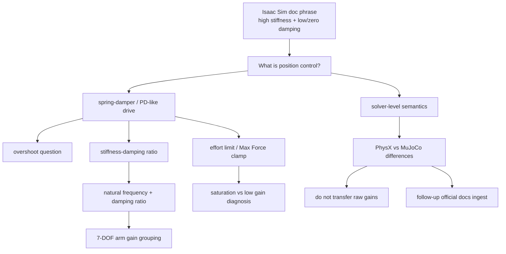

# Isaac Sim and MuJoCo Physics and Control Notes

## 讨论背景

本页 distill 一次关于 Isaac Sim / PhysX joint position control、官方文档语义、effort limit、七自由度机械臂 gain scaling，以及 MuJoCo 与 PhysX 物理解算差异的讨论。起点是 Isaac Sim 官方 robot setup 教程中一句话：position controlled joints 使用 high stiffness and relatively low or zero damping。讨论的核心不是只问“gain 怎么调”，而是追问这句话背后的 simulator semantics：PhysX 的 position control 到底是不是 PD、低 damping 为什么可能 overshoot、effort limit 如何改变 position servo、机械臂各关节 gain 是否应随远近变化，以及 MuJoCo 和 PhysX 的 solver / actuator abstraction 为什么不能直接互搬参数。

## 提炼结果

| Insight | Evidence Level | Wiki Target |
| --- | --- | --- |
| Isaac Sim 教程里的 “high stiffness and relatively low or zero damping” 更应读作 control-mode setup heuristic：position control 需要非零 stiffness；velocity control 通常主要靠 damping；effort control 则关闭 drive gains。它不是“最终稳定调参规则”。 | conversation-derived interpretation; needs Isaac docs ingest | 本页 |
| PhysX/Isaac Sim articulation drive 可以按 spring-damper / PD-like drive 理解：Omni Physics source 明确说 articulation drive is analogous to a PD controller；`stiffness` / `damping` 的精确 discrete solver semantics 仍需 joint tuning docs。 | source-backed for PD analogy; details still follow-up | [[omniverse-omni-physics-articulations]], 本页 |
| PhysX drive 不是单纯在外部 control loop 里显式计算 torque 的连续时间 PD；它受到 performance envelope、force / velocity limits、contact、closed loops、mimic compliance、timestep 和 TGS iterations 影响。 | partly source-backed by Omni Physics articulation docs; broader tuning still conversation-derived | [[ReducedCoordinateArticulations]], [[ContactSolvers]], 本页 |
| `Max Force` / effort limit 是 position control 的一等参数，不是事后细节；它会 clamp drive torque/force，决定 tracking error 是 gain 不足还是 actuator authority 不足。 | conversation-derived; needs Isaac joint tuning docs ingest | 本页 |
| 七自由度机械臂的 gains 不应机械地按 joint index 递减，而应按 effective inertia、payload、gravity torque、task stiffness 和 contact requirement 分组调；shoulder/elbow 通常需要更高 absolute stiffness，wrist 通常可以更小。 | conversation-derived heuristic | 本页 |
| `Kd/Kp` 不是无量纲固定比例；更稳定的参数化是 natural frequency $\omega_n$ 和 damping ratio $\zeta$。常用起点是 $\zeta \approx 0.7-1.0$，接触任务可更高。 | conversation-derived control heuristic | 本页 |
| PhysX 和 MuJoCo 的关键差异不只在 gain 字段名，而在物理解算和 actuator abstraction：PhysX/Isaac Sim 更偏 reduced-coordinate articulation + iterative constraint solver + built-in drive；MuJoCo 更偏 generalized-coordinate dynamics + optimization-based constraints + explicit actuator model。 | conversation-derived; partially aligned with [[ContactSolvers]] | [[MuJoCo]], [[IsaacSim]], [[ContactSolvers]], 本页 |
| MuJoCo 与 PhysX 的 gain 不能 raw-number 迁移；应迁移 closed-loop bandwidth、damping ratio、effort/force limit 和 contact regime，而不是直接复制 stiffness/damping 数字。 | conversation-derived; partially aligned with [[ContactSolvers]] | [[MuJoCo]], [[ContactSolvers]], 本页 |
| 当前 wiki 已有 source-backed support 说明 contact solver/model choices 会影响 forces、residuals、downstream MPC/RL/differentiable optimization；但 PhysX articulation drive 与 MuJoCo actuator API 的具体 current-version semantics 还需要后续 ingest 官方 docs。 | source-backed for general solver impact; follow-up needed for current API | [[contact-models-in-robotics-a-comparative-analysis]], [[ContactSolvers]] |

## 讨论地图

这张图表达本次讨论的完整结构：官方文档的一句话引出 position drive semantics；drive semantics 进一步连接 overshoot、effort limit、gain ratio 和机械臂分组调参；最后落到 MuJoCo / PhysX solver 与 actuator abstraction 的差异，以及哪些结论目前只是 conversation-derived。

## 数学结构

把单关节 position drive 近似成 PD servo：

$$
\tau = K_p(q^\star - q) + K_d(\dot{q}^\star - \dot{q})
$$

其中 $q$ 是 joint position，$q^\star$ 是 target position，$\dot{q}$ 是 joint velocity，$\dot{q}^\star$ 是 target velocity，$K_p$ 对应 stiffness，$K_d$ 对应 damping。若目标速度为零，这个式子变成 $\tau = K_p(q^\star-q)-K_d\dot{q}$。在真实 simulator 中，最终 torque/force 还会受 effort limit、velocity limit、solver iterations、timestep、mass/inertia、joint limits、contact 和 friction 影响。

用 effective inertia $I_{\mathrm{eff}}$ 表达 closed-loop shape：

$$
\omega_n = \sqrt{\frac{K_p}{I_{\mathrm{eff}}}}, \qquad \zeta = \frac{K_d}{2\sqrt{K_p I_{\mathrm{eff}}}}
$$

反过来：

$$
K_p = I_{\mathrm{eff}}\omega_n^2, \qquad K_d = 2\zeta I_{\mathrm{eff}}\omega_n
$$

这说明 `damping / stiffness` 不是固定比例，而是 $K_d/K_p = 2\zeta/\omega_n$，有时间单位。更重的 joint、不同姿态下变化的 effective inertia、payload 和 contact condition 都会改变合适的 raw gain。

## 官方文档语义

本次讨论中，Isaac Sim 官方教程里的 “For position controlled joints, set a high stiffness and relatively low or zero damping” 不应被孤立理解成“低 damping 是推荐的最终稳定状态”。更合理的读法是：它在 robot setup context 中强调 drive mode 的基本区分。Position control 至少需要 stiffness 来产生 position error restoring force；velocity control 可以把 stiffness 置零、用 damping 跟踪 velocity；effort control 则通常关闭 drive gains，直接由外部 action/torque 决定。

这个 distinction 很容易被误读。若只看 continuous-time PD intuition，高 stiffness + low damping 正是 underdamped spring 的条件，overshoot 是正常风险。因此文档中的 low/zero damping 更适合作为“从 mode setup 入手”的起点，而不是最终 gain tuning。最终是否需要更高 damping，要看 step response、target trajectory、effort saturation、joint inertia、solver timestep 和 contact regime。

## 直觉

`stiffness` 决定“想把关节拉回目标”的强度；`damping` 决定“抵抗当前速度和目标速度差”的强度；`Max Force` 决定这个 drive 是否有足够 actuator authority。高 stiffness + 低 damping 像硬弹簧，响应快但可能 overshoot；高 damping 能抑制 overshoot，但太高会变慢、发热感强，或在离散仿真中引入 numerical stiffness；过低 `Max Force` 会让关节长期饱和，表现为 tracking error 大、抗重力或抗 contact 能力差。

对七自由度机械臂，shoulder / base joint 通常承载后续整条 arm 和 payload，absolute stiffness、damping 与 effort limit 往往较高；elbow 次之；wrist 的 effective inertia 和 gravity torque 通常较小，absolute stiffness 可以较低。但这只是起点：末端 payload、orientation accuracy、force-control-heavy task、insertion/contact task 和 singularity 附近的 Cartesian stiffness 都可能推翻简单递减规则。

## PhysX Position Drive Semantics

[[omniverse-omni-physics-articulations|Omni Physics Articulations]] 已经 source-back 了这个 working model 的一部分：articulation drive 被描述为 analogous to a PD controller，且 source 用 `DriveAPI.maxForce`、velocity-dependent resistance、speed-effort gradient 和 `maxActuatorVelocity` 定义 drive performance envelope。它还明确区分 `maxActuatorVelocity` 与 joint-level `maxJointVelocity`，并说明 `driveEffort` 包含 internal drive effort 与 user-defined joint effort。

仍需保留的边界是：这个 source 没有完整展开 Isaac Sim UI 中 `stiffness` / `damping` 的所有 mode-specific semantics，也没有给出 PhysX drive discretization、acceleration drive、solver defaults 或 Gain Tuner workflow。因此“PD-like”现在是 source-backed；“如何把它调成某个 closed-loop bandwidth”仍是 engineering interpretation，需要后续 joint tuning docs。

本页讨论中的 working model 是：PhysX / Isaac Sim 的 position drive 是 PD-like spring-damper drive，但它不等同于用户自己在 Python control loop 中每步显式算出的 torque command。它位于 PhysX articulation / constraint solver 的语义里，最终 behavior 会被 solver discretization、iteration budget、force limit、velocity limit、joint limits、contact constraints 和 articulation mass matrix 共同塑造。

这个 distinction 对调参很关键。连续时间 PD 公式能解释 overshoot、damping ratio 和 gain scaling；但在 PhysX 里，若 timestep 太大、solver iterations 太少、drive 太硬、force limit 太高或 contact 同时发生，系统可能表现出连续时间公式没有直接预测的 chatter、constraint error 或非物理强伺服。反过来，PhysX 的 implicit / solver-level treatment 也可能让某些高 gain 配置比显式 Euler control loop 更稳定。

## Effort Limit Semantics

`Max Force` / effort limit 应被看作 actuator model 的核心部分。Position drive 先根据 position/velocity error 产生期望 effort，再受 force/torque limit 限幅。若 limit 太低，系统表现为 position servo 很软、tracking lag、抗重力或抗 payload 不足；若 limit 太高，position servo 会变成近似 kinematic constraint，尤其在 contact 或 joint limit 附近产生不真实大力。

一个实用 diagnosis 是同时看 position error 和 effort saturation。若 error 大且 effort 长时间顶满，应先怀疑 effort limit、trajectory aggressiveness、payload/gravity compensation 或 actuator authority，而不是继续提高 stiffness。若 error 大但 effort 没饱和，才更像 gain/bandwidth 不足。

## 七自由度机械臂的 Gain Scaling

“越靠近末端 stiffness 越小”是一个常见但不完整的 heuristic。更正确的对象是 effective inertia：每个 joint 在当前姿态、payload 和 task direction 下看到的 inertia 不同。若希望不同关节有相似 closed-loop bandwidth，应按 $K_p \approx I_{\mathrm{eff}}\omega_n^2$ 和 $K_d \approx 2\zeta I_{\mathrm{eff}}\omega_n$ 调整。

实践上可以从三组开始：base/shoulder、elbow、wrist。Base/shoulder 通常要带动整条 arm，gravity torque 和 effective inertia 大；elbow 居中；wrist 通常较轻，absolute gain 可以较低。但末端 payload、orientation tracking、forceful insertion、tool contact 和 singular configuration 都可能要求 wrist 或末端相关 joints 更硬或更阻尼。

## PhysX vs MuJoCo 物理解算差异

本次讨论把 PhysX 和 MuJoCo 的差异总结为 solver / dynamics formulation / actuator abstraction 三层，而不是简单说谁更“真实”。

| 维度 | Isaac Sim / PhysX | MuJoCo |
| --- | --- | --- |
| Robot dynamics abstraction | reduced-coordinate articulation 与 rigid-body constraints 是核心实践入口 | generalized coordinates / joint-space dynamics 是核心建模入口 |
| Constraint solving intuition | PGS / TGS 这类 iterative constraint solver family；drive、contact、limits 和 articulation constraints 都受 solver budget 影响 | contact / constraint forces 更显式地表述为 optimization / regularized constraint problem；通常更便于分析 actuator 与 generalized dynamics |
| Actuator / drive abstraction | built-in articulation drive 暴露 stiffness、damping、force limit、drive type 等 | actuator system 更通用，`motor`、`position`、`velocity`、general actuator、`forcerange`、joint damping、armature 等组合表达控制语义 |
| 参数迁移 | gain 的效果强依赖 timestep、solver iterations、force limits、drive mode 和 contact state | gain 的效果强依赖 actuator type、forcerange、armature、integrator、contact softness 和 solver settings |
| 实践风险 | 硬 drive + 大 effort limit 容易产生不真实强伺服或 contact chatter | soft constraints / regularization 可能 shift physical solution，并影响 trajectory optimization 或 RL gradients |

当前 wiki 已有 [[ContactSolvers]] 和 [[ContactModelsInRobotics]] 支持 general 判断：solver/model choices 会改变 forces、residuals、conditioning 和 downstream behavior。但上表中关于 PhysX current articulation drive 与 MuJoCo current actuator API 的具体字段语义仍是本次讨论的工程归纳，需要后续 ingest 官方 docs。

## Isaac Sim / PhysX 调参经验

1. 先设置真实或合理的 `Max Force` / effort limit。若关节 effort 长时间顶满，tracking 差通常不是单纯加 `stiffness` 能解决，而是 actuator authority、trajectory aggressiveness、gravity compensation 或 payload assumption 有问题。
2. 用 natural frequency 和 damping ratio 思考，而不是只记 `stiffness:damping` 数字。机械臂位置伺服可从 $\zeta \approx 0.7-1.0$ 起步；接触、抓取和插入任务可提高 damping ratio 或降低 stiffness。
3. 按 joint group 调参：base/shoulder、elbow、wrist 分开设 raw gain，再用 step response、sine tracking 和 effort saturation 检查。
4. 看到 overshoot / oscillation：优先提高 `damping` 或降低 `stiffness`；看到响应慢且 effort 没饱和：可以提高 `stiffness`；看到 effort 饱和：检查 `Max Force`、payload、gravity、trajectory slope 和 velocity limit。
5. 高 stiffness 需要更小 timestep、更多 solver iterations 或更保守的 target trajectory；否则 contact、joint limit、高质量比和硬 position drive 会共同放大 instability。
6. 接触任务不要追求极硬的位置伺服。lower stiffness + adequate damping 更接近 impedance control，通常比无限强位置 servo 更利于 sim-to-real。

## MuJoCo 调参经验

1. 先明确 actuator semantics：`motor` 更接近 torque/force input，`position` actuator 是 position servo，`velocity` actuator 或 joint damping 提供 velocity damping；若需要标准 PD，可以用 position + velocity actuator 或 general actuator 自己构造。
2. 设置并监控 `forcerange` / actuator force saturation。和 Isaac 一样，force limit 太小会导致 tracking error，太大会生成不真实强伺服。
3. MuJoCo 的 `armature`、passive joint damping、contact `solref/solimp`、integrator 和 timestep 会显著影响稳定性；不要只调 actuator gains。
4. MuJoCo gains 和 PhysX gains 不应直接复制。更可迁移的是 target closed-loop bandwidth、damping ratio、force limit、trajectory smoothness 和允许的 contact compliance。
5. 对 RL 或 MPC，MuJoCo 的 soft constraint / regularized contact choices 会影响 gradients、rollout 和 policy behavior；这与 [[ContactModelsInRobotics]] 中“contact model choice 是 modeling assumption 而非 implementation detail”的判断一致。

## Failure Modes

- Damping underfit：`stiffness` 高而 `damping` 太低，step response 出现 overshoot、oscillation 或 contact chatter。
- Torque saturation hidden as low gain：effort limit 太小导致 tracking error，误判为 `stiffness` 不够。
- Unrealistically strong servo：effort limit 太大、stiffness 太高，让仿真 robot 变成近似 kinematic actuator，接触力和 sim-to-real 都不可信。
- Joint-wise copy-paste gains：所有关节使用同一 raw gain，忽略 effective inertia、payload、gravity torque 和 task stiffness。
- Solver mismatch：PhysX/Isaac Sim 与 MuJoCo 的 solver、contact regularization 和 actuator semantics 不同，raw gains 迁移后行为改变。
- Time discretization instability：dt 过大、solver iterations 不够或 target jump 太大时，即使连续时间直觉上 damping 合理，离散仿真也可能不稳。

## Evidence Boundaries

Source-backed：当前 wiki 已 ingest 的 [[contact-models-in-robotics-a-comparative-analysis]] 支持一个更 general 的判断：contact model 和 solver choices 会改变 forces、residuals、conditioning 和 downstream MPC/RL/differentiable optimization；[[isaac-sim-asset-structure]] 支持 Isaac Sim asset graph 中 PhysX/MuJoCo-specific tuning 应被隔离在 runtime-specific layer 的 authoring principle；[[omniverse-omni-physics-articulations]] 支持 PhysX articulation drive 的 PD analogy、performance envelope、joint friction、mimic compliance、TGS position-iteration effect 和 closed-loop / hard-contact stability warnings。

Conversation-derived：本页关于 Isaac Sim 官方教程措辞的解释、具体 stiffness/damping tuning workflow、seven-DOF arm gain grouping、PhysX vs MuJoCo 物理解算对比、Isaac Gain Tuner-style tuning 和 MuJoCo actuator tuning，来自本次讨论中的工程归纳。它们应作为工作笔记使用，不应被当作已 ingest 的 source-backed claim。

Hypothesis / follow-up needed：需要后续 ingest PhysX Articulation / Joint Drive docs、Isaac Sim Joint Tuning / Gain Tuner docs、MuJoCo Computation docs 和 MuJoCo XML actuator reference，才能把 drive formula、API 字段名、solver defaults 和版本差异升级为 source-backed wiki knowledge。

## 写入位置

- 本页保存 physics/control conversation 的复用框架。
- [[IsaacSim]] 与 [[MuJoCo]] entity pages 增加到本页的链接，明确这是 conversation-derived physics and control note。
- 暂不更新 [[overview|Overview]]：这次讨论补充的是 simulator-specific 实践框架，尚未改变当前 wiki 的 broader synthesis。

## Follow-up Sources

- Isaac Sim Simple Robot / Joint Control setup tutorial：验证 “high stiffness and relatively low or zero damping” 的原文 context，以及它是在 mode setup 还是 gain tuning context 中出现。
- Isaac Sim Joint Tuning / Gain Tuner documentation：验证 `stiffness`、`damping`、`Max Force`、natural frequency 和 damping ratio 的官方语义。
- Omni Physics Articulation Stability Guide：补充 closed loops、timestep、solver iterations、mass ratio 和 robot stability 的官方调参建议。
- PhysX SDK Articulations / Joint Drive documentation：继续验证 articulation drive 的 force law、implicit solver behavior、acceleration drive、TGS/PGS interaction 和 force limit semantics。
- MuJoCo Computation and XML Reference：验证 actuator model、`forcerange`、`kp/kv` equivalent setup、`armature`、`solref/solimp`、Newton/CG/PGS solvers 和 defaults。
- 实际机械臂 datasheet 或 URDF/MJCF/USD asset：验证 effort limit、joint damping、friction、payload 和 inertia 是否与真实硬件匹配。
