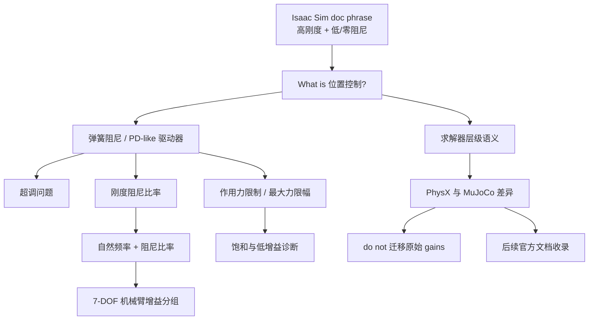

# Isaac Sim 与 MuJoCo 物理和控制笔记

## 讨论背景

本页提炼一次关于 Isaac Sim / PhysX 关节位置控制、官方文档语义、力矩限制、七自由度机械臂增益缩放，以及 MuJoCo 与 PhysX 物理解算差异的讨论。起点是 Isaac Sim 官方机器人设置教程中一句话：位置受控的关节使用高刚度与相对低或 zero 阻尼。讨论的核心不是只问“增益怎么调”，而是追问这句话背后的仿真器语义：PhysX 的位置控制到底是不是 PD、低阻尼为什么可能超调、力矩限制如何改变位置伺服、机械臂各关节增益是否应随远近变化，以及 MuJoCo 和 PhysX 的求解器 / 执行器抽象为什么不能直接互搬参数。

## 提炼结果

| Insight | 证据层级 | 知识库目标 |
| --- | --- | --- |
| Isaac Sim 教程里的 “高刚度与相对低或 zero 阻尼” 更应读作控制模式设置启发式规则：位置控制需要非零刚度；速度控制通常主要靠阻尼；作用力控制则关闭驱动器增益。它不是“最终稳定调参规则”。 | 源自讨论的解释; 需要 Isaac 文档收录 | 本页 |
| PhysX/Isaac Sim 关节系统驱动器可以按弹簧—阻尼 / 类 PD 驱动器理解：Omni 物理来源明确说关节系统驱动器 is 类似 PD 控制器；`stiffness` / `damping` 的精确 discrete 求解器语义仍需关节调优文档。 | 有来源支持的用于 PD 类比; 细节仍需后续 | [[omniverse-omni-physics-articulations]], 本页 |
| PhysX 驱动器不是单纯在外部控制循环里显式计算力矩的连续时间 PD；它受到性能适用范围、力 / 速度限制、接触、闭环机构、mimic 柔顺性、时间步和 TGS 迭代影响。 | 部分有来源支持的由 Omni 物理关节系统文档; 更广泛的调优仍需源自讨论的 | [[ReducedCoordinateArticulations]], [[ContactSolvers]], 本页 |
| `Max Force` / 力矩限制是位置控制的一等参数，不是事后细节；它会限幅驱动器力矩/力，决定跟踪错误是增益不足还是执行器能力不足。 | 源自讨论的; 需要 Isaac 关节调优文档收录 | 本页 |
| 七自由度机械臂的增益不应机械地按关节索引递减，而应按有效的惯量、载荷、重力力矩、任务刚度和接触要求分组调；肩部/肘部通常需要更高绝对刚度，腕部通常可以更小。 | 源自讨论的启发式规则 | 本页 |
| `Kd/Kp` 不是无量纲固定比例；更稳定的参数化是自然频率 $\omega_n$ 和阻尼比率 $\zeta$。常用起点是 $\zeta \approx 0.7-1.0$，接触任务可更高。 | 源自讨论的控制启发式规则 | 本页 |
| PhysX 和 MuJoCo 的关键差异不只在增益字段名，而在物理解算和执行器抽象：PhysX/Isaac Sim 更偏约化坐标关节系统 + 迭代式的约束求解器 + 内置驱动器；MuJoCo 更偏广义的坐标动力学 + 优化基于约束 + 显式执行器模型。 | 源自讨论的; 部分一致带有 [[ContactSolvers]] | [[MuJoCo]], [[IsaacSim]], [[ContactSolvers]], 本页 |
| MuJoCo 与 PhysX 的增益不能原始-数值迁移；应迁移闭环带宽、阻尼比率、作用力/力限制和接触 regime，而不是直接复制刚度/阻尼数字。 | 源自讨论的; 部分一致带有 [[ContactSolvers]] | [[MuJoCo]], [[ContactSolvers]], 本页 |
| 当前知识库已有来源支持：接触求解器与模型选择会影响力、残差，以及下游的 MPC、RL 和可微优化；但 PhysX 关节系统驱动器与 MuJoCo 执行器 API 在当前版本中的具体语义，仍需后续收录官方文档。 | 一般性的求解器影响已有来源支持；当前 API 语义仍待补充 | [[contact-models-in-robotics-a-comparative-analysis]], [[ContactSolvers]] |

## 讨论地图

```mermaid
flowchart TD
  A["Isaac Sim doc phrase<br/>高刚度 + 低/零阻尼"] --> B["What is 位置控制?"]
  B --> C["弹簧阻尼 / PD-like 驱动器"]
  C --> D["超调问题"]
  C --> E["作用力限制 / 最大力限幅"]
  C --> F["刚度阻尼比率"]
  F --> G["自然频率 + 阻尼比率"]
  E --> H["饱和与低增益诊断"]
  G --> I["7-DOF 机械臂增益分组"]
  B --> J["求解器层级语义"]
  J --> K["PhysX 与 MuJoCo 差异"]
  K --> L["do not 迁移原始 gains"]
  K --> M["后续官方文档收录"]
```

这张图表达本次讨论的完整结构：官方文档的一句话引出位置驱动语义；驱动器语义进一步连接超调、力矩限制、增益比率和机械臂分组调参；最后落到 MuJoCo / PhysX 求解器与执行器抽象的差异，以及哪些结论目前只是源自讨论的。

## 数学结构

把单关节位置驱动近似成 PD 伺服：

$$
\tau = K_p(q^\star - q) + K_d(\dot{q}^\star - \dot{q})
$$

其中 $q$ 是关节位置，$q^\star$ 是目标位置，$\dot{q}$ 是关节速度，$\dot{q}^\star$ 是目标速度，$K_p$ 对应刚度，$K_d$ 对应阻尼。若目标速度为零，这个式子变成 $\tau = K_p(q^\star-q)-K_d\dot{q}$。在真实仿真器中，最终力矩/力还会受力矩限制、速度限制、求解器迭代、时间步、质量/惯量、关节限制、接触和摩擦影响。

用有效的惯量 $I_{\mathrm{eff}}$ 表达闭环形状：

$$
\omega_n = \sqrt{\frac{K_p}{I_{\mathrm{eff}}}}, \qquad \zeta = \frac{K_d}{2\sqrt{K_p I_{\mathrm{eff}}}}
$$

反过来：

$$
K_p = I_{\mathrm{eff}}\omega_n^2, \qquad K_d = 2\zeta I_{\mathrm{eff}}\omega_n
$$

这说明 `damping / stiffness` 不是固定比例，而是 $K_d/K_p = 2\zeta/\omega_n$，有时间单位。更重的关节、不同姿态下变化的有效的惯量、载荷和接触条件都会改变合适的原始增益。

## 官方文档语义

本次讨论中，Isaac Sim 官方教程里的 “用于位置受控的关节, 集合 a 高刚度与相对低或 zero 阻尼” 不应被孤立理解成“低阻尼是推荐的最终稳定状态”。更合理的读法是：它在机器人设置上下文中强调驱动器模式的基本区分。位置控制至少需要刚度来产生位置错误恢复力；速度控制可以把刚度置零、用阻尼跟踪速度；作用力控制则通常关闭驱动器增益，直接由外部动作/力矩决定。

这个区别很容易被误读。若只看连续时间 PD 直觉，高刚度加低阻尼正是欠阻尼弹簧的条件，超调是正常风险。因此，文档中的低阻尼或零阻尼更适合作为“从模式设置入手”的起点，而不是最终增益。最终是否需要更高阻尼，要看阶跃响应、目标轨迹、作用力饱和、关节惯量、求解器时间步和接触状态。

## 直觉

`stiffness` 决定“想把关节拉回目标”的强度；`damping` 决定“抵抗当前速度和目标速度差”的强度；`Max Force` 决定这个驱动器是否有足够执行器能力。高刚度 + 低阻尼像硬弹簧，响应快但可能超调；高阻尼能抑制超调，但太高会变慢、发热感强，或在离散仿真中引入数值刚度；过低 `Max Force` 会让关节长期饱和，表现为跟踪错误大、抗重力或抗接触能力差。

对七自由度机械臂，肩部 / 基座关节通常承载后续整条机械臂和载荷，绝对刚度、阻尼与力矩限制往往较高；肘部次之；腕部的有效的惯量和重力力矩通常较小，绝对刚度可以较低。但这只是起点：末端载荷、姿态准确率、力控制-密集型任务、插入/接触任务和奇异位形附近的笛卡尔空间刚度都可能推翻简单递减规则。

## PhysX 位置驱动语义

[[omniverse-omni-physics-articulations|Omni 物理关节系统]] 已经由来源支持了这个工作模型的一部分：关节系统驱动器被描述为类似 PD 控制器，且来源用 `DriveAPI.maxForce`、速度-依赖的 resistance、速度作用力梯度和 `maxActuatorVelocity` 定义驱动性能适用范围。它还明确区分 `maxActuatorVelocity` 与关节层级 `maxJointVelocity`，并说明 `driveEffort` 包含内部驱动器作用力与用户-定义的关节作用力。

仍需保留的边界是：这个来源没有完整展开 Isaac Sim UI 中 `stiffness` / `damping` 的所有模式特定的语义，也没有给出 PhysX 驱动器离散化、加速度驱动器、求解器默认值或增益调参器工作流。因此“类 PD”现在是有来源支持的；“如何把它调成某个闭环带宽”仍是工程解释，需要后续关节调优文档。

本页讨论中的工作模型是：PhysX / Isaac Sim 的位置驱动是类 PD 弹簧—阻尼驱动器，但它不等同于用户自己在 Python 控制循环中每步显式算出的力矩命令。它位于 PhysX 关节系统 / 约束求解器的语义里，最终行为会被求解器离散化、迭代预算、力限制、速度限制、关节限制、接触约束和关节系统质量矩阵共同塑造。

这个区别对调参很关键。连续时间 PD 公式能解释超调、阻尼比和增益缩放；但在 PhysX 中，若时间步太大、求解器迭代太少、驱动器太硬、力限制太高或接触同时发生，系统可能表现出连续时间公式没有直接预测的颤振、约束错误或非物理强伺服。反过来，PhysX 的隐式求解器处理也可能让某些高增益配置比显式 Euler 控制循环更稳定。

## 力矩限制语义

`Max Force` / 力矩限制应被看作执行器模型的核心部分。位置驱动先根据位置/速度错误产生期望作用力，再受力/力矩限制限幅。若限制太低，系统表现为位置伺服很软、跟踪 lag、抗重力或抗载荷不足；若限制太高，位置伺服会变成近似运动学约束，尤其在接触或关节限制附近产生不真实大力。

一个实用 diagnosis 是同时看位置错误和作用力饱和。若错误大且作用力长时间顶满，应先怀疑力矩限制、轨迹激进程度、载荷/重力补偿或执行器能力，而不是继续提高刚度。若错误大但作用力没饱和，才更像增益/带宽不足。

## 七自由度机械臂的增益缩放

“越靠近末端刚度越小”是一个常见但不完整的启发式规则。更正确的对象是有效的惯量：每个关节在当前姿态、载荷和任务方向下看到的惯量不同。若希望不同关节有相似闭环 bandwidth，应按 $K_p \approx I_{\mathrm{eff}}\omega_n^2$ 和 $K_d \approx 2\zeta I_{\mathrm{eff}}\omega_n$ 调整。

实践上可以从三组开始：基座/肩部、肘部、腕部。基座/肩部通常要带动整条机械臂，重力力矩和有效的惯量大；肘部居中；腕部通常较轻，绝对增益可以较低。但末端载荷、姿态跟踪、高作用力的插入、工具接触和 singular 配置都可能要求腕部或末端相关关节更硬或更阻尼。

## PhysX 与 MuJoCo 的物理解算差异

本次讨论把 PhysX 和 MuJoCo 的差异总结为求解器 / 动力学表述 / 执行器抽象三层，而不是简单说谁更“真实”。

| 维度 | Isaac Sim / PhysX | MuJoCo |
| --- | --- | --- |
| 机器人动力学抽象 | 约化坐标关节系统与刚性机体约束是核心实践入口 | 广义的坐标 / 关节空间动力学是核心建模入口 |
| 约束求解直觉 | PGS / TGS 这类迭代式的约束求解器族；驱动器、接触、限制和关节系统约束都受求解器预算影响 | 接触 / 约束力更显式地表述为优化 / 正则化的约束问题；通常更便于分析执行器与广义的动力学 |
| 执行器 / 驱动器抽象 | 内置关节系统驱动器暴露刚度、阻尼、力限制、驱动器类型等 | 执行器系统更通用，`motor`、`position`、`velocity`、一般性执行器、`forcerange`、关节阻尼、armature 等组合表达控制语义 |
| 参数迁移 | 增益的效果强依赖时间步、求解器迭代、力限制、驱动器模式和接触状态 | 增益的效果强依赖执行器类型、forcerange、armature、积分器、接触软化参数和求解器场景 |
| 实践风险 | 硬驱动器 + 大力矩限制容易产生不真实强伺服或接触颤振 | 软约束 / regularization 可能 shift 物理 solution，并影响轨迹优化或 RL 梯度 |

当前知识库已有 [[ContactSolvers]] 和 [[ContactModelsInRobotics]] 支持一般性判断：求解器/模型选择会改变力、残差、条件化和下游行为。但上表中关于 PhysX 当前关节系统驱动器与 MuJoCo 当前执行器 API 的具体字段语义仍是本次讨论的工程归纳，需要后续收录官方文档。

## Isaac Sim / PhysX 调参经验

1. 先设置真实或合理的 `Max Force` / 力矩限制。若关节作用力长时间顶满，跟踪差通常不是单纯加 `stiffness` 能解决，而是执行器能力、轨迹激进程度、重力补偿或载荷假设有问题。
2. 用自然频率和阻尼比率思考，而不是只记 `stiffness:damping` 数字。机械臂位置伺服可从 $\zeta \approx 0.7-1.0$ 起步；接触、抓取和插入任务可提高阻尼比率或降低刚度。
3. 按关节组调参：基座/肩部、肘部、腕部分开设原始增益，再用阶跃响应、sine 跟踪和作用力饱和检查。
4. 看到超调 / 振荡：优先提高 `damping` 或降低 `stiffness`；看到响应慢且作用力没饱和：可以提高 `stiffness`；看到作用力饱和：检查 `Max Force`、载荷、重力、轨迹斜率和速度限制。
5. 高刚度需要更小时间步、更多求解器迭代或更保守的目标轨迹；否则接触、关节限制、高质量比和硬位置驱动会共同放大不稳定。
6. 接触任务不要追求极硬的位置伺服。较低刚度 + 足够的阻尼更接近阻抗控制，通常比无限强位置伺服更利于仿真到现实迁移。

## MuJoCo 调参经验

1. 先明确执行器语义：`motor` 更接近力矩/力输入，`position` 执行器是位置伺服，`velocity` 执行器或关节阻尼提供速度阻尼；若需要标准 PD，可以用位置 + 速度执行器或一般性执行器自己构造。
2. 设置并监控 `forcerange` / 执行器力饱和。和 Isaac 一样，力限制太小会导致跟踪错误，太大会生成不真实强伺服。
3. MuJoCo 的 `armature`、被动关节 damping、接触 `solref/solimp`、积分器和时间步会显著影响稳定性；不要只调执行器增益。
4. MuJoCo 增益和 PhysX 增益不应直接复制。更可迁移的是目标闭环带宽、阻尼比率、力限制、轨迹平滑性和允许的接触柔顺性。
5. 对 RL 或 MPC，MuJoCo 的软约束 / 正则化的接触选择会影响梯度、轨迹采样和策略行为；这与 [[ContactModelsInRobotics]] 中“接触模型选择是建模假设而非实现细节”的判断一致。

## 失效情形

- 阻尼不足：`stiffness` 高而 `damping` 太低，阶跃响应出现超调、振荡或接触颤振。
- 力矩饱和隐藏的作为低增益：力矩限制太小导致跟踪错误，误判为 `stiffness` 不够。
- 不现实地强伺服：力矩限制太大、刚度太高，让仿真机器人变成近似运动学执行器，接触力和仿真到现实迁移都不可信。
- 关节-逐项复制粘贴增益：所有关节使用同一原始增益，忽略有效的惯量、载荷、重力力矩和任务刚度。
- 求解器不匹配：PhysX/Isaac Sim 与 MuJoCo 的求解器、接触 regularization 和执行器语义不同，原始增益迁移后行为改变。
- 时间离散化不稳定：dt 过大、求解器迭代不够或目标 jump 太大时，即使连续时间直觉上阻尼合理，离散仿真也可能不稳。

## 证据边界

有来源支持的：当前知识库已收录的 [[contact-models-in-robotics-a-comparative-analysis]] 支持一个更一般性的判断：接触模型和求解器选择会改变力、残差、条件化和下游 MPC/RL/可微的优化；[[isaac-sim-asset-structure]] 支持 Isaac Sim 资产图结构中 PhysX/MuJoCo-特定的调优应被隔离在运行时特定的层的制作 principle；[[omniverse-omni-physics-articulations]] 支持 PhysX 关节系统驱动器的 PD 类比、性能适用范围、关节摩擦、mimic 柔顺性、TGS 位置迭代 effect 和闭环 / 硬接触稳定性 warnings。

源自讨论的：本页关于 Isaac Sim 官方教程措辞的解释、具体刚度/阻尼调优工作流、seven-DOF 机械臂增益分组、PhysX 与 MuJoCo 物理解算对比、Isaac 增益调参器-风格调优和 MuJoCo 执行器调优，来自本次讨论中的工程归纳。它们应作为工作笔记使用，不应被当作已收录的有来源支持的主张。

Hypothesis / 后续需要：需要后续收录 PhysX 关节系统 / 关节驱动器文档、Isaac Sim 关节调优 / 增益调参器文档、MuJoCo Computation 文档和 MuJoCo XML 执行器参考，才能把驱动器公式、API 字段名、求解器默认值和版本差异升级为有来源支持的知识库知识。

## 写入位置

- 本页保存物理/控制 conversation 的复用框架。
- [[IsaacSim]] 与 [[MuJoCo]] 实体页面增加到本页的链接，明确这是源自讨论的物理与控制笔记。
- 暂不更新 [[overview|总览]]：这次讨论补充的是仿真器特定的实践框架，尚未改变当前知识库的更广泛的综合整理。

## 后续来源

- Isaac Sim 简单机器人 / 关节控制设置教程：验证 “高刚度与相对低或 zero 阻尼” 的原文上下文，以及它是在模式设置还是增益调优上下文中出现。
- Isaac Sim 关节调优 / 增益调参器文档：验证 `stiffness`、`damping`、`Max Force`、自然频率和阻尼比率的官方语义。
- Omni 物理关节系统稳定性指南：补充闭环机构、时间步、求解器迭代、质量比率和机器人稳定性的官方调参建议。
- PhysX SDK 关节系统 / 关节驱动器文档：继续验证关节系统驱动器的力定律、隐式求解器行为、加速度驱动器、TGS/PGS 交互和力限制语义。
- MuJoCo Computation 与 XML 参考：验证执行器模型、`forcerange`、`kp/kv` 等价的设置、`armature`、`solref/solimp`、Newton/CG/PGS 求解器和默认值。
- 实际机械臂数据手册或 URDF/MJCF/USD 资产：验证力矩限制、关节阻尼、摩擦、载荷和惯量是否与真实硬件匹配。
