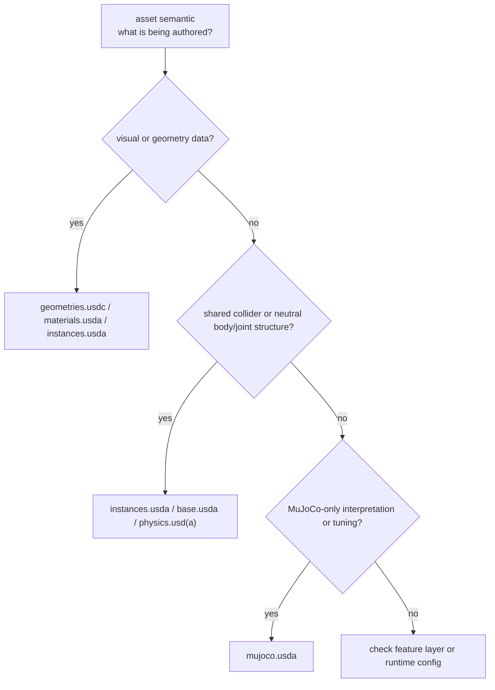

# Isaac Sim mujoco.usda Runtime Semantics

## 讨论背景

本页 distill 一次关于 Isaac Sim Asset Structure 3.0 中 `mujoco.usda` 的讨论：用户关心 MJCF 不支持 USD/GLB 作为 native model description 时，Isaac asset graph 里的 `mujoco.usda` 到底保存什么，以及 MuJoCo 自己也有 visual/collision model 时这些语义是否应该放在 `mujoco.usda`。

## 提炼结果

| Insight | Evidence Level | Wiki Target |
| --- | --- | --- |
| `mujoco.usda` 不等价于 MJCF，也不是 MuJoCo 版 visual/collision asset；它是 Isaac USD asset graph 中隔离 MuJoCo physics setup / tuning 的 layer。 | source-backed + conversation-derived clarification | [[IsaacSimAssetStructure]], 本页 |
| Visual mesh、material、mesh topology 和 visual/collision assembly 应优先归入 `geometries.usdc`、`materials.usda`、`instances.usda` 或 shared physics/instance layer，而不是 `mujoco.usda`。 | source-backed for layer ownership | [[isaac-sim-asset-structure]], [[IsaacSimAssetStructure]] |
| Collision shape / collider representation 如果是 cross-engine shared asset semantics，应优先放在 shared collider / neutral physics layer；只有 MuJoCo-specific contact interpretation 或 solver tuning 才进入 `mujoco.usda`。 | source-backed layer principle + conversation-derived boundary | [[IsaacSimAssetStructure]] |
| Actuator type、joint damping、frictionloss 等是 `mujoco.usda` 的典型用途，但不应把该文件简化成 actuator-only layer。 | source-backed example + conversation-derived clarification | [[IsaacSimAssetStructure]], 本页 |
| `condim`、MuJoCo friction vector、`solref`、`solimp`、`armature`、tendon/equality constraint tuning、collision filtering 等是否能写入 Isaac `mujoco.usda`，需要后续 ingest MuJoCo XML Reference 和 Isaac backend schema/support docs 验证。 | hypothesis / follow-up source needed | 本页 Follow-up Sources |

## Layer Ownership Heuristic

`mujoco.usda` 的判断问题不是“这个东西在 MJCF 里出现过吗”，而是“这个语义是否只属于 MuJoCo runtime interpretation”。如果答案是 mesh topology、texture、visual material、body/joint hierarchy、cross-engine collider shape 或 shared mass/inertia，它不应该优先进入 `mujoco.usda`；如果答案是 MuJoCo actuator/transmission behavior、joint passive dynamics、contact solver parameters、MuJoCo-only collision filtering 或 engine-specific constraint tuning，它才接近 `mujoco.usda` 的职责。

这张图是 conversation-derived checklist，用来避免把 MJCF 的分类直接搬到 USD Asset Structure。MJCF 把 mesh、geom、joint、actuator、option 等语义放在一个 XML model 中；Isaac Asset Structure 3.0 则按 USD layer ownership 拆开：geometry/material/collider 是 shared asset semantics，MuJoCo-only runtime semantics 才进 `mujoco.usda`。

## Evidence Boundaries

Source-backed：[[isaac-sim-asset-structure]] 明确把 imported assets 拆成 geometry、materials、instances、physics、MuJoCo、PhysX 和 robot 等 components，并把 `mujoco.usda` 描述为 MuJoCo physics setup / engine-specific tuning layer。该 source 也明确要求 isolate attributes for different physics engines，防止 backend-specific attributes clashing。

Conversation-derived：本页把这个 source-backed layer principle 进一步转成实践判断：`mujoco.usda` 应理解为 MuJoCo 对已有 USD robot asset 的 runtime interpretation / tuning overlay，而不是 MuJoCo visual/collision model 的替代文件。这个判断来自本次讨论的工程归纳，不等同于官方 schema 清单。

Hypothesis / follow-up needed：MuJoCo native XML Reference 中的许多字段看起来属于 MuJoCo-only runtime semantics，例如 actuator/transmission、joint passive dynamics、contact solver parameters、collision filtering、tendons 和 equality constraints；但 Isaac `mujoco.usda` 实际支持哪些 custom attributes，需要后续 ingest official MuJoCo XML Reference、Isaac Sim MuJoCo backend docs 或 importer schema/source code 后再升级为 source-backed conclusion。

## 写入位置

- 更新 [[IsaacSimAssetStructure]]，加入 `mujoco.usda` ownership boundary 和 runtime semantics examples。
- 本页保存本次 conversation-derived distill，避免把未 ingest 的 MuJoCo XML attribute list 写成 source-backed claim。

## Follow-up Sources

- MuJoCo XML Reference：验证 native MJCF 中 actuator、joint、geom、contact、tendon、equality 和 option 字段的准确语义。
- Isaac Sim MuJoCo backend / importer schema docs：验证哪些 MuJoCo-specific attributes 可以作为 `mujoco:*` custom attributes 写入 USD。
- OpenUSD Physics schema docs：区分 neutral USD Physics 能表达的 body/joint/collider semantics 和 backend-specific extension semantics。
