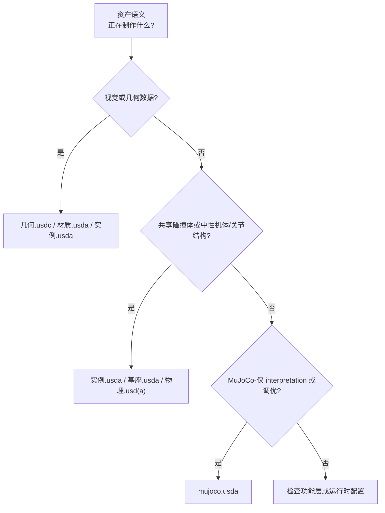

# Isaac Sim `mujoco.usda` 运行时语义

## 讨论背景

本页提炼一次关于 Isaac Sim 资产结构 3.0 中 `mujoco.usda` 的讨论：用户关心 MJCF 不支持 USD/GLB 作为原生模型描述时，Isaac 资产图结构里的 `mujoco.usda` 到底保存什么，以及 MuJoCo 自己也有视觉/碰撞模型时这些语义是否应该放在 `mujoco.usda`。

## 提炼结果

| Insight | 证据层级 | 知识库目标 |
| --- | --- | --- |
| `mujoco.usda` 不等价于 MJCF，也不是 MuJoCo 版视觉/碰撞资产；它是 Isaac USD 资产图结构中隔离 MuJoCo 物理设置 / 调优的层。 | 有来源支持的 + 源自讨论的 clarification | [[IsaacSimAssetStructure]], 本页 |
| 视觉网格、材质、网格拓扑和视觉/碰撞 assembly 应优先归入 `geometries.usdc`、`materials.usda`、`instances.usda` 或共享物理/实例层，而不是 `mujoco.usda`。 | 有来源支持的用于层 ownership | [[isaac-sim-asset-structure]], [[IsaacSimAssetStructure]] |
| 碰撞形状 / 碰撞体表示如果是跨引擎共享资产语义，应优先放在共享碰撞体 / 中性物理层；只有 MuJoCo-特定的接触解释或求解器调优才进入 `mujoco.usda`。 | 有来源支持的层 principle + 来自讨论的边界 | [[IsaacSimAssetStructure]] |
| 执行器类型、关节阻尼、frictionloss 等是 `mujoco.usda` 的典型用途，但不应把该文件简化成执行器-仅层。 | 有来源支持的示例 + 源自讨论的 clarification | [[IsaacSimAssetStructure]], 本页 |
| `condim`、MuJoCo 摩擦 vector、`solref`、`solimp`、`armature`、tendon/equality 约束调优、碰撞过滤等是否能写入 Isaac `mujoco.usda`，需要后续收录 MuJoCo XML 参考和 Isaac 后端结构规范/支持文档验证。 | hypothesis / 后续来源需要 | 本页后续来源 |

## 分层归属判断法

`mujoco.usda` 的判断问题不是“这个东西在 MJCF 里出现过吗”，而是“这个语义是否只属于 MuJoCo 运行时解释”。如果答案是网格拓扑、纹理、视觉材质、机体/关节层级、跨引擎碰撞体形状或共享质量/惯量，它不应该优先进入 `mujoco.usda`；如果答案是 MuJoCo 执行器/transmission 行为、关节被动动力学、接触求解器参数、MuJoCo 专用碰撞过滤或引擎特定的约束调优，它才接近 `mujoco.usda` 的职责。

```mermaid
flowchart TD
  Q["资产语义<br/>正在制作什么?"] --> G{"视觉或几何数据?"}
  G -- "是" --> L1["几何.usdc / 材质.usda / 实例.usda"]
  G -- "否" --> C{"共享碰撞体或中性机体/关节结构?"}
  C -- "是" --> L2["实例.usda / 基座.usda / 物理.usd(a)"]
  C -- "否" --> M{"MuJoCo-仅 interpretation 或调优?"}
  M -- "是" --> L3["mujoco.usda"]
  M -- "否" --> R["检查功能层或运行时配置"]
```

这张图是源自讨论的 checklist，用来避免把 MJCF 的分类直接搬到 USD 资产结构。MJCF 把网格、geom、关节、执行器、option 等语义放在一个 XML 模型中；Isaac 资产结构 3.0 则按 USD 层归属拆开：几何/材质/碰撞体是共享资产语义，MuJoCo 专用运行时语义才进 `mujoco.usda`。

## 证据边界

有来源支持的部分：[[isaac-sim-asset-structure]] 明确把导入资产拆成几何、材质、实例、物理、MuJoCo、PhysX 和机器人等组件，并把 `mujoco.usda` 描述为 MuJoCo 物理设置与引擎专用调优层。该来源也明确要求隔离不同物理引擎的属性，避免后端专用属性发生冲突。

源自讨论的：本页把这个有来源支持的层 principle 进一步转成实践判断：`mujoco.usda` 应理解为 MuJoCo 对已有 USD 机器人资产的运行时解释 / 调优叠加层，而不是 MuJoCo 视觉/碰撞模型的替代文件。这个判断来自本次讨论的工程归纳，不等同于官方结构规范清单。

Hypothesis / 后续需要：MuJoCo 原生 XML 参考中的许多字段看起来属于 MuJoCo 专用运行时语义，例如执行器/transmission、关节被动动力学、接触求解器参数、碰撞过滤、肌腱和 equality 约束；但 Isaac `mujoco.usda` 实际支持哪些 custom 属性，需要后续收录官方 MuJoCo XML 参考、Isaac Sim MuJoCo 后端文档或导入器结构规范/来源代码后再升级为有来源支持的 conclusion。

## 写入位置

- 更新 [[IsaacSimAssetStructure]]，加入 `mujoco.usda` 归属边界和运行时语义示例。
- 本页保存本次源自讨论的提炼，避免把未收录的 MuJoCo XML 属性列表写成有来源支持的主张。

## 后续来源

- MuJoCo XML 参考：验证原生 MJCF 中执行器、关节、geom、接触、tendon、equality 和 option 字段的准确语义。
- Isaac Sim MuJoCo 后端 / 导入器结构规范文档：验证哪些 MuJoCo-特定的属性可以作为 `mujoco:*` custom 属性写入 USD。
- OpenUSD 物理结构规范文档：区分中性 USD 物理能表达的机体/关节/碰撞体语义和后端特定的 extension 语义。
