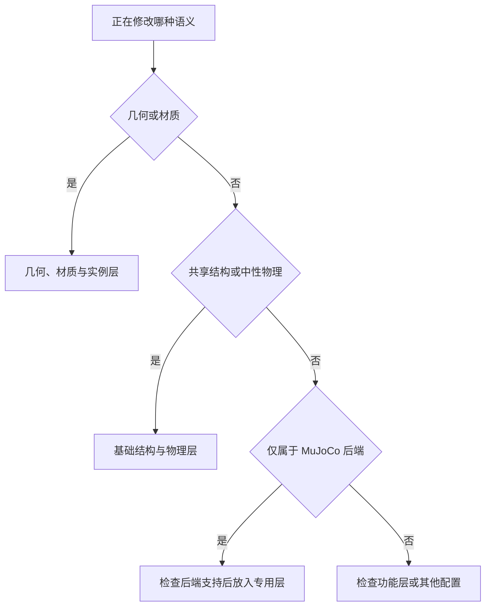

# Isaac Sim `mujoco.usda` 运行时语义

本页整理资产分层讨论：Isaac Sim 资产结构3.0里的 `mujoco.usda` 是什么，哪些内容应放进去？依据是 [[isaac-sim-asset-structure|Isaac Sim 6.0 EDR 资产结构来源页]]，不是 MuJoCo 原生 MJCF 或 Isaac 后端属性的完整参考。本次仅编辑现页与来源页，没有重新核验导入器。

## 文档支持的部分

来源将几何、材质、实例、机器人结构、中性物理及引擎专用调优分层；`mujoco.usda` 承载 MuJoCo 专用物理设置。它是 USD 组合中的一层，不等价于 MJCF，也不应承担整个机器人的视觉和碰撞资产。文件职责见 [[IsaacSimAssetStructure|资产结构3.0]]。

## 讨论形成的归属判断

**以下是基于分层原则的工程判断，不是官方字段清单。**先问某项语义是否跨引擎共享：网格、材质、共享碰撞形状、质量和关节结构优先放在相应共享层；只有引擎专用的解释或调优，才考虑放进 `mujoco.usda` 或该后端的配置。

```mermaid
flowchart TD
  Q[正在修改哪种语义] --> G{几何或材质}
  G -->|是| L[几何、材质与实例层]
  G -->|否| P{共享结构或中性物理}
  P -->|是| B[基础结构与物理层]
  P -->|否| M{仅属于 MuJoCo 后端}
  M -->|是| C[检查后端支持后放入专用层]
  M -->|否| F[检查功能层或其他配置]
```

执行器及传动、关节被动动力学、接触求解参数或专用约束，是讨论中用于判断归属的例子。某个字段存在于 MJCF，不代表 Isaac 的 USD 后端已支持它。

## 尚待验证的字段与接口

`condim`、摩擦向量、`solref`、`solimp`、`armature`、`frictionloss`、肌腱与等式约束、碰撞过滤等，需要同时检查两类证据：MuJoCo XML 文档定义它们的原生语义，Isaac 后端模式或导入器说明它们能否以及如何映射为 USD 属性。不能凭命名自行写入 `mujoco:*` 并认定会生效。

后续补证还需 OpenUSD 物理模式，以区分共享表达与后端扩展。相关研究入口：[[topics/asset-representation|资产表示]]、[[topics/simulation-transfer|仿真迁移]]；参数效果的讨论见 [[isaac-sim-mujoco-control-tuning-notes|物理与控制笔记]]。

## 研究归属

[[topics/assets-and-world-generation|3D 资产与场景]] · [[topics/evaluation-and-transfer|评测与 Sim-to-Real]] · [[topics/asset-representation|3D 资产格式]] · [[topics/simulation-transfer|Sim-to-Real]]。
