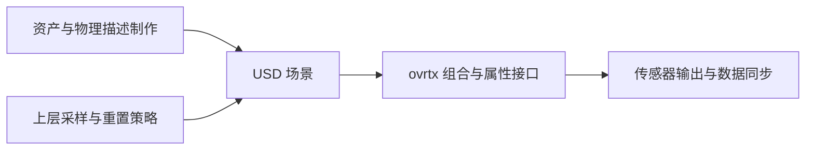

# ovrtx API 边界

本页回答两个问题：ovrtx 能否组合 USD 场景，能否负责物理对象制作与域随机化？依据是 [[nvidia-ovrtx|ovrtx 0.3.0 归档来源页]]；本次只读现页及来源页整理措辞，没有重新审计整个仓库，也不推断后续版本。

## 已记录的接口与未证实的能力

| 问题 | 既有来源支持的范围 | 边界 |
| --- | --- | --- |
| 能否组合场景 | 打开根 USD、加入行内 USDA 子层、添加或移除引用、复制已加载子树、查询图元、读写及映射属性 | 组合接口不等于高层物理建模接口 |
| 能否创建物理对象 | 当前来源页未记录 `create_rigid_body`、`create_articulation`、`create_deformable` 这类辅助接口 | 这是归档接口中未发现的能力，不证明底层不能读取相关 USD 模式 |
| 能否随机化观测 | 属性接口允许上层改变相机、灯光、材质、实例变换或产品场景 | 来源页未记录内置域随机化模块；采样分布与重置时机仍由应用决定 |
| 能否输出传感器数据 | 配置传感器、`RenderProduct` 与 `RenderVar`，按同步和生命周期契约读取张量 | 不自动证明物理建模或真实传感器校准正确 |

执行路径、数据通道和映射注意事项集中在 [[RTXSensorSimulationPipeline|ovrtx 的 RTX 传感器仿真流程]]。

## 讨论形成的分工建议

**工程解释，尚非官方统一架构：**由 USD 制作工具、Isaac Sim／Isaac Lab、ovPhysX 或离线生成代码负责适合各自能力的物理描述，上层环境决定随机变量和回合重置，ovrtx 接收组合场景并产出传感器观测。采用这套分工前仍需检查实际集成接口、后端语义和版本。

后续验证需要官方共进程集成文档、物理模式制作资料、随机化示例与发布记录；研究入口见 [[topics/asset-representation|资产表示]] 与 [[topics/simulation-ready-worlds|可执行生成世界]]。这些材料未补齐前，不将分工建议改写为已验证的完整实现方案。

## 研究归属

[[topics/assets-and-world-generation|三维资产与场景生成]] · [[topics/asset-representation|资产格式怎样保留仿真语义]]。
