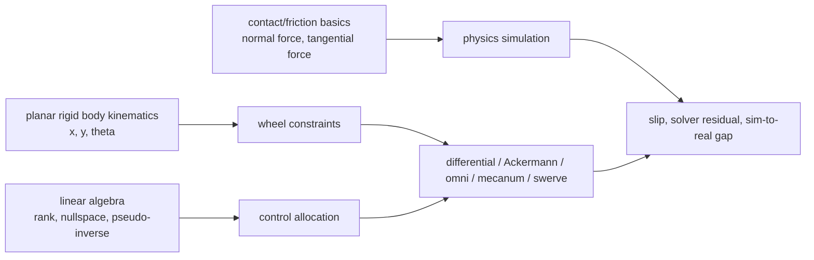

# Wheeled Robot Modeling Learning Map

这个页面是 wheel-based mobile robot modeling（轮式移动机器人建模）的 learning scaffold。当前 wiki 已经 ingest [[modern-robotics-chapter-13-wheeled-mobile-robots|Modern Robotics Chapter 13]] 和 [[structural-properties-and-classification-of-wheeled-mobile-robots|Campion et al. WMR classification]]，因此基础 kinematics、omnidirectional / nonholonomic distinction、odometry、$\delta_m/\delta_s$ taxonomy 和 centered/off-centered steerable wheels 已升级为 source-backed coverage。Swerve implementation、skid-steer/tracked vehicles、tire dynamics 和 simulator-specific controller docs 仍需后续 sources；contact、solver、sim-to-real gap 相关判断回连到 [[ContactModelsInRobotics]]、[[ContactComplementarity]]、[[ContactSolvers]] 和 [[SimulationRealityGap]]。

## Topic Boundary

本主题关注地面移动机器人中 wheel-ground interaction 如何决定底盘 motion、control allocation、state estimation 和 simulation fidelity。核心对象包括 differential drive、Ackermann / car-like steering、omni wheel、mecanum wheel、swerve / steerable wheel、caster wheel、skid-steer / tracked base 和 spherical / ball wheel。

暂时不把 legged locomotion、aerial vehicle dynamics、manipulator joint dynamics 或 tire mechanics 的完整 high-speed vehicle model 作为主线。它们会在 contact dynamics、slip modeling、MPC 或 vehicle dynamics 需要时作为扩展。

## Prerequisite Map

学习顺序建议是：先掌握平面刚体 twist，再理解单个轮子的 rolling / lateral constraints，然后把多个轮子的约束堆成矩阵，最后进入 contact force、friction 和 simulator solver。

## Core Concepts

| Concept | Evidence Level | 作用 |
| --- | --- | --- |
| Wheel morphology | source-backed | [[structural-properties-and-classification-of-wheeled-mobile-robots|Campion et al.]] 区分 fixed conventional、centered steerable、off-centered steerable/caster 和 omniwheels。 |
| Nonholonomic constraint（非完整约束） | source-backed | [[modern-robotics-chapter-13-wheeled-mobile-robots|Modern Robotics]] 用 $A(q)\dot q=0$ 和 Lie bracket 解释不能直接侧移但可 maneuver。 |
| Holonomic / omnidirectional base | source-backed | [[modern-robotics-chapter-13-wheeled-mobile-robots|Modern Robotics]] 用 $u=H(0)V_b$ 与 rank-3 condition 建模 omni / mecanum；Campion 对应 type $(3,0)$。 |
| Control allocation | source-backed / implementation gap | Chapter 13 支持 $H(0)$、$H^\dagger$ 和 wheel speed limits；swerve module saturation policy 仍需 implementation docs。 |
| Contact model | source-backed | wheel-ground force 由 contact law、friction model 和 solver 近似决定；见 [[ContactModelsInRobotics]]。 |
| Solver residual | source-backed | 仿真中的 wheel slip、support force 和 friction behavior 可能受 [[ContactSolvers|contact solver]] residual 影响。 |

## Wheel Taxonomy

| Wheel / Base Type | Modeling View | 优势 | 劣势 |
| --- | --- | --- | --- |
| Differential drive | 左右轮速差控制 forward velocity 和 yaw rate。 | 结构简单、低成本、控制和里程计成熟。 | 不能侧移；转向依赖左右轮同步和地面摩擦。 |
| Ackermann / car-like | 前轮转向，通常后轮驱动或四轮驱动；满足近似 pure rolling。 | 高速稳定、轮胎磨损小、适合道路车辆。 | 转弯半径有限，低速横向机动性差。 |
| Omni wheel | 轮周小滚子释放侧向约束，使轮子可在非驱动方向被动滚动。 | 可构成简单 holonomic base，低速机动性强。 | 接触 patch 离散，牵引力、效率、越障能力通常较弱。 |
| Mecanum wheel | 斜滚子把每个轮速投影到前后、横向和 yaw。 | 四轮即可全向，机械布局紧凑。 | 对摩擦、载荷分布、地面平整度和滚子建模敏感。 |
| Swerve / steerable module | 每个轮模块有 steering DOF 和 driving DOF。 | 全向且牵引力强，高性能移动平台常用。 | 机构复杂，需要处理 steering dynamics、角度 wrap 和模块同步。 |
| Caster / passive wheel | 被动支撑，方向随运动自对准。 | 简化支撑结构，常用于轻载底盘。 | 会引入 transient alignment、shimmy 和里程计误差。 |
| Skid-steer / tracked base | 左右侧速度差转向，转向时依赖 lateral slip。 | 越野和高牵引场景强。 | 纯 no-slip kinematics 不够，需要显式处理 slip 和地面参数。 |
| Spherical / ball wheel | 通过球面接触实现紧凑全向运动。 | 理论机动性高，结构占用小。 | 机械、驱动、感知和 contact simulation 都更难。 |

## 数学结构

把底盘看作平面刚体，body frame 中的 chassis twist 写成：

$$
\xi = \begin{bmatrix} v_x \\ v_y \\ \omega \end{bmatrix}
$$

其中 $v_x$ 是前向速度，$v_y$ 是侧向速度，$\omega$ 是 yaw rate。第 $i$ 个轮子相对底盘中心的位置是 $r_i=(x_i,y_i)$，接触点的平面速度为：

$$
v_i =
\begin{bmatrix}
v_x - \omega y_i \\
v_y + \omega x_i
\end{bmatrix}
$$

若普通轮或舵轮的 rolling direction 为 $t_i=[\cos\alpha_i,\sin\alpha_i]^T$，lateral direction 为 $n_i=[-\sin\alpha_i,\cos\alpha_i]^T$，轮半径为 $r$，则理想 rolling kinematics 可以写成：

$$
\dot\phi_i = \frac{1}{r}t_i^T v_i
$$

$$
n_i^T v_i = 0
$$

第一个式子把接触点沿轮子滚动方向的速度转换成 wheel spin rate $\dot\phi_i$；第二个式子是 lateral no-slip constraint，表示普通轮不能沿侧向滑动。Differential drive、Ackermann 和 fixed-wheel mobile base 都可以看作这些 constraints 的不同组合。

对 omni / mecanum / swerve 这类全向结构，常用统一矩阵形式：

$$
\dot\phi = \frac{1}{r}A\xi
$$

其中 $A$ 的每一行来自一个 wheel/module 的位置、安装角、roller angle 或 steering angle。若 $A$ 的 rank 为 3，底盘在平面内可以控制 $v_x$、$v_y$ 和 $\omega$；若 rank 不足，则存在无法直接实现的 velocity direction。用 pseudo-inverse 做逆运动学时：

$$
\xi = rA^+\dot\phi
$$

这条式子的实践含义是：不要把 mecanum 或 omni 的公式当成孤立模板背诵，而要检查 geometry matrix 的 rank、condition number、wheel speed limits 和 saturation policy。

## Swerve / Steerable Wheel Intuition

Swerve module 的逆解可以从每个模块接触点的期望速度出发。对第 $i$ 个模块：

$$
u_i =
\begin{bmatrix}
v_x - \omega y_i \\
v_y + \omega x_i
\end{bmatrix}
$$

理想 steering angle 和 wheel speed 为：

$$
\delta_i = \operatorname{atan2}(u_{iy},u_{ix})
$$

$$
\dot\phi_i = \frac{\|u_i\|}{r}
$$

工程实现里还要加入 steering rate limit、角度 wrap、drive reversal、module zero calibration、low-speed singularity handling 和 wheel-speed desaturation。也就是说，swerve 的数学逆解很短，但可靠控制主要难在 actuator limits、state estimation 和模块同步。

## From Kinematics To Dynamics

Kinematics 只描述 wheel speed 与 chassis velocity 的理想关系。Physics simulation 和真实机器人还要决定 contact force：

$$
M(q)\dot v + h(q,v) = S^T\tau + J_c(q)^T\lambda
$$

其中 $M(q)$ 是 mass matrix，$h(q,v)$ 包含重力、Coriolis 和其他 bias terms，$S^T\tau$ 是 actuator torque，$J_c(q)$ 是 contact Jacobian，$\lambda$ 是 contact force 或 impulse。轮式机器人中，$\lambda$ 会受 normal load、friction coefficient、slip velocity、ground geometry、wheel compliance 和 solver residual 影响。

这部分与当前 wiki 的 source-backed contact pages 直接相连：[[ContactComplementarity]] 解释 non-penetration 与 friction bound 的数学约束，[[ContactSolvers]] 解释 simulator 如何近似求解 contact impulses，[[SimulationRealityGap]] 解释这些近似如何进入 MPC、RL 和 hardware transfer。

## Simulation Path

第一阶段建议写 kinematic simulator：给定目标 $\xi$ 计算 wheel commands，再用 wheel commands 反算 odometry。验证直线、原地旋转、圆弧、侧移、组合运动和速度饱和。

第二阶段进入 controller-level physics：在 simulator 中使用真实 joint、mass、inertia、wheel radius 和 actuator limits，但对 omni / mecanum 可以先用 holonomic controller 或 anisotropic friction approximation，避免一开始就显式建每个小滚子。

第三阶段才做 high-fidelity contact：显式建 roller geometry、wheel compliance、friction anisotropy、slip 和 contact solver settings。这个阶段的目标不是“画得像”，而是验证 contact forces、slip ratio、odometry drift 和 sim-to-real sensitivity 是否符合任务需求。

## Failure Modes

- Kinematic overconfidence：公式层面可全向，不代表真实平台在低摩擦、载荷偏置或速度饱和下仍能全向。
- Rank / conditioning problem：wheel geometry rank 为 3 只是可控性门槛；condition number 差会放大编码器误差和命令误差。
- Wheel speed saturation：pseudo-inverse 输出的 wheel speeds 可能超过硬件限制，需要统一缩放或重新优化 allocation。
- Lateral slip mismatch：differential、Ackermann 和 skid-steer 在转向时很容易违反理想 no-slip assumption。
- Roller contact artifacts：omni / mecanum 的小滚子接触会产生离散接触、振动和力矩 ripple；仿真中常被简化。
- Solver-dependent behavior：不同 [[ContactSolvers|contact solver]] 可能给出不同 friction impulse、support force 和 sliding behavior。
- Odometry drift：轮速积分假设 rolling without slipping，实际 slip、caster transient 和 ground compliance 会让 pose estimate 漂移。

## Practice Hooks

- 对 MPC：先决定使用 kinematic model 还是 dynamic/contact-aware model；复杂地面、急加速和高载荷时，contact mismatch 可能主导误差。
- 对 RL：如果用 physics simulator 训练 wheel policy，需要 domain randomization friction、mass、delay、motor strength 和 ground compliance，同时审计 [[SimulationRealityGap|simulation reality gap]]。
- 对 system identification：优先估计 wheel radius、track width、steering zero、motor deadband、friction/slip parameters 和 latency。
- 对 sim-to-real：先用 simple trajectories 校准 kinematic layer，再用 aggressive maneuvers 暴露 slip 和 contact solver mismatch。
- 对 robot design：mecanum/omni 提供机动性，swerve 提供更强牵引和效率，Ackermann 提供高速稳定；选择应由任务空间、地面、载荷、速度和维护成本决定。

## Misconception Map

| Misconception | Correction |
| --- | --- |
| 全向轮就是没有约束。 | 全向结构是通过 roller 或 steering DOF 释放某些约束，并通过多个轮子的速度投影合成 chassis twist。 |
| Mecanum 公式适用于所有安装方式。 | 公式依赖 wheel order、roller angle、坐标系和符号约定；应从 geometry matrix $A$ 推导。 |
| 仿真里能侧移就说明模型正确。 | 还需要检查力、滑移、载荷分布、solver residual 和现实平台的 trajectory tracking。 |
| Skid-steer 可以用 differential-drive no-slip model 精确描述。 | Skid-steer 转向本质依赖 lateral slip，纯 no-slip 模型只能作为低保真近似。 |
| Swerve 只是 mecanum 的高级版本。 | Swerve 用主动 steering 改变 wheel direction，牵引和效率更好，但控制和机构复杂度更高。 |

## Evidence Boundaries

当前页面中关于 basic wheeled kinematics、omni/mecanum rank condition、nonholonomic canonical model、odometry 和 Campion $\delta_m/\delta_s$ taxonomy 的判断由 [[modern-robotics-chapter-13-wheeled-mobile-robots]] 与 [[structural-properties-and-classification-of-wheeled-mobile-robots]] 支持。关于 contact law、solver residual 和 sim-to-real gap 的判断由 [[ContactModelsInRobotics]]、[[ContactComplementarity]]、[[ContactSolvers]]、[[SimulationRealityGap]] 支持。Swerve-specific controller implementation、skid-steer/tracked vehicles、deformable tire dynamics 和 simulator-specific API 仍属于待 ingest 缺口。

## Source Acquisition Plan

| Priority | Candidate Source | Kind | 用途 | 建议 |
| --- | --- | --- | --- | --- |
| done | Modern Robotics Chapter 13: Wheeled Mobile Robots | textbook / lecture | 已建立 [[WheeledRobotKinematics]]、[[OmnidirectionalWheels]]、[[NonholonomicMobileRobots]]、[[MobileRobotOdometry]] 的基础。 | ingested |
| done | Campion, Bastin, D'Andrea-Novel, "Structural Properties and Classification of Kinematic and Dynamic Models of Wheeled Mobile Robots" | seminal paper | 已建立 [[WheeledMobileRobotClassification]] 与 [[SteerableWheels]] 的 taxonomy 基础。 | ingested |
| 1 | ROS 2 control mobile base controllers docs | implementation docs | 对接 differential drive、Ackermann、mecanum 等 controller interface、odometry 和 command semantics。 | ingest selected pages |
| 2 | Isaac Sim Mobile Robot Controllers docs | implementation docs | 理解 Isaac Sim 中 differential、holonomic/mecanum 和 wheeled robot controller workflow。 | ingest selected pages |
| 3 | MuJoCo contact / friction documentation | simulator docs | 理解 wheel simulation 中 friction cone、contact dimension、rolling/sliding friction 和 solver parameters。 | ingest selected pages |
| 4 | Vehicle dynamics or tire modeling notes | mathematical | 扩展到 slip angle、Pacejka tire model、high-speed steering 和 dynamic bicycle model。 | background first |

后续 ingest 顺序建议是：先补 ROS 2 control / Isaac Sim mobile robot controllers，把 implementation semantics 接上；再补 MuJoCo contact/friction docs 与 vehicle dynamics/tire modeling sources，把 wheel-ground contact simulation 和 skid/tire regimes 补齐。
