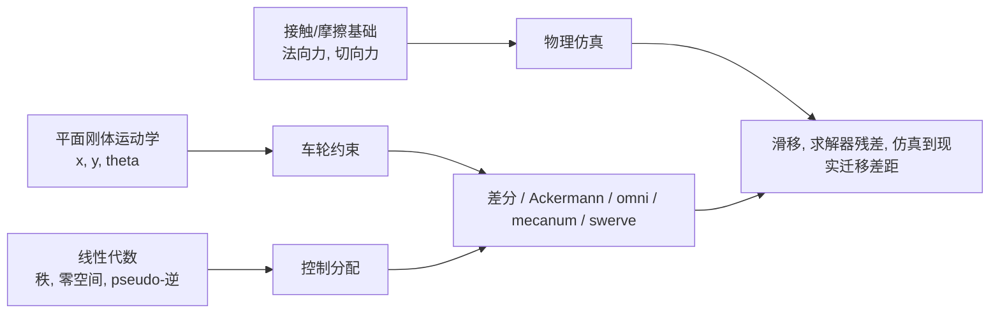

# 轮式机器人建模学习地图

这个页面是轮式移动机器人建模的学习脚手架。当前知识库已经收录 [[modern-robotics-chapter-13-wheeled-mobile-robots|《现代机器人学》第 13 章]] 和 [[structural-properties-and-classification-of-wheeled-mobile-robots|Campion 等人的 WMR 分类论文]]，因此基础运动学、全向与非完整约束的区别、里程计、$\delta_m/\delta_s$ 分类体系，以及中心式与偏心式可转向轮已有来源支持。全向转向实现、滑移转向/履带车辆、轮胎动力学和仿真器专用控制器文档仍需补充来源；接触、求解器和仿真到现实迁移差距的判断回连到 [[ContactModelsInRobotics]]、[[ContactComplementarity]]、[[ContactSolvers]] 和 [[SimulationRealityGap]]。

## 主题边界

本主题关注地面移动机器人中车轮地面交互如何决定底盘运动、控制分配、状态估计和仿真保真度。核心对象包括差分驱动器、Ackermann / 类汽车转向、omni 车轮、mecanum 车轮、全向转向 / 可引导的车轮、脚轮车轮、skid-steer / 履带式基座和 spherical / ball 车轮。

暂时不把 legged 移动、aerial 车辆动力学、manipulator 关节动力学或轮胎 mechanics 的完整高速度车辆模型作为主线。它们会在接触动力学、滑移建模、MPC 或车辆动力学需要时作为扩展。

## 前置知识图

```mermaid
flowchart LR
  A["平面刚体运动学<br/>x, y, theta"] --> D["车轮约束"]
  B["线性代数<br/>秩, 零空间, pseudo-逆"] --> E["控制分配"]
  C["接触/摩擦基础<br/>法向力, 切向力"] --> F["物理仿真"]
  D --> G["差分 / Ackermann / omni / mecanum / swerve"]
  E --> G
  F --> H["滑移, 求解器残差, 仿真到现实迁移差距"]
  G --> H
```

学习顺序建议是：先掌握平面刚体旋量，再理解单个轮子的滚动 / 横向约束，然后把多个轮子的约束堆成矩阵，最后进入接触力、摩擦和仿真器求解器。

## 核心概念

| 概念页 | 证据层级 | 作用 |
| --- | --- | --- |
| 车轮形态 | 有来源支持的 | [[structural-properties-and-classification-of-wheeled-mobile-robots|Campion et al.]] 区分固定传统、中心化的可引导的、off-中心化的可引导的/脚轮和 omniwheels。 |
| 非完整约束 | 有来源支持的 | [[modern-robotics-chapter-13-wheeled-mobile-robots|《现代机器人学》]] 用 $A(q)\dot q=0$ 和李括号解释机器人不能直接侧移，却可以通过组合运动实现横向位移。 |
| 完整约束 / 全向基座 | 有来源支持的 | [[modern-robotics-chapter-13-wheeled-mobile-robots|Modern 机器人学]] 用 $u=H(0)V_b$ 与秩-3 条件建模 omni / mecanum；Campion 对应类型 $(3,0)$。 |
| 控制分配 | 有来源支持的 / 实现差距 | 章节 13 支持 $H(0)$、$H^\dagger$ 和车轮速度限制；全向转向模块饱和策略仍需实现文档。 |
| 接触模型 | 有来源支持的 | 车轮地面力由接触定律、摩擦模型和求解器近似决定；见 [[ContactModelsInRobotics]]。 |
| 求解器残差 | 有来源支持的 | 仿真中的车轮滑移、支持力和摩擦行为可能受 [[ContactSolvers|接触求解器]] 残差影响。 |

## 车轮分类

| 车轮 / 基座类型 | 建模视角 | 优势 | 劣势 |
| --- | --- | --- | --- |
| 差分驱动器 | 左右轮速差控制正向速度和偏航角比率。 | 结构简单、低成本、控制和里程计成熟。 | 不能侧移；转向依赖左右轮同步和地面摩擦。 |
| Ackermann / 类汽车 | 前轮转向，通常后轮驱动或四轮驱动；满足近似 pure 滚动。 | 高速稳定、轮胎磨损小、适合道路车辆。 | 转弯半径有限，低速横向机动性差。 |
| Omni 车轮 | 轮周小滚子释放侧向约束，使轮子可在非驱动方向被动滚动。 | 可构成简单完整约束基座，低速机动性强。 | 接触 patch 离散，牵引力、效率、越障能力通常较弱。 |
| Mecanum 车轮 | 斜滚子把每个轮速投影到前后、横向和偏航角。 | 四轮即可全向，机械布局紧凑。 | 对摩擦、载荷分布、地面平整度和滚子建模敏感。 |
| 全向转向 / 可引导的模块 | 每个轮模块有转向 DOF 和驱动 DOF。 | 全向且牵引力强，高性能移动平台常用。 | 机构复杂，需要处理转向动力学、角度 wrap 和模块同步。 |
| 脚轮 / 被动车轮 | 被动支撑，方向随运动自对准。 | 简化支撑结构，常用于轻载底盘。 | 会引入 transient 对齐、shimmy 和里程计误差。 |
| Skid-steer / 履带式基座 | 左右侧速度差转向，转向时依赖横向滑移。 | 越野和高牵引场景强。 | 纯无滑移运动学不够，需要显式处理滑移和地面参数。 |
| Spherical / ball 车轮 | 通过球面接触实现紧凑全向运动。 | 理论机动性高，结构占用小。 | 机械、驱动、感知和接触仿真都更难。 |

## 数学结构

把底盘看作平面刚体，机体帧中的底盘旋量写成：

$$
\xi = \begin{bmatrix} v_x \\ v_y \\ \omega \end{bmatrix}
$$

其中 $v_x$ 是前向速度，$v_y$ 是侧向速度，$\omega$ 是偏航角比率。第 $i$ 个轮子相对底盘中心的位置是 $r_i=(x_i,y_i)$，接触点的平面速度为：

$$
v_i =
\begin{bmatrix}
v_x - \omega y_i \\
v_y + \omega x_i
\end{bmatrix}
$$

若普通轮或舵轮的滚动方向为 $t_i=[\cos\alpha_i,\sin\alpha_i]^T$，横向方向为 $n_i=[-\sin\alpha_i,\cos\alpha_i]^T$，轮半径为 $r$，则理想滚动运动学可以写成：

$$
\dot\phi_i = \frac{1}{r}t_i^T v_i
$$

$$
n_i^T v_i = 0
$$

第一个式子把接触点沿轮子滚动方向的速度转换成车轮 spin 比率 $\dot\phi_i$；第二个式子是横向无滑移约束，表示普通轮不能沿侧向滑动。差分驱动器、Ackermann 和固定车轮移动式基座都可以看作这些约束的不同组合。

对 omni / mecanum / 全向转向这类全向结构，常用统一矩阵形式：

$$
\dot\phi = \frac{1}{r}A\xi
$$

其中 $A$ 的每一行来自一个车轮/模块的位置、安装角、滚轮角度或转向角度。若 $A$ 的秩为 3，底盘在平面内可以控制 $v_x$、$v_y$ 和 $\omega$；若秩不足，则存在无法直接实现的速度方向。用 pseudo-逆做逆运动学时：

$$
\xi = rA^+\dot\phi
$$

这条式子的实践含义是：不要把 mecanum 或 omni 的公式当成孤立模板背诵，而要检查几何矩阵的秩、条件数值、车轮速度限制和饱和策略。

## 转向轮直觉

全向转向模块的逆解可以从每个模块接触点的期望速度出发。对第 $i$ 个模块：

$$
u_i =
\begin{bmatrix}
v_x - \omega y_i \\
v_y + \omega x_i
\end{bmatrix}
$$

理想转向角度和车轮速度为：

$$
\delta_i = \operatorname{atan2}(u_{iy},u_{ix})
$$

$$
\dot\phi_i = \frac{\|u_i\|}{r}
$$

工程实现里还要加入转向比率限制、角度 wrap、驱动器 reversal、模块 zero 标定、低速度奇异位形处理和车轮速度 desaturation。也就是说，全向转向的数学逆解很短，但可靠控制主要难在执行器限制、状态估计和模块同步。

## 从运动学到动力学

运动学只描述车轮速度与底盘速度的理想关系。物理仿真和真实机器人还要决定接触力：

$$
M(q)\dot v + h(q,v) = S^T\tau + J_c(q)^T\lambda
$$

其中 $M(q)$ 是质量矩阵，$h(q,v)$ 包含重力、Coriolis 和其他偏差条款，$S^T\tau$ 是执行器力矩，$J_c(q)$ 是接触雅可比矩阵，$\lambda$ 是接触力或冲量。轮式机器人中，$\lambda$ 会受法向负载、摩擦 coefficient、滑移速度、地面几何、车轮柔顺性和求解器残差影响。

这部分与当前知识库的有来源支持的接触页面直接相连：[[ContactComplementarity]] 解释 non-穿透与摩擦边界的数学约束，[[ContactSolvers]] 解释仿真器如何近似求解接触冲量，[[SimulationRealityGap]] 解释这些近似如何进入 MPC、RL 和硬件迁移。

## 仿真路径

第一阶段建议写运动学仿真器：给定目标 $\xi$ 计算车轮命令，再用车轮命令反算里程计。验证直线、原地旋转、圆弧、侧移、组合运动和速度饱和。

第二阶段进入控制器层级物理：在仿真器中使用真实关节、质量、惯量、车轮 radius 和执行器限制，但对 omni / mecanum 可以先用完整约束控制器或 anisotropic 摩擦近似，避免一开始就显式建每个小滚子。

第三阶段才做高保真度接触：显式建滚轮几何、车轮柔顺性、摩擦 anisotropy、滑移和接触求解器场景。这个阶段的目标不是“画得像”，而是验证接触力、滑移比率、里程计漂移和仿真到现实迁移敏感性是否符合任务需求。

## 失效情形

- 运动学 overconfidence：公式层面可全向，不代表真实平台在低摩擦、载荷偏置或速度饱和下仍能全向。
- 秩 / 条件化问题：车轮几何秩为 3 只是可控性门槛；条件数值差会放大编码器误差和命令误差。
- 车轮速度饱和：pseudo-逆输出的车轮速度可能超过硬件限制，需要统一缩放或重新优化分配。
- 横向滑移不匹配：差分、Ackermann 和 skid-steer 在转向时很容易违反理想无滑移假设。
- 滚轮接触产物：omni / mecanum 的小滚子接触会产生离散接触、振动和力矩 ripple；仿真中常被简化。
- 求解器-依赖的行为：不同 [[ContactSolvers|接触求解器]] 可能给出不同摩擦冲量、支持力和 sliding 行为。
- 里程计漂移：轮速积分假设滚动不含 slipping，实际滑移、脚轮 transient 和地面柔顺性会让位姿估计值漂移。

## 实践连接

- 对几何/矩阵直觉：[[wheeled-robot-visual-lab|Wheeled Robot Visual Lab]] 把车轮约束、滚动行和底盘矩阵放在同一个平面图里复习。
- 对 MPC：先决定使用运动学模型还是动力学/接触感知模型；复杂地面、急加速和高载荷时，接触不匹配可能主导误差。
- 对 RL：如果用物理仿真器训练车轮策略，需要域随机化摩擦、质量、延迟、motor 强度和地面柔顺性，同时审计 [[SimulationRealityGap|仿真—现实差距]]。
- 对系统辨识：优先估计车轮半径、轮距、转向零位、电机死区、摩擦与滑移参数以及延迟。
- 对仿真到现实迁移：先用简单轨迹校准运动学层，再用激烈机动暴露滑移和接触求解器不匹配。
- 对机器人设计：mecanum/omni 提供机动性，全向转向提供更强牵引和效率，Ackermann 提供高速稳定；选择应由任务空间、地面、载荷、速度和维护成本决定。

## 误解图谱

| Misconception | 校正 |
| --- | --- |
| 全向轮就是没有约束。 | 全向结构是通过滚轮或转向 DOF 释放某些约束，并通过多个轮子的速度投影合成底盘旋量。 |
| Mecanum 公式适用于所有安装方式。 | 公式依赖车轮顺序、滚轮角度、坐标系和符号约定；应从几何矩阵 $A$ 推导。 |
| 仿真里能侧移就说明模型正确。 | 还需要检查力、滑移、载荷分布、求解器残差和现实平台的轨迹跟踪。 |
| Skid-steer 可以用差分驱动器无滑移模型精确描述。 | Skid-steer 转向本质依赖横向滑移，纯无滑移模型只能作为低保真近似。 |
| 全向转向只是 mecanum 的高级版本。 | 全向转向用主动转向改变车轮方向，牵引和效率更好，但控制和机构复杂度更高。 |

## 证据边界

当前页面中关于基础轮式运动学、全向轮/麦克纳姆轮秩条件、非完整约束规范模型、里程计和 Campion $\delta_m/\delta_s$ 分类体系的判断，由 [[modern-robotics-chapter-13-wheeled-mobile-robots]] 与 [[structural-properties-and-classification-of-wheeled-mobile-robots]] 支持。关于接触定律、求解器残差和仿真到现实迁移差距的判断，由 [[ContactModelsInRobotics]]、[[ContactComplementarity]]、[[ContactSolvers]]、[[SimulationRealityGap]] 支持。全向转向专用控制器、滑移转向/履带车辆、可变形轮胎动力学和仿真器专用 API 仍属于待收录缺口。

## 来源获取计划

| 优先级 | 候选来源 | Kind | 用途 | 建议 |
| --- | --- | --- | --- | --- |
| 已完成 | Modern 机器人学章节 13: 轮式移动式机器人 | 教材 / 讲义 | 已建立 [[WheeledRobotKinematics]]、[[OmnidirectionalWheels]]、[[NonholonomicMobileRobots]]、[[MobileRobotOdometry]] 的基础。 | 已收录 |
| 已完成 | Campion, Bastin, D'Andrea-Novel, "Structural Properties and Classification of Kinematic and Dynamic Models of Wheeled Mobile Robots" | 奠基论文 | 已建立 [[WheeledMobileRobotClassification]] 与 [[SteerableWheels]] 的分类体系基础。 | 已收录 |
| 1 | ROS 2 控制移动式基座控制器文档 | 实现文档 | 对接差分驱动器、Ackermann、mecanum 等控制器接口、里程计和命令语义。 | 收录 selected 页面 |
| 2 | Isaac Sim 移动式机器人控制器文档 | 实现文档 | 理解 Isaac Sim 中差分、完整约束/mecanum 和轮式机器人控制器工作流。 | 收录 selected 页面 |
| 3 | MuJoCo 接触 / 摩擦文档 | 仿真器文档 | 理解车轮仿真中摩擦锥体、接触 dimension、滚动/sliding 摩擦和求解器参数。 | 收录 selected 页面 |
| 4 | 车辆动力学或轮胎建模笔记 | 数学 | 扩展到滑移角度、Pacejka 轮胎模型、高速度转向和动力学 bicycle 模型。 | 背景 first |

后续收录顺序建议是：先补 ROS 2 控制 / Isaac Sim 移动式机器人控制器，把实现语义接上；再补 MuJoCo 接触/摩擦文档与车辆动力学/轮胎建模来源，把车轮地面接触仿真和 skid/轮胎 regimes 补齐。
