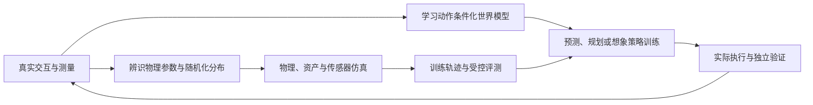

# 世界模型与机器人仿真：研究覆盖地图

2026-10-02 的研究以机器人与具身智能为边界，将“预测怎样用于决策”和“仿真怎样生成可信训练与评测”连成可复习的知识链。全文收录经典原始论文、官方课程和固定版本文档，同时补充近期方法与评估；这是一轮有边界的覆盖扩展，不声称囊括整个领域。

学习顺序由 [[world-models-learning-path|世界模型路径]] 和 [[simulation-and-assets-learning-path|仿真路径]] 负责。本页记录研究范围、机制覆盖与证据变化；研究问题和待补证需求由 [[topics/world-model-decision|世界模型与决策]]、[[topics/world-model-evaluation|世界模型评估]]、[[topics/policy-evaluation|数据与泛化评测]]、[[topics/simulation-ready-worlds|可执行生成世界]] 和 [[topics/simulation-transfer|仿真迁移]] 等专题维护，[[research-questions|研究问题索引]]只汇总入口。

## 机制覆盖

| 维度 | 可以复习的机制 | 证据范围与入口 |
| --- | --- | --- |
| 状态与表示 | 观测后验、转移先验、记忆、潜在表示 | [[LatentStateSpaceModels|潜在状态空间]]；[[planet-learning-latent-dynamics|PlaNet]] 的 RSSM 与具体训练目标 |
| 在线动作搜索 | 有限时域预测、候选更新、终端价值、滚动执行 | [[ModelPredictiveControl|MPC]]；PlaNet 与 [[td-mpc2-scalable-robust-world-models|TD-MPC2]] 的算法条件不同 |
| 想象策略训练 | 预测轨迹、价值自举、策略更新与模型误差 | [[ImaginedPolicyLearning|想象策略学习]]；[[dreamerv3-mastering-diverse-control|DreamerV3]] 执行时直接用策略 |
| 视觉目标规划 | 冻结特征、动作条件化预测、目标距离 | [[VisualGoalPlanning|视觉目标规划]]；[[dino-wm-pretrained-visual-features|DINO-WM]] 与 [[v-jepa-2-understanding-prediction-planning|V-JEPA 2]] 的数据和硬件范围 |
| 世界模型评估 | 动作遵循、状态指标、同预算闭环任务 | [[WorldModelEvaluation|评估层次]]；[[worldecho-worldsync-action-following|WorldEcho／WorldSync]] 提供近期预印本证据 |
| 物理状态与推进 | 坐标变换、质量矩阵、偏置力、约束力与积分 | [[RobotCoordinateFrames|坐标]] → [[RobotRigidBodyDynamics|动力学]] → [[SimulationTimeStepping|时序]]；官方课程与 MuJoCo 3.8 |
| 真实数据与参数分布 | 视觉／动力学随机化、轨迹匹配、参数可辨识性 | [[DomainRandomization|域随机化]]、[[SystemIdentificationForSimulation|系统辨识]]；Tobin、Peng 与 SimOpt 的特定实验 |
| 训练与部署接口 | 关节顺序、动作缩放、观测历史、导出模型和降频 | [[PolicyDeploymentContract|部署契约]]；Isaac Sim 6.1 官方指南，版本限定 |

## 两条主线怎样连接

图是跨来源综合形成的研究组织方式，不是某篇论文已经验证的统一架构。学习模型与物理引擎都能生成轨迹，但状态表示、动力学假设、接触处理、任务接口与误差来源不同。接通接口仍需核对动作、时间与观测的语义；视频相似或仿真分数高不能代替真实执行验证。

## 2026-10-02 的研究判断记录

**在线搜索与想象训练应分开理解。** PlaNet、TD-MPC2 执行时规划；Dreamer 在训练中利用预测轨迹，执行时直接从策略采样。模型是否可微、训练是否展开模型与执行时是否搜索是不同问题。[[ModelPredictiveControl|MPC]]、[[ImaginedPolicyLearning|想象策略]]

**“不需要任务奖励”不能改写成“没有动作数据”。** DINO-WM 用动作轨迹学习转移，PushT 部分数据来自带噪专家轨迹；它对 Dreamer／TD-MPC2 的离线目标规划比较也改变了这些方法的原始训练设置。比较结论须保留协议，不据表格构造跨论文总排名。[[dino-wm-pretrained-visual-features|DINO-WM 来源与限制]]

**随机化与辨识承担不同目标。** 随机化追求参数分布上的任务性能；辨识利用测量约束模型；SimOpt 则调节分布以改善任务相关轨迹匹配。参数能相互补偿，所以迁移成功或轨迹一致不自动证明真实参数已被唯一恢复。[[DomainRandomization|随机化]]、[[SystemIdentificationForSimulation|辨识]]、[[simopt-adaptive-randomization|SimOpt]]

**部署完整性包含时序与数据语义。** 加载模型之后，仍需复现训练时的输入顺序、缩放、历史、执行器和策略频率。新 Isaac Sim 指南由 `RobotPolicyRunner` 负责降频，调用方重复降频会改变周期；此接口结论限定于所收录版本。[[isaac-sim-policy-deployment|Isaac Sim 6.1 部署指南]]

## 2026-10-04 全文复核与更正

本次重新核验归档论文并修订来源页与概念页；这是对既有判断的复核，不把本次新增检查追记为首次研究时已经完成。这里列影响跨论文比较的修订，原文章节、表格与版本差异见链接来源页。

| 需要修订的概括 | 复核后的解释与证据入口 |
| --- | --- |
| 可微世界模型意味着策略沿动力学直接反传 | Nature Dreamer 使用 REINFORCE 更新策略；想象轨迹用于策略与价值学习，但梯度路径应逐式判断。跨领域结果来自分别训练的任务实例。[[dreamerv3-mastering-diverse-control|Dreamer]] |
| 视觉目标规划等于无监督、自主分解任务 | DINO-WM 有动作标注，PushT 包含带噪专家数据；V-JEPA 2-AC 有动作数据、目标图像、相机选择和固定步数子目标协议。无需任务奖励不等于无目标代价。[[dino-wm-pretrained-visual-features|DINO-WM]]、[[v-jepa-2-understanding-prediction-planning|V-JEPA 2]] |
| 两阶段训练单独解释全部提升 | RoboCasa365 的两阶段为8万步预训练加6万步微调，联合训练为12万步；任务覆盖消融也改变样本量。已有结果比较完整方案，尚未隔离顺序与预算。[[robocasa365-a-large-scale-simulation-framework-for-training-and-benchmarking-generalist-robots|RoboCasa365]] |
| 执行与资产系统已独立证明整条链有效 | MagicSim 没有本报告统一协议下的成功率、异步吞吐或真机成绩；其配套资产统计与 EmbodiedGen V2 的下游迁移成绩是转述，不能重复计为独立验证。[[magicsim-a-unified-infrastructure-for-executable-embodied-interaction|MagicSim]]、[[embodiedgen-v2-an-agentic-simulation-ready-3d-world-engine-for-embodied-ai|EmbodiedGen V2]] |
| 一个总分可以替代预算和外部有效性检查 | WorldSync 主表更新预算不同；UniLab 的实用比较含算法与配置差异；RoboLab 真机对应随策略而变。论文结果需保留原协议，不据此形成通用排名。[[worldecho-worldsync-action-following|WorldEcho／WorldSync]]、[[unilab-a-heterogeneous-architecture-for-robot-rl-beyond-gpu-dominant-paradigms|UniLab]]、[[robolab-a-high-fidelity-simulation-benchmark-for-analysis-of-task-generalist-policies|RoboLab]] |

Dreamer 此次依据已归档 Nature 正文、方法和扩展图说明；独立的扩展数据表页面及补充 PDF 不在该 HTML 中，未冒充完整读取。VIRAL 的现有证据仍是项目页，不因本轮统一整理而升级为已精读论文。各来源页记录本次实际阅读范围，未复跑实验或作独立硬件复现。[[dreamerv3-mastering-diverse-control|Dreamer 阅读范围]]、[[viral-visual-sim-to-real-at-scale-for-humanoid-loco-manipulation|VIRAL 证据身份]]

## 资料与刷新记录

首次研究日期为 2026-10-02，本次复核日期为 2026-10-04。首次研究记录的原始资料在 `raw/`，MarkItDown 阅读缓存在 `graph/extracts/`；提取的公式、表格与双栏错序通过原文交叉核对。来源页记录规范 URL、版本、日期及实验条件，`graph/acquisitions.jsonl` 记录获取时间和 SHA-256，收录与刷新操作保留在日志。

MuJoCo 沿用 [[mujoco-computation-collision-detection|原计算文档来源页]]，接入 3.8 固定版本，并保留原碰撞文档快照。后续 `refresh 世界模型与机器人仿真` 沿用本覆盖记录：复用相同原文，保留新旧版本，只有实质审阅和判断变化才更新知识日期。
