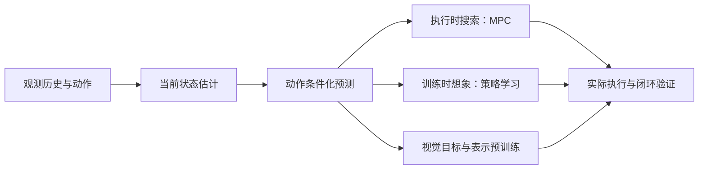

# 世界模型：从潜在状态到机器人决策

学习目标是读懂“模型预测什么、如何训练、预测怎样影响动作”，并能比较方法的证据。需要基础概率、神经网络与优化知识；不熟悉状态和策略时，先读 [[MarkovDecisionProcesses|MDP 基础]]。

> 路径与练习是教学设计；技术机制追溯到概念页与已收录原文。新论文不自动替代经典机制，方法名称也不能替代对输入、监督和执行方式的检查。

## 学习顺序

| 阶段 | 要理解的机制 | 阅读入口 | 完成标志 |
| --- | --- | --- | --- |
| 1 · 为什么需要记忆 | 观测不完整，历史如何形成当前状态估计 | [[LatentStateSpaceModels|潜在状态空间模型]] | 能区分真实状态、观测、后验和预测先验 |
| 2 · 怎样学习未来 | 动作条件化转移、重建与分布约束 | [[WorldModelsForEmbodiedAI|具身世界模型]] → [[planet-learning-latent-dynamics|PlaNet]] | 能解释模型损失各项约束什么 |
| 3 · 执行时怎样搜索 | 预测多个动作序列，只执行前段再重规划 | [[ModelPredictiveControl|模型预测控制]] | 能写清时域、候选、末端价值和重规划频率 |
| 4 · 怎样在想象中学策略 | 用预测轨迹训练策略和价值，执行时直接出动作 | [[ImaginedPolicyLearning|想象策略学习]] → [[dreamerv3-mastering-diverse-control|DreamerV3]] | 能区分模型展开、策略梯度路径和执行中的在线搜索 |
| 5 · 没有任务奖励怎样规划 | 目标图像与特征距离驱动动作搜索 | [[VisualGoalPlanning|视觉目标规划]] | 能区分动作数据、专家来源、任务奖励与目标代价 |
| 6 · 从未来推断动作 | 动力学表示、视觉子目标与逆动力学进入策略 | [[InverseDynamicsModels|逆动力学]] → [[LatentDynamicsActionModels|潜在动力学预训练]] | 能说明潜在动作怎样落地为机器人指令 |
| 7 · 怎样验证价值 | 动作遵循、状态预测和闭环任务分别测量什么 | [[WorldModelEvaluation|世界模型评估]] | 能设计同预算对照，而非只比较视频质量 |

图是教学分类：PlaNet、TD-MPC2 的执行搜索，Dreamer 的想象策略训练，以及视觉目标与预训练路线承担不同角色。一个系统可以组合这些角色，但组合收益需要实验，不能从图中直接推出。

## 按使用方式对照方法

| 使用方式 | 代表来源 | 首先检查什么 |
| --- | --- | --- |
| 执行时预测与搜索 | [[planet-learning-latent-dynamics|PlaNet]]、[[td-mpc2-scalable-robust-world-models|TD-MPC2]] | 优化目标、控制时域、终端价值与完整规划耗时 |
| 在想象中训练策略 | [[dreamerv3-mastering-diverse-control|DreamerV3]] | 模型误差、梯度路径、训练预算和执行方式 |
| 图像目标驱动规划 | [[dino-wm-pretrained-visual-features|DINO-WM]]、[[v-jepa-2-understanding-prediction-planning|V-JEPA 2-AC]] | 动作标注、特征距离、离线覆盖与真实机器人证据 |
| 未来表示进入策略 | [[pi07-steerable-generalist-robotic-foundation-model|π0.7]]、[[lda-1b-scaling-latent-dynamics-action-model|LDA-1B]]、[[InverseDynamicsModels|Seer／DeFI]] | 未来是目标、监督、表示还是执行模型 |

## 用两个未来复习

教学练习：给定同一张“夹爪靠近杯子”的图像，分别输入“继续靠近”和“后退”两段动作。如果预测几乎相同，应检查动作条件化、数据覆盖与评估中的哪些部分？如果视频很好而抓取成功率没变，问题可能位于哪个决策接口？答案线索见 [[WorldModelsForEmbodiedAI|世界模型机制]] 与 [[WorldModelEvaluation|评估层次]]。

再比较两种实现：一种每次搜索未来动作；另一种只在训练中展开模型，执行时用策略出动作。为它们分别列训练成本、执行成本、模型更新后的适应方式，避免用一个“模型大小”数字判断实时控制能力。

## 证据与复习入口

RSSM、MPC、想象策略、视觉目标规划与动作遵循评估均有原文入口。复习时保留三条区别：Dreamer 的统一配置在任务间分别训练，不代表同一权重覆盖所有领域；V-JEPA 2-AC 的视觉目标规划有动作数据与预设子目标切换，不代表自主任务分解；DINO-WM 的离线基线改变了 Dreamer／TD-MPC2 的原在线设置。各论文任务、奖励、数据和预算不一致，不能直接拼成排名。[[dreamerv3-mastering-diverse-control|Dreamer]]、[[v-jepa-2-understanding-prediction-planning|V-JEPA 2]]、[[dino-wm-pretrained-visual-features|DINO-WM]]

教学练习：为同一个视觉目标任务写两张实验卡片。一张固定训练数据，另一张固定完整训练与执行计算预算；分别说明两种对照能检验什么。再标出目标图像、人工子目标和相机选择提供了哪些额外信息。跨领域覆盖记录见 [[world-models-and-simulation-research|研究地图]]。

比较在线规划与想象学习，进入 [[topics/world-model-decision|世界模型怎样参与决策]]；研究未来监督与动作学习，进入 [[topics/future-conditioned-action|未来预测怎样帮助动作学习]]；检验动作遵循与闭环收益，进入 [[topics/world-model-evaluation|如何验证世界模型的动作后果]]。[[research-questions|研究问题索引]]只汇总入口；方法分类见 [[WorldModelTaxonomy|分类体系]]，文献索引见 [[awesome-world-models|AwesomeWorldModels]]。

## 研究归属

[[topics/world-models-and-representations|世界模型与表征]] · [[topics/planning-and-control|规划与控制]] · [[topics/robot-policy-learning|机器人策略学习]] · [[topics/evaluation-and-transfer|评测与现实迁移]] · [[topics/world-model-decision|世界模型如何用于决策]] · [[topics/future-conditioned-action|未来预测怎样帮助动作学习]] · [[topics/world-model-evaluation|如何验证世界模型的动作后果]]。
