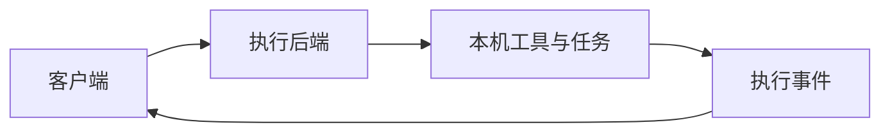

# Agent Systems

明确客户端、执行后端与会话持久化的职责。

## 方法与证据

[[agentsserver|AgentsServer]]与[[agentsdock-releases|AgentsDock 发布快照]]分别记录执行后端和客户端相关资料。[[dsh-learning-map|DeepSeek Harness 专题]]仍是资料计划，不能支撑正式实现结论。

**当前判断：**本专题现有证据主要是项目文档，尚不足以比较完整系统的可靠性。界面提供的功能、后端实际执行语义和会话恢复能力应分别核验；没有已收录论文时不填充虚构论文列表。

## 支撑资料

- [[agentsdock-releases|AgentsDock Releases]]
- [[agentsserver|AgentsServer]]

## 机制基础

[[sources/agentsdock-releases|AgentsDock]]、[[sources/agentsserver|AgentsServer]]。

## 客户端与执行后端

图是对已有 AgentsDock／AgentsServer 资料的教学抽象，不是对所有智能体系统的统一架构描述。阅读时分别确认客户端职责、执行权限、运行位置、日志与恢复行为，避免将界面能力等同于后端能力。

## 未解问题与优先补证

插件、执行隔离与恢复机制的实际语义如何核验？优先收录 DeepSeek Harness 正式资料；当前项目 README 不能替代完整实现与故障实验。

这些是研究问题与验证要求，尚未作为已有结论。
